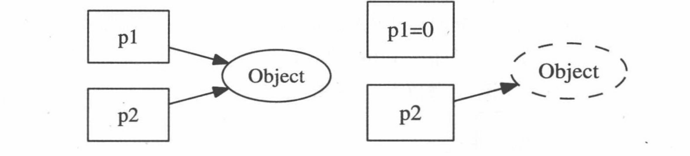
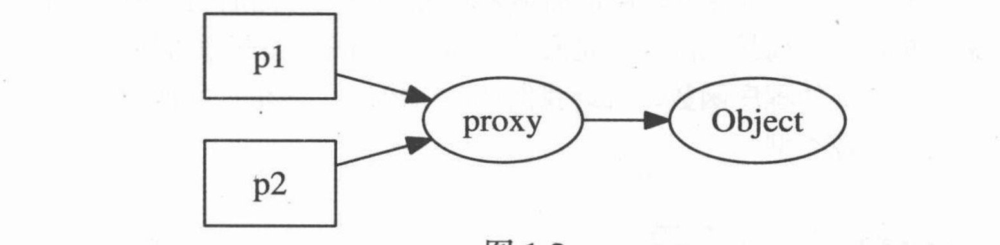
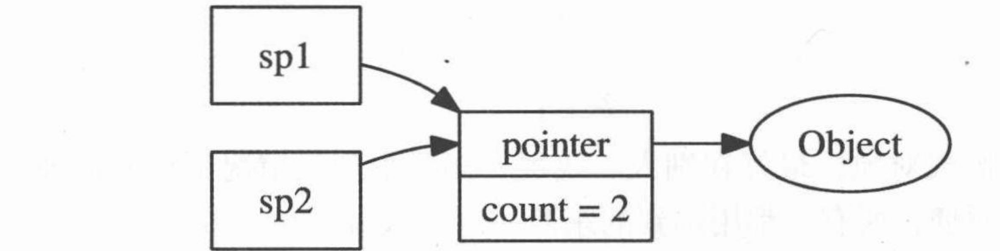

# Linux多线程服务端编程笔记

## 心得

笔记不会一小节一小节的去剖析这本书，会有小节跳跃

这本书，不像游双大佬的《Linux高性能服务器开发》偏向于基础的教学，更多的倾向于多线程服务端编程的经验和注意事项。

## 1：线程安全的对象生命期管理（跨线程）

**以下所有多线程的模式都是跨线程**

对象的生死不能由对象自生拥有的`mutex`来保护，如何避免对象析构时可能存在的 race condition（竞态条件）是多线程编程面临的基本问题。

通俗的来说，公共资源，一般设置成静态或者它的作用域针对于程序的全局，而不需考虑回收顺序问题，只需要考虑线程同步问题，可以使用线程同的方式如锁，信号量等条件做到线程安全。**但对于对象而言，则是在析构的时候会出现问题，就是这个对象的析构时机是不知道的，也许在某个时刻该对象被析构，其他线程使用该对象就会出现未定义行为，这是我们不愿期望的。**

**两种解决方式：**

- **利用`shared_ptr` 和 `weak_ptr`可以完美解决**

  - 首先我们知道shared_prt 是共享指针，它的内部存在一个计数，这个计数会随着这个指针的引用而增加，只有该引用次数减为0对象才被析构，而且为了防止循环缠绕的问题，即两个对象中的成员有对方的类型并且在初始化的时候拿彼此作为初始的值，所以要引入weak_ptr来解决这个问题

- **或者实现线程完全的Observer模式的必备技术**

  - **线程安全的观察者模式**（Observer Pattern）：

    - 观察者模式是一种常用的设计模式，用于建立一种对象（主题，Subject）与观察者（Observer）之间的依赖关系，使得当主题对象状态改变时，所有依赖于它的观察者都会得到通知并自动更新。

      在多线程环境中实现观察者模式需要额外的考虑来确保线程安全，特别是当通知观察者或者修改主题状态时。`shared_ptr`和`weak_ptr`在实现线程安全的观察者模式中发挥重要作用

### 1.1.当析构函数遇到多线程：

由于C++要求程序员自己管理对象的生命周期，这在多线程环境下是困难的。当一个对象能被多个线程同时考到时，那么对象的销毁实际就会变得模糊不清。就如前面提到的那样，主要引发的问题如下：

- 在析构一个对象的时候，不知道是否有线程是否在执行这个对象的成员函数
- 还有就是执行该对象的成员函数，该对象是否会被另外的线程析构
- 在线程要执行该对象成员函数时，如何知道这个对象是否被析构了

这本书的第一章主要**利用`shared_ptr` 和 `weak_ptr`来减轻多线程的负担


#### 1.1.1 线程安全的定义

**一个线程安全的class应当满足以下三个条件：**

- 多线程同时访问时，表现出其正确的行为
- 无论操作系统如何调度这些线程，无论这些线程的执行顺序如何交织，通俗来说对于要操作的临界区，不受执行顺序影响
- 调用端代码无需额外的同步或其他协调动作
  - 强调，当设计一个多线程安全的组件或者库时，应该尽量减少调用者（也就是使用这个组件或库的代码）需要进行的同步或协调工作。

以此看出在c++标准库里有大多数class都不是线程安全的，包含std::string,std::vector等容器，在线程同步下都学要需要借助外部锁来实现线程安全

**一个线程安全的函数**：个人觉的要满足两个条件

- 指的是函数可以重传入，即内部不存在静态成员，这样该函数在多线程下对于函数内部数据是安全的
- 还有就是函数处理外部数据，可以是传参（引用或者指针形式）或者高一级作用域下的资源，内部得提供线程同步手段


#### 1.1.2 MutexLock 与 MutexLockGuard

在游双大佬那么书中是封装过MutexLock的，该类如下：

```c++
class MutexLock
{
public:
    locker(){
        if(pthread_mutex_init(&m_mutex)!=0) perrno(errno);
    }
    ~locker(){
        pthread_mutex_destroy(&mutex);
    }
   	bool lock()
    {
        return pthread_mutex_lock == 0;
    }
    bool unlock(){
        return pthread_mutex_unlcok ==0;
    }
private:
    pthread_mutex_t m_mutex;
};
//但是pthread_mutex_t是不可重入的，一般是别的class中的数据成员，这项不同对象实例在一定程度上减轻了对这个锁加锁的频率，但还是不安全


```

对于pthread_mutex_t不可重入的解释，对于相同锁的标识符会出现二次加锁，因为它是普通锁的类型，这样会导致死锁的发生

当然有很好的解决思想，利用RAII思想，即就是使用时创建，解锁时析构，是例如下：

```c++
//锁的定义
class LockGuard {
public:
    explicit LockGuard(pthread_mutex_t& mutex) : m_mutex(mutex) {//防止隐式转换
        pthread_mutex_lock(&m_mutex); // 构造函数加锁
    }

    ~LockGuard() {
        pthread_mutex_unlock(&m_mutex); // 析构函数解锁
    }

private:
    pthread_mutex_t& m_mutex;
};


{
    LockGuard lock(mutex); // 自动加锁
    // 临界区：执行需要互斥访问的操作
} // 离开作用域时自动解锁

```

MutexLockGuard封装临界区的进入和退出，即加锁和解锁，它一般是栈上的对象，它的作用域刚好等于临界区，即临界区使用完锁自动析构，也就是上面说的解决MutexLock的解决方法。

**还有这两个class不允许拷贝构造和赋值**

### 1.2 对象的创建很简单

对象构造要做到线程安全，唯一的要求是在构造期间不要泄漏this指针，即：

- 不要在构造函数中注册任何回调
- 也不要在构造函数中把this传给跨线程的对象
- 即便在构造函数的最后一行也不行

构造函数执行期间对像还没完成初始化，如果this被泄露（escape）给了其他对象（其自生创建的子对象除外），那么别的线程有可能访问这个半成品对象，这会造成难以预料的后果

列子如下：

```c++
class Observer{
  //构造  
 register_();
  //析构
};
//不要这么做
class Foo: public Observer
{
    public:
    	Foo(Observlue * s){
            s-register_(this);//错误,非线程安全,因为在构造函数构造时，把该对象暴露出去，拿到的是个半成品
            //effective c++中也提到这种做法的不好
        }
    virtual void update();
}
//应该这样做
class Foo : public Observer
{
  public:
    Foo();
    virtual void update();
    void observer(Observaule* s){
        s->register_(this);
    }
};
Foo* pFoo = new Foo;
Observalue* s = getSubject ();
pFoo->observe(s);//称之为二段式构造，其实就是对对象进行二次构造去改变它的一些属性，
```

说明一下，二段式构造，构造函数+ initialize()（自定义来实现第二次构造）；

```c++
class DatabaseConnection {
public:
    DatabaseConnection() {
        // 第一阶段：执行基本的构造逻辑，如分配资源
    }

    bool initialize(const std::string& config) {
        // 第二阶段：尝试连接到数据库，或者增加更多的复杂性功能，比如一些类要使用该类对象达到一定的目标，这也符合了上面的实列
        // 如果连接失败，返回false
        return true;
    }
};

DatabaseConnection db;
if (!db.initialize("config/path")) {
    // 处理初始化失败的情况
}

```

即使构造函数的最后一行也不要泄露this，因为Foo有可能是基类，基类先于派生类构造，执行完Foo::Foo()的最后一行代码还会继续执行派生类的构造函数 most-derived class的对象还处于构造中，仍然不安全。

### 1.3 销毁对象过去困难

对象析构，这在单线程里不够成问题，最多需要注意避免悬空指针和野指针。

对于多线程程序，存在了太多竞态条件，对于一般的成员函数而言，我们希望它在微观的角度来是顺序执行（关键在于不在同一时刻读写共享状态）

成员函数用来保护临界区的互斥锁本身必须有效。而析构函数破坏了这一假设，它会把mutex成员变量销毁。

#### 1.3.1 mutex不是办法

mutex只能保证函数一个接一个地执行，但是无法保护析构函数，我们来分析以下地代码：

```c++
Foo : ~ Foo()
{
    MutexLockGuard lcok(mutex_);//这种写法也仅仅能起到在同一时刻对这对象实列回收一次， 
    //freee internal state
}

void Foo :: update()
{
     MutexLockGuard lcok(mutex_);
    //make something .....
}
//然后我们假设存在两个线程，他们都可以去操作Foo对象（简称 x）
//thread 1 的行为
delet X
x = nullptr；
//thread 2 的行为
if(x){
    x->update();
}
//如果单纯这样，其实会出现bug，可以让它正常运行，比thread 1 还没有进行析构操作， thread2 就走到update后，但是这个问题十分严重
//如果在bug出现在thread2 判断通过，执行x->update之前析构掉了，那么这个行为是一个未定义行为，会造成难以想象的问题，这造成的问题是无法想象的
```

#### 1.3.2 作为数据成员的mutex不能保护析构函数

前面例子可以看出，类中的成员mutex仅仅只能用于同步本class的其他数据成员的读和写，他不能保护安全地析构，因为析构动作可以说是发生在对象死亡之后或者死亡时。

还有如果同时读写一个class的两个对象，有潜在的死锁可能，比如：

```c++
//swap
void swap(A& a, A& b){
    MutexLockGuard aLock(a.mutex_);
    MutexLockGuard bLOCK(B.mutex_);
    //swap 操作
}
//同时thread1也进行操作，如下
void swap(A& b, A&a){
    MutexLockGuard bLOCK(B.mutex_);
     MutexLockGuard aLock(a.mutex_);
    //swap操作
}
//明显可以看出问题来，比如thread1 执行时先给a上了锁，此时thread2也开始执行，给b上锁，此时他们各执行一步，1发现b已经加锁了，2发现a已经加锁了，相互等待，他们两都得堵塞在这，无法进行
```

一个函数如果想锁住相同类型的多个对象，为了保证始终按相同的顺序加锁，我们可以比较mutex对象的地址，始终先加锁地址较小的mutex.

### 1.4 线程安全的Observer有多难

一个动态创建的对象是否存活，观看指针是看不出来的，指针只是指向一块内存，delete的时候只是对指针指向的内存回收，而指针被指向了空，但这存在一个问题，如果我后续申请内存的时候，刚刚回收的内存用来存放这次新的对象实例呢，真个问题还真的挺头大的。

在面向对象程序设计中，是离不对象之间的关系的，主要有三种： composition（组合）， aggregation（聚合），association（关联）这三种关系。对于第一个关系，在多线程模式下是安全的，因为就算一个对象里面包含其他对象，他们的生命周期都是一个管理者，前提是你不用其他对象去初始化对象里的其他对象且发生不发生浅拷贝，即不和用来初始对象共同指向一块内存地址，因为这样不仅在单线程存在问题，多线程会存在更严重的问题，通俗来说如下：

**类对象之间为组合关系，在多线程下的考虑**

**主要体现不安全的地方就是，一个类中有另一个类，我们称前者为a，后者为b，a中有b，这情况最忌讳的是的是b它发生浅拷贝，应该它一旦和别的对象共享内存，单线程不安全，多线程就更不安全，虽然这是c++程序员常识，为了迎合第一章关于析构函数多线程不安全，我不得不提出这个问题**，这又不得引出第二个问题即，**类作为容器得元素，在不加以其他编程技术加持下，在多线程下是不安全**，如：仔细查看了clion编译器中提供了两个版本的push_back为左值引用和右值引用，**其实我的侧重点是关心左值引用的线程安全问题，即使他用了顶层const去左值引用使得它的指向的值和地址无法改变，但是多于类而言，它的析构函数在多线程下是不安全的，当一个类对象成为元素，被加入到容器中，的下一秒这个类对象被其他线程析构了，锁是没办法阻止的，这是可悲的，下一次再去访问容器，会发生未定义行为，这是多么可怕**，**问题就是出在原始类对象生命周期得问题**，这又迎合这本书第一章得主题，析构函数在多线程下是不安全。但是不得不思考的是，这种情况下，需要考虑上面的场景并不是要百分之百要考虑析构在多线程下的安全（单只容器访问元素这块），而其他两种是必须要考虑。

**对于其他两种的考虑**

对于这两种，处理不好就是内存泄漏（单线程下），重复释放（可能多线程下或者单线程下）

association（关联）：简单来说对象a中用到了另一个对象b，调用了后者的成员函数，也就是a只有了对象b的指针或者引用，生命周期不归它管（这个问题和上面的问题类似，要关心原始对象的上面周期），在调用的时候，b被其他线程析构掉了，就会发生未定义的行为，多线程下是不安全的。

aggregation（聚合）与前者类似。

**其实总结一句话来说，就是只要类对象注册了任何非静态成员函数的回调，那么必然是要考虑，类对象的生命周期问题，就不得不避免析构函数在多线程下的安全问题。**

书上的例子：

```c++
class Observer {
    public:
    	virtual ~Observer();
    	virtual void update() = 0;
    	//.....
};
class Observale
{
    public:
    	void register_(Observer* x);
    	void unregister(Observer* x);
    	
    	void notifyObservers(){
            for(Observer* x : observers_)
                x->update();
        }
    private:
    	std::vector<Observer*> observers_;
}
```

当Observable通知每一个Observer时，他如何得知这个对象x是否还活着

### 1.5 原始指针有何不妥

指向对象的原始指针（raw pointer）是坏的，尤其当它暴露给别的线程时。我们是不知道这个对象是不是还活着，如果有一个东西可以代替指针，最好像类那样可以告诉我存不存在，于是不难想到智能指针，是可以做到的，智能指针又有好几种，独占指针，共享指针，weak_ptr，于是想到用共享指针（share_ptr）可是共享指针又有问题，即循环引用，weak_ptr可以解决。

**我们从如下一点一点引出使用这两个智能指针**

**空悬指针**

如图演示



可以看出这两个指针指向同一块区域，从单线程角度去看，在析构时不加特判，会出现重复析构问题

对于多线程中跨线程，就是我们前面讨论的析构函数暴露在多线程下的安全问题

**一个“解决办法”**

我们可以间接的用一个对象去观察另一个对象他是否还或者，如图所示：



p1和p2都可以是二级指针，可是又有新的问题，中间的这个又该如何释放呢。

**一个很好的解决方式**

那就是对这块对象内存的引用可以做计数处理，一旦计数为0，那么就没有线程在使用这个了，就可以被析构，如图：



如图中，一旦count减为0，则对象发生析构

所以可以引出shared_ptr 和 weak_ptr的使用。

### 1.6 神器 shared_ptr/ weak_ptr

shared_ptr 是引用计数型智能指针，在Boost和std::tr1里均提供，也被纳入c++标准库。std::shared_ptr<T>是一个类模板（class template）， 他只有一个类型参数，使用起来很方便。**引用计数是自动化资源管理的常用手法，当引用计数降为0时，对象资源即被销毁**，weak_ptr也是一个引用计数型智能指针，但是它不增加对象的引用次数，即weak引用。

shared_ptr 控制对象的生命周期。shared_ptr 是强引用，**只要智能指针的引用计数不降为0，也就是还有对象被引用，该对象就不可能被析构**，如果此时count为1，并且马上将为0，即发生析构或reset()的时候，该对象会被销毁。

weak_ptr不控制对象的生命周期，但它知道对象是否还活着。如果对象还活着，那么它可以被提升称为有效的shared，如果对象已经死，提升失败，返回一个空“shared_ptr”,当然提升的过程也是线程安全，

shared_ptr /weak_ptr的“计数”在主流平台上是原子操作，没有用锁，性能不俗。

c++利用智能指针达成的效果是：一旦某个对象不再被引用，系统刻不容缓，立刻回收内存。这通常发生在关键任务完成后的清理时期（即，不再使用这个对象，在跨线程下做关键操作），不会影响关键任务的实时性，同时内存里所有的对象都是有用的，绝对没有垃圾空占内存。

### 1.7 系统地避免各种指针错误

C++里可能出现的内存问题大致由这么几个方面：

- 缓冲区内存溢出（buffer overrun）
- 空悬指针/野指针
- 重复释放（double delete）
- 内存泄漏（memory leak）
- 不配对的new[]/delete
- 内存碎片（memory fragmentation）

关于以上问题的解决：

1. 对于缓冲区溢出：用自己编写的class或者容器，一定要记住缓冲区的大小，防止溢出，还有通过这和类对象的函数来操作，而不是单纯的使用原始指针去操作
2. 空悬指针/野指针：空悬指针在前一小节引出智能指针时说过，再次访问被释放的内存，会引发这种问题，而野指针就是指向未初始化，或者是指向自身作用域以外的，当这个被释放掉指针会发生异常
3. 重复释放：在单线程下一般出现在类的浅拷贝下，多线程下，可以用独占指针std::unique_ptr，shared_ptr解决
4. 内存泄漏：对象析构时自动释放内存，智能指针都支持这样的操作
5. 不配对的new[]/delete,最常见的错误就是 new[]，不用delete []删除的（这里的仔细讲解，可以看内存管理，大概是在侯捷老师那节课的前几节吧），解决策略要么记得，要么将new []替换为std::vector或者 scoped_arry

智能指针和容器的引入，使得现在c++程序中一般不会出现delete语句，资源（包含复杂对象本身）都是通过对象（智能指针和容器）来管理的。

### 1.9 再论shared_ptr 的线程安全

shared_ptr可以来实现线程安全的对象释放，原因在于count计数是原子操作，本身安全且无锁，当两个线程同时意识到count将变为0，进行析构时，由于原子操作，只会进行一次释放。但对于读写是不安全的

- 一个shared_ptr 对象实体可以被多个线程同时读（因为读操作并不会改变资源，读写锁就是利用这个点）
- 两个shared_ptr对象实体可以被两个线程同时写入，“析构”也可以认为是写操作
- 如果要从多个线程读写同一个shared_ptr对象，那么需要加锁

### 1.10 shared_ptr 技术与陷阱

**意外延长对象的生命周期**：首先要重点说明一件事情就是延长生命周期不一定会造成内存泄漏问题，我们这两种问题分开说明：

- 对于造成内存泄漏
  - 最常见的场景即**循环引用问题**，循环引用发生的场景有多种
    - 一种就是两个对象的属性存在各自对象，且使用共享指针封装，并且各自用双方为自己的属性赋值，由于对象属性归对象管理，析构释放一次，就会造成引用计数不会将为0，但其实是可以**在对象的析构函数做修改是可以将引用计数降为0，正常释放，还有就是利用shared_ptr<T>是类模板的特性，使用隐函数来处理析构（具体就是将函数封装到类，这个类来充当将计数变为0的操作），但是使用现成的weak_ptr不是更方便**
    - 一种就是发生在多态上，当派生类中有父类对象的共享指针，这里使用weak_ptr解决
- 不造成内存泄漏的（逻辑上的生命延长（副本））
  - 即原原本本的拷贝了一份，这个原原本本的拷贝不会增加原来shared_ptr的计数 ，只是单纯的深拷贝了一份，那么这个副本也许它的生命周期会更长一些

**函数传参问题**：shared_ptr的拷贝开销比原始指针要高，但需要拷贝的时候并不多。可以使用引用作为传参，可以使得计数不增加。

析构动作在创建时被捕获，这是一个非常有用的特性，这意味着：

- 虚析构不再必需
- shared_ptr<void>可以持有任何对象，而且安全地释放
- shared_ptr对象可以安全地跨越某块边界
- 因为shared_ptr<T>只有一个模板参数，而“析构行为”可以是函数指针，仿函数或者其他什么东西。

**析构所在的线程**：对象地析构时同步地，当最后一个指向x的shared_ptr离开其作用域的时候，x会同时在一个线程析构，这个线程不一定时对象出生的线程，这个特性是一把双刃剑，如果对象的析构比较耗费时间，可能会拖慢关键线程的速度，我们可以让单独的线程来专门做析构函数，从而解放关键线程。

**现成的 RAII handle**

## **2：线程同步的精要**

摘要：

线程同步的四项原则，按重要性排列：

1. 首要原则时尽量最低限度地共享对象，减少需要同步地场合。一个对象能不暴露给别的线程就不要暴露，如果暴露优先考虑immutable
2. 使用高级并发编程构件：如TaskQueue，CountDownLatch等
3. 最后不得已使用底层同步原语时，使用非递归地互斥锁和条件变量，慎用读写锁，不要用信号量
4. 不要字节编写lock_free代码

### 2.1 互斥器（mutex）

使用原则：

- 用RAII手法封装mutex的创建，销毁，加锁，解锁这四个操作，**这是c++的标准实践**，其实在c++11之后提供其他手法封装了锁，做到了RAII手法，比如lock_guard和unquie_lock等
- 只是要非递归锁（不可重入的mutex），这个因人而异
- 不手工调用lock()和unlock，这个在RAII手法封装锁就解决了，我们保证始终在同一个函数同一个scope里对某个mutex加锁和解锁
- 在每次构造guard对象的时候，思考一路（调用栈上）已经持有的锁，两个考虑一是防止同一线程对同一个不可重入的锁进行二次加锁造成死锁，另一张就是在两个或两个以上跨线程的情况下，导致加锁顺序不同产生死锁。
- 不使用跨进程使用锁，在游双大佬那本书中提到过，在一个线程中使用fork，此时的fork后的进程会复制锁的状态，而且线程中的fork是不知道锁的状态，就会发生对同一个锁进行二次加锁的情况。

#### 2.1.1关于死锁的产生

1：同一线程下，对同一个锁（非递归锁），进行一次以上的加锁操作（对于POSIX中的pthread_mutex是不可重入的）

2：跨线程下，对于多个共享资源加锁顺序不一致（第一章提到）

### 2.2 条件变量（condition variable）

mutex是加锁原语，用来排他性地访问共享变量，它不是等待原语，因为当多个线程同步访问一个公共资源，由于在同一个时刻只允许一个线程拿锁访问，其他线程只能发生阻塞，但我们不期望发生阻塞，总能立即拿到锁，然后尽快访问数据，用完之后尽快解锁，这样才能不影响并发性和性能。

如果需要等待某个条件地成立，应该使用条件变量。也就是等待某一个布尔值变为true，即等待别的线程“唤醒”它（通知某一个线程，或者通知多个线程，来处理某种行为），条件变量的学名叫管程（monitor）

条件变量只有一种正确的使用的方式，对于wait端：

- 必须与mutex一起使用，mutex可以保证原子性，即保护布尔表达式的读写
- 在mutex已上锁的时候才能调用wait
- 把判断布尔条件和wait（）放到while循环中（判断布尔条件，也就是终止循环的条件），代码如下

```c++
//例子
MutexLock mutex;
Condition cond(mutex);
std::deque<int> queue;

int deque()
{
    MutexLockGuard lock(mutex);
    while(queue.empty()){//必须用循环,等某个条件的产生来终止循环
        cond.wait()//他会对上面的锁进行解锁，防止其他线程在拿到上面锁的情况下产生死锁
        //再重新加锁，一直反复
    }
    //一些操纵
        
}
```

注意点，用while而不是if，是避免“虚假唤醒”，主要原因是底层操作系统的实现细节，可能是由于调度器的实现、内核中断或其他操作系统事件引起的。

对于signal/broadcast端：

1. 比一定要在mutex已上锁的情况下调用signal（理论上）
2. 在signal之前一般要修改布尔表达式
3. 修改布尔表达式通常要用mutex锁保护
4. 区分signal与boardcast，前者通常指资源可以，后者通常是状态变化

```c++
//例子
void push(int){
    //锁
    queue.push_back(x);
    cond.notify();//用于唤醒
}
```

条件变量·是非常底层的同步原语，很少直接使用，一般都是由来实现高层的同步措施 如CountDownLatch和BlockingQue<T>

CountDownLatch是一种常用且易用的同步手段，主要两个用途：

- 主线程发起多个子线程，等这些子线程各自都完成一定的任务之后，主线程才继续执行。通常用于主线程等待多个子线程完成初始化，还有就是用于结束程序
- 主线程发起多个子线程，子线程都等待主线程，主线程完成某些任务，通知所有的子线程开始执行。


**互斥器和条件变量构成了多线程编程的全部必备同步原语，用它们即可完成任何多线程同步任务，二者不能相互替代。**


### 2.3 不要用读写锁和信号量

#### 2.3.1读写锁（Reader-Writer lock）

它明确区分了read 和 write 两种行为。

读写锁的特点是：对于读取共享数据，不会进行锁操作，只有发生写操作才会加锁，看上去非常的好，减少了锁的使用，但是是存在问题的：

- 典型的易犯错误是在持有read lock的时候修改了共享数据，这个是不可控的，万一读的操作那要衍生一些行为
- 性能方面来说，读写锁不见得比mutex更高效。无论如何reader lock 加锁的开销不会比mutex lock小，因为它要更新当前reader的数目。如果临界区很小，锁竞争不激烈，那么mutex往往会更快
- reader lock可能允许提升为writer lock，也可能不允许提升（Pthread rwlock 不允许提升）
- 通常 reader lock 是可重入的，writer lock 是不可重入的，为了防止 writer 饥饿 writer lock 通常会阻塞后来的 reader lock ，因此 reader lock 重入的时候可能死锁。
- 在最求低延迟读取的场合也不适用读写锁。

#### 2.3.2 信号量

信号量（Semaphore）：条件变量配合互斥器可以完全替代其功能，而且更不易用错，信号量其实也就是一个值的计数，象征着某种条件，这个条件变量配合互斥锁可以轻松解决，**个人觉得唯一的好处也就是支持某个资源可以同时被多个线程读（不修改），比读锁安全一点**，个人觉得没有这个必要（首先它会使得内核要多维护一个数据结构，还有就是PV操作的维护问题），只要临界区设计短，为了保证数据的准确性还是用条件变量和锁即可。

### 2.4 封装MutexLock，MutexLockGuard，Condition

不讲具体实现，具体实现可以参考书中P45 

对于Pthread_mutex的一些建议： 在初始化mutex的时候建议使用pthread_mutex_init(pthread_mutex_t* mutex, const pthread_mutexattr_t* mutexattr);，并且指定 mutexattr，也就是锁的属性

### 2.5线程安全的Sigleton（单列设计）实现

- eager initialization （饿汉）
  - 定义：
    - eager initialization 顾名思义就是在进入程序时直接实例化（类的静态成员，被所有类对象共享）。
  - 优点：
    - 不用考虑多线程安全，因为即使是多线程程序，在进入的时候一般都是单线程。
    - 因为预先创建好了，所以调用时反应速度快。
  - 缺点：
    - 资源效率，所有实例在程序开始时创建，可能会造成卡顿。
- lazy initialization （懒汉）
  - 定义：
    - lazy initialization 顾名思义，等到要用的时候再实例化。
  - 优点：
    - 资源利用率高，要用的时候再实例化，很好的节省了资源。
  - 缺点：
    - 在多线程的情况下容易产生线程安全问题。
    - 第一次加载时不够快。

**主要讨论使懒汉更加高性能的线程安全**

懒汉线程不安全主要体现在判断类的实例前没加锁，导致可能多线程下，同一时间多个线程访问，多次使用new，当然也有加锁，但是加了锁，但是锁会降低性能，于是又衍生除了 DCL（Double Checked Locking），如下：

```c++
static T &instance() {
	if (!instance_) {
		lock_guard<mutex> lock(mutex_);//这样写，能减少锁的使用
		if (!instance_) {
			instance_ = new T();
		}
	}
	return *instance_;
}
```

这种方式看似高枕无忧了，实际上很长时间，人们也认为这种方式是正确的。但是后来有人指出由于**乱序执行**（包括**编译乱序**和**执行乱序**，一个是编译器层面的一个是核心层面）的影响，DCL 也是靠不住的。主要的问题在于`instance_ = new T();`的三步执行顺序：

1. 调用new分配空间
2. 调用初始化函数
3. 将内存地址赋值给指针

只能保证1是先执行的，2 3就不知道了

#### 2.5.1 memory barrier指令解决

首先说一下c++11后是保证了 上面表达式的原子性即123按顺序执行

C++11之前解决方法是barrier指令。要使其正确执行的话，就得在步骤2、3直接加上一道memory barrier。强迫CPU执行的时候按照1、2、3的步骤来运行。

两种实现：

- 基于operator new+placement new，遵循1,2,3执行顺序依次编写代码。
- 基于直接嵌入ASM汇编指令mfence，uninx的barrier宏也是通过该指令实现的。【参考链接：[单例模式 - C++那些事 (light-city.github.io)](https://light-city.github.io/design_pattern/singleton/singleton/)】

#### 2.5.2 Meyers' Singleton

即

```c++
singleton *singleton::instance() {
    static singleton p;
    return &p;
}
```

这样的化多个线程调用的时候只会返回一个p

#### 2.5.3 使用pthread_once 

原型如下：

```c
int pthread_once(pthread_once_t once_control, void (init_routine) (void))；
```

用法：

```c++
template<typename T>
class Singleton : noncopyable
{
public:
    static T& instance()
    {
        pthread_once()
            return *value_;
    }
 private:
    //构造
    //析构
    static void init()
    {
     value_ = new T();   
    }
private:
    static pthread_once_t ponce_;
    static T* value_;
};
//一些静态成员的类外赋值
```

### **2.6 sleep不是同步原语：**

sleep 只能出现在测试代码之中，正常的执行中，如果需要等待一段已知的时间，应该往 event loop 里注册一个 timer，然后在 timer 的回调函数中继续干活，如果是等待某个事情发生应该使用条件变量或者 IO 事件回调，不能使用 sleep。使用 sleep 低效且浪费资源。


### 2.7 借 shared_ptr 实现 copy-on-write

#### 2.7.1 用普通mutex替换读写锁

**读写冲突的对象，我们可以使用 shared_ptr 来实现类似读写锁的机制，**将数据使用 shared_ptr 储存，但**读取的时候使用一个栈上的局部 shared_ptr 变量当作“观察者”**，将它指向数据，使数据的计数器增加，**这时只需要加锁构建“观察者”的那部分,缩小了临界区**，并且读操作不会互相冲突，**增加 read 的速度，减少 read 的延时。**

```c++
void read(){
	shared_ptr<DataType> obs;
	{
		lock_gruad<mutex> lock(mutex_);
		obs=data_;
 	}
	obs->doit();
}
```

**write 在写入的时候判断一次数据是否正在被读取，也就是 shared_pte 的计数器是否为一，如果不为一就拷贝一份并且替代原本的数据，再进行修改。**这个方法的缺点是 write 需要额外开销，如果进行频繁的写操作时内存中可能会出现多个数据的副本（由于是使用 shared_ptr 不会内存泄漏）,适合多读少写的需求情况。

```C++

void write(const WriteType &x){	
	lock_gruad<mutex> lock(mutex_);
	if(!data_.unique()){
		data_.reset(new DataType(*data_));
	}
	data_.write(x);
}
```

## 3 多线程服务器的适用场合与常用编程模型

## 4 C++ 多线程系统编程精要
