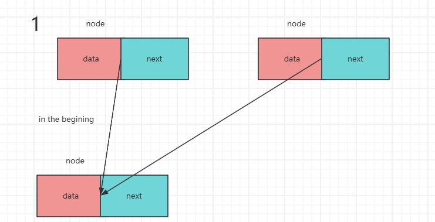
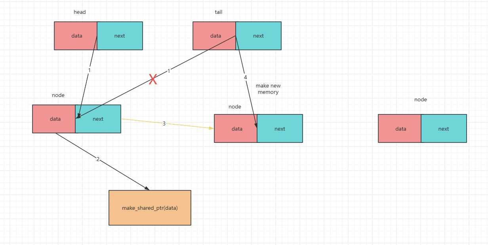
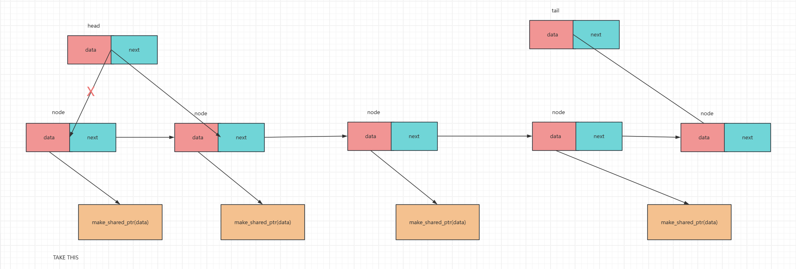

#  Mutil_STL

# 线程安全的数据结构实现

## 线程安全的无锁结构

## 线程安全的有锁数据结构

### 线程安全的有锁队列

为了把控锁的精度，不采用STL中的queue来做任务队列（因为push和pop很难做到实际意义上的并行操作），队列的特点为先进先出，那么维护两个指针head和tail，利用tail push数据，head用于pop数据，规范逻辑，可以做到pop与push并行的去执行，从而提高锁的精度。

#### forward_list实现任务队列

一开始，head和tail会同时指向相同的一块区域，如果head和tail指向地址相同那么代表队列为空

push函数的图解

通过图我们可以看出，tail指向的永远都是一个“空”node（没有数据，本身的next也没有指向下一个），tail的做法就是未雨绸缪，等到下一次变动tail指向时，会将原来的“空”node里的成员二次赋值

pop函数的图解

