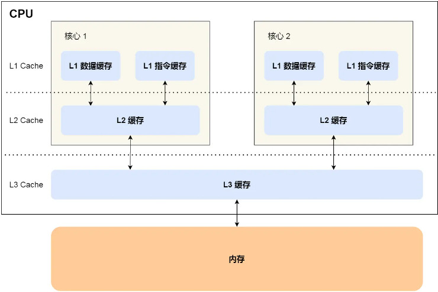
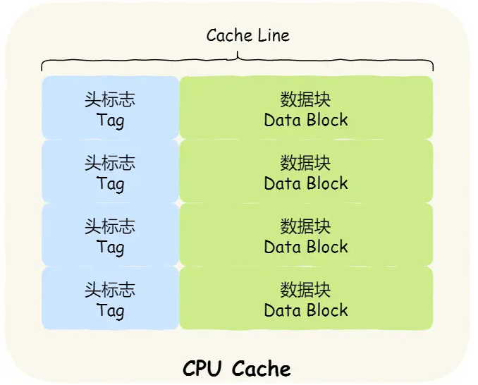
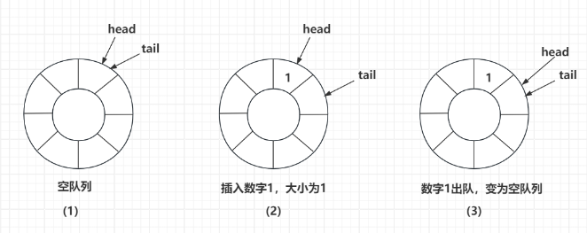
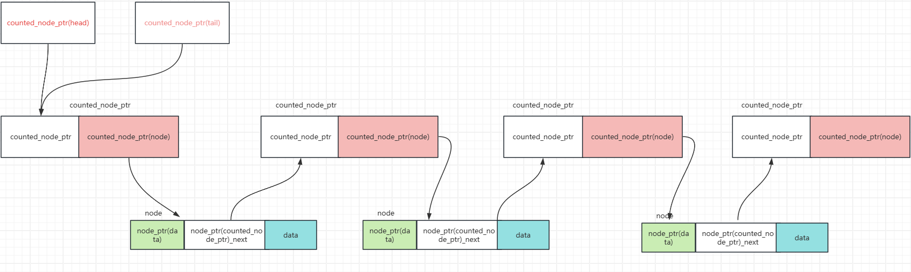
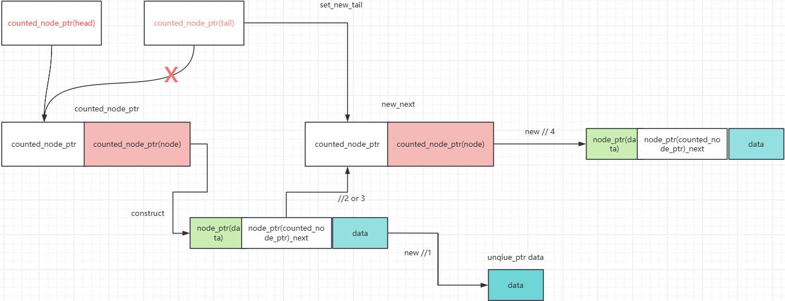
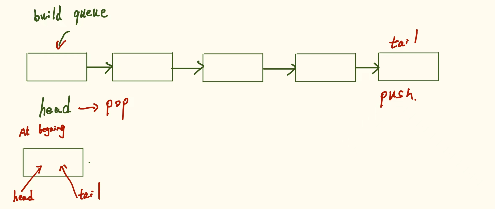
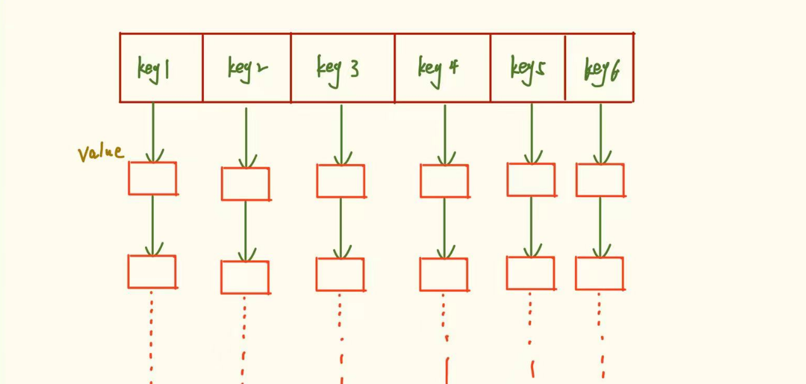

# C++并发编程总结

# 1：线程使用的相关问题

## 1.1 detach 慎用

详细代码看ch1

### 常见问题

如果我们的线程使用了主线程的一些资源，即使thread在执行时内部的一些代码会进行拷贝，但是你无法保证拷贝是发生在主线程未结束时，所以慎用detach的使用

### 特殊问题

对于一些隐式转换，造成主线程不等子线程的情况导致子线程崩溃

那就是char[]类型转string，数组名即数组首地址，所以仍然使用到了主线程的资源

```c++
void safe_oops(int some_param) {
    char buffer[1024];
    sprintf(buffer, "%i", some_param);
    std::thread t(print_str, 3, buffer);//问题所在
    t.detach();
}
```

# 2：线程所属权管理

thread禁用了拷贝构造和等号重载，支持移动拷贝构造

也就是说，一个线程在执行时，无法将其重写赋值，但支持移动语义比如`t1 = std::move(t2)`这种

还有就是一种用法

```c++
std::thread func(void* fc){
    std::thread(fc);
}
auto t = func(xxx);//默认使用移动拷贝构造
```

## 重新封装线程类

为什么要重新封装呢，手动回收是代码重样，封装线程，使其析构函数自动回收

```

```

# 3：并发三剑客async，promise，future

## async

### 基本使用

在C++中，`std::async` 是一个用于异步任务执行的函数，可以让你在独立的线程中运行某个函数或可调用对象，从而实现并发编程。它的返回值为future类

```c++
int task(int n) {
    std::this_thread::sleep_for(std::chrono::seconds(n));
    return n * n;
}

int main() {
    // 使用 std::async 来异步地运行任务
    std::future<int> result = std::async(std::launch::async, task, 3);

    // 主线程可以继续做其他事情
    std::cout << "Doing something else in the main thread...\n";

    // 获取异步任务的结果（会阻塞主线程，直到结果可用）
    int value = result.get();
    std::cout << "Result from async task: " << value << std::endl;

    return 0;
}
```

### std::launch选项

`std::async` 的第一个参数是一个可选的 `std::launch` 枚举，可以用来控制异步任务的执行方式：

- `std::launch::async`: 强制在新线程中异步运行任务。
- `std::launch::deferred`: 任务延迟执行，直到 `get` 或 `wait` 被调用。

```c++
#include <iostream>
#include <future>
#include <thread>

int task(int n) {
    std::this_thread::sleep_for(std::chrono::seconds(n));
    return n * n;
}

int main() {
    // 使用 std::launch::deferred 选项
    std::future<int> result = std::async(std::launch::deferred, task, 3);

    // 主线程可以继续做其他事情
    std::cout << "Doing something else in the main thread...\n";

    // 在此之前，任务并不会执行
    std::cout << "Now waiting for the task to finish...\n";
    int value = result.get();
    std::cout << "Result from deferred task: " << value << std::endl;

    return 0;
}
```

## future

future作为async的返回值，用来获取异步操作的结果

### std::packaged_task

`std::packaged_task` 是一个包装器，用于将可调用对象（如函数、lambda 表达式、函数对象）包装成一个异步任务。它会将可调用对象的结果存储在一个 `std::future` 对象中，从而可以在任务完成后获取结果。

```c++
#include <iostream>
#include <future>
#include <thread>

int task(int n) {
    std::this_thread::sleep_for(std::chrono::seconds(n));
    return n * n;
}

int main() {
    // 创建一个 std::packaged_task 包装 task 函数
    std::packaged_task<int(int)> pt(task);

    // 获取与任务关联的 future 对象
    std::future<int> result = pt.get_future();

    // 将任务交给一个线程来运行
    std::thread t(std::move(pt), 3);

    std::cout << "Doing something else in the main thread...\n";

    // 获取任务结果
    int value = result.get();
    std::cout << "Result from task: " << value << std::endl;

    t.join();
    return 0;
}

```


### **get,wait和wait_for**

#### `get`

- **功能**: 获取异步任务的结果。
- **行为**: 如果异步任务尚未完成，`get` 会阻塞当前线程直到任务完成并返回结果。调用 `get` 之后，`std::future` 对象就不再拥有结果，也不能再次调用 `get`。
- **异常**: 如果异步任务在执行过程中抛出了异常，`get` 会在调用时重新抛出这个异常。

示例：

```c++
int task(int n) {
    std::this_thread::sleep_for(std::chrono::seconds(n));
    return n * n;
}

int main() {
    std::future<int> result = std::async(std::launch::async, task, 2);
    
    // get 会阻塞，直到任务完成，并返回结果
    int value = result.get();
    std::cout << "Result: " << value << std::endl;

    return 0;
}
```

#### wait

```c++
#include <iostream>
#include <future>
#include <thread>

int task(int n) {
    std::this_thread::sleep_for(std::chrono::seconds(n));
    return n * n;
}

int main() {
    std::future<int> result = std::async(std::launch::async, task, 2);
    
    // wait 会阻塞，直到任务完成
    result.wait();
    std::cout << "Task completed.\n";

    // 获取结果
    int value = result.get();
    std::cout << "Result: " << value << std::endl;

    return 0;
}
```

**功能**: 等待异步任务完成。

**行为**: `wait` 只是等待任务完成，但不会获取任务的结果。它不会返回任何值。等待完成后，你可以使用 `get` 获取结果。

**异常**: `wait` 本身不会处理任务的异常，异常会在调用 `get` 时被重新抛出。

#### wait_for

- **功能**: 等待指定的时间段，检查异步任务是否完成。
- **行为**: `wait_for` 接受一个时间段作为参数，等待任务完成或者超时。它返回一个 `std::future_status` 枚举值，可以是 `std::future_status::ready`（任务已完成）、`std::future_status::timeout`（等待超时）、或 `std::future_status::deferred`（任务是延迟执行的）。
- **异常**: 与 `wait` 一样，`wait_for` 本身不会处理任务的异常，异常会在调用 `get` 时被重新抛出。

```c++
#include <iostream>
#include <future>
#include <thread>
#include <chrono>

int task(int n) {
    std::this_thread::sleep_for(std::chrono::seconds(n));
    return n * n;
}

int main() {
    std::future<int> result = std::async(std::launch::async, task, 3);
    
    // 等待2秒，检查任务是否完成
    if (result.wait_for(std::chrono::seconds(2)) == std::future_status::ready) {
        std::cout << "Task completed within 2 seconds.\n";
        int value = result.get();
        std::cout << "Result: " << value << std::endl;
    } else {
        std::cout << "Task did not complete within 2 seconds.\n";
    }

    return 0;
}

```

都是在获取结果也就是调用get函数时，进行异常的抛出，例子如下：

```c++
std::future<int> result = std::async(std::launch::async, task, -1);

    try {
        int value = result.get();
        std::cout << "Result: " << value << std::endl;
    } catch (const std::exception& e) {
        std::cout << "Exception caught: " << e.what() << std::endl;
    }

```

#### 共享类型的future

当我们需要多个线程等待同一个执行结果时，需要使用std::shared_future

```c++
void myFunction(std::promise<int>&& promise) {
    // 模拟一些工作
    std::this_thread::sleep_for(std::chrono::seconds(1));
    promise.set_value(42); // 设置 promise 的值
}
void threadFunction(std::shared_future<int> future) {
    try {
        int result = future.get();
        std::cout << "Result: " << result << std::endl;
    }
    catch (const std::future_error& e) {
        std::cout << "Future error: " << e.what() << std::endl;
    }
}
void use_shared_future() {
    std::promise<int> promise;//多个线程需要这个变量
    std::shared_future<int> future = promise.get_future();
    std::thread myThread1(myFunction, std::move(promise)); // 将 promise 移动到线程中
    // 使用 share() 方法获取新的 shared_future 对象  
    std::thread myThread2(threadFunction, future);
    std::thread myThread3(threadFunction, future);
    myThread1.join();
    myThread2.join();
    myThread3.join();
}
```


### promise

`std::promise`用于在某一线程中设置某个值或异常，而`std::future`则用于在另一线程中获取这个值或异常。`std::promise` 设置结果，`std::future` 获取结果。

```c++
#include <iostream>
#include <future>
#include <thread>

void task(std::promise<int>& prom, int n) {
    std::this_thread::sleep_for(std::chrono::seconds(n));
    prom.set_value(n * n);
}

int main() {
    std::promise<int> prom;
    std::future<int> result = prom.get_future();

    std::thread t(task, std::ref(prom), 3);

    std::cout << "Doing something else in the main thread...\n";

    int value = result.get();
    std::cout << "Result from task: " << value << std::endl;

    t.join();
    return 0;
}

```

```c++
//promise两个重要的函数
set_value();
set_exception();//用于设置异常，该方法接受一个std::exception_ptr参数，该参数可以通过调用std::current_exception()方法获取。下面是一个例子：
#include <iostream>
#include <thread>
#include <future>
void set_exception(std::promise<void> prom) {
    try {
        // 抛出一个异常
        throw std::runtime_error("An error occurred!");
    } catch(...) {
        // 设置 promise 的异常
        prom.set_exception(std::current_exception());
    }
}
int main() {
    // 创建一个 promise 对象
    std::promise<void> prom;
    // 获取与 promise 相关联的 future 对象
    std::future<void> fut = prom.get_future();
    // 在新线程中设置 promise 的异常
    std::thread t(set_exception, std::move(prom));
    // 在主线程中获取 future 的异常
    try {
        std::cout << "Waiting for the thread to set the exception...\n";
        fut.get();
    } catch(const std::exception& e) {
        std::cout << "Exception set by the thread: " << e.what() << '\n';
    }
    t.join();
    return 0;
}
```


## 4:多线程架构

### Actor

Actor模型是一种用于构建并发系统的设计模式。在Actor模型中，"Actor"是并发执行的基本单位。每个Actor都有自己的状态和行为，并通过消息传递进行通信。

#### 主要特点

1. **并发实体**: 每个Actor都是独立的并发实体，具有自己的状态和行为。
2. **消息传递**: Actors通过消息传递进行通信，而不是通过共享内存。消息是异步发送的。
3. **不变性**: 接收到消息的Actor可以创建新的Actors、更改其行为、发送更多消息，但不能直接访问其他Actors的状态。
4. **故障隔离**: Actor之间的隔离性有助于实现故障隔离，即一个Actor的故障不会直接影响到其他Actors。

### CSP

它将系统建模为一组独立的进程，这些进程通过消息通道进行通信。CSP注重进程间的同步通信。

#### 主要特点

1. **独立进程**: 每个进程是独立的顺序执行实体。
2. **通信通道**: 进程通过通信通道进行消息传递。通道可以是同步的或异步的。
3. **同步通信**: 在经典CSP中，进程之间的通信是同步的，发送者和接收者必须在同一时间点进行通信。
4. **组合操作**: CSP支持组合操作，如选择（select）和并发（parallel composition），以便构建复杂的并发行为。

### 总结

对这两个模式的理解，actor，就是将请求的类型分开处理，相同事件被分配到一个队列中，这个类型的事件的队列交给都一个逻辑线程来统一处理。这样不同事物之间存在隔离，且处理同一类型事件不会出现隐患，对于CSP模型，个人认为它是将事件全部打包的一个仓库，拿go来说就是chan，每个仓库的大小确定，保证了仓库之间的隔离性，与actor不同的是，仓库什么类型都有

# 4：**原子操作和内存模型**

## 序列

在我们实现单列模式的时候，提到一个问题，就是使用双锁完成懒汉单列模式时，不使用call_once或者posix提供的pthread_once去声明只允许一个线程去创建单列，或出现顺序上的乱序问题最终导致线程的不安全。这就是从c++语言转汇编底层改变了原来的指令顺序，比如 int* a = new int(10);他在底层并不是像cpp那样，是一个表达式，在转汇编的时候是由多个指令组成。

## 原子类型

标准原子类型的定义位于头文件`<atomic>`内。我们可以通过`atomic<>`定义一些原子类型的变量，如`atomic<bool>`,`atomic<int>` 这些类型的操作全是原子化的。原子类型，默认是线程安全的。

从C++17开始，所有的原子类型都包含一个静态常量表达式成员变量，`std::atomic::is_always_lock_free`。这个成员变量的值表示在任意给定的目标硬件上，原子类型X是否始终以无锁结构形式实现。如果在所有支持该程序运行的硬件上，原子类型X都以无锁结构形式实现，那么这个成员变量的值就为true；否则为false。

`std::atomic_flag`，不提供`is_lock_free()`成员函数，它的`test_and_set`成员函数是一个原子操作，他会先检查`std::atomic_flag`当前的状态是否被设置过，

1 如果没被设置过(比如初始状态或者清除后)，将`std::atomic_flag`当前的状态设置为`true`，并返回`false`。

2 如果被设置过则直接返回`ture`。

对于`std::atomic<T>`类型的原子变量，还支持`load()`和`store()`、`exchange()`、`compare_exchange_weak()`和`compare_exchange_strong()`等操作。

```c++
std::atomic<int> atomicInt(0);
int oldValue = atomicInt.exchange(5); // 将 atomicInt 的值设置为 5，并返回旧值
```

## 内存序

**指令重排（Instruction Reordering）是编译器和处理器为了优化性能，对代码指令执行顺序进行调整的一种技术**。它并不会改变单线程程序的结果，但在多线程环境下，指令重排可能会导致预期外的行为。

C++ 提供了几种内存序，用于控制原子操作的可见性和排序：

- `std::memory_order_relaxed`：没有同步或顺序约束。
  - 不依赖其他数据，只需关注自身即可
  - 最常用的就是计时器（只关注自身的数据）
- `std::memory_order_consume`：读-依赖顺序。
  - 需要读取其他共享资源的数据，再进行操作
  - 适用于依赖读取结果的情况下。注意：由于其复杂性，许多编译器将其视为 `memory_order_acquire`。
- `std::memory_order_acquire`：获取操作不会重排到之前。
  - 用于确保在获取操作之后的所有读取操作看到之前所有写入的结果。
- `std::memory_order_release`：释放操作不会重排到之后。
  - 确保在释放操作之前的所有写入操作在其他线程看到释放操作之后可见。
- `std::memory_order_acq_rel`：获取和释放操作。
  - 用于既需要获取又需要释放的操作。
- `std::memory_order_seq_cst`：顺序一致性操作。
  - 顺序一致性操作。即，所有的读取和写入操作都以全局顺序一致的方式执行。它是最严格的内存序。
  - 确保所有线程对内存的访问顺序完全一致。

**原子类型的两大操作：**

存储（`store`）操作，可选用的内存次序有`std::memory_order_relaxed`、`std::memory_order_release`或`std::memory_order_seq_cst`。

载入（`load`）操作，可选用的内存次序有`std::memory_order_relaxed`、`std::memory_order_consume`、`std::memory_order_acquire`或`std::memory_order_seq_cst`。

## **三大内存模型**

### std::memory_order_relaxed 宽松内存序分析

没有同步或顺序约束。

同步约束：在多线程同步的背景下，其他线程有可能无法立刻马上获取最新的值，可能仍然使用旧的值，进行操作

```c++
std::atomic<int> a = 2;
void set_value() {
    a.store(10, std::memory_order_relaxed);
}
void read_value() {

   // std::this_thread::sleep_for(std::chrono::milliseconds(2000));
    std::cout << "a's value" << a << std::endl;
}

void run() {
    std::thread t1(set_value);

    std::thread t2(read_value);
    t1.join();
    t2.join();
}
//结果是 a = 2
//如果让t2睡一会，结果会变为10，
```

顺序约束的问题：

```c++

    void Set(bool a) {
        //有可能编译器优化导致，他们不一定会按照原来的顺序执行end->start，有可能是start->end
        end.store(a, std::memory_order_relaxed);
        start.store(a, std::memory_order_relaxed);
   
    }
    void Get() {
        while (!start.load(std::memory_order_relaxed))
            std::cout << " start' value still false" << std::endl;
        
        while (!end.load(std::memory_order_relaxed)) {
            ++z;
            std::cout << "end value still false" << std::endl;
        }
        if (z) {//end为false，z增加
            std::cout << "end is false,and the order is " << "z's value" << z << std::endl;
        }
    }
    void run2() {
        std::thread t1(Set, true);
        std::thread t2(Get);
        t1.join();
        t2.join();
        std::cout << "run2 over" << std::endl;
    }
//测试的结果有多样性，有时候start改变了，有时候都不改变，无法预测，这就是不受顺序的约束
```

通过前面的学习，不难看出，一个原子类型进行原子操作，受限于三个主要因素，内存序，cpu构架和缓存一致协议

分析上面，对于同步问题，可能cpu1拿到数据进行修改时还没有放回两者都可见的缓存，cpu2就进行读

对于顺序问题，在编译器层面，可能优化代码形成重排，将start先改为true，并且放回到两者可见的缓存，但是end有可能改了，但是没有放回公共的缓存（顺序），导致t2执行的时候拿到的还是旧值（没有同步）。

### `std::memory_order_seq_cst`

**顺序一致性内存模型**,在这个模型下, 所有线程看到的所有操作都有一个一致的顺序, 即使这些操作可能针对不同的变量, 运行在不同的线程.也就是说对于原子类型的操作，对其进行更改后，其他线程拿到的都是更改后的最新值

```c++
    std::atomic<bool> start;
    std::atomic<bool> end;
    std::atomic<int> z = 0;

    void Set(bool a) {
        end.store(a, std::memory_order_seq_cst);
        start.store(a, std::memory_order_seq_cst);

    }
    void Get() {
        if(start.load(std::memory_order_seq_cst))
            std::cout << "we have catch the start' value change" << std::endl;

        if(end.load(std::memory_order_seq_cst)) {
            ++z;
            std::cout << "end value still is true" << std::endl;
        }
        if (z) {
            std::cout << "end is false,and the order is " << "z's value" << z << std::endl;
        }
    }
    void run() {
        std::thread t1(Set, true);
        std::thread t2(Get);
        t1.join();
        t2.join();
        std::cout << "run2 over" << std::endl;
    }
//测试结果反应出，Get函数中两个分支要么同时出现，要么同时不出现，也就是说，不会出现顺序问题，且支持线程同步
```

实现 sequencial consistent 模型有一定的开销.，所有的cpu都需要统一同步公共的缓存，该过程会造成开销，为了更好且重分使用现代cpu的构架，应该考虑使用宽松的顺序模型

### **Acquire-Release Memory Model**

`std::memory_order_acquire`（load使用） 和 `std::memory_order_release`(store使用) 用于实现同步和顺序保证。

**这里要强调一下，即使release配合acquire，依然会造成，信息无法即使立刻共享问题，也就是说load不一定能拿到最新的值**（参考cpu的构架）

**我们所谓的同步与先行都是基于逻辑层面，也就是我们写code时候用来实现**

如果一个原子类型变量使用std::memory_order_release内存序写数据，则使用load得数据采用std::memory_order_acquire，会获得最新的数据，所以利用他们实现原子类型变量的多线程同步，也就是store happends before the load

release释放操作时，要将释放前的代码全部完成，也就是release之前的代码，不会进行重排操作

```c++
    std::atomic<bool> start;
    std::atomic<bool> end;
    std::atomic<int> z = 0;

    void run() {
        std::thread t1([&] {
            while(!start.load(std::memory_order_acquire))
                std::cout << "wait the start value" << std::endl;
           
            });

        std::thread t2([&] {
            start.store(true,std::memory_order_release);
            });
        t1.join();
        t2.join();
        std::cout << "test3 run over" << std::endl;
    }
//利用该模型解决松散内存序列问题
    void run(int) {
        std::thread t1([&] {
            while (!end.load(std::memory_order_acquire))
                std::cout << "wait the start value" << std::endl;

            if (start)
                std::cout << "get the value change " << std::endl;

            }
        );
 
        //利用该模型是得relax可以正常进行线程同步,保证顺序是start->end
        std::thread t2([&] {
            start.store(true, std::memory_order_relaxed);
            end.store(true, std::memory_order_release);
            });
        t1.join();
        t2.join();
        std::cout << "test3 run over" << std::endl;
    }
//但是如果有其他线程对end进行store的release操作，会再次打乱，因为这是t3线程与t1线程之前的同步
     std::thread t3([&] {
         end.store(true, std::memory_order_release);
         });
```

#### memory_order_consume

是 `acquire-release` 模型的一部分, 但是它比较特殊, 它涉及到数据间相互依赖的关系. 就是前文我们提及的 `carries dependency`和 `dependency-ordered before`.

memory_order_consume 可以用于 load 操作. 使用 memory_order_consume 的 load 称为 consume 操作

```c++
//多次运行，没有触发断言   
void ConsumeDependency() {
       std::atomic<std::string*> ptr;
       int data;

       std::thread t1([&]() {
           std::string* p = new std::string("Hello World"); // (1)
           data = 42; // (2)
           ptr.store(p, std::memory_order_release); // (3)
           });

       std::thread t2([&]() {
           std::string* p2;
           while (!(p2 = ptr.load(std::memory_order_consume))); // (4)
           assert(*p2 == "Hello World"); // (5)
           assert(data == 42); // (6)
           });

       t1.join();
       t2.join();
   }
```


## **cpu架构介绍**

随着时间的推移，CPU 和内存的访问性能相差越来越大，于是就在 CPU 内部嵌入了 CPU Cache（高速缓存），CPU Cache 离 CPU 核心相当近，因此它的访问速度是很快的，于是它充当了 CPU 与内存之间的缓存角色。

**详细架构图**



一个数据要对多个cpu可见，必须存在L3或者内存中，保证数据的原子性的发生要在L3中，如果多个cpu对其进行写操作，必会造成乱序问题，所以各个cpu之前出现MESI

### MESI协议

MESI 协议其实是 4 个状态单词的开头字母缩写，分别是：

- *Modified*，已修改
- *Exclusive*，独占
- *Shared*，共享
- *Invalidated*，已失效

**MESI 协议**，是一种叫作写失效（Write Invalidate）的协议。在写失效协议里，只有一个 CPU 核心负责写入数据，其他的核心，只是同步读取到这个写入。在这个 CPU 核心写入 cache 之后，它会去广播一个“失效”请求告诉所有其他的 CPU 核心。

CPU Cache 是由很多个 Cache Line 组成的，CPU Line 是 CPU 从内存读取数据的基本单位，而 CPU Line 是由各种标志（Tag）+ 数据块（Data Block）组成，你可以在下图清晰的看到：



### 几个常用术语

**`synchronizes-with`" : 同步**

 **happens-before** : 先行，A happens-before B，不管怎样，B拿到数据一定是最新的

**sequenced-before**：单线程情况下前面的语句先执行，后面的语句后执行。操作a先于操作b，那么操作b可以看到操作a的结果。我们称操作a顺序先行于操作b。也就是"a sequenced-before b"。

**inter-thread-happens-before**：线程间先行，也就是线程A改变一个数据，线程B需要依赖这个数据

**carries dependency 和 dependency-ordered before**：单线程情况下a “sequenced-before” b, 且 b 依赖 a 的数据, 则 a “carries a dependency into” b. 称作 a 将依赖关系带给 b, 也理解为b依赖于a。

这些强调的是数据之间的关联顺序问题，不代表指令执行的顺序

## release-acquire-释放序列的扩展

对于store操作，内存序为memory_order_release、memory_order_acq_rel或memory_order_seq_cst，对于load操作，内存序memory_order_consume、memory_order_acquire或memory_order_seq_cst标记，这些操作前后相扣成链，每次载入的值都源自前面的存储操作，那么该操作链由一个释放序列组成，若最后的载入操作服从内存次序memory_order_acquire，memory_order_seq_cst，则最初的存储操作与它构成同步关系，作链中，每个“读-改-写”操作都可选用任意内存次序，甚至也能选用memory_order_relaxed次序。

理解：我们所谓的同步，依赖，先行等术语，实现都是在逻辑层面，**无锁还是依赖于循环进行尝试，不像互斥量那样，会使得其他线程被挂起，所以它并有没有所谓的顺序可言，也就是说release的store可能和load的acquire同时发生，此时acquire的load不会拿到store的最新的值**，要是得他们同步还是得在逻辑层自己控制，上文说到release会形成一个链，，保证了只要store的release比其他线程的acquire先执行，就会引起这个链，保证后续的load得到store的值，对于作链的关系

### **release-sequence关系**

一个原子变量X执行了store采用release标记，该操作为A，后续对这个原子变量的操作。后续操作为以这个A为链头，形成作链，也就是说如果一个线程进行A操作，其他线程对X的操作，会加入到这个以A为链头的作链中，所以一生产者对多个消费者这种模式下，不会产生消费同一块区域的情况，多与多对多的情况，每一个A操作都会建立单独的**release-sequence关系**

```c++
void populate_queue()
{
    unsigned const number_of_items = 20;
    queue_data.clear();
    for (unsigned i = 0; i < number_of_items; ++i)
    {
        queue_data.push_back(i);
    }
    // 1 最初的存储操作
    count.store(number_of_items, std::memory_order_release);   
    store_finish.store(true, std::memory_order_release);
}

void consume_queue_items()
{
    while (true)
    {
        //2等待存储完成
        while (!store_finish.load(std::memory_order_acquire));

        int item_index;
        //3 读—改—写”操作
        if ((item_index = count.fetch_sub(1, std::memory_order_acquire)) <= 0)   
        {
            return;
        }
        //4 从内部容器queue_data 读取数据项是安全行为
        std::cout << "queue_data is  " << queue_data[item_index-1] << std::endl;
    }
}
//启动三个线程t1，t2，t3，t1生产，t2，t3消费，通过打印不会出现打印相同的值，也就是证明了执行一个A操作，会使得其他线程对x原子变量（代码中的count）的后续操作加入到以A为链头的作链中，使得t2与t3达到同步
```

### 易错理解

release不一定会发生在acquire之前，他们的顺序是不知道的，但是只要release发生了，它就会构成**release-sequence关系**，按序来处理作链中的内容

## 利用原子类型实现自旋锁（spinLock）

利用std::atomic_flag,来实现SpinLock

//一点建议，尽量不要过多使用spinkLock,会过度使用cpu

```c++
class SpinLock {
public:
    void lock() {
        //1 处，改变为true，但是返回原来false，获取锁，其他线程再去使用，会陷入循环指针，直到unlock
        while (flag.test_and_set(std::memory_order_acquire)); // 自旋等待，直到成功获取到锁
    }

    void unlock() {
        //2 处
        flag.clear(std::memory_order_release); // 释放锁
    }

private:
    std::atomic_flag flag = ATOMIC_FLAG_INIT;//默认为false
};
//h还可以进一步封装，使其变为lock_guard形式
```

## 利用内存序来优化无锁

对于无锁的多线程程序，需要充分利用当代CPU多核的构架，就离不开内存序的使用，**对于原子类型主要涉及三个点内存序，cpu构架和缓存一致协议**，对于默认内存序`std::memory_order_seq_cst`，并没有充分用到多核的cpu架构，也就是缓存一致性得主内来保证，才能做到多个线程看到数据是最新的，但是这种还是耗费时间，多核中cpu都有一个公共的缓存区L3，利用这个可以减少主存来保证这个核中cpu的缓存一致性，所要用到的内存序就是release-acquire，而release-acquire又可以配合releax形成栅栏。并发编程书中说到release-acquire会形成release-sequence，该作链中读写改所用到的内存序可以是任意的，甚至是relax，对于一个生产者使用release形成链头，多个消费者对这个原子变量在做操作，都是相对“互斥的”，因为它们都在一条作链上。

而对于多对多的情况，是无法做到所谓的互斥，每个release操作都会形成一个新的作链，此时消费者不一定会互斥的去访问数据，去要配合循环去尝试。

## 总结

原子类型进行原子操作，受限于三个主要因素，内存序，cpu构架和缓存一致协议

# **5：实现无锁队列**

## 环形队列



一个环形队列需要两个标志head和tail，插入操作只需要更新tail即可，取出操作移动head，当head与tail相同时表示当前队列为空

```c++
//实现如下：包括测试函数
namespace lock_queue {
    template<class T>
    class Circular_queue {
    public:
        Circular_queue(size_t max_size)
            : m_max_size(max_size), m_data(nullptr), m_head(0), m_tail(0) {
            if (m_max_size > 0) {
                m_data = std::allocator_traits<std::allocator<T>>::allocate(m_allocator, m_max_size);
            }
            std::cout << "sucessful run in the construct" << std::endl;
        }

        Circular_queue(const Circular_queue& other) = delete;
        Circular_queue& operator=(const Circular_queue& other) = delete;

        ~Circular_queue() {
            std::lock_guard<std::mutex> lockguard(m_mutex);
            while (m_head != m_tail) {
                std::allocator_traits<std::allocator<T>>::destroy(m_allocator, m_data + m_head);
                m_head = (m_head + 1) % m_max_size;
            }
            if (m_data) {
                std::allocator_traits<std::allocator<T>>::deallocate(m_allocator, m_data, m_max_size);
            }
            std::cout << "clear sucessfully" << std::endl;
        }

        template<typename ...Args>
        bool emplace(Args&& ... args) {
            std::lock_guard<std::mutex> lockguard(m_mutex);
            if ((m_tail + 1) % m_max_size == m_head) {
                std::cout << "emplace error because of the full" << std::endl;
                return false;
            }
            std::allocator_traits<std::allocator<T>>::construct(m_allocator, m_data + m_tail, std::forward<Args>(args)...);
            m_tail = (m_tail + 1) % m_max_size;
            return true;
        }

        bool push(const T& val) {
            std::cout << "called push const T& version" << std::endl;
            return emplace(val);
        }

        bool push(T&& val) {
            std::cout << "called push T&& version" << std::endl;
            return emplace(std::move(val));
        }

        bool pop(T& val) {
            std::lock_guard<std::mutex> lockguard(m_mutex);
            if (m_head == m_tail) {
                std::cout << "circular queue empty! " << std::endl;
                return false;
            }
            val = std::move(m_data[m_head]);
            std::allocator_traits<std::allocator<T>>::destroy(m_allocator, m_data + m_head);
            m_head = (m_head + 1) % m_max_size;
            return true;
        }

    private:
        std::allocator<T> m_allocator;
        T* m_data;
        size_t m_max_size;
        size_t m_head;
        size_t m_tail;
        std::mutex m_mutex;
    };

    void test_queue() {
        Circular_queue<int> queue(5);


        int value;
        queue.pop(value);
        std::cout << "Popped value: " << value << std::endl;

        queue.push(3);
        queue.push(4);
        queue.push(5);

        while (queue.pop(value)) {
            std::cout << "Popped value: " << value << std::endl;
        }
        Circular_queue<int> queue2(2);
        int x = 20;
        queue2.push(x);
        int value2;
        queue2.pop(value2);
        std::cout << "Popped value: " << value2 << std::endl;
    }

    void queue_test_under_mu_thread() {
        Circular_queue<std::string >queue(5);
        std::string s1 = "sdasdas";
        std::string s2 = "123213213";
        std::thread t1([&] {queue.push(s1); });
        std::thread t2([&] {queue.push(s2); });
    
        t1.join();
        t2.join();
      
        std::string  value;
        while (queue.pop(value)) {
            std::cout << "Popped value: " << value << std::endl;
        }
    }
}
```

## 无锁队列

如何实现无锁呢，那就是想办法将加锁操作那边，利用原子类型来代替lock操作

```cpp
//两种原子比较交换（CAS, Compare-And-Swap）操作
bool std::atomic<T>::compare_exchange_weak(T &expected, T desired);
bool std::atomic<T>::compare_exchange_strong(T &expected, T desired);
```

```c++
//compare_exchange_weak
bool compare_exchange_weak(T& expected, T desired);
bool compare_exchange_weak(T& expected, T desired, std::memory_order success,std::memory_order failure);
```

- `expected`：期望值，通过引用传递。如果当前值与 `expected` 相等，则将当前值替换为 `desired`，并返回 `true`。如果不相等，则更新 `expected` 为当前值，并返回 `false`。
- `desired`：要存储的新值。
- `success`：在比较和交换成功时使用的内存顺序。
- `failure`：在比较和交换失败时使用的内存顺序。

`compare_exchange_weak` 可能会因为伪失败（spurious failure）而返回 `false`，即使当前值与 `expected` 相等。通常用于优化循环中的自旋锁（spinlock），它更容易在高并发下失败，但执行速度更快。

```c++
#include <atomic>
#include <iostream>

int main() {
    std::atomic<int> atomic_val(10);
    int expected = 10;
    int desired = 20;

    if (atomic_val.compare_exchange_weak(expected, desired)) {
        std::cout << "Exchange successful: " << atomic_val.load() << std::endl;
    } else {
        std::cout << "Exchange failed, expected was updated to: " << expected << std::endl;
    }

    return 0;
}

```

### compare_exchange_strong

与weak一样，但是不会发生伪成功。

### 利用单一原子变量实现无锁队列

模仿spinlock

```c++
template<typename T, size_t Cap>
class CircularQueSeq :private std::allocator<T> {
public:
    CircularQueSeq() :_max_size(Cap + 1), _data(std::allocator<T>::allocate(_max_size)), _atomic_using(false), _head(0), _tail(0) {}
    CircularQueSeq(const CircularQueSeq&) = delete;
    CircularQueSeq& operator = (const CircularQueSeq&) volatile = delete;
    CircularQueSeq& operator = (const CircularQueSeq&) = delete;

    ~CircularQueSeq() {
        //循环销毁
        bool use_expected = false;
        bool use_desired = true;
        do
        {
            use_expected = false;
            use_desired = true;
        } while (!_atomic_using.compare_exchange_strong(use_expected, use_desired));
        //调用内部元素的析构函数
        while (_head != _tail) {
            std::allocator<T>::destroy(_data + _head);
            _head = （_head + 1） % _max_size;
        }
        //调用回收操作
        std::allocator<T>::deallocate(_data, _max_size);

        do
        {
            use_expected = true;
            use_desired = false;
        } while (!_atomic_using.compare_exchange_strong(use_expected, use_desired));
    }

    //先实现一个可变参数列表版本的插入函数最为基准函数
    template <typename ...Args>
    bool emplace(Args && ... args) {

        bool use_expected ;
        bool use_desired;
        //类似加锁操作
        //一开始，flag为false,期望也是false，compare返回true，不进入循环，并将falg置为true，其他线程跑到这都会进入循环
        //当第二个线程跑过来时，expect为false，但此时flag为true，返回false陷入循环，然后execpt变为了true，但是在下次循环又被换掉，所以只有一个线程可以进入，其他则陷入循环
        do
        {
            use_expected = false;
            use_desired = true;
        } while (!_atomic_using.compare_exchange_strong(use_expected, use_desired));

        //判断队列是否满了
        if ((_tail + 1) % _max_size == _head) {
            std::cout << "circular que full ! " << std::endl;
            do
            {
                use_expected = true;
                use_desired = false;
            } while (!_atomic_using.compare_exchange_strong(use_expected, use_desired));
            return false;
        }
        //在尾部位置构造一个T类型的对象，构造参数为args...
        std::allocator<T>::construct(_data + _tail, std::forward<Args>(args)...);
        //更新尾部元素位置
        _tail = (_tail + 1) % _max_size;
		//类似解锁操作，此时flag为true，期望也是true，flag又会置为false
        do
        {
            use_expected = true;
            use_desired = false;
        } while (!_atomic_using.compare_exchange_strong(use_expected, use_desired));

        return true;
    }

    //push 实现两个版本，一个接受左值引用，一个接受右值引用

    //接受左值引用版本
    bool push(const T& val) {
        std::cout << "called push const T& version" << std::endl;
        return emplace(val);
    }

    //接受右值引用版本，当然也可以接受左值引用，T&&为万能引用
    // 但是因为我们实现了const T&
    bool push(T&& val) {
        std::cout << "called push T&& version" << std::endl;
        return emplace(std::move(val));
    }

    //出队函数
    bool pop(T& val) {

        bool use_expected = false;
        bool use_desired = true;
        do
        {
            use_desired = true;
            use_expected = false;
        } while (!_atomic_using.compare_exchange_strong(use_expected, use_desired));
        //判断头部和尾部指针是否重合，如果重合则队列为空
        if (_head == _tail) {
            std::cout << "circular que empty ! " << std::endl;
            do
            {
                use_expected = true;
                use_desired = false;
            } while (!_atomic_using.compare_exchange_strong(use_expected, use_desired));
            return false;
        }
        //取出头部指针指向的数据
        val = std::move(_data[_head]);
        //更新头部指针
        _head = (_head + 1) % _max_size;

        do
        {
            use_expected = true;
            use_desired = false;
        } while (!_atomic_using.compare_exchange_strong(use_expected, use_desired));
        return true;
    }
private:
    size_t _max_size;
    T* _data;
    std::atomic<bool> _atomic_using;
    size_t _head = 0;
    size_t _tail = 0;
};
```

#### 弊端

我们实现无锁队列，要面临线程同步时，利用了类似spinlock的方式（不停的尝试），实现了无锁队列，但是这样存在类似spinlock带来的问题，就是cpu的占用效率过高

#### 优化

将m_head和m_tail,变为原子类型即可，在do-while循环的时候，尝试进行push或者pop操作即可（push移动tail，pop移动head）

使用load配合compare_exchange_strong，来优化无锁的逻辑

```c++
//对于pop函数
    bool pop(T& val) {

        size_t h;
        do //先试着获取_head的value，然后尝试用val获取此时head代表的值
        {
            h = _head.load(); //默认采用memory_order_seq_cst，只要原子变量发生改变，其他线程一定会获取最新的值
            //判断头部和尾部指针是否重合，如果重合则队列为空
            if(h == _tail.load())
            {
                return false;
            }
            val = _data[h];

        } while (!_head.compare_exchange_strong(h, //进行比较，如果h的值与_head一致，则尝试pop成功，将_head位置后移动
            (h+1)% _max_size));//那么其他线程进行以上操作时，只有获取最新的_head时才会进行pop操作

        return true;
    }
//不存在value出同一个，compare_exchange_strong是原子的，一个时间只会出现一次，其他线程即使获得同一个pop也不会退
//如果是push操作，就会发生覆盖问题，就算把 _data[h] = val，可以避免多个线程同时对_data进行写


//引入_tail_update,来保证，pop操作是对最新队列的操作，当push操作完，一定更新_tail_update，来保证push操作的结束
//在pop时head必须要和_tail_update进行比较来确定，pop出的是已经更新完的
 bool push(const T& val)
    {
        size_t t;
        do
        {
            t = _tail.load(std::memory_order_relaxed); 
            //判断队列是否满
            if ((t + 1) % _max_size == _head.load(std::memory_order_acquire))
            {
                std::cout << "circular que full ! " << std::endl;
                return false;
            }


        } while (!_tail.compare_exchange_strong(t,
            (t + 1) % _max_size, std::memory_order_release, std::memory_order_relaxed));  //6

        _data[t] = val; 
        size_t tailup;
        do
        {
            tailup = t;

        } while (_tail_update.compare_exchange_strong(tailup,
            (tailup + 1) % _max_size, std::memory_order_release, std::memory_order_relaxed)); //7

        std::cout << "called push data success " << val << std::endl;
        return true;
    }

 bool pop(T& val) {

        size_t h;
        do
        {
            h = _head.load(std::memory_order_relaxed); 
            //判断头部和尾部指针是否重合，如果重合则队列为空
            if (h == _tail.load(std::memory_order_acquire)) 
            {
                std::cout << "circular que empty ! " << std::endl;
                return false;
            }

            //判断如果此时要读取的数据和tail_update是否一致，如果一致说明尾部数据未更新完
            if (h == _tail_update.load(std::memory_order_acquire)) {
                return false;
            }
            val = _data[h]; // 2处

        } while (!_head.compare_exchange_strong(h,
            (h + 1) % _max_size, std::memory_order_release, std::memory_order_relaxed)); 
        std::cout << "pop data success, data is " << val << std::endl;
        return true;
    }
```

### 利用栅栏实现线程同步

前面提到过，利用release和acquire老保证relax可以按照顺序正常执行

```c++
//如下，release保证了前后都不重排，所以得了y的true必然得到x的true
void write_x_then_y3()
{
    x.store(true, std::memory_order_relaxed); // 1
    y.store(true, std::memory_order_release);   // 2
}

void read_y_then_x3()
{
    while (!y.load(std::memory_order_acquire));  // 3
    if (x.load(std::memory_order_relaxed))  // 4
        ++z;
}
//另一种
void write_x_then_y_fence()
{
    x.store(true, std::memory_order_relaxed);  //1
    std::atomic_thread_fence(std::memory_order_release);  //2
    y.store(true, std::memory_order_relaxed);  //3
}

void read_y_then_x_fence()
{
    while (!y.load(std::memory_order_relaxed));  //4
    std::atomic_thread_fence(std::memory_order_acquire); //5
    if (x.load(std::memory_order_relaxed))  //6
        ++z;
}
```

## 无锁队列的优化版本（双引用计数）

//picture 1，整体



//picture 2 插入操作 



```c++


//队列中节点的设计
struct node_counter
    {
        unsigned internal_count : 30;
        unsigned external_counters : 2;
    };//位域

    struct node;

    struct counted_node_ptr
    {
    
        counted_node_ptr():external_count(0), ptr(nullptr) {}
        int external_count;
        node* ptr;
    };

    struct node
    {
        std::atomic<T*> data;
        std::atomic<node_counter> count;//该node的计数情况
        std::atomic<counted_node_ptr> next;

        node(int external_count = 2)
        {
            node_counter new_count;
            new_count.internal_count = 0;
            new_count.external_counters = external_count;//当一个节点被创建时，这个外部的计数应当为2
            count.store(new_count);                      //因为改node会被tail指向，也会被前一个节点的node_ptr指向
			//在创建第一个节点的时候（构造函数实现），head中的node_ptr和tail中的nod_ptr就会指向 ,看A处
            counted_node_ptr node_ptr;
			node_ptr.ptr = nullptr;
			node_ptr.external_count = 0;

            next.store(node_ptr);
        }

   //队列与栈不同需要维护两个节点来控制先进先出
    std::atomic<counted_node_ptr> head; //pop数据需要根据head
    std::atomic<counted_node_ptr> tail; //push数据需要根据tail
   
   lock_free_queue() {
	//A
    counted_node_ptr new_next;
    new_next.ptr = new node();//此时内部计数的external_count = 2，head和tail同时指向
    new_next.external_count = 1;
    tail.store(new_next);
    head.store(new_next);
    std::cout << "new_next.ptr is " << new_next.ptr << std::endl;
}
  /*
  为了保证安全，就不能出现数据冲突问题，即需要及时	更新tail节点
  */
 //push函数的实现
 /**
 push的实现逻辑，head和tail在整个队列构造结束后其值为一个新的counted_node_ptr而且node_ptr（记为m1）指向了一块new出来的空间，在push操作时，第一步就是为这m1的数据部分赋予值，然后才是利用m1的counted_node_ptr_next指向new_counted_node,而且也会效仿construct那样，new node
对于操作3和2处
std::unique_ptr<T> new_data(new T(new_value));
counted_node_ptr new_next;
new_next.ptr = new node;
new_next.external_count = 1;
counted_node_ptr old_tail = tail.load();
 
 **/
 void push(T new_value)
 {  
    std::unique_ptr<T> new_data(new T(new_value));//1
    counted_node_ptr new_next;
    new_next.ptr = new node; //4
    new_next.external_count = 1;
    counted_node_ptr old_tail = tail.load();//获取此时tail的副本
     //old_tail作为局部变量
    for (;;)
    {
        increase_external_count(tail, old_tail); //实现看B
        T* old_data = nullptr;
        //插入数据，将tail中的ptr（node类型）指向1处创建好的数据，一开始data为nullptr
        //如果数据部分(data)为空，将之前创建好的数据部分赋值给data
        if (old_tail.ptr->data.compare_exchange_strong(
            old_data, new_data.get()))//c
        {
            //此时需要node中的counted_node_ptr next来连接下一个counted_node_ptr （看图1）
            //因为我们是基于counted_node_ptr来寻找的
            counted_node_ptr old_next;
            counted_node_ptr now_next = old_tail.ptr->next.load();//old_tail中node指向下一个 counted_node_ptr
            //默认为nullptr
            if (!old_tail.ptr->next.compare_exchange_strong(//更新node中的counted_node_ptr失败，回收该线程new出来
                old_next, new_next))//2
            { 
                delete new_next.ptr;
                new_next = old_next;  
            }
            set_new_tail(old_tail, new_next);//更新tail
            new_data.release();//将独占指针与其指向区域解绑，因为之前将其裸指针赋予其他指针，该内存未被回收
            break;
        }
        else //发现此时的tail中node中数据部分不为空，那么就要去操作node中的next_ptr //d
        {
            counted_node_ptr old_next;
            if (old_tail.ptr->next.compare_exchange_strong(//3
                old_next, new_next))
            {
                old_next = new_next;
                new_next.ptr = new node; 
            }
            set_new_tail(old_tail, old_next);
        }
    }

    construct_count++;
}

  //增加counted_node_ptr中的引用计数
    static void increase_external_count(
        std::atomic<counted_node_ptr>& counter,
        counted_node_ptr& old_counter)
    {
        counted_node_ptr new_counter;
        do
        {
            new_counter = old_counter;
            ++new_counter.external_count;
        } while (!counter.compare_exchange_strong(
            old_counter, new_counter,
            std::memory_order_acquire, std::memory_order_relaxed));
        old_counter.external_count = new_counter.external_count;
    }
    //set_new_tail
    void set_new_tail(counted_node_ptr& old_tail,
        counted_node_ptr const& new_tail)
    {
        node* const current_tail_ptr = old_tail.ptr;//即使old_tail为该线程的局部变量但是可以通过指针进行共享

        while (!tail.compare_exchange_weak(old_tail, new_tail) && //更新tail //F
            old_tail.ptr == current_tail_ptr);
    
        if (old_tail.ptr == current_tail_ptr)
            free_external_counter(old_tail);
        else
            current_tail_ptr->release_ref();
    }
        //释放外部计数，并减少node中external_counters，因为tail被更新，，只有一个外部引用在使用
     static void free_external_counter(counted_node_ptr& old_node_ptr)
    {
        std::cout << "call  free_external_counter " << std::endl;
        node* const ptr = old_node_ptr.ptr; //node
        int const count_increase = old_node_ptr.external_count - 2;//counted_node_ptr, one thread = 0
        node_counter old_counter =
            ptr->count.load(std::memory_order_relaxed);// internal_count = 0; external_count = 2
        node_counter new_counter;
        do
        {
            new_counter = old_counter; //// internal_count = 0; external_count = 2
            --new_counter.external_counters;
            new_counter.internal_count += count_increase;
        }
        while (!ptr->count.compare_exchange_strong(
            old_counter, new_counter,
            std::memory_order_acquire, std::memory_order_relaxed));
        if (!new_counter.internal_count &&
            !new_counter.external_counters)
        {
            //⇽---  4
            destruct_count.fetch_add(1);
            std::cout << "free_external_counter delete success" << std::endl;
            delete ptr;
        }

    }
```

### 多线程下push的分析

三个线程t1，t2，t3，三个线程同时进行分别在线程本地创建由独占指针管理的数据部分和下一个counted_node_ptr，像构造函数一样为这个counted_node_ptr的node部分new 出一个新的空间，三个线程同时吼得当前tail值的副本记为old_tail，并进入 increase_external_count，经过该函数t1中old_tail中external_count，并且tail的external_count也增加，目前为2，此时t2线程也走到这发现while循环条件不符合，又++，将本地old_tail和tail的external_count变为3，t3则变为了4,它们走到c处，有且只有一个线程可以让tail的node的data可以利用独占指针来构造其数据部分，其他线程就会走到d处，其实接下来的操作都是帮助node中的counted_node_ptr连接下一个counted_node_ptr，如果线程t1没有进行连接，那么t2或者t3会帮其连接，且t1会回收该线程连接的counted_node_ptr new出来的node

1：由t1完成counted_node_ptr的连接，进入 set_new_tail，t2，t3直接进入 set_new_tail，试图更新tail，有且只有一个线程会更新成功，如果此时old_tail中node指向没有发生变化，就进入 free_external_counter，减少node中node_counter的外部的引用计数，这种情况下t2与t3F,发现tail已经更改

## 实现线程安全的无锁栈

//与前文相同，利用compare_exchange_strong或者compare_exchange_weak（这个效率高一点，后面详细说明）

```c++
//在出栈，时保证线程安全
//入栈操作，维护一个头节点，，根据头节点的next进行插入操作
template<typename T>
class lock_free_stack
{	//node实现
    struct node
{
    T data;
    node* next;
    node(T const& data_) : 
            data(data_)
    {}
};
private:
    lock_free_stack(const lock_free_stack&) = delete;
    lock_free_stack& operator = (const lock_free_stack&) = delete;
	//作为compare_exchange_strong的条件，作为多线程之间的共享量
    std::atomic<node*> head;
public:
    lock_free_stack() {}
    //入栈操作
    /***
    当多个线程执行push时，先让new_node指向head->next指向的area
    如果head的指向与new_node->next指向一样则更新head为new_node
    此时head指向就是new_node
    某一时刻有且只有一个线程会成功执行compare_exchange_strong，其他线程会再次尝试陷入循环
    ***/
    void push(const T& value){
    	auto new_node = new Node(value)
   	 do{
        	new_node->next = head.load();
    	}while(!head.compare_exchange_strong(new_node->next, new_node));//采用weak会更好，即使出现虚假，也最多再尝试一次
    }
    //pop操作
    //以头节点为驱动，来pop元素
    void pop(T& value){
        do{
            node* old_head = head.load(); //1
            if(old_head == nullptr){
                //error the stack is empty
                return ;
            }
        }while(!head.compare_exchange_weak(old_head, old_head->next)); //2
        //简单的赋值
        try{
        value = old_head->data; //3
        }catch(.....){}
        //如果operator=的实现很安全，那么这个过程个人认为是安全的，即使出现内存不足造成程序的崩溃也不会导致栈结构的破坏
        //具体还是要看operator=的具体实现分析
        //但是考虑到对象跨线程下的一些安全隐患问题，还是使用std::shared_ptr会更加安全
    }
    //shared_ptr
    std::shared_ptr<T> pop() {
        node* old_head = nullptr; //1        
        do {
            old_head = head.load(); //2
            if (old_head == nullptr) {
                return nullptr; 
            }
        } while (!head.compare_exchange_weak(old_head, old_head->next)); //3        

        return old_head->data;  //4    //将struct node 中data 改成std::shared_ptr<T> data
    }
    
}；
    

    
```

### 无锁stack的隐患

**隐患，那就是push次数巨多巨多，然后pop，又push，内存无法及时回收，造成这个栈的空间越来越大**

```c++
//错误的实例：
    template<typename T>
std::shared_ptr<T> pop() {
    node* old_head = nullptr; //1        
    do {
        old_head = head.load();//2
        if (old_head == nullptr) {
            return nullptr; 
        }
    } while (!head.compare_exchange_weak(old_head, old_head->next)); //3      

    std::shared_ptr<T> res;   
    res.swap(old_head->data); 
    //如果对于有锁而言，他是安全的
    //但是无锁不行，无锁不会线程挂起，线程一直尝试，当一个线程成功回收old_head指向的内存
    //第二线程此时已经走到2之后了，运气好点在if时结束，不好点在3出直接崩溃因为线程2的old_head指向了一块被回收的区域
    delete old_head; 
    return res; 
```

### **优化**

- 利用atomic配合待删除列表，对正在使用一个节点的线程做计数，如果计数为1那么代表可以delete（**Reclaim Later**）
- 利用风险指针的决策去处理（**Hazard Pointer**）
- 利用引用计数

#### Hazard Pointer

```c++
//如果一个节点被一个线程使用，(有可能被多个线程使用，因为无锁的核心在于尝试，线程无法被挂起)，那么这个节点就是风险节点
//必须被风险指针和风险指针数组配合管理
//利用风险指针实现
//风险指针
 static const int MAX_HAZARD_POINTERS = 100;
 struct HazardPointer {
        std::atomic<std::thread::id> id;
        std::atomic<void*> pointer;//指向head节点
    };
//风险指针数组
  extern HazardPointer hazard_pointers[MAX_HAZARD_POINTERS];//对于整个项目它是唯一的
//风险指针持有类
class hp_owner{
public:
	hp_owner(hp_owner const&) = delete;
	hp_owner operator=(hp_owner const&) = delete;
    hp_owner():hp(nullptr){
		bind_hazard_pointer();
	}
    
     std::atomic<void*>& get_pointer() {
       return hp->pointer;
   }
    
private:
    //绑定风险指针，当一个风险指针被一个线程启用，遍历风险指针数组
    //如果风险数组中的item的id与old_id相同则将线程当前的id作为替换
    //风险指针中的id一定是于old_id相同两者的初始化都是采用默认构造，也就是id for no thread
    void bind_hazard_pointer(){
        for(unsigned i = 0 ; i< MAX_HAZARD_POINTERS;i++){
			std::thread::id old_id;//id for no thread
            if( hazard_pointers[i].id.compare_exchage_strong(old_id,std::this_thread::get_id())){
                hp = & hazard_pointers[i];
                break;
            }
        }
        if(!hp) throw std::runtime_error("No hazard pointers available")
    }
     HazardPointer* hp;
}

std::atomic<void*>& get_hazard_pointer_for_current_thread() {
    //每个线程都具有自己的风险指针 线程本地变量
    thread_local static hp_owner hazzard;//对应风险指针数组其中一个
    return hazzard.get_pointer();
}

//对于栈的插入，没有任何改变
//对于pop函数，主要涉及到一下几个重点的函数和成员变量

//待删链表
struct data_to_reclaim {
        node* data;
        data_to_reclaim* next;
        data_to_reclaim(node* p) :data(p), next(nullptr) {}
        ~data_to_reclaim() {
            delete data;
        }
   };
//用于判断要删节点是否被其他线程所使用，来判断是直接删除还是加入待删链表之中
//去风险指针数组中找是否与传进来指针的指向是否相同的风险指针
bool outstanding_hazard_pointers_for(void* p)
{
	for (unsigned i = 0; i < max_hazard_pointers; ++i)
	{
		if (hazard_pointers[i].pointer.load() == p)
		{
			return true;
		}
	}
	return false;
}

//待删链表的添加
void add_to_reclaim_list(data_to_reclaim* reclaim_node) {
		reclaim_node->next = nodes_to_reclaim.load();
		while (!nodes_to_reclaim.compare_exchange_weak(reclaim_node->next, reclaim_node));
	}

//以pop出的节点构造待删节点（指向pop出节点的地址）
void reclaim_later(node* old_head) {
		add_to_reclaim_list(new data_to_reclaim(old_head));
	}
//待删链表的删除
void delete_nodes_with_no_hazards() {
  //原子地以非原子实参的值替换原子对象的值，并返回该原子对象的旧值
    //这个做的好处在于同一时刻，只有一个线程可以回收这个待删链表
		data_to_reclaim* current = nodes_to_reclaim.exchange(nullptr);
		while (current) {
			data_to_reclaim* const next = current->next; 
			if (!outstanding_hazard_pointers_for(current->data)) {// A1
				delete current;
			}
			else {
				add_to_reclaim_list(current);//A2
			}

			current = next;
		}
	}

//pop函数
std::shared_ptr<T> pop() {
	//从风险列表中获取一个节点给当前线程
	std::atomic<void*>& hp = get_hazard_pointer_for_current_thread();
	node* old_head = head.load();//1
	do
	{
		node* temp;
		do
		{
			temp = old_head; //2
            //将获取到的stack的head node传给风险指针
			hp.store(old_head);//3
            //再次获取head node
			old_head = head.load();//4
		}while (old_head != temp);//如果head node被更新，那么陷入循环 //5
        //没有则继续操作，如果old_head不为空且，head = old_head则更新head指向
	}while (old_head &&
		!head.compare_exchange_strong(old_head, old_head->next));//6
    
   /**
   上述问题从多线程角度观察三个线程t1,t2,t3
   1： t1先跑一会到2,获取了最新的head，此时t2也启动了也跑到了2，获取了相同的head，同时都在3处让风险指针管理，且在4处依然是原来的		   head，此时在5处两者都同时exit内层循环，在6出有且只有一个线程成功比如t1 success，出来了,而且t1走的很快，走到了8且成功交		 换，此时走到了9处，会去风险指针数组中找，有没有其他风险指针还在使用这个old_head，不巧的是t2很慢还没进行第二次loop，t1的9	     处检测到还有其他线程在使用old_head于是返回true，将其以old_head为值构造放到待删链表之中。再次进入11处，看	         delete_nodes_with_no_hazards()实现逻辑，先获取待删链表的r_head,如果没有其他线程用这个节点就将其直接删除，否则重新将待删节点加入
   
   2：如果幸运的是t2进入了第二次loop且到了3处，将该线程的风险指针指向了新的head，那么t1走到9处判断则是false就直接删除了，就算启用	  了t3,t4,t5等等线程都是这种结果
   
   **/
	hp.store(nullptr); //7
	std::shared_ptr<T> res;
	if (old_head)
	{
		res.swap(old_head->data); //8
		if (outstanding_hazard_pointers_for(old_head)) //9
		{
			reclaim_later(old_head);
		}
		else
		{
			delete old_head; //10
		}
		
		delete_nodes_with_no_hazards(); //11
	}
	return res;
}
```

#### ref_count

**正确的写法是利用拷贝，而不是指针**，以下看似没问题，实则还是存在pop操作时访问空指针的隐患

启动两个线程t1，t2，在一种极端的情况下，t1与t2同时走到了1，且t1成功到了2并且进入了if为true的情况，此时计数为2，且成功的在三处推出且释放了这块区域，t2很慢，走到2处，在进行++操作就会导致访问未定义地址，造成程序的崩溃

```c++
template<typename T>
class single_ref_stack {
public:
	single_ref_stack():head(nullptr) {

	}

	~single_ref_stack() {
		//循环出栈
		while (pop());
	}

	void push(T const& data) {
		auto new_node = new ref_node(data);
		new_node->next = head.load();
		while (!head.compare_exchange_weak(new_node->next, new_node));
	}


	std::shared_ptr<T> pop() {
		ref_node* old_head = head.load();// 1
		for (;;) {
			if (!old_head) {
				return std::shared_ptr<T>();
			}
			++(old_head->_ref_count); //2 
			if (head.compare_exchange_strong(old_head, old_head->_next)) {
				auto cur_count = old_head->_ref_count.load();
				auto new_count;
				do {
					new_count = cur_count - 2;
				} while (!old_head->_ref_count.compare_exchange_weak(cur_count,  new_count));//3

				std::shared_ptr<T> res;
				res.swap(old_head->_data);

				if (old_head->_ref_count == 0) {
					delete old_head;
				}

				return res;
			}
			else {
				if (old_head->_ref_count.fetch_sub(1) == 1) {
					delete old_head;
				}
			}
		}
	}

private:
	struct ref_node {
		//1 数据域智能指针
		std::shared_ptr<T>  _data;
		//2 引用计数
		std::atomic<int> _ref_count;
		//3  下一个节点
		ref_node* _next;
		ref_node(T const& data_) : _data(std::make_shared<T>(data_)),
			_ref_count(1), _next(nullptr) {}
	};

	//头部节点
	std::atomic<ref_node*> head;
};

//这种实现也是存在这样的问题
 std::shared_ptr<T> pop() {
        Node* old_head = head.load(std::memory_order_acquire);
        while (true) {
            if (!old_head) {
                return std::shared_ptr<T>(); // Stack is empty
            }

            Node* new_head = old_head;
            new_head->ref_count.fetch_add(1, std::memory_order_relaxed); // Increase reference count to protect node_ptr

            if (head.compare_exchange_weak(old_head, new_head, std::memory_order_acquire, std::memory_order_relaxed)) {
                break; // Successfully increased reference count
            }

            old_head->ref_count.fetch_sub(1, std::memory_order_relaxed);
            old_head = head.load(std::memory_order_acquire);
        }

        Node* node_ptr = old_head;
        if (head.compare_exchange_strong(old_head, node_ptr->next, std::memory_order_release, std::memory_order_relaxed)) {
            std::shared_ptr<T> res;
            res.swap(node_ptr->data);

            int increase_count = old_head->ref_count.load(std::memory_order_relaxed) - 2;
            if (node_ptr->ref_count.fetch_add(increase_count, std::memory_order_release) == -increase_count) {
                delete node_ptr;
            }

            return res;
        }
        else {
            if (node_ptr->ref_count.fetch_sub(1, std::memory_order_release) == 1) {
                delete node_ptr;
            }
        }
    }
```

**正确的实现**

```c++
//改造node
/**
与之前不同的时node的next变为ref_node，并且多了一个原子变量_dec_count
ref_node作为stack的item


**/
class single_ref_stack{
//...
private:
struct ref_node;
	struct node {
		//1 数据域智能指针
		std::shared_ptr<T>  _data;
		//2  下一个节点
		ref_node _next;
		node(T const& data_) : _data(std::make_shared<T>(data_)) {}

		//减少的数量
		std::atomic<int>  _dec_count;
	};

struct ref_node {
		// 引用计数
		int _ref_count;
	
		node* _node_ptr;
		ref_node( T const & data_):_node_ptr(new node(data_)), _ref_count(1){}

		ref_node():_node_ptr(nullptr),_ref_count(0){}
	};
    
    	//头部节点
	std::atomic<ref_node> head;
}


//插入函数
void push(T const& data) {
		auto new_node =  ref_node(data);
		new_node._node_ptr->_next = head.load();
		while (!head.compare_exchange_weak(new_node._node_ptr->_next, new_node));
	}


//不使用指针，简单的拷贝可以解决上述问题
//在2处，多个线程有且只有一个线程走到3处，多个线程都是在操作head的副本，其他线程就意识到这个点有其他线程在使用且对head的副本的_ref_count+1，虽然是对head的副本操作，但是利用2可以做到多线程之间的计数共享（因为发现head变化，其他线程就会更新_ref_count+1）
//通过4和b的配合，其他线程就算_ref_count计数不为0，发现内存被回收了，直接返回，且9也能保证其他线程不会重复回收
//两处delete只有一处会成功，会成功的的一处也只会是操作这块区域的最后一次
std::shared_ptr<T> pop() {
    ref_node old_head = head.load();//a
    for (;;) {
        ref_node new_head;
        do {
            //1
            new_head = old_head;
            new_head._ref_count += 1;
            //1
        } while (!head.compare_exchange_weak(old_head, new_head));//2

        old_head = new_head;//3
        auto* node_ptr = old_head._node_ptr;//4
        if (node_ptr == nullptr) {//b
            return  std::shared_ptr<T>();
        }

        if (head.compare_exchange_strong(old_head, node_ptr->_next)) {//5
            std::shared_ptr<T> res;
            res.swap(node_ptr->_data); //6
            int increase_count = old_head._ref_count - 2; //7
            if (node_ptr->_dec_count.fetch_add(increase_count) == -increase_count) {
                delete node_ptr;//8
            }

            return res;
        }else {
            if (node_ptr->_dec_count.fetch_sub(1) == 1) { //9
                delete node_ptr;
            }
        }
    }
}


```

#### 利用内存序来优化

关于内存序的知识，在ch4

```c++
//节点实现
//前置声明节点类型
	struct count_node;
	struct counted_node_ptr {
		//1 外部引用计数
		int external_count;
		//2 节点地址
		count_node* ptr;
	};

	struct count_node {
		//3  数据域智能指针
		std::shared_ptr<T> data;
		//4  节点内部引用计数
		std::atomic<int>  internal_count;
		//5  下一个节点
		counted_node_ptr  next;
		count_node(T const& data_): data(std::make_shared<T>(data_)), internal_count(0) {}
	};
	//6 头部节点
	std::atomic<counted_node_ptr> head;

//push的实现
void push(T const& data) {
		counted_node_ptr  new_node;
		new_node.ptr = new count_node(data);
		new_node.external_count = 1;
		new_node.ptr->next = head.load();
		while (!head.compare_exchange_weak(new_node.ptr->next, new_node, 
			std::memory_order_release, std::memory_order_relaxed));//如果成功采用release，失败采用relaxed
	}

//增加头部节点引用数量
	void increase_head_count(counted_node_ptr& old_counter) {
		counted_node_ptr new_counter;
		
		do {
			new_counter = old_counter;
			++new_counter.external_count;
		}
		while (!head.compare_exchange_strong(old_counter,  new_counter, 
			std::memory_order_acquire, std::memory_order_relaxed));
		old_counter.external_count = new_counter.external_count;
	}
//pop的实现
std::shared_ptr<T> pop() {
		counted_node_ptr old_head = head.load();
		for (;;) {
			increase_head_count(old_head); //1
			count_node* const ptr = old_head.ptr;
			if (!ptr) {
				return std::shared_ptr<T>();
			}

			if (head.compare_exchange_strong(old_head, ptr->next,  std::memory_order_relaxed)) {
				std::shared_ptr<T> res;
				res.swap(ptr->data);
				int const count_increase = old_head.external_count - 2;
				if (ptr->internal_count.fetch_add(count_increase, std::memory_order_release) == -count_increase) {
					delete  ptr;
				}
				return res;
			} else if (ptr->internal_count.fetch_add(-1, std::memory_order_acquire) == 1) { //5
				ptr->internal_count.load(std::memory_order_acquire);
				delete ptr;
			}
		}
	}

```


## 原子类型以及无锁编程总结

### 无锁与有锁

#### 有锁算法

##### 优点：

1. **简单性**：有锁算法相对简单，更容易理解和实现。
2. **确定性**：锁机制确保线程安全，避免数据竞争问题。

##### 缺点：

1. **上下文切换开销**：当锁竞争激烈时，线程可能会被阻塞，导致频繁的上下文切换，影响性能。
2. **优先级反转**：高优先级线程可能会被低优先级线程阻塞，导致性能下降。

#### 无锁算法

##### 优点：

1. **高并发性能**：无锁算法在高并发场景下能有效减少上下文切换，提高系统吞吐量。
2. **避免死锁**：无锁算法没有传统锁机制，不会产生死锁问题。

##### 缺点：

1. **复杂性**：无锁算法通常比较复杂，难以实现和调试。
2. **活锁和忙等待**：在高竞争情况下，线程可能会陷入忙等待（spin），导致CPU占用率增加，反而降低系统整体性能。

##### 适用场景

1. **高并发场景**：在需要处理大量并发请求的场景下，无锁算法能有效提高系统的吞吐量。例如，高性能的服务器和网络编程中。
2. **低并发场景**：在并发量不高的场景下，使用锁可以更容易地实现线程安全，且不需要复杂的无锁算法。

不管如何，如果能精准把握锁的精度，仍然可以在高并发场景下在一定程度上提高吞吐量，对一个网络库的高效处理能力其实涉及的方面太多，也有不同的方式去提高网络库的处理能力，但是归其本质都是围绕线程而言，比如优化线程的上下问切换，或者优化线程切换轮询的算法等来优化线程处理任务

### 无锁编程四大建议

### 1. 模型设计

在设计无锁程序时，建议最初使用最严格的内存序，即 `std::memory_order_seq_cst`。这种内存顺序保证了所有线程看到的结果是一致的，使得思考和设计变得相对简单。在代码的逻辑实现基本完成后，可以逐步检查和优化内存顺序，寻找可以放宽内存序的地方。通常，`release` 和 `acquire` 操作用来形成逻辑上的同步，或者根据 `release-sequence` 序列来确保内存的一致性。在确定哪些操作可以放宽内存序时，必须小心验证，这样既能提高性能，又能确保程序的正确性。

### 2. 内存回收方案

在无锁数据结构中，内存回收是一个特别需要关注的问题。由于无锁算法是基于循环尝试的，如果内存管理不当，可能会导致内存泄漏或崩溃。常见的内存回收策略包括：

- **双引用计数**：通过维护两个独立的引用计数，来避免内存被误回收。
- **风险指针（Hazard Pointer）**：通过标记线程正在访问的内存区域，以确保在该内存区域仍被访问时不进行回收。
- **延迟删除**：将要删除的内存延迟到确认所有线程都不再使用该内存时再进行回收。

此外，还可以采用固定大小的内存池，避免频繁的内存分配和释放。但是，这种方法可能会导致 ABA 问题，特别是在使用原子交换操作时。如果一个线程 `pop` 出一个值为 2，另一个线程 `push` 的值也为 2，可能会导致前一个线程误以为操作未发生变化。因此，需要特别注意使用指针的比较来防范这种情况。

### 3. 防范 ABA 问题

ABA 问题是无锁编程中常见的问题之一，尤其是在使用 CAS（Compare-And-Swap）操作时。如果一个线程在检查内存位置的值之后，该值被修改并恢复为原始值，线程可能会误以为值从未改变，从而导致错误的判断和行为。防范 ABA 问题的策略包括：

- **使用版本号**：在指针或者值的基础上附加一个版本号，每次修改值时同时更新版本号，这样即使值恢复到原始值，版本号的变化也能让线程察觉到。
- **使用双引用计数**：维护两个独立的引用计数来追踪内存对象的生命周期，确保内存不会在中间被错误回收和复用。
- 只用指针作为CAS的交换对象

### 4. 解决忙等

忙等（spin-waiting）是无锁编程中常见的一个问题，尤其是在循环重试的过程中。忙等会导致 CPU 资源的浪费，因此在可能的情况下，应尽量减少或消除忙等。解决忙等的策略包括：

- **辅助操作**：在循环重试过程中，线程可以执行一些其他辅助操作，例如帮助其他线程完成它们的任务，这样可以有效利用 CPU 资源，同时减少忙等的影响。
- **自适应等待**：在循环重试时，可以引入自适应等待机制，例如在最初的几次循环中直接重试，如果发现重试过多，可以让线程稍微休眠一段时间再进行重试，从而减少对 CPU 的占用。

# 6:基于锁实现线程安全的数据结构

## 线程安全的stack

对于这种容器类数据结构的线程安全，通常采用消费者与生产模型（通常为锁+条件变量），生产者添加任务执行push操作（signal），消费者执行pop操作（broadcast）

```c++
template<typename  T>
class threadsafe_stack_waitable
{
private:
    std::stack<T> data;
    mutable std::mutex m;
    std::condition_variable cv;
public:
    threadsafe_stack_waitable() {}

    threadsafe_stack_waitable(const threadsafe_stack_waitable& other)
    {
        std::lock_guard<std::mutex> lock(other.m);
        data = other.data;
    }

    threadsafe_stack_waitable& operator=(const threadsafe_stack_waitable&) = delete;

    void push(T new_value)
    {
        std::lock_guard<std::mutex> lock(m);
        data.push(std::move(new_value));   
        cv.notify_one();
    }

    std::shared_ptr<T> wait_and_pop()
    {
        std::unique_lock<std::mutex> lock(m);
        cv.wait(lock, [this]()   
            {
                if(data.empty())
                {
                    return false;
                }
                return true;
            }); 


        std::shared_ptr<T> const res(
            std::make_shared<T>(std::move(data.top())));  
        data.pop();   
        return res;
    }

    void wait_and_pop(T& value)
    {
        std::unique_lock<std::mutex> lock(m);
        cv.wait(lock, [this]()
            {
                if (data.empty())
                {
                    return false;
                }
                return true;
            });

        value = std::move(data.top()); 
        data.pop();  
    }

    bool empty() const
    {
        std::lock_guard<std::mutex> lock(m);
        return data.empty();
    }

    bool try_pop(T& value)
    {
        std::lock_guard<std::mutex> lock(m);
        if(data.empty())
        {
            return false;
        }

        value = std::move(data.top());
        data.pop();
        return true;
    }

    std::shared_ptr<T> try_pop()
    {
        std::lock_guard<std::mutex> lock(m);
        if(data.empty())
        {
            return std::shared_ptr<T>();
        }

        std::shared_ptr<T> res(std::make_shared<T>(std::move(data.top())));
        data.pop();
        return res;
    }

};
```

## 线程安全的队列

```c++
template<typename T>
class threadsafe_queue_ptr
{
private:
    mutable std::mutex mut;
    std::queue<std::shared_ptr<T>> data_queue;
    std::condition_variable data_cond;
public:
    threadsafe_queue_ptr()
    {}
    void wait_and_pop(T& value)
    {
        std::unique_lock<std::mutex> lk(mut);
        data_cond.wait(lk, [this] {return !data_queue.empty(); });
        value = std::move(*data_queue.front());    //⇽-- - 1
            data_queue.pop();
    }
    bool try_pop(T& value)
    {
        std::lock_guard<std::mutex> lk(mut);
        if (data_queue.empty())
            return false;
        value = std::move(*data_queue.front());   // ⇽-- - 2
            data_queue.pop();
        return true;
    }
    std::shared_ptr<T> wait_and_pop()
    {
        std::unique_lock<std::mutex> lk(mut);
        data_cond.wait(lk, [this] {return !data_queue.empty(); });
        std::shared_ptr<T> res = data_queue.front();   // ⇽-- - 3
            data_queue.pop();
        return res;
    }
    std::shared_ptr<T> try_pop()
    {
        std::lock_guard<std::mutex> lk(mut);
        if (data_queue.empty())
            return std::shared_ptr<T>();
        std::shared_ptr<T> res = data_queue.front();   // ⇽-- - 4
            data_queue.pop();
        return res;
    }
    void push(T new_value)
    {
        std::shared_ptr<T> data(
            std::make_shared<T>(std::move(new_value)));   // ⇽-- - 5
            std::lock_guard<std::mutex> lk(mut);
        data_queue.push(data);
        data_cond.notify_one();
    }
    bool empty() const
    {
        std::lock_guard<std::mutex> lk(mut);
        return data_queue.empty();
    }
};
```

### 把握锁的精度

队列这个数据结构很特殊，push操作与pop操作是不冲突的，push操作归一个锁管理，pop操作归另一个锁管理，这样就不会像上面那样类似于应答操作（类似于串行的执行）




```c++
 template<class T>
 class mu_lock_queue {
 public:
     mu_lock_queue() : m_head(new node), m_tail(m_head.get()) {
         std::cout << "construct the queue successful" << std::endl;
     };
     mu_lock_queue(const mu_lock_queue& other) = delete;
     mu_lock_queue(const mu_lock_queue&& other) = delete;
     mu_lock_queue& operator=(const mu_lock_queue& other) = delete;
     mu_lock_queue& operator=(const mu_lock_queue&& other) = delete;
     ~mu_lock_queue() {
         std::cout << "destroy the queue successful" << std::endl;
     }

     std::shared_ptr<T> pop() {
         std::unique_lock<std::mutex> mlock(wait_for_data());
         std::unique_ptr<node> temp = std::move(m_head);
         m_head = std::move(temp->m_next);
         return temp->m_data;
     }

     void push(T new_value) {
         std::unique_ptr<node> new_node = std::make_unique<node>();
        // std::shared_ptr<T> new_data = std::make_shared<T>(std::move(new_value));
         node* new_tail = new_node.get();
         {
             std::lock_guard<std::mutex> lock(m_tail_lock);
             m_tail->m_data = std::make_shared<T>(std::move(new_value));
             m_tail->m_next = std::move(new_node);
             m_tail = new_tail;
         }
         m_cond.notify_one();
     }

 private:
     std::unique_lock<std::mutex> wait_for_data() {
         std::unique_lock<std::mutex> ui_lock(m_head_lock);
         m_cond.wait(ui_lock, [&] {
             return m_head.get() != m_tail;
             });
         return ui_lock;
     }

     struct node {
         std::shared_ptr<T> m_data;
         std::unique_ptr<node> m_next;
     };

     std::mutex m_head_lock;
     std::mutex m_tail_lock;
     std::condition_variable m_cond;
     std::unique_ptr<node> m_head; // pop
     node* m_tail; //push
 };
```

## 查找列表



处理数据和插入数据的时间复杂度都是O(N)的

如果使用map，红黑树对锁的精度掌握和实现比较复杂，如果单纯使用map+mutex，会导致锁的精度过低，

观看上面的图，在store value的时候采用链表，可以沿用上面用链表实现队列的方式来优化和提高锁的进度

实现代码：

```c++

```

## 线程安全的链表

提高锁的精度

```c++
template<typename T>
//........

    struct node
	{
    std::mutex m;
    std::shared_ptr<T> data;
    std::unique_ptr<node> next;
    node() :
        next()
    {}
    node(T const& value) :
        data(std::make_shared<T>(value))
    {}
};
		//.....
      node head;
//插入实现，锁住头节点，保证头插的线程安全
     void push_front(T const& value)
     {
         std::unique_ptr<node> new_node(new node(value));
         std::lock_guard<std::mutex> lk(head.m);
         new_node->next = std::move(head.next);
         head.next = std::move(new_node);
     }
//遍历或者获取没个节点的值
//每次锁住两个节点，以虚节点作为驱动，遍历过的节点作为下次一次遍历的虚节点
//这样的话，再其他线程也进行for_each时，可以安全的访问没加锁的节点
template<typename Function>
	void for_each(Function f)
	{
		node* current = &head;
		std::unique_lock<std::mutex> lk(head.m);
		while (node* const next = current->next.get())
		{
			std::unique_lock<std::mutex> next_lk(next->m);
			lk.unlock();
			f(*next->data);
			current = next;
			lk = std::move(next_lk);
		}
	}

//找到符合条件的节点的数据，然后返回
//取数据的时候，在一定程度上，保证了并行
template<typename Predicate>//Predicate 谓词，一般以匿名函数的形式传入
	std::shared_ptr<T> find_first_if(Predicate p)
	{
		node* current = &head;
		std::unique_lock<std::mutex> lk(head.m);
		while (node* const next = current->next.get())
		{
			std::unique_lock<std::mutex> next_lk(next->m);
			lk.unlock();
			if (p(*next->data))
			{
				return next->data;
			}
			current = next;
			lk = std::move(next_lk);
		}
		return std::shared_ptr<T>();
	}
//删除节点
template<typename Predicate>
	void remove_if(Predicate p)
	{
		node* current = &head;
		std::unique_lock<std::mutex> lk(head.m);
		while (node* const next = current->next.get())
		{
			std::unique_lock<std::mutex> next_lk(next->m);
			if (p(*next->data))
			{
				std::unique_ptr<node> old_next = std::move(current->next);
				current->next = std::move(next->next);
				next_lk.unlock();
			}
			else
			{
				lk.unlock();
				current = next;
				lk = std::move(next_lk);
			}
		}
	}

 //除了push_front其他个函数，皆可以实现真正意义上的并行
```

# 线程池

## 介绍

线程池是一种并发编程的技术，用于有效地管理和复用线程资源。它由一组预先创建的线程组成，**这些线程可以在需要时执行任务，并在任务完成后返回线程池中等待下一个任务。**

线程池的**主要目的是避免反复创建和销毁线程的开销**，**以及有效地控制并发线程的数量**。通过使用线程池，可以降低系统的负载，并提高任务执行的效率，池化技术是一种为了高效的常用手段，除了线程池，还有对象池，内存池等。

### **线程池的一些关键特点：**

1. 线程池包含一个线程队列和任务队列，任务队列用于存储待执行的任务。
2. 线程池在启动时会创建一定数量的线程，并将它们放入线程队列中。
3. 当有任务需要执行时，线程池从任务队列中获取任务，并将其分配给空闲的线程执行。
4. 执行完任务的线程会继续等待下一个任务的到来，而不是被销毁，线程的生命周期归线程池管理。
5. 如果任务队列为空，线程池中的线程可以进入睡眠状态，减少资源占用。
6. 线程池可以限制同时执行的线程数量，避免过多的并发线程导致系统负载过高，比如通过RR算法实现负载均衡。

### 线程池有以下几个优点：

1. 提高性能：通过复用线程，避免了线程创建和销毁的开销，提高了任务执行的效率。
2. 资源控制：线程池可以限制并发线程的数量，避免系统负载过高，保护系统资源。
3. 提高响应性：线程池可以在任务到来时立即进行处理，减少了任务等待的时间，提高了系统的响应速度。
4. 简化编程：使用线程池可以将任务的提交和执行分离，简化了并发编程的复杂性。

## 基本代码实现

```c++
namespace Thread_pool {
	class threadpool
	{
		using Task = function<void()>;	//定义类型
		vector<thread> _pool;           //线程池
		queue<Task> _tasks;             //任务队列
		mutex _lock;                    //同步
		condition_variable _task_cv;    //条件阻塞
		atomic<bool> _run{ true };      //线程池是否执行,原子变量
		atomic<int>  _idlThrNum{ 0 };   //空闲线程数量,原子变量

	public:
		inline threadpool(unsigned short size = 4) { addThread(size); }

		inline ~threadpool() {
			_run = false;
			_task_cv.notify_all();
			for (thread& thread : _pool) {
				//thread.detach(); // 让线程“自生自灭”,不建议这种,前面提到
				if (thread.joinable())
					thread.join(); // 等待任务结束， 前提：线程一定会执行完
			}
		}

	public:
		// 提交一个任务
		// 调用.get()获取返回值会等待任务执行完,获取返回值
		// 有两种方法可以实现调用类成员，
		// 一种是使用   bind： .commit(std::bind(&Dog::sayHello, &dog));
		// 一种是用   mem_fn： .commit(std::mem_fn(&Dog::sayHello), this)
		template<class F, class... Args>
		auto commit(F&& f, Args&&... args) -> future<decltype(f(args...))>//自定义识别,传参为左值还是右值
		{
			if (!_run)    // stoped ??
				throw runtime_error("commit on ThreadPool is stopped.");

			using RetType = decltype(f(args...));  // typename std::result_of<F(Args...)>::type, 函数 f 的返回值类型
			// 把函数入口及参数,打包(绑定)
			auto task = make_shared<packaged_task<RetType()>>(bind(forward<F>(f), forward<Args>(args)...));//完美转发,让传进的参数是什么类型,就以什么类型,传入
			future<RetType> future = task->get_future();
			{    // 添加任务到队列
				lock_guard<mutex> lock{ _lock };
				_tasks.emplace([task]() { (*task)(); });
			}

#ifdef THREADPOOL_AUTO_GROW
			if (_idlThrNum < 1 && _pool.size() < THREADPOOL_MAX_NUM)
				addThread(1);
#endif // !THREADPOOL_AUTO_GROW
			_task_cv.notify_one(); // 唤醒一个线程执行
			return future;
		}
		//空闲线程数量
		int idlCount() { return _idlThrNum; }
		//线程数量
		int thrCount() { return _pool.size(); }

#ifndef THREADPOOL_AUTO_GROW
	private:
#endif // !THREADPOOL_AUTO_GROW

		//添加指定数量的线程
		void addThread(unsigned short size) {
			for (; _pool.size() < THREADPOOL_MAX_NUM && size > 0; --size)
			{   //增加线程数量,但不超过 预定义数量 THREADPOOL_MAX_NUM
				_pool.emplace_back([this] { //工作线程函数
					while (_run) {
						Task task; // 获取一个待执行的 task
						{
							// unique_lock 相比 lock_guard 的好处是：可以随时 unlock() 和 lock()
							unique_lock<mutex> lock{ _lock };
							_task_cv.wait(lock, [this] {return !_run || !_tasks.empty(); }); // wait 直到有 task
							if (!_run && _tasks.empty())
								return;

							task = move(_tasks.front()); // 按先进先出从队列取一个 task
							_tasks.pop();
						}
						_idlThrNum--;
						task();//执行任务
						_idlThrNum++;
					}
					});
				_idlThrNum++;
			}
		}
	};

}
```

## 几种线程池的实现

# 封装可中断线程

在线程池的析构函数回收线程的过程也可以变相的理解成一种中断线程的方式，通过一个所有线程都能看到的bool变量配合条件变量，实现了线程池中线程的回收。那么对于单独的线程如何实现单独的线程与线程之前的中断，

中断线程的实现大体如下：

```c++
class  interruptible_thread{
public:
template<typename Func>
interruptible_thread(){};
~interruptible_thread(){};
void join(){};
void interrupt(){}; // set the flag 

private:
    std::thread interrupt_thread;
    interrupt_flag _flag;
};
```

重要的是如何实现中断标记interrupt_flag

```c++
class interrupt_flag{ // the member of the interrupt_flag
 // some  function
    
private：
    std::atomic<bool> flag;
    std::condition_variable* thread_cond;
    std::condition_variable_any* thread_cond_any; // 你可以使用所有类型的锁来配合该条件变量
    std::mutex _mtx;
};
```

