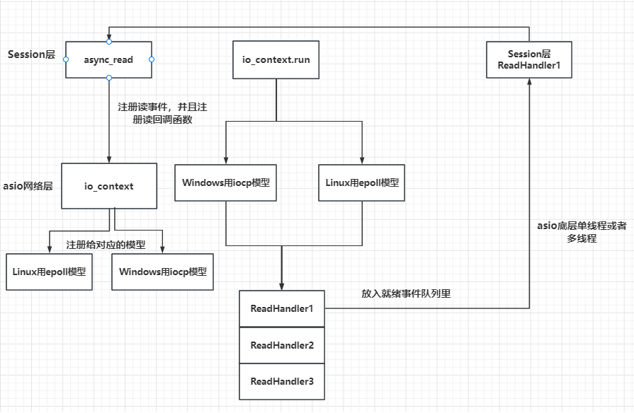
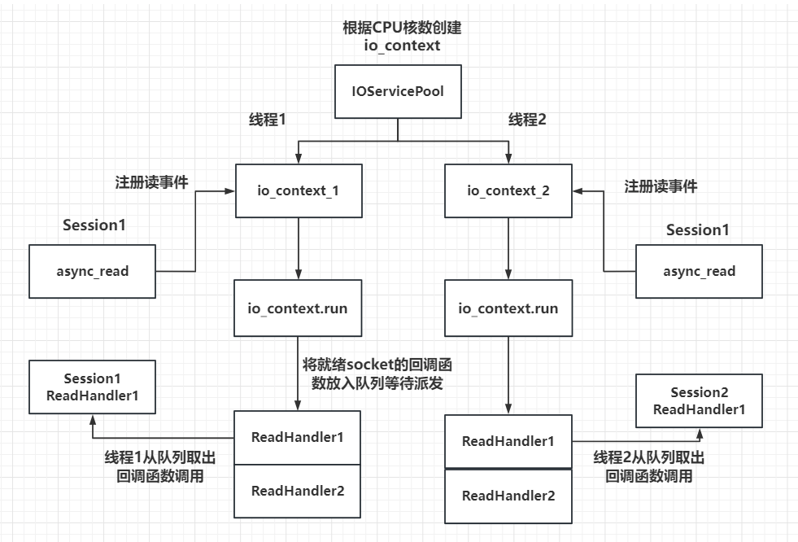
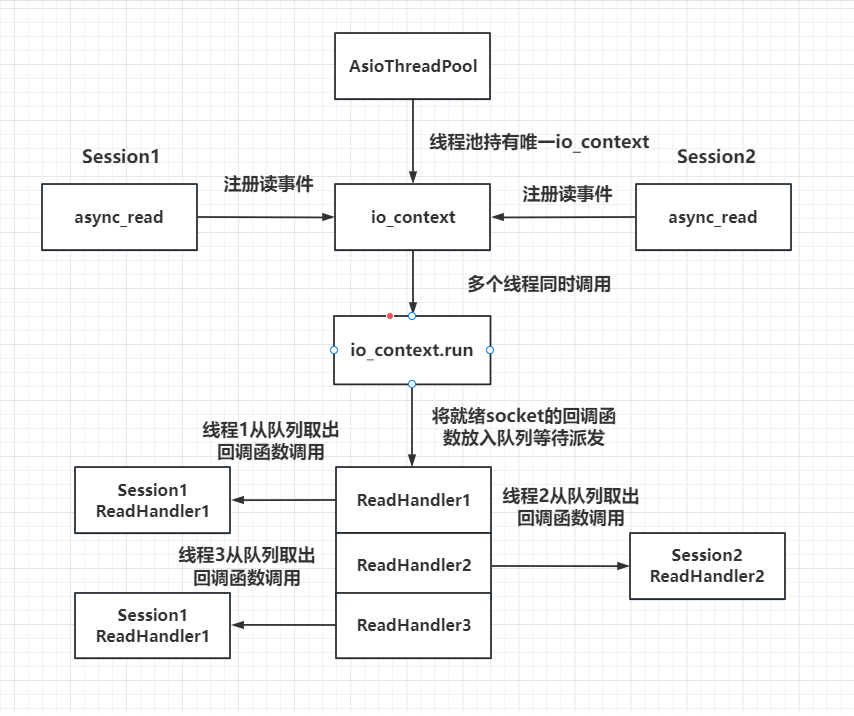
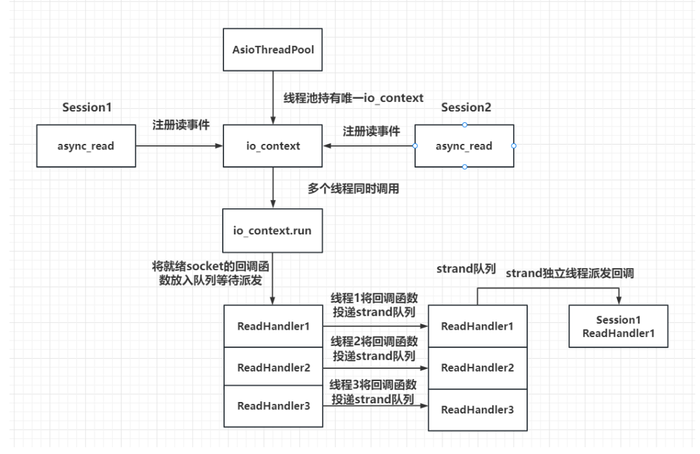

# 网络编程总结

# 使用Boost进行网络编程

## 常用Boost进行网络编程的API

```c++
//创建，通信的客户端，由ip+port组成,运输层采用tcp的形式
using namespace boost;
string ip = "xxxxxxx";
system::error_code ec;
asio::ip::tcp::endpoint ep(asio::ip::address::from_string(ip,ec),ip_address,port_num);
```

```c++
//server
unsigned short port_num = 3333;
asio::ip::address ip_address = asio::ip::address_v6::any();
asio::ip::tcp::endpoint ep(ip_address, port_num);
```

```c++
//上面的endpoint都需要绑定本地套接字也就是socketfd，用来最为双方通信的本地代表
int  connect_to_end() {
    // Step 1. Assume that the client application has already
            // obtained the IP address and protocol port number of the
            // target server.
    std::string raw_ip_address = "127.0.0.1";
    unsigned short port_num = 3333;
    try {
        // Step 2. Creating an endpoint designating 
        // a target server application.
        asio::ip::tcp::endpoint
            ep(asio::ip::address::from_string(raw_ip_address),
                port_num);
        asio::io_context ios;
        // Step 3. Creating and opening a socket.
        asio::ip::tcp::socket sock(ios, ep.protocol());
        // Step 4. Connecting a socket.
        sock.connect(ep);
        // At this point socket 'sock' is connected to 
        // the server application and can be used
        // to send data to or receive data from it.
    }
    // Overloads of asio::ip::address::from_string() and 
    // asio::ip::tcp::socket::connect() used here throw
    // exceptions in case of error condition.
    catch (system::system_error& e) {
        std::cout << "Error occured! Error code = " << e.code()
            << ". Message: " << e.what();
        return e.code().value();
    }
}
//server
int accept_new_connection(){
    // The size of the queue containing the pending connection
            // requests.
    const int BACKLOG_SIZE = 30;
    // Step 1. Here we assume that the server application has
    // already obtained the protocol port number.
    unsigned short port_num = 3333;
    // Step 2. Creating a server endpoint.
    asio::ip::tcp::endpoint ep(asio::ip::address_v4::any(),
        port_num);
    asio::io_context  ios;
    try {
        // Step 3. Instantiating and opening an acceptor socket.
        asio::ip::tcp::acceptor acceptor(ios, ep.protocol());
        // Step 4. Binding the acceptor socket to the 
        // server endpint.
        acceptor.bind(ep);
        // Step 5. Starting to listen for incoming connection
        // requests.
        acceptor.listen(BACKLOG_SIZE);
        // Step 6. Creating an active socket.
        asio::ip::tcp::socket sock(ios);
        // Step 7. Processing the next connection request and 
        // connecting the active socket to the client.
        acceptor.accept(sock);
        // At this point 'sock' socket is connected to 
        //the client application and can be used to send data to
        // or receive data from it.
    }
    catch (system::system_error& e) {
        std::cout << "Error occured! Error code = " << e.code()
            << ". Message: " << e.what();
        return e.code().value();
    }
}
```

## 关于buffer的处理

```c++
//关于boost asio提供的发送接收读写，需要接收的参数是boost提供的buffer类型
//直接使用asio::buffer转换即可，参数为字符串首地址和字符串长度
```

## boost提供的提供的发送接收读写的API

这里我不得不重新回顾一下异步，同步的知识点

- 从事件角度的同步异步
  - 同步：处理未完成事件，也就是事件发送过来，得处理，就像你定外卖，你站在门口等外卖员，把外卖送到你的手里
  - 异步：已经完成的事件，通知我们的是已完成的事件，比如你定外卖，你告诉外卖员放门口即可
- 程序执行上的同步异步
  - 同步：程序串行的执行
  - 异步：程序岔开的执行，事件完成后再回来
- 我们提到过的两个框架reactor和Preactor他们涉及到的同步异步都是基于事件层面的同步和异步
  - 同步：对于reactor架构的服务器而言，程序的I/O处理单元处理连接等操作，逻辑单元处理具体事件的处理，当然reactor也可以是异步，Reactor 模型其实更多是事件驱动机制，I/O事件准备好之后会通知应用层，由应用层同步处理。
  - 异步：对于Preactor架构而言，I/O处理单元，即用来具体处理事件，逻辑单元用来处理完成事件
- 在一般开发中，一般采用两者的混合，半同步/半反应堆模式或者采用muduo的架构思路，主从reactor

### 同步接口

```c++
//关于boost提供的提供的发送接收读写的API
// 1: write_some,特点，如果要写的data很大，无法做到一次性写完，得配合循环，加字符串偏移来解决
    std::string buf = "Hello World!";
    std::size_t  total_bytes_written = 0;
    //循环发送
    //write_some返回每次写入的字节数
    //total_bytes_written是已经发送的字节数。
    //每次发送buf.length()- total_bytes_written)字节数据
    while (total_bytes_written != buf.length()) {
        total_bytes_written += sock.write_some(
            asio::buffer(buf.c_str()+total_bytes_written, 
                buf.length()- total_bytes_written));
 //2:boost提供发送完才返回的函数send，不需要像上面那样
       int send_data_by_send(){
    std::string raw_ip_address = "127.0.0.1";
    unsigned short port_num = 3333;
    try {
        asio::ip::tcp::endpoint
            ep(asio::ip::address::from_string(raw_ip_address),
                port_num);
        asio::io_service ios;
        // Step 1. Allocating and opening the socket.
        asio::ip::tcp::socket sock(ios, ep.protocol());
        sock.connect(ep);
        std::string buf = "Hello World!";
        int send_length = sock.send(asio::buffer(buf.c_str(), buf.length()));
        if (send_length <= 0) {
            cout << "send failed" << endl;
            return 0;
        }
    }
    catch (system::system_error& e) {
        std::cout << "Error occured! Error code = " << e.code()
            << ". Message: " << e.what();
        return e.code().value();
    }
    return 0;
} 
 //write,也可以做到一次性写完
 int send_length  = asio::write(sock, asio::buffer(buf.c_str(), buf.length()));       
 //同步读read_some
 const unsigned char MESSAGE_SIZE = 7;
    char buf[MESSAGE_SIZE];
    std::size_t total_bytes_read = 0;
    while (total_bytes_read != MESSAGE_SIZE) {
        total_bytes_read += sock.read_some(
            asio::buffer(buf + total_bytes_read,
                MESSAGE_SIZE - total_bytes_read));
    }
    return std::string(buf, total_bytes_read);
   //同步，下面两个都可以做到一次性读完
    int receive_length =  sock.receive(asio::buffer(buffer_receive, BUFF_SIZE));
     int receive_length = asio::read(sock, asio::buffer(buffer_receive, BUFF_SIZE)); 
    //读取到指定的字符
    std::string  read_data_by_until(asio::ip::tcp::socket& sock) {
    asio::streambuf buf;
    // Synchronously read data from the socket until
    // '\n' symbol is encountered.  
    asio::read_until(sock, buf, '\n');
    std::string message;
    // Because buffer 'buf' may contain some other data
    // after '\n' symbol, we have to parse the buffer and
    // extract only symbols before the delimiter. 
    std::istream input_stream(&buf);
    std::getline(input_stream, message);
    return message;
 }
```

### 异步接口

```c++
//所有异步接口都需要提供回调函数，用来处理异步读写完毕后的操作
//异步写
boost::asio::async_write_some(buffer, callback)//读取，并不是全部读完，需要利用循环或者递归来逐步完善
boost::asio::async_write(buffer，callback)//全部读完才可
//异步读
boost::asio::async_read_some(buffer,callback)
boots::asio::async_read(buffer,callback)
```

## 粘包问题的处理

粘包问题的出现是基于Tcp协议的特点，因为其基于字节流，它是无边界，当一个服务器频繁recv或者其他情况时发生这种情况，所以要处理粘包问题的逻辑要发生于应用层

example：比如send hello world， 如果发生频繁，recv处理且返回时可能时world hello

**常见的粘包问题处理方式**

- 发送双方协定一个最大接收和发送的字节缓存区，也就是用户缓存区如果要拷贝到TCP的发送缓存区就得规定好的缓存区大小，当数据从TCP的接收缓存区拷贝到用户的缓存区时也是以这个大小
  - 这个处理有一个弊端，在接收发送小数据时仍然可能出现粘包问题，或者采用，/0或其他来填充，这无疑会造成资源上的浪费。
- 第二种使用\r，\0,\n等换位，换行符等，来作为切包处理，但是还是存在隐患，如果原有数据仍然存在这些多个换行符，照样会产生问题
- 采用TIV格式的缓存区，主要组成部分数据id+数据大小+数据内容。（抛开数据id部分，只讨论后面两个部）
  - 客户端发送的包包含数据大小+内容，服务端先处理头部，拿到该数据大小，再进行读取操作

**aysnc_read_some处理粘包**

```c++
//消息体结构体
class MsgNode
{
    friend class CSession;
public:
    MsgNode(char * msg, short max_len):_total_len(max_len + HEAD_LENGTH),_cur_len(0){
        _data = new char[_total_len+1]();
        memcpy(_data, &max_len, HEAD_LENGTH);//消息体大小的拷贝
        memcpy(_data+ HEAD_LENGTH, msg, max_len);//数据部分的拷贝
        _data[_total_len] = '\0';
    }
    MsgNode(short max_len):_total_len(max_len),_cur_len(0) {
        _data = new char[_total_len +1]();
    }
    ~MsgNode() {
        delete[] _data;
    }
    void Clear() {
        ::memset(_data, 0, _total_len);
        _cur_len = 0;
    }
private:
    short _cur_len;
    short _total_len;
    char* _data;
};

  //收到的消息结构,在CSession中添加这两个成员
    std::shared_ptr<MsgNode> _recv_msg_node;
    bool _b_head_parse;
    //收到的头部结构
    std::shared_ptr<MsgNode> _recv_head_node;

//读函数处理逻辑
void CSession::HandleRead(const boost::system::error_code& error, size_t  bytes_transferred, std::shared_ptr<CSession> shared_self){
    if (!error) {
        //已经移动的字符数
        int copy_len = 0;
        while (bytes_transferred>0) {
            if (!_b_head_parse) {
                //收到的数据不足头部大小
                if (bytes_transferred + _recv_head_node->_cur_len < HEAD_LENGTH) {
                    memcpy(_recv_head_node->_data + _recv_head_node->_cur_len, _data+ copy_len, bytes_transferred);
                    _recv_head_node->_cur_len += bytes_transferred;
                    ::memset(_data, 0, MAX_LENGTH);
                    _socket.async_read_some(boost::asio::buffer(_data, MAX_LENGTH), 
                        std::bind(&CSession::HandleRead, this, std::placeholders::_1, std::placeholders::_2, shared_self));
                    return;
                }
                //收到的数据比头部多
                //头部剩余未复制的长度
                int head_remain = HEAD_LENGTH - _recv_head_node->_cur_len;
                memcpy(_recv_head_node->_data + _recv_head_node->_cur_len, _data+copy_len, head_remain);
                //更新已处理的data长度和剩余未处理的长度
                copy_len += head_remain;
                bytes_transferred -= head_remain;
                //获取头部数据
                short data_len = 0;
                memcpy(&data_len, _recv_head_node->_data, HEAD_LENGTH);
                cout << "data_len is " << data_len << endl;
                //头部长度非法
                if (data_len > MAX_LENGTH) {
                    std::cout << "invalid data length is " << data_len << endl;
                    _server->ClearSession(_uuid);
                    return;
                }
                _recv_msg_node = make_shared<MsgNode>(data_len);
                //消息的长度小于头部规定的长度，说明数据未收全，则先将部分消息放到接收节点里
                if (bytes_transferred < data_len) {
                    memcpy(_recv_msg_node->_data + _recv_msg_node->_cur_len, _data + copy_len, bytes_transferred);
                    _recv_msg_node->_cur_len += bytes_transferred;
                    ::memset(_data, 0, MAX_LENGTH);
                    _socket.async_read_some(boost::asio::buffer(_data, MAX_LENGTH), 
                        std::bind(&CSession::HandleRead, this, std::placeholders::_1, std::placeholders::_2, shared_self));
                    //头部处理完成
                    _b_head_parse = true;
                    return;
                }
                memcpy(_recv_msg_node->_data + _recv_msg_node->_cur_len, _data + copy_len, data_len);
                _recv_msg_node->_cur_len += data_len;
                copy_len += data_len;
                bytes_transferred -= data_len;
                _recv_msg_node->_data[_recv_msg_node->_total_len] = '\0';
                cout << "receive data is " << _recv_msg_node->_data << endl;
                //此处可以调用Send发送测试
                Send(_recv_msg_node->_data, _recv_msg_node->_total_len);
                //继续轮询剩余未处理数据
                _b_head_parse = false;
                _recv_head_node->Clear();
                if (bytes_transferred <= 0) {
                    ::memset(_data, 0, MAX_LENGTH);
                    _socket.async_read_some(boost::asio::buffer(_data, MAX_LENGTH), 
                        std::bind(&CSession::HandleRead, this, std::placeholders::_1, std::placeholders::_2, shared_self));
                    return;
                }
                continue;
            }
            //已经处理完头部，处理上次未接受完的消息数据
            //接收的数据仍不足剩余未处理的
            int remain_msg = _recv_msg_node->_total_len - _recv_msg_node->_cur_len;
            if (bytes_transferred < remain_msg) {
                memcpy(_recv_msg_node->_data + _recv_msg_node->_cur_len, _data + copy_len, bytes_transferred);
                _recv_msg_node->_cur_len += bytes_transferred;
                ::memset(_data, 0, MAX_LENGTH);
                _socket.async_read_some(boost::asio::buffer(_data, MAX_LENGTH), 
                    std::bind(&CSession::HandleRead, this, std::placeholders::_1, std::placeholders::_2, shared_self));
                return;
            }
            memcpy(_recv_msg_node->_data + _recv_msg_node->_cur_len, _data + copy_len, remain_msg);
            _recv_msg_node->_cur_len += remain_msg;
            bytes_transferred -= remain_msg;
            copy_len += remain_msg;
            _recv_msg_node->_data[_recv_msg_node->_total_len] = '\0';
            cout << "receive data is " << _recv_msg_node->_data << endl;
            //此处可以调用Send发送测试
            Send(_recv_msg_node->_data, _recv_msg_node->_total_len);
            //继续轮询剩余未处理数据
            _b_head_parse = false;
            _recv_head_node->Clear();
            if (bytes_transferred <= 0) {
                ::memset(_data, 0, MAX_LENGTH);
                _socket.async_read_some(boost::asio::buffer(_data, MAX_LENGTH),
                    std::bind(&CSession::HandleRead, this, std::placeholders::_1, std::placeholders::_2, shared_self));
                return;
            }
            continue;
        }
    }
    else {
        std::cout << "handle read failed, error is " << error.what() << endl;
        Close();
        _server->ClearSession(_uuid);
    }
}
```

**async_read处理粘包问题**

```c++
void CSession::Start(){
    _recv_head_node->Clear();
    boost::asio::async_read(_socket, boost::asio::buffer(_recv_head_node->_data, HEAD_LENGTH), std::bind(&CSession::HandleReadHead, this, 
        std::placeholders::_1, std::placeholders::_2, SharedSelf()));
}
//解析头部
void CSession::HandleReadHead(const boost::system::error_code& error, size_t  bytes_transferred, std::shared_ptr<CSession> shared_self) {
    if (!error) {
        if (bytes_transferred < HEAD_LENGTH) {
            cout << "read head lenth error";
            Close();
            _server->ClearSession(_uuid);
            return;
        }
        //头部接收完，解析头部
        short data_len = 0;
        memcpy(&data_len, _recv_head_node->_data, HEAD_LENGTH);
        cout << "data_len is " << data_len << endl;
        //此处省略字节序转换
        // ...
        //头部长度非法
        if (data_len > MAX_LENGTH) {
            std::cout << "invalid data length is " << data_len << endl;
            _server->ClearSession(_uuid);
            return;
        }
        _recv_msg_node= make_shared<MsgNode>(data_len);
        boost::asio::async_read(_socket, boost::asio::buffer(_recv_msg_node->_data, _recv_msg_node->_total_len), 
            std::bind(&CSession::HandleReadMsg, this,
            std::placeholders::_1, std::placeholders::_2, SharedSelf()));
    }
    else {
        std::cout << "handle read failed, error is " << error.what() << endl;
        Close();
        _server->ClearSession(_uuid);
    }
}
//解析消息体
void CSession::HandleReadMsg(const boost::system::error_code& error, size_t  bytes_transferred,
    std::shared_ptr<CSession> shared_self) {
    if (!error) {
        PrintRecvData(_data, bytes_transferred);
        std::chrono::milliseconds dura(2000);
        std::this_thread::sleep_for(dura);
        _recv_msg_node->_data[_recv_msg_node->_total_len] = '\0';
        cout << "receive data is " << _recv_msg_node->_data << endl;
        Send(_recv_msg_node->_data, _recv_msg_node->_total_len);
        //再次接收头部数据
        _recv_head_node->Clear();
        boost::asio::async_read(_socket, boost::asio::buffer(_recv_head_node->_data, HEAD_LENGTH),
            std::bind(&CSession::HandleReadHead, this, std::placeholders::_1, std::placeholders::_2,
                SharedSelf()));
    }
    else {
        cout << "handle read msg failed,  error is " << error.what() << endl;
        Close();
        _server->ClearSession(_uuid);
    }
}
```

## boost库中asio进行服务器架构的原理



io_context的底层封装epoll模型或者是iocp模型。所有的事件都会被注册到io_context的底层模型里面

以Linux的epoll为例

```c++
//声明一个io_context，并且将其赋值给我们所写的server类并且使用了run函数等价于以下操作
//假设一个用于监听的socketfd为listenfd，将其注册到epoll的注册表中
//已经初始了epollfd

//然后调用epoll_wait进行就绪事件的监听
//判断listenfd如果再次触发，就是新的连接到来，使用accept函数接收连接，并反回一个新的scoketfd且加入epoll_wait

//在单线程下，相较于传统的Linux使用原生的epoll，它可以通过上下文切换，来对epoll_wait这个就绪队列进行操作
//io_context.run()类似于以下
while (true) {
    std::vector<epoll_event> events = epoll_wait(epollfd, ...);
    for (auto& event : events) {
        if (event.fd == listenfd) {
            // 处理新的连接
            int new_socket = accept(listenfd, ...);
            epoll_ctl(epollfd, EPOLL_CTL_ADD, new_socket, ...);
        } else {
            // 处理其他 I/O 事件
        }
    }
}
```


## 优雅关闭服务器的方式

### 第一种：信号+条件变量

```c++
//重新回顾一下条件变量
//条件变量的使用涉及到两个点 signal/broadcast，signal通知方， broadcast就是所谓的接收方

static bool bstop = false;
std::condition_variable cond_quit;
std::mutex mutex_quit;

void sig_handle(int sig){ //信号处理函数,作为signal方 //配合signal使用
    if(sig == SIGINT || sig = SIGTERM){
        std::unique_lock<std::mutex>lock_quit(mutex_quit);
        bstop = true;//条件变量改变，通知
        cond.quit.notify_one();
    }
}
//broadcast方
while(!bstop){ //利用循环防止虚假唤醒
    std::unique_lock<std::mutex> lock_quit(mutex_quit);
    cond_quit.wait(lock_quit);
}


```

### 第二种：使用 boost提供的信号捕获函数

```c++
int main()
{
    try {
        boost::asio::io_context  io_context;
        boost::asio::signal_set signals(io_context, SIGINT, SIGTERM);//等待接收这两个信号
        signals.async_wait([&io_context](auto, auto) {
            io_context.stop();
            });
        CServer s(io_context, 10086);
        io_context.run();
    }
    catch (std::exception& e) {
        std::cerr << "Exception: " << e.what() << endl;
    }
}
```

## asio多线程模型

### IOServicePool模型

//来自up主恋恋风辰zack



利用多个io_context实现多线程模式下的服务器架构

主线程的io_context用于建立新的连接，将新生成的socketfd交给其他io-context处理即可，事件可读，可写，就将其交给对应的io_context处理，不建议将其他线程作为事件处理的主单元，，而是将其交给一个统一的逻辑线程来处理。（这样减少处理I/O事件的时间来保证处理其他事件不被延迟，而由逻辑线程来统一处理处理，就像redis的逻辑线程就是单线程）

代码示例

```c++
class AsioIOServicePool:public Singleton<AsioIOServicePool>
{
    friend Singleton<AsioIOServicePool>;
public:
    using IOService = boost::asio::io_context;
    using Work = boost::asio::io_context::work;
    using WorkPtr = std::unique_ptr<Work>;
    ~AsioIOServicePool();
    //单列，禁用
    AsioIOServicePool(const AsioIOServicePool&) = delete;
    AsioIOServicePool& operator=(const AsioIOServicePool&) = delete;
    // 使用 round-robin 的方式返回一个 io_service
    boost::asio::io_context& GetIOService();
    void Stop();
private:
    AsioIOServicePool(std::size_t size = std::thread::hardware_concurrency());
    //用来处理事件的上下文
    std::vector<IOService> _ioServices;
    std::vector<WorkPtr> _works;
    std::vector<std::thread> _threads;
    //上下文的索引
    std::size_t   _nextIOService;
};

AsioIOServicePool::AsioIOServicePool(std::size_t size):_ioServices(size),
_works(size), _nextIOService(0){
    //初始化work以上下文为参
    for (std::size_t i = 0; i < size; ++i) {
        //调用移动拷贝构造
        //也可以使用std::move
        _works[i] = std::unique_ptr<Work>(new Work(_ioServices[i]));
    }
    //遍历多个ioservice，创建多个线程，每个线程内部启动ioservice
    for (std::size_t i = 0; i < _ioServices.size(); ++i) {
        _threads.emplace_back([this, i]() { //快速构造
            _ioServices[i].run();
            });
    }
}

//获取io_context
AsioIOServicePool::AsioIOServicePool(std::size_t size):_ioServices(size),
_works(size), _nextIOService(0){
    for (std::size_t i = 0; i < size; ++i) {
        _works[i] = std::unique_ptr<Work>(new Work(_ioServices[i]));
    }
    //遍历多个ioservice，创建多个线程，每个线程内部启动ioservice
 	boost::asio::io_context& AsioIOServicePool::GetIOService() {
    auto& service = _ioServices[_nextIOService++];
    if (_nextIOService == _ioServices.size()) {
        _nextIOService = 0;
    }
    return service;
}
}

//暂停IOServerPool
void AsioIOServicePool::Stop(){
    for (auto& work : _works) {
        work.reset();
    }
    for (auto& t : _threads) {
        t.join();
    }
}
```

### IOThreadPool模型

//来自up主恋恋风辰zack



优化版



# **protobuf**

Protocol Buffers（简称 Protobuf）是一种轻便高效的序列化数据结构的协议，由 Google 开发。它可以用于将结构化数据序列化到二进制格式，并广泛用于数据存储、通信协议、配置文件等领域。

简单来说就是将一个类或者结构体类型的属性，序列化后进行传输，接收者通过反序列化，再得到这个类的属性等

## 定义消息体

```protobuf
syntax = "proto3";//语法版本

message Person {
//消息体属性
  string name = 1;
  int32 id = 2;
  string email = 3;
}

```

```shell
protoc --cpp_out=. person.proto //编译命令
```

## 使用

### 基本用法

```c++
#include "person.pb.h"
#include <iostream>
#include <fstream>

int main() {
    // 创建一个 Person 对象并设置其属性
    Person person;
    person.set_name("John Doe");
    person.set_id(1234);
    person.set_email("johndoe@example.com");

    // 将对象序列化为二进制格式
    std::ofstream output("person.bin", std::ios::binary);
    person.SerializeToOstream(&output);//也可以使用字符串类型SerializeToString()
    output.close();

    // 从二进制格式反序列化为对象
    Person new_person;
    std::ifstream input("person.bin", std::ios::binary);
    new_person.ParseFromIstream(&input);
    input.close();

    // 输出反序列化后的对象属性
    std::cout << "Name: " << new_person.name() << std::endl;
    std::cout << "ID: " << new_person.id() << std::endl;
    std::cout << "Email: " << new_person.email() << std::endl;

    return 0;
}

```

### 进阶用法

- **嵌套消息**

  - ```protobuf
    syntax = "proto3";
    
    message Address {
      string street = 1;
      string city = 2;
      string state = 3;
      string zip = 4;
    }
    
    message Person {
      string name = 1;
      int32 id = 2;
      string email = 3;
      Address address = 4; // 嵌套 Address 消息
    }
    
    ```

- 枚举类型

  - ```protobuf
    syntax = "proto3";
    
    enum PhoneType {
      MOBILE = 0;
      HOME = 1;
      WORK = 2;
    }
    
    message PhoneNumber {
      string number = 1;
      PhoneType type = 2;
    }
    
    ```

- 重复字段（数组）

  - ```protobuf
    syntax = "proto3";
    
    message Person {
      string name = 1;
      int32 id = 2;
      repeated string email = 3; // 重复字段
    }
    ```

- 一消息体对多消息体

  - ```protobuf
    syntax = "proto3";
    
    message Course {
      string name = 1;
      int32 credits = 2;
    }
    
    message Student {
      string name = 1;
      int32 id = 2;
      repeated Course courses = 3; // 一个学生可以有多个课程
    }
    ```

    

## 优点

**高效**：序列化后的数据是二进制格式，比 JSON 或 XML 更紧凑。

**跨语言**：支持多种编程语言，可以在不同语言的系统之间传输数据。

**兼容性**：通过字段编号可以很好地支持前向和后向兼容性。

# json

介绍：json格式也是一种用于前端和后端交互的格式，它相比于protobuf，更加具有可读性，其实际意义也将一个类或者结构体类型的属性，序列化后进行传输，接收者通过反序列化

## 使用

- 基本使用

  - ```c++
    #include <iostream>
    #include <json/json.h>  // 包含 jsoncpp 头文件
    //序列化例子
    int main() {
        // 创建一个 Json::Value 对象
        Json::Value person;
        person["name"] = "John Doe";
        person["age"] = 30;
        person["city"] = "New York";
    
        // 序列化为 JSON 字符串
        Json::StreamWriterBuilder writer;
        std::string serialized_data = Json::writeString(writer, person);
        std::cout << "Serialized JSON: " << serialized_data << std::endl;
    
        return 0;
    }
    //反序列化
    #include <iostream>
    #include <json/json.h>  // 包含 jsoncpp 头文件
    
    int main() {
        std::string serialized_data = R"({"name": "John Doe", "age": 30, "city": "New York"})";
    
        // 反序列化 JSON 字符串
        Json::CharReaderBuilder reader;
        Json::Value person;
        std::string errs;
        std::istringstream s(serialized_data);//将序列化拿出
        std::ostringstream os;
        if (Json::parseFromStream(reader, s, &person, &errs)) {
            std::cout << "Deserialized Person: " << person["name"].asString() << ", "
                      << person["age"].asInt() << ", " << person["city"].asString() << std::endl;
        } else {
            std::cerr << "Failed to parse JSON: " << errs << std::endl;
        }
    
        return 0;
    }
    ```

- 处理数组

  - ```c++
    #include <iostream>
    #include <json/json.h>  // 包含 jsoncpp 头文件
    
    int main() {
        // 创建一个 JSON 数组
        Json::Value people(Json::arrayValue);
        
        // 添加第一个人
        Json::Value person1;
        person1["name"] = "John Doe";
        person1["age"] = 30;
        person1["city"] = "New York";
        people.append(person1);
    
        // 添加第二个人
        Json::Value person2;
        person2["name"] = "Jane Smith";
        person2["age"] = 25;
        person2["city"] = "Los Angeles";
        people.append(person2);
    
        // 序列化为 JSON 字符串
        Json::StreamWriterBuilder writer;
        std::string serialized_data = Json::writeString(writer, people);
        std::cout << "Serialized JSON: " << serialized_data << std::endl;
    
        // 反序列化 JSON 字符串
        Json::CharReaderBuilder reader;
        Json::Value deserialized_people;
        std::string errs;
        std::istringstream s(serialized_data);
        if (Json::parseFromStream(reader, s, &deserialized_people, &errs)) {
            for (const auto& person : deserialized_people) {
                std::cout << "Person: " << person["name"].asString() << ", "
                          << person["age"].asInt() << ", " << person["city"].asString() << std::endl;
            }
        } else {
            std::cerr << "Failed to parse JSON: " << errs << std::endl;
        }
    
        return 0;
    }
    ```

- 处理嵌套

  - ```c++
    #include <iostream>
    #include <json/json.h>  // 包含 jsoncpp 头文件
    
    int main() {
        // 创建一个嵌套的 JSON 对象
        Json::Value person;
        person["name"] = "John Doe";
        person["age"] = 30;
    
        Json::Value address;
        address["street"] = "123 Main St";
        address["city"] = "New York";
        address["zip"] = "10001";
    
        person["address"] = address;
    
        // 序列化为 JSON 字符串
        Json::StreamWriterBuilder writer;
        std::string serialized_data = Json::writeString(writer, person);
        std::cout << "Serialized JSON: " << serialized_data << std::endl;
    
        // 反序列化 JSON 字符串
        Json::CharReaderBuilder reader;
        Json::Value deserialized_person;
        std::string errs;
        std::istringstream s(serialized_data);
        if (Json::parseFromStream(reader, s, &deserialized_person, &errs)) {
            std::cout << "Deserialized Person: " << deserialized_person["name"].asString() << ", "
                      << deserialized_person["age"].asInt() << std::endl;
            Json::Value deserialized_address = deserialized_person["address"];
            std::cout << "Address: " << deserialized_address["street"].asString() << ", "
                      << deserialized_address["city"].asString() << ", " << deserialized_address["zip"].asString() << std::endl;
        } else {
            std::cerr << "Failed to parse JSON: " << errs << std::endl;
        }
    
        return 0;
    }
    ```

    

# best库的学习

# 使用原生的POSIX进行网络编程

