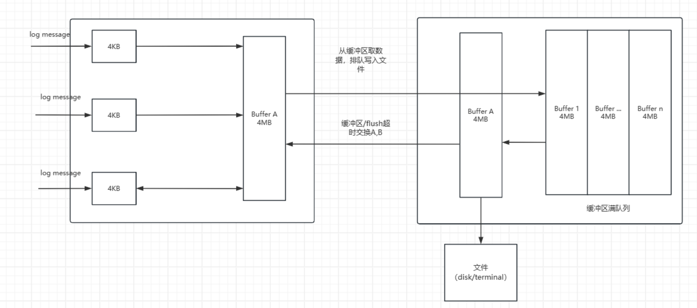
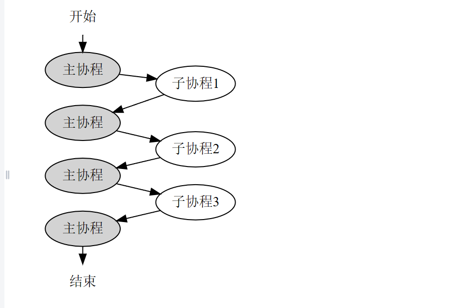

# 基于sylar和muduo实现实现C++高性能服务器框架

写这个文档的目的：首先是为了总结自己所学和一些自己的理解，其二是为了针对面试。

## 日志的设计

参考muduo，实现采用双缓冲技术的日志系统，提高了写入日志的效率，实现了日志分级，日志回滚功能。

更多详细细节可以看muduo日志那章

日志输出样式：


### 日志介绍

一个日志库大体可以分为前端（frontend）和 后端（backend）两个部分：

- 前端负责生成日志信息
- 后端负责把日志消息输出到目的地
- 两者之前可以通过一个简单的回调函数就可以完成

在多线程程序中，前后端都与单线程在一样，无非就是有多个线程通过前端的API形成多个日志消息，然后共用一个后端将日志信息输出到目标位置.

本项目的日志采用stream风格（也就是重载<<）,好处在于对比printf在于当输出日志级别高于语句的日志级别是，打印日志为空操作，运行时开销接近0（具体可以看日志分级的实现在base/Logging.h）。

本项目日志还有一个好处就是无需重新编译来实现更改日志的级别，只需要export将环境变量更改即可，就可以做到在服务器运行时改变日志的输出级别

### **日志回滚的实现**：

日志的回滚是必要的，特别是对于高并发的服务器而言。

rolling的条件：文件大小（列如写完1gb就换另一个文件和时间

本项目的日志主要采用了文件的大小，当一个日志的文件大于某个闸值的时候触发回滚（base/LogFile.h）,如果想要了解通过大小和时间可以自行参考muduo的rolling实现

### 双缓存的原理：

代码的实现可以详细查看源码（base/AsyncLogging.cpp）

真正用于交换得是 BufferVector

实际上项目采用了四个缓冲区：前端两个，后端两个

准备两个buffer，假设为A和B，前端（日志信息产生端）负责往A上增加数据，后端负责将B中的数据写入文件中。当A写满时会与B进行交换（也就是将A的数据直接拷贝给B，自己再reset一下），让后端将A中的日志数据写入文件中，前端继续向B中填充。这样可以在一定程度上减少I/O操作，因为可以批量写入日志数据，而且减少后端线程的唤醒，为了可以即使将日志数据写入文件，为定时执行交换操作

缓存区是支持自动增长的，因为用了vector容器来存，vector支持倍数扩充。



## 协程库的设计

### 协程类的实现：

#### 关于协程

协程的概念：协程**又被成为轻量级的线程或者用户级别的线程**（比如go中的线程），这意味着它减少了上下文的开销，遗憾的是它不是cpu执行的最小单元。

**协程的特点：**

- **用户空间的调度**：协程通常在用户空间进行调度，而不是由操作系统内核管理。这意味着**协程的切换不需要进入内核空间，减少了上下文切换的开销。**
- **协作式多任务**：**协程采用协作式的方式进行多任务处理，而不是抢占式**。这意味着一个协程会主动让出控制权（yield），而不是被操作系统强制抢占，这个特点可以使得协程更适合于异步编程。
- **轻量级**：由于减少了上下文切换的开销和在用户空间进行调度，协程相对于传统线程来说是轻量级的，可以在一个进程中创建和管理成千上万个协程。

协程与线程的不同：

- **调度方式**：线程的调度通常由操作系统负责，是抢占式的；而协程的调度是在用户空间进行的，通常是协作式的。
- **并发模型**：线程支持并发和可能的并行执行（在多核处理器上），而协程通常在单个线程内实现并发，通过任务的协作式切换来实现。
- **性能开销**：线程涉及更重的上下文切换和资源开销，而协程由于在用户空间调度，其上下文切换开销小得多。

**协程的分类**：**有栈协程**（statckful）和**无栈协程**（statckless）（无栈协程无法保持切换的上下文）

缺点：协程无法享受多核cpu，因为线程是cpu调度的最小单元，而且协程需要占用额外的空间开销（可以使用协程池来优化）

#### 协程的实现

根据协程的特点协作式多任务型，可以让出（yield）也可以切换回来，对于切换回来是要知道切换前的栈空间内容。

这一点**可以借助于Linux下的ucontext族函数**，ucontext机制是GNU C库提供的⼀组**创建，保存，切换⽤户态执⾏上下⽂的API，这是协程能够随时切换和恢复的关键。**

 **简单说来， ` getcontext`获取当前上下文，`setcontext`设置当前上下文，`swapcontext`切换上下文，`makecontext`创建一个新的上下文。**

利用ucontext提供的四个函数`getcontext(),setcontext(),makecontext(),swapcontext()`(这四个函数的功能不过多介绍)可以在一个进程中实现用户级的线程切换。一个简单的例子：

```c++
#include <stdio.h>
#include <ucontext.h>
#include <unistd.h>

int main(int argc, const char *argv[]){
    ucontext_t context;

    getcontext(&context);
    puts("Hello world");
    sleep(1);
    setcontext(&context);
    return 0;
}
```

注：代码来自维基百科

运行的结果会发现会不停的输出hello world，切实就是 `getcontext(&context);`在这个点获得了当前位置的上下文，在执行到set时再切换回设置上下文的get处，如此往复。（对于主线程这样，当然可以用于多线程了）

利用以上的结论就可以进行协程的切换（处理函数的切换，做到像python的yeild一样）

协程调度的模型：对称和非对称模型等

**对称协程**：启动后的就跟启动前的协程就没有任何关系。

**本项目的协程的设计借鉴sylar，是非对称模型，如图所示（图片来源sylar）：**




从图中看出被调用的协程必须要和主协程捆绑在一起，子协程让出cpu时（yield和return），都是先切换至主协程。非对称协程只能返回最初调用它的协程。

既然要对协程进行调度，那么协程也要像进程那样拥有状态,就绪态，运行态和结束态

对于一个协程类来说，它需要这几点要素：

- 协程的一些信息比如协程的ID，状态等
- 协程既然是轻量级线程，那么函数则是它的执行单元（运行函数，这个函数可以做到像python中的函数那样）
- 一个获取和设置协程信息的API
- 协程路口函数
- resume和yield函数用于恢复和让出，主要用swapcontext（切换让出）和makecontext来实现
- 为当前协程分配和释放栈空间的API