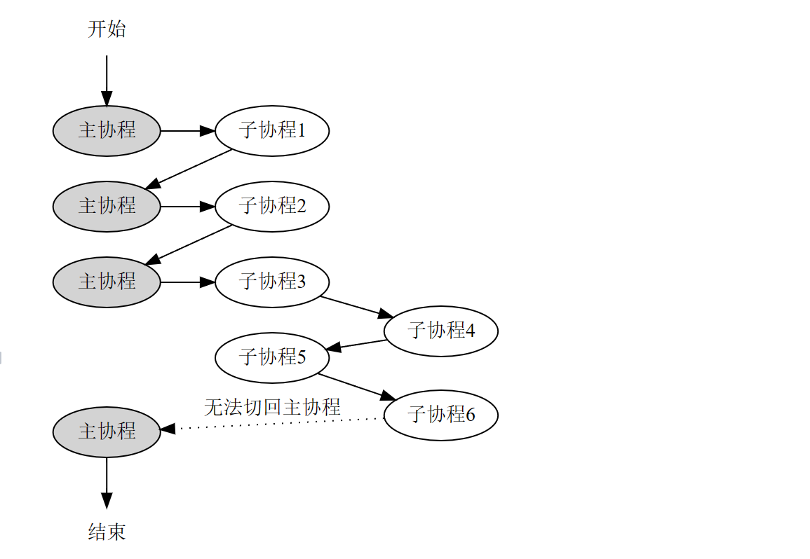
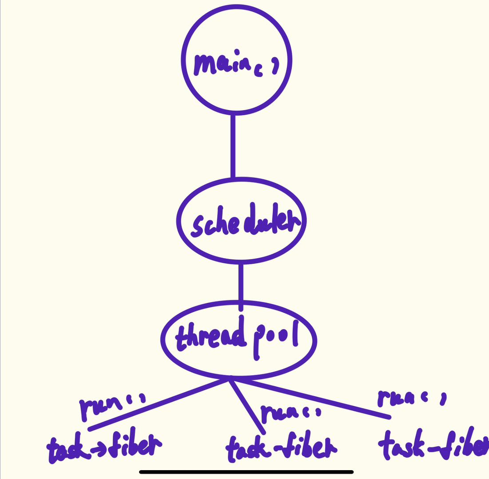
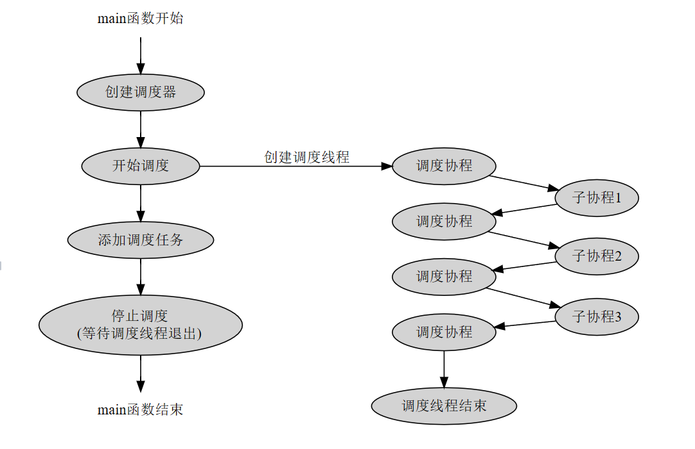

# 基于sylar和muduo实现实现C++高性能服务器框架

写这个文档的目的：首先是为了总结自己所学和一些自己的理解，其二是为了针对面试。

## 项目参考

《Linux高性能服务器编程》，《Linux服务端多线程编程》,sylarC++高性能服务器框架

## **项目的介绍**

在原来的WebServer的基础上增加了协程模块，提高WebServer在处理I/O密集型场景下的事件处理效率。

协程主要用于一些同步I/O API，因为不管是阻塞还是非阻塞都会导致服务器处理事件效率低下（阻塞的I/O会挂起，也就是无法第一时间处理，而非阻塞要加while循环和判断errno来决定事件的就绪，无疑是空耗CPU的资源）。这也就是同步在I/O密集型并发下处理效率没有异步效率高，利用协程可以很简单的实现异步

## 日志的设计

参考muduo，实现采用双缓冲技术的日志系统，提高了写入日志的效率，实现了日志分级，日志回滚功能。

更多详细细节可以看muduo日志那章

日志输出样式：


### 日志介绍

一个日志库大体可以分为前端（frontend）和 后端（backend）两个部分：

- 前端负责生成日志信息
- 后端负责把日志消息输出到目的地
- 两者之前可以通过一个简单的回调函数就可以完成

在多线程程序中，前后端都与单线程在一样，无非就是有多个线程通过前端的API形成多个日志消息，然后共用一个后端将日志信息输出到目标位置.

本项目的日志采用stream风格（也就是重载<<）,好处在于对比printf在于当输出日志级别高于语句的日志级别是，打印日志为空操作，运行时开销接近0（具体可以看日志分级的实现在base/Logging.h）。

本项目日志还有一个好处就是无需重新编译来实现更改日志的级别，只需要export将环境变量更改即可，就可以做到在服务器运行时改变日志的输出级别

### **日志回滚的实现**：

日志的回滚是必要的，特别是对于高并发的服务器而言。

rolling的条件：文件大小（列如写完1gb就换另一个文件和时间

本项目的日志主要采用了文件的大小，当一个日志的文件大于某个闸值的时候触发回滚（base/LogFile.h）,如果想要了解通过大小和时间可以自行参考muduo的rolling实现

### 双缓存的原理：

代码的实现可以详细查看源码（base/AsyncLogging.cpp）

真正用于交换得是 BufferVector

实际上项目采用了四个缓冲区：前端两个，后端两个

准备两个buffer，假设为A和B，前端（日志信息产生端）负责往A上增加数据，后端负责将B中的数据写入文件中。当A写满时会与B进行交换（也就是将A的数据直接拷贝给B，自己再reset一下），让后端将A中的日志数据写入文件中，前端继续向B中填充。这样可以在一定程度上减少I/O操作，因为可以批量写入日志数据，而且减少后端线程的唤醒，为了可以即使将日志数据写入文件，为定时执行交换操作

缓存区是支持自动增长的，因为用了vector容器来存，vector支持倍数扩充。


## 协程库的设计

### 协程类的实现：

为了好理解可以任务协程无非就是像py中的function那样支持执行一般切换，就其本质就是个函数，类对像只是噱头，实质还是封装了函数和切换上下文的一些细节，这样对于多线线程而言从一开始

#### 关于协程

协程的概念：协程**又被成为轻量级的线程或者用户级别的线程**（比如go中的线程），这意味着它减少了上下文的开销，遗憾的是它不是cpu执行的最小单元。

**协程的特点：**

- **用户空间的调度**：协程通常在用户空间进行调度，而不是由操作系统内核管理。这意味着**协程的切换不需要进入内核空间，减少了上下文切换的开销。**
- **协作式多任务**：**协程采用协作式的方式进行多任务处理，而不是抢占式**。这意味着一个协程会主动让出控制权（yield），而不是被操作系统强制抢占，这个特点可以使得协程更适合于异步编程。
- **轻量级**：由于减少了上下文切换的开销和在用户空间进行调度，协程相对于传统线程来说是轻量级的，可以在一个进程中创建和管理成千上万个协程。

协程与线程的不同：

- **调度方式**：线程的调度通常由操作系统负责，是抢占式的；而协程的调度是在用户空间进行的，通常是协作式的。
- **并发模型**：线程支持并发和可能的并行执行（在多核处理器上），而协程通常在单个线程内实现并发，通过任务的协作式切换来实现。
- **性能开销**：线程涉及更重的上下文切换和资源开销，而协程由于在用户空间调度，其上下文切换开销小得多。

**协程的分类**：**有栈协程**（statckful）和**无栈协程**（statckless）（无栈协程无法保持切换的上下文）

缺点：协程无法享受多核cpu，因为线程是cpu调度的最小单元，而且协程需要占用额外的空间开销（可以使用协程池来优化）

#### 协程的实现

根据协程的特点协作式多任务型，可以让出（yield）也可以切换回来，对于切换回来是要知道切换前的栈空间内容。

这一点**可以借助于Linux下的ucontext族函数**，ucontext机制是GNU C库提供的⼀组**创建，保存，切换⽤户态执⾏上下⽂的API，这是协程能够随时切换和恢复的关键。**

 **简单说来， ` getcontext`获取当前上下文，`setcontext`设置当前上下文，`swapcontext`切换上下文，`makecontext`创建一个新的上下文。**

利用ucontext提供的四个函数`getcontext(),setcontext(),makecontext(),swapcontext()`(这四个函数的功能不过多介绍)可以在一个进程中实现用户级的线程切换。一个简单的例子：

```c++
#include <stdio.h>
#include <ucontext.h>
#include <unistd.h>

int main(int argc, const char *argv[]){
    ucontext_t context;

    getcontext(&context);
    puts("Hello world");
    sleep(1);
    setcontext(&context);
    return 0;
}
```

注：代码来自维基百科

运行的结果会发现会不停的输出hello world，切实就是 `getcontext(&context);`在这个点获得了当前位置的上下文，在执行到set时再切换回设置上下文的get处，如此往复。（对于主线程这样，当然可以用于多线程了）

利用以上的结论就可以进行协程的切换（处理函数的切换，做到像python的yeild一样）

协程调度的模型：对称和非对称模型等

**对称协程**：启动后的就跟启动前的协程就没有任何关系。

**本项目的协程的设计借鉴sylar，是非对称模型，如图所示（图片来源sylar）：**


从图中看出被调用的协程必须要和主协程捆绑在一起，子协程让出cpu时（yield和return），都是先切换至主协程。非对称协程只能返回最初调用它的协程。

既然要对协程进行调度，那么协程也要像进程那样拥有状态,就绪态，运行态和结束态

**对于一个协程类来说，它需要这几点要素：**

- 协程的一些信息比如协程的ID，状态等
- 协程既然是轻量级线程，那么函数则是它的执行单元（运行函数，这个函数可以做到像python中的函数那样）
- 一个获取和设置协程信息的API
- 协程路口函数
- resume和yield函数用于恢复和让出，主要用swapcontext（切换让出）和makecontext来实现
- 为当前协程分配和释放栈空间的API

非对称模型无法嵌套使用协程：不能在子协程中嵌套使用协程，这样程序会跑偏，在一个线程中使用协程会使用resume()函数，中的swapcontext函数会把当前的上下文保存到主协程的m_ctx中，以便让它回到主线之中，如果在swapcontext的二个参数（一般位Mainfunc）存在一个新的协程并且有resume行为，那么它的swapcontext会把当前的上下文存到主协程的m_ct之中，就改变了之前的m_ctx,那么程序就切不回主线了，如图所示：

为了提高并发，既然非对称型的协程无法嵌套，那么就让线程嵌套，协程的调度就是利用了这个



图片来源于：[协程模块 - 类库与框架 - 程序员的自我修养 (midlane.top)](https://www.midlane.top/wiki/pages/viewpage.action?pageId=10060957)

### 协程调度器：

**实现了一个N-M的协程调度器，N个线程运行M个协程，协程可以在线程之间进行切换，也可以绑定到指定线程运行**

**协程调度的概念**：当拥有多个协程时，如何将这些协程消耗掉。

**为什么引入协程调度器**：（就像操作系统调度进程那样）

在前⾯的协程模块中，对于每个协程，都需要⽤户⼿动调⽤协程的resume⽅法将协程运⾏起来，然后等协程运⾏结束并返回，再运⾏下⼀个协程。这种运⾏协程的⽅式其实是⽤户⾃⼰在挑选协程执⾏，相当于⽤户在充当调度器，显然不够灵活，引⼊协程调度后，则可以先创建⼀个协程调度器，然后把这些要调度的协程传递给调度器，由调度器负责把这些协程⼀个⼀个消耗掉。

本项目借鉴sylar使用最简单的先来先服务。

**主要的思想**:在前面发现对于一个线程，只能执行一个协程，协程与主协程之间轮流切换，那么就利用多线程来提升,这样就能使用多个协程。

**设计思路**：主线程掌握一个协程调度器，调度器中拥有一个线程池，线程






**注意**：在进行上下文切换时，一定要清楚是从哪个线程进行切换的，比如caller线程使用了swapcontext，那么这个函数的第一个参数的上下文一定保存在caller的m_ctx中

- 协调度的的启动，暂停等函数
- 获取和设置调度器信息的一些API
- 调度的任务体，通知函数等
- 线程池（采用生产者-消费者模式）（该线程池只用于协程的调度）通俗来说，之前线程池中的线程的处理单元就是普通的类函数，现在变成了被协程封装的类函数（也就是处理单元有了像协程那样的功能可以切换，不像之前的线程那样一路走下去，而是可以拥有异步的能力“切换”）

## I/O协程调度器

继承自协程调度器，是协程调度器的基类，封装了epoll，支持为socket fd注册读写事件回调函数

当检测到文件描述符就绪时，就注册感兴趣的事件

### I/O复用之一epoll

I/O复用的好处，对于服务器而言，减少了逻辑处理单元减少了对事件的可读可写的关注度下降，事件的可读可写交给了I/O复用技术（epoll，poll，select），这样就有专门的机制去处理事件的可读可写异常等等，这样对于处理逻辑单元而言他们所处理的事件都是准备就绪事件，这样能减少逻辑处理单元对I/O同步产生的问题

这里重点介绍一下epoll，**epoll就是I/O复用技术的一种，其他两个分别是select和poll**：

- **在最大监听数小于等于1024的情况下epoll和select的差距微乎其微**，但是select和poll轮询的不光是就绪事件还有未就绪事件所以在处理就绪事件的之间复杂度层面而言是O(n)的，而对于epoll而言则是0(1)的，**而且select只关注可读可写异常这三种事件，对于连接抽象化而言很难做，poll呢在这基础上好一点**。但是epoll系列中携带的结构体epoll_event内部的epoll_data为一个联合体可以舍弃对fd复制从而使用其中的指针做到连接抽象化
- epoll提供两种触发为LT和ET，边缘触发配合非堵塞I/O可以很大程度上提高处理效率，并且提供EPOLLSHOWNE选项来更好的提供对于一个就绪fd的处理

## I/O协程调度器的设计

### 总体介绍：

**IO协程调度还解决了调度器在idle状态下忙等待导致CPU占用率高的问题**。**IO协程调度器使用一对管道fd来tickle调度协程，当调度器空闲时，idle协程通过epoll_wait阻塞在管道的读描述符上**，等管道的可读事件。添加新任务时，tickle方法写管道，**idle协程检测到管道可读后退出，调度器执行调度。**

主要的思路就是继承调度器类，并且在它基础上封装epoll系列函数，比如添加事件（事件被分为两大类型写与读），删除等，发现事件可读或者可写有两种方式去处理，一种是使用回调函数，另一种是基于调度器的调度。

I/O调度器执行的本质就是通过一对管道(pipe[2],pipe[0]为读端，pipe[1]为写端)，通过监听pipe读端，如果有事件发生则idle出去，而切换回来要依靠处理单元（也就是调度器中的任务队列为空时，）通过管道的写端，来通知读端，以便让其进行适当的切换。

###  IO协程调度的几点总结

-  总得来说，sylar的IO协程调度模块可分为两部分，第一部分是对协程调度器的改造，将epoll与协程调度融合，重新实现tickle和idle，并保证原有的功能不变。第二部分是基于epoll实现IO事件的添加、删除、调度、取消等功能。
- IO协程调度关注的是FdContext信息，也就是描述符-事件-回调函数三元组，IOManager需要保存所有关注的三元组，并且在epoll_wait检测到描述符事件就绪时执行对应的回调函数。后序会通过改动一些使得连接抽象化
- epoll是线程安全的，即使调度器有多个调度线程，它们也可以共用同一个epoll实例，而不用担心互斥。由于空闲时所有线程都阻塞的epoll_wait上，所以也不用担心CPU占用问题。
-  FdContext的寻址问题，sylar直接使用fd的值作为FdContext数组的下标，这样可以快速找到一个fd对应的FdContext。由于关闭的fd会被重复利用，所以这里也不用担心FdContext数组膨胀太快，或是利用率低的问题。


