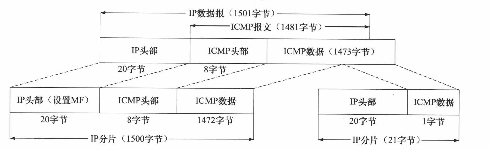

# Linux高性能服务器编程

## 前置知识

### 前 1 ： TCP/IP协议详解

#### 1.1TCP/IP协议族体系结构以及主要协议：

下面的图总结了四层模型主要用到的协议，这一节笔记简单的介绍这四层，重要的协议会在下面详细介绍

介绍一下七层模型为应用层，表示层，会话层，传输层，网络层。数据链路层，物理层。


下面会从下向上一一介绍。

下层永远是为上层服务的，下层永远是对上层封闭的

##### 1.1.1数据链路层：

数据链路层实现了网卡接口的网络驱动程序，以处理数据在物理媒介上的传输。

数据链路层两个最常用的协议**ARP协议**（address resolve Proctocol，地址解析协议）和RARP协议（逆地址解析协议）。它们实现IP地址和机器物理地址（通常是MAC地址）之间的相互转换。

**网络层使用IP地址寻址一台机器，而数据链路层使用物理地址寻址一台机器**，因此网络层必须将目标机器的IP地址转化成其物理地址，才能使用数据链路层提供服务（IP地址是逻辑上的地址，端口是这个IP地址提供服务的窗口），而**利用ARP协议可以提供IP地址转化物理地址。**

##### 1.1.2 网络层

网络层的两大主要功能是：**数据包的选路和转发**（这里不管是数据流还是数据报都统称为数据包），通常使用众多分级的路由器来连接分散的主机或LAN（局域网）。

两台主机进行通信，不可能是直接连接，而是通过很多节点连接，如图：

网络层的任务就是选择这些中间节点，以确定两台主机之间的通信路径，由于下层对上层有封闭性，让人取看传输层觉得是直接相连的


网络层**最核心的协议是IP协议（Internet Protocol，因特网协议）**。**IP协议根据数据包的目的IP地址来决定如何投递**（在介绍IP协议头部结构会详细记入）

如果数据包不能直接发送给目标主机，那么IP协议为它寻找一个适合的下一跳（next hop）路由器，并将数据包交付给该路由器来转发，上图很好的展示了这个过程。（数据包有很能到达，也有可能在传输时被丢弃）

网络层另一个重要的协议时ICMP协议（因特网控制报文协议）。它是IP协议的重要补充，主要检测网络连接，下面是ICMP协议的报文格式


- 8位类型字段用于区分报文类型，它将ICMP报文分为两大类：
  - **错差报文，**主要用来回应网络错误，比如目标不可到达（类型值位3）和 重定向（类型为5）
  - **查询报文，**这类报文用来查询网络信息
- 8位代码进一步来细分不同条件
- 16位校验和字段对整个报文（包括头部和内容部分）进行循环校验（CRC），来检验报文段在传输过程中是否损坏。不同的ICMP报文类型具有不同正文内容。
- **ICMP协议并非严格意义上的网络协议，因为它使用处于同一层的IP协议提供服务**（一般来说，上层协议使用下层协议提供服务）

##### 1.1.3传输层：

传输层为两台主机上的应用程序提供端到端的通信（端口是用来区分不同程序和不同服务的，这点不难看出，因为TCP和UDP报文结构只需要指明目标端口和源端口），传输层只关心通信的起始段和目标端，不在乎数据包的中转过程


如上图，由于下层为上层提供服务且下层是对上层封闭的，所以虚线代表逻辑上的通信而实线代表实际的通信（先看实线，再看虚线）

**传输层协议主要有三个：TCP协议，UDP协议和SCTP协议**

**TCP协议（传输层控制协议）为应用层提供了可靠的，面向连接的和基于流（stream）的服务**。TCP协议使用超时重传，数据确认等方式来确保数据包被正确的发送至目的端，因此TCP服务是可靠（在后面介绍TCP报文结构会一一解释），使用TCP协议通信地双方必须建立TCP连接并且在内核中为该连接维持一些必要地数据结构，比如连接状态，读写缓冲区，以及诸多定时器，当连接关闭要释放这些。

基于流的数据没有边界（长度）限制，它源源不断地从通信地一端流入另一端。

UDP协议（用户数据报），**它为应用层提供提供不可靠，无连接和基于数据报的服务，** 对于数据在中途的丢失，或目的端通过数据校验发现错误而将其丢弃，UDP只是简单地通知应用程序发送失败。UDP协议地应用程序需要自己处理数据确认，超时重传等逻辑。**UDP协议是无连接，即通信双方不保持一个长久的联系**。**每个UDP数据报都有一个长度，接收端必须以该长度为最小单位将其所有内容一次性读出，否则数据将被截断**。

SCTP协议（流控制传输协议）

##### 1.1.4应用层

应用层负责处理应用程序的逻辑。**数据链路层，网络层和传输层负责处理网络通信细节，这部分必须稳定又高效，因此它们都在内核空间中实现**

应用层主要是为请求连接，提供逻辑服务的，比如一个客户端使用web客户端请求一个网站的资源，而此时接收端收到请求报文把自己的资源打包发送给请求者即可。对于请求者而言发送报文是它在应用层的如今动作，对于接收者从内核读取发送的报文并且解析加发送是它的逻辑处理方式。

简单介绍应用层的协议或者程序：

- ping应用层程序，利用ICMP检测网络连接，是调试网络环境的必备工具
- telent协议是一种远程登入协议，它使得我们能在本地完成远程任务
- OSPF开放最短路径优先，协议是一种动态路由更新协议，用于路由器之间的通信，以告知对方各自的路由信息
- DNS协议提供机器域名到IP协议的转换

应用层协议（或者程序）可能跳过传输层直接使用网络层提供的服务，比如ping和OSPF。

#### 1.2封装

下层协议是为上层协议所服务的，服务的方式就是封装，下层协议封装上层协议使得上层协议具有了下层协议的能力。

举个例子人使用web客户端发送http报文：

- http报文先要被TCP封装（http1.0/2.0和https都是基于TCP），才有传输能力
- 上面的又被IP封装才有知道自己怎么走，能走到要访问资源的服务器
- 上面又要被数据链路层的协议封装，知道了要访问资源服务器的物理地址，于是开始出发.

如图：

数据部分是相对的


经过TCP封装后的数据称为TCP报文段，TCP协议通信双方维持一个连接，并且在内核中存储相关的数据


经过数据链路层封装的数据北城为帧（frame），传输的媒介不同，帧的类型也不同，比如以太网上传输的是以太网帧，而令牌环网络帧。

以太网帧（由数据链路层协议头部+数据部分组成）如图：


帧的最大传输单元（MTU），即帧最多能携带多少上层协议数据（比如IP数据报），也就是上图的数据部分，一把来说是1500字节，过长会被分片传输。

#### 1.3分用

当帧到达目的主机，将沿着协议栈自低向上依次传递，各层协议依次处理帧中本层负责的头部数据，以获取所需信息，一张图概况：


#### 1.4 ARP协议工作原理：

**ARP协议主要的任务：就是实现网络层地址到任意物理地址的转换**

ARP工作原理：主机向自己所在的网络广播一个ARP请求，该请求包含目标机器的网络地址，此网络上的其他机器都将收到这个请求，但只有被请求的目标机器会回答一个ARP应答，其中包含自己的物理地址。

##### 14.1以太网ARP请求/应答报文详解

以太网ARP请求/应答报文格式如下：


当被请求的目标机器，会在ARP请求报文将后两个字段填入，然后在于前面两个字段交换（发送端成为被请求端）

##### 1.4.3 ARP高速缓存的查看和修改

ARP维护一个高速缓存，其中包含经常访问（比如网关地址）或最近访问的机器的IP地址到物理地址的映射。这样避免了重复的ARP请求，提高了发送数据包的速度。

Linux下可以使用arp命令（配合指令-d删除，-s添加（IP + 物理地址））来查看修改ARP高速缓存（它是动态的变化）

#### 1.5 DNS工作原理

我们通常会使用机器的域名来访问这台机器或者网址，而不是直接使用IP地址，比如访问百度会是www.baidu.com而不是119.75.217.109

##### 1.5.1 DNS查询和应答报文详细：

DNS是一套分布式的域名服务系统，每个DNS服务器上都存放大浪的机器名和IP地址的映射，并且是动态更新的

结构如图所示：


- 16位标识：标记一对DNS查询和应答（相当于16位标识为key，这对应答为value），以此来区分一个DNS应答是哪个DNS查询回应的
- 16位标志字段用于协商具体的通信方式和反馈通信状态，DNS报文头部的16位标志字段细节如下：
  - 

查询问题格式如下：


- 查询名以一定的格式封装了要查询的主机域名
- 16位查询类型表示如何执行查询操作，常见类型如下：
  - 类型A,值是1，表示获取目标主机的IP地址
  - 类型CNAME值为5，表示获得主机别名
  - 类型PTR，值是12.表示反向查询

- 16位查询类通常为1，表示获得因特网地址（IP地址）

应答字段，授权字段和额外信息字段都使用资源记录（RR）格式。资源记录格式如图：


- 32位域名是该记录中与资源对应的名字，其格式和查询问题中的查询名字段相同
- 16位类型和16位类和前面查询问题格式中的这两个字段意思一样
- 32位生存时间表示该查询记录结果可被本地客户端程序缓存多长时间，单位秒
- 16位资源数据长度字段和资源数据字段内容取决于类型字段

### 前 2 ： IP协议详解

IP协议是TCP/IP协议族的核心协议，也是socket网络编程基础之一。

IP最重要的只是有这两点：

- IP头部信息。IP头部信息出现在每个IP数据报中，用于指定IP通信的源端IP地址，目的端IP地址，知道IP分片和重组
- IP数据报的路由和转发，前面提到过IP协议最重要的就是选路和转发

#### 2.1IP服务的特点

IP协议为上层提提供无状态，无连接，不可靠的服务

- 无状态是指IP通信双方不同步传输数据的状态信息，因此所有IP数据报的发送，传输和接收都是相互独立的，没有上下文关系，这种服务最大的缺点是无法处理乱序和重复的IP数据报。接收端的IP只需要接收完整的IP数据报（如果IP有切片的化，IP模块将先执行重组），将其数据部分交给上层协议，主语乱序或者重复，就要看上层协议如果去处理。
  - 虽然IP数据报头部提供了一个标识字段用以唯一标识一个IP数据报（也就是标识为key，属于这个标识的IP数据报是这个key的value，一对多的关系）
- 无连接是指IP通信双方都不长久地维持对方任何信息，这样上层协议每次发送数据时，必须明确指定对方地IP地址。
- 不可靠是指IP协议不能保证IP数据报准确地到达接收端
- 无论那种情况，发送端IP模块一旦检到IP数据报发送失败，就通知上层协议发送失败，就通知上层协议发送失败，而不是试图重传，这个重担就要交给上层协议来判定

#### 2.2 IPv4头部结构

##### 2.2.1 IP头部结构

IPv4头部结构如图所示，其长度通常为20字节，除非含有可变选项


- 4位版本号指定IP协议版本，对于IPv4来说，其值是4。
- 4位长度（header length）标识该IP头部有多少个32bit（4字节）。而思维最大表示15，所以IP头部最长是60字节（4x15）
- 8位服务类型包括一个3位的优先权字段（现在已被忽略），4位TOS字段和1位保留字段（必须置0）。
  - 最大延时，最大吞吐量，最高可靠性和最小费用，其中只能由一个能置为1，应用程序应该根据实际血药来设置它（不能贪）
- 16位总长度：是指整个IP数据报的长度，以字节为单位，因此IP数据报的最长长度为65535字节
- 16为标识唯一地标识主机发送的每一个数据报。由相同数据报切片而来的字片它们的标识符是一样的（这个标识符复制而来）
- 3位标志字段的第一位保留，第二位（DF）表示禁止禁止分片，第三位（MF），更多分片，数据包除了最后一个其他位置都要设置为1；
- 13位分片偏移是分片相对于原始IP数据报开始处（数据部分）的偏移，每个IP分片的数据部分长度必须是8的整数倍
- 8位生存时间（TTL）是数据报到达目的地之前允许经过的路由器跳数，TTL值被发送端设置（常见位64），数据报在转发过程没经过一个路由，该值就被路由器减去1，当该值为0时，路由器将丢弃这个数据报，并向源端发送一个ICMP差错报文
- 8位协议用来区分上层协议
  - TCP 为6
  - UDP为17
- 32位源端IP地址和目的IP地址，这个是要传入的，上面提到过它是无连接。
- option
  - 记入路由（record route）
  - 时间戳（timestamp）
  - 嗽散源路由选择（loose source routing）指定一个路由器IP地址列表，数据报发送过程中必须经过列表中所以的路由器
  - 严格源路由选择，数据只经过被指定的路由器

#### 2.3 IP分片

**当IP数据报的长度（也就是帧的数据部分）超过帧的MTU时，它被分片传输**。**分片可能发生在发送端，也有可能发生在中转路由器上**，而且可能在传输过程中被多次分片，最终旨在目标机器上由内核中的IP模块重组。

IP头部中的如下三个字段给IP的分片和重组提供足够的信息

- 数据报标识
- 标志和片偏移

**通过Tcpdump抓包发现原始IP数据报被切片后，ICMP只会复制一次**，如图所示



**IP层传递给数据链路层的数据可能是一个完整的IP数据报，也有可能是一个IP分片，它们统称位IP分组**（packet）；

#### 2.4 IP路由

IP协议的一个核心任务是数据报的路由，即决定发送数据报到目标机器的路径。

##### 2.4.1 IP模块的工作流程：


简单流程：

- 首先IP模块收到来自数据链路层的IP数据报时，首先对该数据报的头部做CRC（基于数据链路层尾部），再来分析由IP数据报（IP头部和IP数据部分）的头部信息
- 如果IP数据报的头部设置了原路选择选项（松散源路或者严格源路由选择），则IP模块调用数据报转发子模块来处理该数据报，如果IP数据报的头部中目标IP地址是本机的某个IP地址或者广播地址，即该数据是发送给本机的然后对应上图yes后在分用确认交给上层那个协议来处理
- 如果发现不是本机的某个IP，数据报转发子模块将首先检测系统是否允许转发，如果不允许则被丢弃，允许则对应图中允许后的操作
- IP数据报应该发送哪个下一跳路由（或者目标机器），以及经过哪个网卡来发送就是IP路由过程，就是图中“计算下一跳路由”，IP模块实现数据报路由的核心数据结构是路由表，他决定了IP路由的过程决定了如何转发
- 图中虚线部分用来更新路由表

##### 2.4.2 路由机制

我们可以使用**`route`**命令或者`netstat`命令查看路由表。一个路由表的例子：


上图包含8个字段内容如下：

- **Destination 目标网络或者主机**
- **Gateway 网关地址，*表示目标和本机在同一个网络，不需要路由**
- **Genmask 网络掩码**
- Flags 路由项标志，常见标志如下5种
  - U 该路由项是活动的
  - H 该路由项的目标是台主机（Host）
  - **G 该路由项目标是网关**
  - D该路由项是由重定向生成
  - M该路由项被重定向修改
- Metric 路由距离，即到达指定网络所需的中转数
- Ref 路由项被引用的次数（Linux未使用）

IP的路由机制：路由表是如何按照IP地址分类，分为三个步骤

- 查找路由表中和数据报的目标IP地址完全匹配的主机IP地址，如果找到了就选择这个路由项，没有则进行第二步
- 查找路由表中和数据报的目标IP地址具有相同网络ID的网络IP地址（找网关地址相同的），没有则进行第三步
- 选择默认路由项，这通常意味着数据报的下一跳路由是网关（也就是default指定的Gateway）

##### 2.4.3 路由表更新

路由表必须能够更新，以反映网络连接的变化，这样IP模块才能准确，高效地转发数据报

#### 2.5 IP转发

前面说到，如果发送的主机不是目的主机，IP数据报将由数据报转发子模块来处理。路由器都能执行数据报的转发操作，而主机一般只能发送和接收数据。（这是因为主机/proc/sys/net/ipv/op_forward内核参数默认被设置为0）

对于允许IP数据报转发的系统（主机或路由器），数据报转发子模块将对期望转发的数据执行如下操作：

1. 检查数据报头部的TTL值，如果已经是0，则丢弃
2. 查看头部的严格源路由选择项，如果该选项被设置，则检查数据报的目标IP地址是否市本级的某个IP地址，如果不是则发送一个ICMP源站旋螺失败报文给发送端
3. **如果有必要**，则给远端发送一个ICMP重定向报文（更改路由表），告诉它一个跟合理的下一跳，它使得路由表可以动态的更新
4. 将TTL的值减1
5. 处理IP头部选项
6. 如果有必要，则执行IP切片操作

#### 2.6 重定向

##### 2.6.1 ICMP重定向报文

结构如下：


前面三个字段前面有介绍，由于是重定向所以8位类型为5

ICMP重定向报文的数据部分含义明确

- 引起重定向IP数据报（**也就是发送端的IP数据报**）的源端IP地址（**也就是当前网关地址（当前路由**），比如到了这个路由他觉得有更好的路由选项于是发送ICMP重定向报文，更改路由表，实现跟合理的转发）
- 应该使用的路由器的IP地址

接受主机根据（发送端）根据这两个信息就可以断定引起重定向的IP数据报应该使用哪个路由器来转发，并且更新路由表

```apl
/proc/sys/net/ipv4/conf/all/send_redirects//内核参数指定是否允许发送ICMP重定向报文
/proc/sys/net/ipv4/conf/all/accept_redirects//内核参数指定是否接收发送ICMP重定向报文

```

**一般来说主机只能接收重定向报文，而路由器只能发送ICMP重定向报文**

最后再来看这张图就很清楚


#### 2.7 IPv6

#### 2.8 IP协议的一些补充知识

### 前 3 ： TCP协议详解

TCP协议是TCP/IP协议族中的另一个重要协议，和IP协议相比，TCP跟靠近应用层，因此在应用程序中具有更强的可操作性

从四个方面来讨论TCP

- TCP头部信息：用于指定通信的源端端口号，目的端端口号，管理TCP连接，控制两个方向的数据流
- TCP状态转移过程。TCP连接的任意一端都是一个状态机。
- TCP数据流：交互数据流和成块数据流
- TCP数据流的控制：为了保证可靠的传输和提高网络通信质量，内核需要对TCP数据流进行控制
  - **超时重传**
  - **拥塞控制**


#### 3.1 TCP服务的特点

TCP协议相对于UDP协议的特点是：**面向连接，字节流和可靠传输**

使用TCP协议通信的双方必须建立连接，然后才能开始数据读写。双方都必须为该连接分配必要的内核资源，用来管理连接状态和连接上数据的传输，TCP连接是全双工的

**TCP协议的这种连接是一对一的**，所以基于广播和多播（目标是多个主机地址）的应用程序不能使用TCP，而无连接协议UDP则非常适合广播和多播

- 举个例子，在网络编程将socket设置基于数据流（TCP），会发现对每个连接都要从监听socket中利用accept去取连接，这就是一对一，对于每个连接都有连接socket对应

当接收端收到一个或多个TCP报文段后，TCP模块将它们携带的应用程序数据按照TCP**报文段的序号（见后文）依次放入TCP接收缓冲区**并通知应用程序读取数据。

接收端应用程序可以一次性将TCP接收缓冲区中的数据全部读出，也可以分多次读取。

**综上所述**：发送端执行的写操作次数和接收端执行的读操作次数之间没有任何数量关系，这就是**字节流的概念：应用程序对数据的发送和接收是没有边界限制的**

下面是TCP服务和UDP服务的图：


TCP传输时可靠的：

1. 首先TCP协议采用发送应答机制，即发送端发送的每个TCP报文都必须得到接收方的应答（TCP建立连接的三次握手就是这样）
2. TCP协议采用超时重传机制
3. TCP报文最终时以IP数据报发送，会出现乱序，重复，苏哟TCP协议还会对接收到的TCP报文端重排，整理，再交付给应用层

UDP协议则和IP协议一样，提供不可靠服务。它们都需要上层协议来处理数据确认和超时重传（比如HTTP3.0在传输层基于UDP）；

##### 3.2.1TCP固定头部结构


- 16位端口，有发送端的端口和目的端的端口（对于端口可以理解成主机上的服务窗口）
- 32位序号：一次TCP通信（从TCP连接到断开）过程中某一个传输方向上的字节流的每一个字节的编号（他保证了TCP可以做到处理乱序的数据）
- 32位确认号：用作另一方发送来的TCP报文的响应，其值是收到的TCP报文端的序号值加1
- 4位头部长度：标识该TCP头部有多少个32bit字（4字节），4位最大表示15，所以TCP头部最长位60字节
- 6位标志包含如下几个选项：
  - URG：表示紧急指针是否有效
  - ACK标志：表示确认号是否有效，携带ACK标志的TCP报文为确认报文段
  - PSH表示：接收端程序应该立即从TCP接收缓冲区中读走数据
- RST标志，表示要求对方重新建立连接。携带RST标志的TCP报文段为复位报文段
- SYN标志，表示请求建立一个链接
- FIN标志，表示通知对方本段要关闭连接
- 16位窗口大小（Windows size）：是TCP流量控制的一个手段，这里的窗口时接收通号窗口，它告诉对方本端TCP接收缓冲区还能容纳多少字节的数据，这样对方就可以控制发送数据的速度
- 16位校验和（TCPchecksum）由发送端填充，接收端的TCP段执行CRC算法以检验TCP报文段在传输过程中是否损坏，不仅包括头部也包括数据部分
- 16位紧急指针：是一个正偏移量。它和序号字段的值相加表示最后一个紧急数据的下一个字节的序号，TCP的紧急指针时发送端向接收端发送紧急数据的方法

##### 3.2.2 TCP头部选项

TCP头部的最后一个选项字段（options）是可变长的可选信息，这部分最多40字节。下面是典型的TCP头部选项结构


- kind说明选项的类型
- length（如果有的话）指定该选项的总长度，包括kind字段，length字段
- info选项的具体信息，常见TCP选项有7种字段

如下：


- kind = 0 选项表结束选项
- kind = 1 是空操作（nop）选项，没有特殊含义，一般用于将TCP选项的总长度填充为4字节的整数倍
- kind =2 最大报文段长度选型。TCP连接初始化时，通信双方使用使用该选项来协商最大报文段的长度（MSS），TCP模块的MSS设置为（MTU-40)字节
  - MTU是IP数据报 = IP头部+数据部分（=TCP头部加数据部分）
  - IP头部+TCP头部默认为40字节（各占20字节，前提是不含选项（IP和TCP头部都有选项字段））
- kind = 3是窗口扩大因子选项。TCP连接初始化时，通信双方使用该选项来协商接收通知窗口的扩大因子，由TCP头部结果，接收窗口最大为2^16=65535字节，**但实际上TCP模块允许的接收窗口远不止这个数（提高TCP通信的吞吐量），扩大因子解决了这个问题**。**假设窗口大小为N，扩大因子为（移位数）是M，此时接收窗口大小位N<<M,**M的取值范围是0-14，可以通过修改`/proc/sys/net/ipv4/tcp_window_scaling`内核变量来启用或关闭窗口扩大因子选项，和MSS选项一样他们都要出现在同步报文当中否则被忽略。
- kind = 4 是选择性确认
- kind = 5是SACK实际工作选项
- kind = 8时间戳选项，该选项提供了较为准确的计算通信双方之间的回路时间（RTT），从而位TCP流量控制提供重要信息。

##### 3.2.3使用TCPdump抓包观察TCP头部信息：


#### 3.3 TCP连接的建立和关闭

##### 3.3.1使用tcpdump观察TCP连接的建立和关闭


连接过程和关闭过程画出更明显的图如下：


##### 3.3.2半关闭状态

**TCP连接是全双工的**，所以它允许两个方向的数据传输被独立关闭

**对于TCP半关闭状态**也就是通信的一端可以**发送结束报文段给对方****，告诉它本端已经完成了数据的发送**，**但允许继续接收来自对方的**数据，知道对方也发送结束报文段以关闭连接**，通俗的来说就是一方发送了结束报文段，另一方在发送结束报文段前发送数据的那一状态。


**服务器和客户端应用程序判断对方是否已经关闭连接的方法**：read系统调用返回0（收到结束报文）

##### 3.3.3连接超时

当我们访问外网的时候，没有梯子，或者由于网络繁忙，导致服务器对于客户端发送出的同步报文没有应答，此时客户端程序将产生什么样的行为，由于TCP连接的可靠性，它必然会进行重连（可能多次），如果重连仍然无效，则通知应用程序连接超时。

如图所显示，重连过程出现多次：


如图所示TCP模块一共执行了5次重连操作，这是由`/proc/sys/net/ipv4/tcp_syn_retries`Linux内核变量决定。每次重连的超时时间都增加一倍。

#### 3.4TCP状态转移

TCP连接的任意一端在任意时刻都处于某种状态，但前状态可以通过netstat命令查看。这里主要是讨论TCP连接从建立到关闭整个过程种通信两端状态的变化。整体形式如图所表示：

在计算机网络自顶向下的3.4.1构造可靠的数据传输协议就提到有限自动机这个概念


图中的起点是CLOSED,粗的实线表示典型的客户端连接的状态转移

简化直观的图如下：


##### 3.4.2TIME_WAIT状态

TIME_WAIT状态通常出现在主动提出关闭连接的一块，主要的作用：**TIME_WAIT 状态是为了保证连接的可靠性**和**防止旧的数据包对新的连接造成影响**。

存在原因（和作用一样的道理）：

- 可靠性终止TCP连接：主动提出关闭连接的一方有这个状态可以避免没有接收到结束报文（重复接收），负责接收不到，会发出复位报文，对于服务器来说是错误的
- 保证让迟来的TCP报文段有足够的时间被识别并丢弃

在Linux中对于TCP端口不能同时打开多次，，当主动关闭连接一端处于TIME_WAIT 状态是不可以占用此时端口，这样做是避免不同的连接造成的问题，比如我的服务器主动关闭由于更新要处理新的业务，那么对于新的服务器被动打开接收连接，不应该沿用上次的连接

TCP报文段最大的生存时间是MSL，所以坚持2MSL时间的TIME_WAIT状态能够确保网络上两个传输方向尚未接收到的迟到的TCP报文段被丢弃。

#### 3.5复位报文段

在某些特殊的条件下，TCP连接的一段回想另一端发送携带REST标志的报文段，即复位报文段，来通知对方关闭连接或者重新建立连接

产生复位报文段的3种情况：

- 访问不存在的端口
- 异常终止连接
- 处于半打开连接

##### 3.5.1访问不存在的端口：

客户端程序访问一个不存在的端口时，目标主机将给它发送一个复位报文


我们可以看出复位报文的接收通知窗口大小为0，可以预见：收到复位报文段的一端应该关闭连接或者重新连接，而不是去回应报文

##### 3.5.2 异常终止连接

TCP提供了异常终止一个连接的方法，即给对方发送一个复位报文段，一旦发送了复位报文段，发送端所有排队等待发送的数据都将被丢弃

##### 3.5.3 处理半打开连接

通俗的来说这个状态就是，双方在建立连接的基础上，有一方由于一些问题断开，另一方不知道断开，此时发生中断的一端重启，没有发生断开连接的一方保持着原来的连接，此时正常一端的发送端发送数据，会受到复位报文

#### 3.6 TCP交互数据流

TCP报文段所携带的应用程序数据按照长度分为两种：

- 交互数据：仅包含很少的字节，使用交互数据的应用程序（或者协议）对实时性要求高如Ltelent，ssh等
- 成块数据的长度则通常为TCP报文段允许的最大数据长度，使用成块数据的应用程序（或协议）对传输效率要求高，比如ftp

### 前 4 ： c/c++即Linux处理I/O的基础函数

### 前 5 ： c/c++处理字符的常用函数

## 1：Linux网络编程基础API

### 1：**socket地址API**：

#### 1.1socket地址API基础概念

**socket地址**:最开始的含义是IP地址和端口对（IP，port），他唯一地表示了使用TCP通信的一端。socket函数产生的值，代表着唯一文件描述符（一个int类型，代表网络通信的一端，唯一标识符），但socket值必须要和socket地址绑定（利用到了bind函数（不是c++11里的那个））,socket的主要API都定义在sys/socket.h中

**网络信息API**： Linux提供一套网络信息API，来**实现主机名和IP地址之间的转换**，**以及服务名称和端口之间的转换（一个主机有多个端口，不同的端口提供不同的服务）**

#### 1.2 主机字节序和网络字节序

现代cpu的累加器一次能装在至少4字节（32为操作系统），即一个整数，4字节在内存中的排序的顺序将影响它被累加器装载成的整数的值，这就涉及字节序问题

字节序被分为**大端字节序**和**小端字节序**

大端字节序：高位的字节（23-31bit）被放在内存的低地址位，低字节被放在内存的高地址处。

小端序：则与大端序相反，在CPU位intel的情况下，一般都是小端序。pc一般大多采用

大端序的例子：

![L80U_ZQSLIDI[2Y67]X1~E0](C:\Users\16537\AppData\Roaming\Tencent\QQ\Temp\L80U_ZQSLIDI[2Y67]X1~E0.png)

判断机器的字节序（由于我的处理器是intel，所以一般情况下是小端序）


如果不统一字节序，那么发送端和接收端必然会产生一定的错误，那么就要统一字节序，就要把主机字节序转换成网络字节（**小端序转换成大端序**），所以**大端序又被称为网络字节序**，任何格式化的数据通过网络传输时，都应该使用函数转换字节序。

#### 1.3通用socket地址

在网络编程中代表socket地址的是结构体 sockaddr。

定义如下：

```c++
#include <bits/socket.h>\

struct sockaddr
{
	sa_family_t sa_family;//地址族类型
	char sa_data[14];//存放socket地址值（端口与ip）
}
```

地址族类型通常与协议族类型对应。常见协议族和对应地址族如下 


```
#include <bits/socket.h>
struct somcaddr_storage
{
	sa_family_t sa_family;
	unsigned long int _ss_align;//内存对齐
	char ——ss_padding[128-sizeof(__ss_align)
}
```

#### 1.4专用socket地址

TCP/IP协议族有socketaddr_in 和 sockaddr_in6两个专用socket地址结构体，分别用于IPv4和IPv6;

```c++
//IPv4
struct sokcaddr_in
{
	sa_family_t sin_family; // 地址族：AF_INET
	U_INT16_T SIN_PORT;   // 端口号，要用的网络字节序表示
    struct in_addr sin_addr; //IPv4地址结构体
}

struct in_addr
{
    u_int32_t s_addr; //IPv4地址，要用网络字节序表示
  
}
```

```c++
//IPv6
struct sockaddr_in6
{
	sa_family_t sin6_family; //地址族 AF_INET6
	u_int16_t sin6_port; //端口号，要用网络字节序表示
	u_int32_t sin6_flowinfo;//流信息，应设置0;
	struct in6_addr sin6_addr;//IPv6地址结构体
	u_int32_t sin6_scope_id// scope ID
	
}
struct in6_addr
{
	unsigned char sa_addr[16]; /*IPv6 地址，要用网络字节序表示
}
```

所有专用的sokcet地址都需要转换成通用的，sockaddr，直接强转即可。

#### 1.4 IP地址转换函数

将点分十进制字符串表示IPv4地址和用网络字节序整数表示的IPv4地址之间的转换。

常用的：

```c++
#include <arpa/inet.h>
//src表示点分十进制，af代表地址族，dst指向转换的结构所在的地址
//成功返回1，失败返回0，并且设置errno
int inet_pton(int af, const char* src, void* dst);//转成网络字节序整数
const char* inet_ntop(int af.const void* src, char* dst, socklen_t cnt);//网络字节序整数转换成点分十进制形式
//cnt指定目标存储单元的大小
//下面两个宏能帮助我们指定这个大小
#include <netinet/in.h>
#define INET_ADDRSTRLEN 16
#define INET6_ADDRSTRLEN 46
//in_ntop成功时返回目标存储单元地址，失败则返回NULL并设置errno;
```

```c++
//用来转换端口，将端口实现主机字节序与网络字节序之间互换
#include <netinet/in.h>
unsigned short int htons()//主机字节序转换成网络字节序
unsigned short int ntohs()//网络字节序转主机字节序
```


### 2:创建socket（本地套接字）

#### 2.1：socket值的解释

**在linux和unix中有一个观点，万物都是文件，scoket也不例外**，回想一下进程间的通信除了有管道（匿名或者有名），内存映射，共享内存，信号，这些都用于本地，他们的创建也会产生处文件描述符（匿名除外），然后提到远程的时候就有socket，socket处于应用层与传输层之间，socket先当与接口，插上去就能实现远端的联系（抽象层面来讲），而且socket可以代表四元组（源端口，目标端口，源IP，目标IP），用socket代表，可以使穿过层间的东西最少，但只适用于本地本地套接字（socket）是本地进程与远端通信的唯一标识符，拿TCP连接举例，我们将本地和远端看成一个管道的作用两端，我们知道TCP连接会在内核中（连接双方）建立发送缓冲区接收缓冲区，而本地套接字socket值，就是维护本地和内核缓存区联系的唯一标识符，根据《计算机网络自定向下学习》这本书对多路分用来看，的确是这样的 **建立tcp连接的双方都需要建立接收和发送缓冲区，他们都位于双方的的内核区，我们知道在多路分解的时候是交给各自的socket， 本地socket是与本地接收发送接收缓存区，建立联系的唯一标识符**

/*创建socket值*/

```c++
#include <sys/types.h>
#include <sys/socket.h>
int socket(int domain, int type, int protocol);
//domain 代表协议族，上面我们看到协议族和地址族是对应的两者可以混用
//type 指定服务类型，主要有SOCK_STREAM（数据流，tcp）和 SOCK_URGAM(数据报，udp)
//protocol 在前面两个参数构成的协议下，选择一个具体的协议，我们默认将它设置成0;
```

```web-idl
注：在Linux内核2.6.17起，type参数可以接受上述服务类型与下面两个重要的标志相与的值：SOCK_NONBLOCK 和SOCK_CLOEXEC。
//分别表示将新创建的socket设为非堵塞，以及frok调用创建子进程中关闭该socket
```

### 3:命名socket（bind）

在我们利用`int fd = socket（PF_INET,SOCK_STREM,0）`创建建立通信的唯一表示符，只是指定了协议族,这个文件描述符不知道它具体对哪一个端口，哪一个IP地址。对于服务端而言要和socket地址绑定，也称之为命名socket（通俗的讲用socket函数得到的整数值是不知道ip和port，所以要将它与port和ip绑定，而它又属于socket地址）

```word
注:对于客户端则通常不需要命名socket，而采用匿名的（我们在写客户端socket，只是指定了目标IP和端口，系统会自动为它分配ip和port）
```

用于命名socket的函数是bind;（和c++11与function<void>y配合使用的bind不一样）

```c++
#include <sys/types.h>
#include <sys/socket.h>
int bind(int socketfd,const struct sockaddr* my_addr,sockelen_t addrlen);
//socketfd 未命名的sockt值
//第二个参数是要绑定给的socket地址, addrlen是socket地址的长度
//bind成功时返回1，失败为-1，会设置errno
/*常见的两个错误
EACCES:被绑定的地址是受保护的地址，比如linux下0-1023端口就需要超级管理员权限
EADDRINUSE: 被绑定的地址正在使用，比如在tcp四次挥手，在一个阶段会进入TIME_WAIT
*/
```

### 4:监听socket（listen）

对于服务端，socket被命名后，然而不能马上接收客户端的连接（命名只是在本地操作而已），需要利用系统调用来创建一个监听队列来存放待处理的客户连接

```c++
#include <sys/socket.h>
int listen(int sockfd, int backlog);
//sockfd,已经被命名的socket值，被指定处于监听状态的sockfd
//backlog 最大监听数量，超过这个数，服务器将不受理新的客户连接，客户端会受收到EADDRINUSE
//listen成功返回0，失败返回-1并设置errno
```

### 5：接受连接accept

从listen监听队列中接收连接使用accept系统函数

```c++
#include <sys/types.h>
#include <sys/socket.h>
int accept(int sockfd,struct sockaddr *addr, socklen_t *addrlen);
//sockfd,代表监听socket，被listen函数所使用过
//第二个参数，代表客户端（连接方）的socket地址族信息
```

有个很神奇的情况（可以见Linux高并发服务器编程第五章5.5的小实验），当多个客户端与服务器建立连接，此时被建立连接的请求被放到了listen所监听的队列中，此时断开连接，服务端照样可以处理，所以accept只是从监听队列取出连接而不考虑连接处在什么状态，更不关心任何网络状况的变化

### 6：发起连接connet

服务端通过listen调用来被动接收连接，客户端需要通过系统调用来发起连接

```c++
#include <sys/types.h>
#include <sys/socket.h>
int connect(sockfd, const struct sockaddr *serv_addr, socklen_t addrlen);
//第一个参数，为socket值，第二个是服务器的socket地址（服务端的port和IP），最后一个是socket地址长度
```

函数成功返回0，失败则返回-1，并这是errno

常见的两种errno：

ECONNREFUSED:端口不存在，连接被拒绝

ETIMEDOUT：连接超时

### 7：关闭连接

关闭一个连接，实际是关闭对应的文件描述符也就是socket值

```c++
#include <unistd.h>
//close并非总是立即关闭一个链接，而是将fd的引用计数减1，只有当fd的引用计数为0时，才是真正的关闭
/** 举个例子多进程编程利用fork
	fork出一个子进程(不触发写时拷贝的情况下)，会对主进程的socket引用数+1，对于这种情况应该在主进程和子进程同时关闭即可
**/
int close(int fd);
//fd对应要关闭的socket的值

```

如果无论如何都要立即终止连接，可以使用shutdown系统调用

```c++
#include <sys/socket.h>
int shutdown(int socktfd, int howto);
//第一个参数是要立即关闭的socket值，对于上述问题直接将引用数不是1统一关闭
//howto是决定行为
```


### 8：数据读写

#### 8.1：TCP数据读写

由于socket值也称之为文件描述符，自然支持read和write，但socket有专门用于socket数据读写的系统调用，增加；饿对数据读写的控制，用于TCP流数据的读写有：

```c++
#include <sys/types.h>
#include <sys/socket.h>
//flag通常设为0，recv成功时返回实际读取到的数据长度，可能小于期望值，因此要多次调用recv，返回值可能小于0代表连接关闭，-1则时出错，设置errno
ssize_t recv(int sockfd, void *buf, size_t len, int flags);//读取
//函数成功返回实际写入的数据大小，失败返回-1，设置errno；
ssize_t send(int sockfd, const void *buf, size_t len, int flags);//发送

```

关于falgs参数


书上有紧急数据发发送接收的代码可以看一下第五章8.1

#### 8.2 UDP数据读写：

对于数据报的读写系统调用如下

```c++
#include <sys/types.h>
#include <sys/socket.h>
ssize_t recvfrom(int sockfd,void* buf,size_t len,int flags,struct sockaddr* src_addr,socken_t* addrlen)
    
ssize_t sendto(int sockfd,const void* buf,size_t len,int flags,struct sockaddr* dest,socken_t* addrlen)
```

由于udp是无连接，所以在接收和发送都要知道对方的port和IP地址（socket地址3）


#### 8.3通用数据读写函数


### 9：带外标记

Linux内核检测到TCP紧急标志时，将通知应用程序有带外数据需要接收，内核通知应用程序带外标志有两种常见方式： I/O复用产生的异常事件和SIGURG信号。

可以通过以下系统调用来知道带外数据的位置：

```c++
#include <sys/socket.h>
int sockatmark(int sockfd);
//判断sockfd是否处于带外标记，即下一个杯渡岛的数据是否是带外数据，如果是返回1，这是我们可以判断，在recv的flags参数设置成对应状态来接受它
```

### 

### 10：地址信息函数

在某些情况下，想知道本地套接字所对应的本地客户端socket地址或者远程连接方的socket地址

通过这些函数可以做到：

```c++
#include <sys/socket.h>
//获取sockfd对应的本端socket地址，将其存贮与address结构体中，如果实际的大小大于第三个参数则会被截断
int getsockname(int sockfd,strcut sockaddr* address,socken_t* address_len);
//成功返回0，失败返回-1；
```

```
int getpeername(int sockfd, struct sockaddr* address, sockelen_t* address_len);
//获取sockfd对应的的远端socket地址。
```

### 11：socket选项

我们知道fcntl系统调用可以控制文件描述符属性通用posix方法，下面两个系统调用撞门来读取和设置socket文件描述属性方法


getsockopt 和 setsockopt 这两个函数成功时返回0，失败返回-1，并且设置errno。

- *对于服务器而言，有部分socket选项只能调用listen系统调用钱针对监听socket设置才有效*
- 对于客户端而言，这些socket选项则应该再调用connect函数之前设置，因为connect调用成功返回之后，tcp三次握手已经完成

#### 11.1 SO_REUSEADDR 选项

在之前，讨论TCP四次挥手结束连接的时候，提到过连接**会有TIME_WAIT状态，并提到服务器程序可以通过设置socket选项SO_REUSEADDR来强制使用被处于TIME_WAIT状态的连接占用的socket地址**

代码示例：

```c++
int sockfd = socket(PF_INET,SOCK_STREAM,0);
assert(sock>=0);
int resue = 1;
setsockopt(sock,SOL_SPCKET,SO_REUSEADDR,&reuse,sizeof(reuse));

strucr sockaddr_int address;
bzero(&address,szieof(address));
address.sin_family = AF_INET;
inet_pton(AF_INET,IP,&address.sin_addr);
address.sin_port = htons(port);
int ret = bind(sockfd,(sockaddr*)address,sizeof(address));
```

经过setsockopt的设置后，即使sock处于TIME_WAIT状态，与之绑定的socket地址也可以立即被重用。

#### 11.2 SO_RCVBUF 和 SO_SNDBUF选项

**SO_RCVBUF** 和 **SO_SNDBUF**选项分别表示TCP**接收缓冲区和发送缓冲区的大小**。值得注意的时通过setsockopt来设置TCP的接收缓冲区和发送缓冲区的小时，**系统都会将其值加倍**，**并且不得小于某个值**。TCP接收缓冲区的最小值是256字节，而发送缓冲区最小值是2048字节（不同的系统可能不同）。，这样做的目的是确保一个TCP连接拥有足够的空闲缓冲区来处理拥塞（**比如快速重传算法等**）

#### 11.3 SO_RCVLOWAT 和 SO_SNDLOWAT 选项

**两个选项分别表示TCP接收缓冲区和发送缓冲区的低水位标记**，**一般被I/O复用系统调用，用来判断socket是否可读或可写。当TCP缓冲区可读数据的总数大于其低水位标记时，**I/O复用系统调用将通知应用程序可以从对应的socket上读取数据，反之如果TCP发送缓冲区的空闲空间低于，则通知应用程序往对应的socket写入数据.（**默认情况下一般为1字节**)

#### 11.4 SO_LINGER选项

用于控制close系统调用在关闭TCP连接时的行为，默认情况下，利用close关闭一个socket，close会立即返回，并将残留的数据发送给对方。

使用该选项要传递一个linger结构体

如下

```c++
#include<sys/socket.h>
struct linger
{
	int l_onoff;//开启非0 关闭 0
    int l_linger;//滞留时间
}
   
```

- l_onoff 不为0，l_linger等于0，他会丢弃残留数据，这种情况给服务器提供了异常终止一个连接的方法
- l_onoff 不为0，l_linger大于0，此时close行为取决连个条件：
  - 要管关闭的socket此时是否有残留数据
  - socket是堵塞还是非堵塞
    - 对于堵塞，close将等待l_linger的时间，，用于发送残留信息，如果这段时间过了没送完并没得到对方确认，则close返回-1，并且设置errno为EWOULDBLOCK
    - 对于非堵塞，close立即返回，此时需要判断返回值和errno来判断残留数据是否已经发送完毕。

### 12：网络信息API

概述

socket地址两个要素IP地址和端口,都是用数值表示，这种不方便记忆，和扩展。

比如我们可以通过主机名访问一台机器，避免使用IP，同样可以使用服务名来代替端口。

#### 12.1 gethostbyname 和 gethostbyaddr

gethostbyname 函数根据主机名来获取主机的完整信息，gethostbyaddr函数根据IP地址获取主机的完整信息。

**gethostbyname函数先通过本地文件/etc/hosts 配置文件来查找主机，如果没找到，再去访问DNS服务器。**

**函数原型如下**

```c++
#include <netdb.h>
struct hostent* gethostbyname(const char* name);//name主机名称
struct hostent* gethostaddr(const void* addr, size_t len, int type);//type地址类型：IPv4 和 IPv6

```

hostent结构体

```c++
struct hostent
{
    char* h_name;  //主机名
    char** h_aliases; //主机名列表
    int h_addrtype;//地址类型
    int h_length;//地址长度
    char** h_addr_lsit;//按照网络字节序列出主机IP地址列表
}
```


#### 12.2 getservbyname 和 getservbyport

getserbyname 函数根据名称获取某个服务的完整信息，getservbyport函数根据端口号获取某个服务的完整信息，实际上都是通过读取/etc/services文件来获取服务信息

函数如下

```c++
#include<netdb.h>
struct servent* getservbyname(const char* name, const char* proto);//proto如果为NULL代表获取所有服务类型（tcp udp）
struct servent* getservbyport(int port , const char* proto);

```

servent结构体如下

```c++
#include <netdb.h>
struct servent
{
	char* s_name; //服务名称
	char** s_aliases;//服务的别名列表
	int s_port;//端口
	char* s_proto;//服务类型
};
```

以上函数4个函数都是不可重入，即线程不安全。但是netdb.h为他们们提供了可重入的版本在原函数后加_r;

#### 12.3 getaddrinfo

getaddrinfo 函数；既能通过主机名获取IP地址（内部使用gethostbyanme函数），也能通过服务名称端口获取端口号（内部使用getserbyname）

## 2：高级I/O函数

### 1.1 pipe函数（匿名管道）

可以用于创建一个管道，以实现进程间的通信。函数原型如下：

```c++
#include <unistd.h>
int pipe (int fd[2]);//参数包含两个int类型的数组指针，函数成功返回0，并且将一堆打开文件描述符的值填充
```

fd[0]为读端，fd[1]为写端，fd[0]只能用于读，fd[1]只能用于写,要实现双向就得使用两个管道，默认情况下，这一对文件描述符是堵塞的。，他的关闭也和引用计数相关，和上面socket的关闭一样。

管道内部的传输数据是字节流，这和TCP字节流的概念相同，但两者又有细微的却别，应用层往一个tcp连接中写入多少个数数据取决于对方接收通告窗口的大小和本段的拥塞窗口大小。而管道本身拥有一个容量的限制，自linux2.6.11内核起，管道容量最小默认是65536字节，当然可以用fctnl函数来修改。

此外socket基础API中有一个socketsocketpair函数，能够创建双向管道第一如下：

```c++
#include <sys/socket.h>
#include <syys/types.h>
int socketpair(int domain,int type,int protocol,int fd[2])
```

### 2.2 dump he dump2

这两个函数可以实现标准输入重定向到一个文件，或者把标准输出重定向到一个网络连接，他们可以复制文件描述符，定义如下：

```c++
#include <unistd.h>

int dup(int file_descriptor)
int dup2(int file_descriptor_one, int file_descriptor_two);
```

- dup函数用于创建一个新的文件描述符，与参数指向同一个文件，管道或者网络连接，并且dump返回的文件**描述符总是取当前可用的最小整数值*
- dup2与dup类似，不过他将返回一个不小与第二个参数的整数值，两者失败都是返回-1
- 注意dup和dup2创建的文件描述符并不继承源文件描述符属性

### 2.3 readv函数和writev函数

- readv函数将数据从文件描述符读到分散的内存中，即分散读

- writev函数则将多块分散的内存数据一并写入文件描述符中，即集中写，定义如下：

  ```c++
  #include<sys/uio.h>
  ssize_t readv(int fd, const struct iovec* vector, int count);
  ssize_t write(int fd ,cosnt struct iovec* vector, int count);
  ```

  - fd参数被操作的文件描述符
  - vector参数的类型是iovec结构数组，该结构是一块内存区
  - count是vector数组的长度，既有多少块内存数据血药从fd读出或写入
  - 返回值：成功返回写入或读出fd的字节数，失败返回-1，相当于简化版的recvmsg和sendmsg上面有讲。

### 2.4 sendfile 函数

sendfile函数在两个文件描述符之间直接传递数据（完全在内核中操作），从而避免内核缓冲区和用户缓冲区之间的数据拷贝，效率很高，被称为零拷贝。函数如下：

将本地资源打包发送，这种感觉

```c++
#include <sys/sendfile.h>
ssize_t sendfile(int out_fd, int in_fd, off_t* offset,size_t count);
```

- in_fd参数指的是等待读出数据内容的文件描述符，数据来源，out_fd碧血是一个真实的文件，不能是socket
- out_fd参数是指等待写入的文件描述符，而且必需是socket

### 2.5 mmap函数 和 munmap 函数

mmap函数用于申请一段内存空间，这块内存既可以用于进程间的通信，又可以将文件直接映射其中，而munmap函数则是释放mmap创建的这段内存空间。

```c++
#include <sys/mman.h>
void* mmap(void * start, size_t length, int prot, int flags, int fd, off_t offset)
```

- start参数允许用户使用某个特定的地址作为这段内存的起始地址，如果为NULL，则随机分配。
- length 这段地址的长度
- prot用来设置内存段访问权限，可以与以下值按位或运算 
  -  PROT_READ	可读
  - PROT_WRITE  可写
  - PROT_EXEC   可执行
  - PROT_NONE 内存段不能被访问

-  flags参数控制内存段内容被修改后程序的行为。行为可选项如下： 


### 2.6 splice函数

splice函数用于两个文件描述符之间移动数据，也是零拷贝，定义如下：

```c++
#include <fcntl.h>
ssize_t splice(int fd_in, loff_t* off_in, int fd_out, size_t len, unsigned int flags);
```

- fd_in 参数是待输入数据的文件描述符，数据来源方
  - 一个管道文件描述符， off_in参数必须设置位NULL
  - 如果不是，off_in表示从输入数据流的何处开始读
- fd_out用于输出数据流，off_out从哪开始输出
- len 代表移动数据长度
- flags参数控制数据如何移动


###  2.7 tee函数

用于两个管道文件描述符之间复制数据，也是零拷贝。

```c++
ssize_t tee(int fd_in, int fd_out,size_t len, unsigned int flags);
```

两个文件描述符必须是管道描述符

### 6.8 fcntl函数


## 3： Linux服务器程序规范

### 概述

Linux服务器程序一般以后台进程形式运行，后台进程又称之为**守护进程**。它没有控制终端，因而不需要接收用户的收入。守护进程的父进程通常是inint进程（PID为1）

Linux服务器程序通常有一套日志系统，至少能输出日志到文件。大部分后台进程都在/var/log目录下拥有自己的日志目录

Linux服务器程序通常是需要配置的，比如服务器的socket地址，线程数量等

### 3.1 日志

#### 3.11 Linux系统日志

日志存在的意义：服务器的调试和维护都需要一个专业的日志系统

Linux系统提供了一个守护进程来处理系统日志-syslogd，但现在都是rsyslogd。rsyslogd守护进程既能接受用户进程输出的日志，有能接收内核日志


#### 3.12 syslog函数

应用程序使用syslog函数与rsyslogd守护进程通信

函数原型如下：

```c++
#include <syslog.h>
void syslog(int priority, const char* message,...);
```

- priority 代表日志输出的优先级，但与设施值与日志级别的按位或。设施值默认是LOG_USER

级别如下：

```C++
#include <syslog.h>
//利用宏分级日志输入
#define LOG_EMERG 0    //系统不可用
#define LOG_ALERT 1    // 报警
#define LOG_CRIT 2    // 非常严重
#define LOG_ERR 3     // 错误
#define LOG WARNING 4 // 警告
#define LOG_NOTICE  5 //  通知 
#define LOG_INFO    6// 信息
#deFINE LOG_DEBUG    7//调试
```

下面的函数可以改变syslog的默认输出方式

```c++
void openlog(const char* ident, int logopt, int facility);//ident通常是程序名称
```


### 3.2 用户信息

3.2.1 UID, EUID,GID和EGID


有效用户为root的进程称之为特权进程

### 3.3 进程组之间的关系

#### 3.3.1进程组

linux下每个进程都隶属于一个进程组，因此他们除了PID信息外，还有进程组ID（PGID）

```c++
#include <unistd.h>
pid_t getpgid(pid_t pid)
```

每个进程组都有一个首领进程，其PGID 和 PID相同。进程组将一直存在，直到其中所有进程都退出，或者加入其他进程组

也可以为进程设置PGID

```c++
#include <unistd.h>
pid_t getpgod(pid_t pid);
```

#### 3.3.2 会话


#### 3.3.3利用ps查看进程间会话关系


### 3.4系统资源限制


### 3.5 改变工作目录和跟目录

获取进程当前工作目录和改变进程工作目录的函数

```c++
#include <unistd.h>
char* getcwd(char* buf, size_t size);
```

- buf参数指向的内存用于存储进程当前工作目录的绝对路径名，其大小由size参数指定

改变进程根目录的函数时chroot，定义如下：

```c++
#include <unistd.h>
int chroot(const char* path);
```

## 4：高性能服务器程序框架

### 4.1服务器模型

#### 4.1.1 C/S模型

一开始没有客户端和服务器的概念之分，都是平等的，但是有些信息被资本家垄断，像讯狗这种，就产生了C/S模式，所有客户端向服务端请求资源，模型如下


C/S的逻辑很简单，服务器启动被绑定多个（可能一个）监听socket，然后就是服务器socket基础编程，客户端通过connect函数与服务器连接。

由于客户端连接请求是**随机到达的异步事件**，服务器**需要使用某种I/O模型来监听事件**，监听到的事件，后通过accpet函数建立通信连接，此时服务器会为**他分配逻辑处理单元，来处理事件**，流程如下：


C/S模型非常适合资源相对集中的场合，并且他的实现很简单，但缺点：服务器作为信息源的集中，面对过多的访问，所有的客户端获取信息都会减慢。

#### 4.1.2 P2P模型

P2P(Peer to Peer)模型比C/S模型更符合网络通信的实际情况，他**摒弃了以服务器为中心的格局**，**让网络上所有主机重新回归对等地位**，也就是每台机子都可以看成信息的来源，机子与机子之前可以互相的提供服务。

P2P的缺点：当用户之间传输的请求过多时，网络的负载将加重。

还有主机与主机之间是很难发现的，这时候就需要一个中间件来帮助主机之间的发现，这个**被称为发现服务器**


从编程的角度来看，P2P模型可以看作C/S模型的扩展

### 4.2服务器编译框架


服务器基本模块功能描述： 

- I/O处理单元 处理客户的连接
  - 服务器管理客户连接的模块
    - 等待并且收新的客户端连接，接收并响应数据
  - 对于单个服务器程序：处理客户端连接，读取网络数据
  - 服务器机群：作为接入服务器，实现负载均衡
- 逻辑单元
  - 一个逻辑单元通常是一个进程或者线程
    - 他分析并处理数据
    - 返回数据给I/O处理单元，或者直接发送给客户端（取决事件处理模式）
  - 对于单个服务器程序：业务进程或线程
  - 逻辑服务器
- 网络存储单元
  - 本地数据库，文件或缓存
  - 数据库服务器
- 请求队列 
  - 各单元之间通信的抽象
  - 各个单元之间的通信方式
  - 各个服务器之间永久TCP连接

​        

### 4.3 I/O模型

#### 4.3.1概述

对于文件描述符（socket属于特殊的文件描述符）有阻塞和非阻塞的两种，我们称堵塞的文件描述符为阻塞I/O，称非阻塞的文件描述符为非阻塞I/O。（关于同步和异步在不同的概念下是有着不同的意义的）

对于阻塞I/O执行系统调用可能因为**无法立即完成而被操作系统挂起**，直到等待事件发生为止。对于socket的基础API中accept，recv，send 和 connect函数都有可能发生堵塞，因为他们都学要接收到信息才能继续执行。

对于非阻塞I/O执行的系统调用则总是立即返回，不管事件有没有发生。对于没有立即发生的事件，这些系统调用会返回-1，跟调用错误一样。此时必须根据errno来判断区分情况：对于accept，send，和recv而言，事件未发生时errno通常设置成EAGAIN(意味再来一次)或者EWOULDBLOCK(期望堵塞)，对于connect而言，errno则被设置成EINPROGRESS(在处理中)

对于堵塞的I/O，处理事件的时候肯定会正确的捕捉已发生的事件处理，但对于非堵塞I/O来说，要判断情况，对于非阻塞I/O，我们总期待去处理一个已发生的事件，这也提高了服务器的效率，**因此非阻塞I/O通常要和其他I/O通知机制一起使用，如I/O复用函数和SIGIO**

I/O复用是最常用的I/O通知机制，应用程序通过I/O复用函数向内核注册一组事件

```
注意：I/O复用与网络多路复用的不同，网络多路复用是发生在TCP那个阶段的，是将tcp的数据部分统计在一起发送
```

内核通过I/O复用函数把其中就绪的事件通知给应用程序（这里和多路分解不好搞混，多路分解也是把数据发送给对应的socket，而它只是通知，通知应用程序来读）。I/O复用函数本身时堵塞的，他能提高程序的效率的原因在于他们具有同时监听多个I/O事件能力。

#### 4.3.2同步I/O 与 异步I/O

陈硕说过阻塞I/O和非阻塞I/O（与I/O复用），信号I/O**都是同步I/O**

**同步I/O**：发出的消息，总是就绪事件，来通知逻辑单元或者I/O处理单元，来处理事件

**异步I/O**：总是发送已经完成的事件，通知我已经完成任务了	

- 对于异步I/O来讲，用户可以直接对I/O执行读写操作，这些操作告诉内核用户读写缓冲区的位置，以及I/O操作完成之后内核通知应用程序的方式
- 异步I/O的读写操作总是能立即返回，而不论I/O是否堵塞（因为他会单独通过编写的方式去处理，而不影响下面的执行，处理完自然就返回了，不影响主计划的实施）

```
在我看来异步编程只是单独编写了逻辑块，在需要时调用它单独处理，而不影响整体的发展，利用资源换取了时间
```

**I/O模型对比**


```
注：非堵塞一般和I/O复用一起使用
```

### 4.4 两种高效的事件处理模式

#### 4.4.1 Reactor 模式

同步I/O模型常用于实现Reactor模式，它要求主线程（I/O处理单元）**只负责监听文件描述符上是否有事件**，有的话就立即将该事件通知工作线程（逻辑单元），**主线程不做任何其他实质性的工作**。**读写数据和接收新的连接，以及处理请求均在工作线程中完成。**

使用同步I/O模型实现Reactor模式的工作流程（epoll为列）：

1. 主线程往epoll内核事件表中注册socket上的读就绪事件
2. 主线程调用epoll_wait等待socket上有数据可读
3. 当socket上有数据可读，epoll_wait通知主线程。**主线程则将socket可读事件放入请求队列**。
4. 睡眠在请求队列上的某个工作线程被唤醒，他从socket上读取数据，并处理客户请求 ，然后往epoll内核事件表中注册该socket上的读就绪事件。
5. 主线程调用epoll_wait等待socket可写。
6. 当socket可写时，epoll_wait通知主线程。主线程将socket可写事件放入请求队列。
7. 同4


#### 4.4.2 Proactor模式

Proactor模式将所有I/O操作都交给主线程和内核来处理，工作线程仅仅负责业务逻辑

处理流程：


主要思想：主线程执行数据读写操作，读写完之后，主线程向工作线程通知这一完成事件。从工作线程的角度来看，他们就直接获取数据读写结果，接下来只要对读写结果进行逻辑处理。

同步I/O模拟Proactor


#### 4.4.3 总结

对于Reactor主线程负责监听，如I/O处理单元负责监听事件的发生，交给逻辑单元处理，事件的发生到来的过程必然会触发堵塞，当然利用Reactor模式也能编写异步模式的Proactor

对于Proactor，主线程为异步线程，即I/O处理单元，不仅负责监听还一并把发生事件处理完了，交给逻辑单元的是完成事件，这个单元只需要通知事件完成即可。

比如送外卖，reactor模式是当面交付，这就会造成你必须亲手拿到，而Proactor,就是放门口即可，然后通知你一声。

### 4.5两种高效的并发模式：

#### 4.5.1概述：

并发编程的**目的是让程序 ”同时“ 执行多个任务**。如果程序是计算机密集型的，并发编程没有优势，反而由于任务的切换使效率降低。如果程序I/O密集型的，比如经常读写文件，访问数据库，则情况不同，因为**I/O的操作速度远没有CPU的计算速度快**，所以让程序阻塞与I/O操作将浪费大量的CPU时间。如果程序有毒哟个执行线程，则当前被I/O操作所堵塞的执行线程可主动放弃CPU（或由操作系统来调度），并将执行权转移到其他线程。

**从实现来说，并发编程主要有多进程和多线程两种方式**

对于前面服务器框架图来说，并发模式是指I/O处理单元和多个逻辑单元之间协调完成人物的方法（实际上I/O处理单元（不管哪种事件处理模式）检测发生事件的socket，将它作为任务分发给逻辑单元，来处理），服务器主要两种并发编程模式：半同步和半异步，领导者/追随者模式。

#### 4.5.2 半同步/半异步模式

这里的”同步“和”异步“与之前的I/O的同步异步不同

I/O中的这些概念都是针对事件，对事件的状态区分（个人理解），而在并发模式下的是程序的执行顺序，想一想操作系统中的异步（操作系统中的进程的执行是异步的，不知道它们执行的规律）

并发编程下的同步：

- 程序完全按照代码序列的顺序执行

异步

- 指的是程序的执行需要由系统事件来驱动，异步他总得要收到一些信号来知道事情是否处理完，来干接下来的事情

```
这边不得不指出一个问题：对于I/O的同步Reactor处理事件模式，又称事件驱动，而这边提到到的并发模型下的异步，也有事件驱动的意思在，不要搞混，这完全是站在两个维度的事情。
```


对于并发模式下，同步的阻塞涉及在I/O复用那块，等待事件的发生，而异步就算事件没有发生，我可以利用资源去等这个事件的发生，事件到达通知就行，在这期间他会处理其他已发生的事件

**按照同步方式运行的线程称之为同步线程，按照异步方式运行的线程称之为异步线程。**

异步的效率很高，但是难于调试，不适用于高并发场景，而同步线程相反，于是可以将它们结合形成半同步/半异步模式实现。

具体思路：

**同步线程用于处理客户逻辑，异步用于处理I/O事件。同步线程去处理的都是发生事件，也就不会产生阻塞I/O，而异步线程去做可能会发生的I/O阻塞事件，这样能大大的提升服务器效率**


在服务器程序中，如果结合考虑两种事件处理模式和几种I/O模式，则半同步/半异步模式就存在多种变体。其中一种与I/O复用型集合称为半同步/半反应堆


异步线程只有一个，由主线程来充当，负责监听socket上的事，检测到事件发生就将发生连接的socket插入请求队列中，然后线程开始取任务。图中的是reactor模式（主线程只负责监听，逻辑单元负责处理事件，半反应就是指工作线程取任务，处理任务（应答））

这种模式的缺点：

- 主线程和工作线程共享请求队列，主线程往请求队列中添加任务，或者工作线程从请求队列中取出任务，都需要对请求队列枷锁保护，从而白白耗费CPU的时间
- 每个工作线程在同一时间只能处理一个客户请求


主线程用监听socket，遇到事件发生，将它交给对应的工作线程，工作线程也有自己的工作注册表（epoll_wait），将发生事件的scoket注册进去，并且来处理，这使得每个工作线程像Proactor模式处理事件（异步处理事件模式）

#### 4.5.3领导者/追随者模式

**领导者/追随者模式是多个线程轮流获取事件源集合，轮流监听，分发并处理事件的一种模式。**在程序的任意时间只有一个领导者线程，它负责监听I/O事件，而其他线程则是追随者，他们休眠在线程池中等待称为新的领导者。如果之前的领导者检测到有事件发生，那么要在线程池中重新选一个领导者，而之前的编程追随者去处理事件，在这种模式下，领导者负责监听，追随者负责处理事件。**这种模式的设计可以有效地分离事件监听和事件处理的职责，提高系统的并发性**

领导者/追随者模式包含如下几种组件：


- 句柄集

  - 句柄在Linux下代表文件描述符，而句柄集用来管理文件描述符，并将发生的事件通知领导者线程

- 线程集

  - 所有工作线程的管理者，负责各线程之间的同步，以及新领导者线程的推选
  - 必须处于以下三种状态
    - Leader：线程当前处于领导者身份
    - processing：线程正在处理事件，可以利用promote_new_leader方法推举新的领导者也可以指定追随者来处理事件。
    - follower：线程当前处于追随者身份，通过调用join方法方法等待成为新的领导者，也可以被用来指定处理事件
  - 

- 事件处理器：通常包含一个或多个回调函数，也些函数用于处理事件对应的业务逻辑

- 具体事件处理器：是事件处理器的派生类，他必须重新实现基类的回调函数，处理特定任务。

  

总体流程：


### 4.6有限状态机

逻辑单元高效的编程方法：有限状态机，有的应用层协议头部包含数据包类型字段，**每种类型可以映射为逻辑单元的一种执行状态，服务器可以根据他来编写相应的处理逻辑**

状态独立的有限状态机代码：

```c++
STATE_MACHINE(Package_pack)
{
	PackageType _type = _pack.GetType();
	switch(_type)
	{
		case type_A:
			process_package_A(_pack)
		case type_B:
			process_package_B(_pack);
			break;
	}
}
//每个状态都是独立的，不涉及到状态转换
```

下面是支持状态转移的：


### 4.7提升服务器性能的其他建议

概述：


池：

数据复制：

上下文切换和锁

## 5 ： I/O复用

Linux下实现I/O复用系统调用主要由select，poll和epoll。使用场景如下：

- 客户端程序同时处理多个socket
- 客户端程序同时处理用户输入和网络连接
- Tcp服务器要同时处理TCP请求和UDP请求
- 服务器同时监听多个端口，或者处理多个文件描述符，但他们本身是堵塞的，使得服务器的处理看起来像串行工作，如果要实现并发，只能使用多进程或多线程等编程手段。 

### 5.1 select系统调用：

#### 5.1.1 selectAPI

原型如下：

```c++
#include <sys/select.h>
int select(int nfds, fd_set* readfds, fd_set* writefds,fd_set* exceptfds,struct timeval* timeout)
```

- **nfds 参数指定了被监听的文件描述符的总数。通常，它被设置为 `select` 监听的所有文件描述符中的最大值加1。**这是因为文件描述符是从 0 开始计数的。对于服务器而言，通常会将 nfds 设置为当前 accept 取得连接的最大 socket 值加1。虽然 socket 的值是随机分配的，但由于文件描述符按顺序递增分配，设置 nfds 为最大 socket 值加1 可以确保监听到所有在此之前分配的 socket。
- readfds，writefds和exceptfds参数分别指向可读，可写和异常等事件对应的文件描述符集合，select调用返回时，内核将修改他们通知应用程序哪些文件描述符已就绪
  -  fd_set结构指针，fd_set结构体定义如下：

​		

fd_set结构体仅包含一个整型数组，该数组的每一个元素的每一位标记一个文件描述符。fd_set能容纳的文件描述符数量由FD_SETSIZE指定的，这就限制了select能同时处理的文件描述符的总量

由于位操作过于繁琐，我们应该使用下面的一系列宏来访问fd_set结构体中的位;

```C++
#include <sys/select.h>
FD_ZERO(fd_set *fdset); //清除fdset的所有位
FD_SET(int fd, fd_set *fdset);//设置fdset的位
FD_CLR(int fd,fd_set *fdset);//清除fdset的位fd
int FD_ISSET(int fd, fd_set *fdset);//测试fdset的位fd是否被设置
```

- timeout参数用来设置select函数的超时时间。它是一个timeval结构类型的指针

  - ```c++
    struct timeval
    {
    	long tv_sec; //秒数
    	long tv_usec;//微秒数
    }//如果成员都为0，则select将立即返回，如果为null则一直处于堵塞，知道某个文件描述符就绪
    ```

    

- select 的返回，成功则返回就绪（可读，可写，异常）文件描述符的总数，如果在超时时间内没有任何文件描述符就绪，select将返回0.select失败时返回-1并设置errno

#### 5.1.2文件描述符就绪条件：

哪些情况下文件描述符可以被认为时可读的，可写的或者时异常呢，这些对于select的使用非常关键。

在网络编程中以下为socket可读

- socket内核接收缓冲区中的字节数大于或者等于其低水位标记SO_RCVLOWAT，此时可以无阻塞的读该socket。
- socket通信的对方关闭连接。此时对该socket的读操作将返回0.
- 监听socket上有新的连接请求
- socket上有未处理的错误，可以通过getsockeopt来读取和清除该错误。
- socket内核发送缓冲区中的可用字节数大于或等于其低水位标记SO_SNDLOWAT。此时可以无阻塞的写该socket。
- socket写操作被关闭。对写操作被关闭的socket执行写操作将触发SIGPIPE信号
- socket使用非堵塞connect连接成功或者失败（超时之后）。

在网络编程中select能处理的异常情况只有一种：socket上接收带外数据（前面我们学过如果判断一个通信中是否带有带外数据）

#### 5.1.3处理带外数据

代码如下：

```c++
//头文件。。。。。
int main(int argc, char* argv[]){
    if(argc<=2){
       ////
        return 1;
    }
    const char* ip = argv[1];
    int port =  atoi(argv[2]);
    int ret = 0;
    struct sockaaddr_in address;
    bazero(&adress, sizeof(address));
    address.sin_family = AF_INET;
    inet_pton(AF_INET, ip,&address.sin_addr);
    address.sin_port = htons(port);
    int listenfd = socket(AF_INET,SOCKSTREAM,0);
    assert(listenfd>=0);
    ret = bind(listenfd, (struct socketaddr*)address,sizeof(address));
    assert(ret ! = -1);
    ret = listen(listenfd, 5);
    assert(ret != -1);
    struct sockaddr_in client_address;
    socklen_t client_addrlength = sizeof(client_address);
    int connfd = accept(lsitenfd, (struct sockaddr*)&client_address,&client_addrlength);
    if(connfd < 0)
    {
        printf("errno is : %d\n",errno);
        close(listenfd);
    }
    char buf[1024];
    fd_set read_fds;
    fd_set exception_fds;
    FD_ZERO(&read_fds);
    FD_ZERO(&exception_fds);
    while(1){
        memset(buf,'\0',sizeof(buf));
        //为该链接请求注册要监听的服务类型
        FD_SET(confd,&read_fds);
        FD_SET(connfd,&exception);
        ret = select( connfd+1,&read_fds,NULL，&exception_fds,NULL);
        if(ret < 0){
            //wrong
            break;
        }
        //判读是否这个connfd成功申请到读服务
        if(FD_ISSET(connfd, & read_fds))
        {
            ret = recv(connfd, buf, sizeof(buf)-1,0);
            if(ret < = 0)
            {
                break;
            }
            printf();
        }else if(FD_ISSET(connfd,&exception_fds)){
            ret = recv(connfd, buf, sizeof(buf)-1,MSG_OOB);
            if(ret <= 0)break;
            printf.......
        }
        
    }
    
    //关闭
}
```

### 5.2 poll系统调用

poll系统调用和select类似，也是在指定时间内轮询一定数量的文件，以测试其中是否有就绪者。

```c++
#include <poll.h>
int poll(struct pollfd* fds, nfds_t nfds, int timeout);
```

- fds参数是一个pollfd结构类型的数组，它指定所有我们感兴趣的文件描述符上发生的可读，可写和异常等事件

  - pollfd结构体如下：

    ```c++
    struct pollfd
    {
    	int fd;//文件描述符
    	short events;//注册事件，一系列事件的按位或
    	short revents;//实际发生的事件，内核填充（实际发生）
    }
    
    ```

事件类型如下;


​           通常应用程序需要根据recv调用的返回值来却分socket上接收到的是有效数据还是关闭连接请求，并做对应的处理，在Linux2.6.17开始poll系统调用增添了一个POLLRDHUP来解决，在socket上接收到对方的关闭之和才会触发，使用这个要在代码最开始的时候定义_GNU_SOURCE

- nfds参数指定被监听事件集合fds的大小     

```c++
typedef unsigned long int nfds_t;
```

- timeout参数指定poll的超时值，单位是毫秒，当该值为-1时，poll将永远阻塞

### 5.3 epoll系列系统调用：

#### 5.3.1 内核事件表

epoll是Linux特有的I/O复用函数。epoll使用一组函数来完成任务，而不是单个，epoll吧用户关心的文件描述符上的事件放在啮合里的一个事件表中，从而无须像select和poll那样每次调用都要重复传入文件描述符或事件集，epoll需要一个额外的文件描述符，来唯一标识内核中的这个事件表：

利用epoll_create函数创建：

```c++
#include <sys/epoll.h>
int epoll_create(int size)
```

size参数现在并不起作用，只是给内核提示，告诉它事件表需要多大。，该函数的返回的文件描述符将用作其他所有epoll系统调用的第一个参数，以指定要访问的内核事件表：

下面的函数用来操作epoll内核表

```c++
#include <sys/epoll.h>
int epoll_ctl(int epfd, int op, int fd, struct epoll_event *event)
```

- fd参数是要操作的文件描述符，op参数则指定操作类型如下：

  - EPOLL_CTL_ADD ,往事件表中注册fd上的事件
  - EPOLL_CTL_MOD，修改fd上的注册事件
  - EPOLL_CTL_DEL 删除fd上的注册事件。

- event参数指定事件，它是epoll_event结构指针类型，epoll_event的定义如下：

  - ```c++
    struct epoll_evnet{
        __uint32_t events; //epoll事件
        epoll_data_t data ; //用户数据
    }；
    ```

    其中events成员描述事件类型，epoll支持事件类型于poll基本相同，在poll的事件宏前加E即可，但epoll有两个额外的宏，EPOLLET 和 EPOLLONESHOT，他们是epoll高效的关键。data用于存储用户数据，其类型是epoll_data_t是一个联合体如下:
    
    ```C++
    typedef union epoll_data
    {
        void* ptr;
        int fd;
        unit32_t u32;
        unit64_t u64;
    }epoll_data_t;
    /*
    epoll_data_t 是一个联合体，其中fd用的最多，指代发生事件的socket，ptr成员可用来指定与fd相关的用户数据
    但我们不能同时使用这两个成员，但在后续的编程中，都会使用ptr，我们把连接抽象（事件发生），让ptr指向这块。
    使得事件更加完善清除，直观。
    */
    
    ```
  
- epoll_ctl成功返回0，失败返回-1并设置errno；

#### 5.3.2 epoll_wait函数

epoll系列系统调用的主要接口是epoll_wait函数。它在一段超时时间内等待一组文件描述符上的事件，其原型如下：

```c++
#include <sys/epoll.h>
int epoll_wait(int epfd, struct epoll_event* event, int maxevents, int timeout);
```

- 函数成功时返回就绪的文件描述符的个数，失败返回-1并设置errno。


epoll_wait函数如果检测到事件，就将所有就绪的事件从内核事件表（由epfd指定）中复制到到它第二个参数指向的数组中。这个数组只用于输出epoll_wait检测到的就绪事件，而不像select和poll的数组参数那样即用于传入用户注册的事件，又用于输出内核检测到的就绪事件


通过代码看出poll还要做判断是否事件已触发，而epoll仅仅利用epoll_wait得到就绪，再处理，这种分割使得逻辑更清晰。

#### 5.3.3 LT 和 ET模式

epoll对文件描述符的操作有两种模式

- LT（水平触发模式）：默认的工作模式，这种模式下epoll相当于一个效率较高的poll
  - LT模式下，epoll_wai检测到事件，事件可以不被及时处理，但下次epoll_wait还是会提醒，直到事件被处理
- ET模式（边缘触发）：epoll的高效工作模式
  - LT模式下，只要epoll-wait检测到事件，需要立即处理，因为epoll_wait在下次是不会再通知这个事件。

可见， ET模式再很大程度上降低了同一个epoll事件被重复触发的次数。

见代码

```c++
//头文件

#define MAX_EVENT_NUMBER 1024
#define BUFFER_SIZE 10
//设置非堵塞
int setnonblocking(int fd){
    int old_option = fnctl(fd, F_GETFL);//获取当前文件描述符的状态
    int new_option =old_option| O_NOBLOCK;
    fcntl(fd, F_SETFL, new_option);
    return old_option;	
}
//用于内核表的注册

void addfd(int epollfd, int fd, bool enable_et)
{
    epoll_evnet evnet;
    event.data.fd = fd;
    if(enable_et)//判断是否要开启ET模式
    {
        event.evnet |= EPOLLET;
    }
    epoll_ctl(epollfd, EPOLL_CTL_ADD,fd,&event);
    setnonblcoking(fd);
} 

```

LT的工作模式：

```c++
//LT的工作模式：
void lt(epoll_event* evnets, int number, int epollfd, int listenfd){
    char buf[BUFFER_SIZE];
    for(int i = 0; i < number; i++)
    {
        int sockfd = event[i].data.fd;
        //处理新的连接
        if(sockfd == listenfd){
            struct sockaddr_in client_address;
            socklen_t client_addrlength = sizeof(client_address);
            int connfd = accept(listenfd,(struct sockaddr*)&client_address,&client_addrlength);
            addfd(epollfd,connfd,false);//禁止ET模式
            //处理感兴趣的socket的事件
        }else if(events[i].events&EPOOLIN){
            //不及时处理，这块代码会重复出现
            printf("event trugger once\n");
            memset(buf,'\0', BUFFER_SIZE);
            int ret = recv(sockfd, buf , BUFFER_SIZE-1);
            if(ret<=0){
                close(sockfd);
                continue;
            }	
            printf("get ////////");
        }else printf("something else happend");
    }
}
```

ET模式的工作流程：

```c++
void et(epoll_event* events, int number, int epollfd, int listenfd)
{
    char buf[BUFFER_SIZE];
    for(int i =0, i< number;i++){
        int sockfd = events[i].data.fd;
        if(sockfd == listenfd)
        {
            struct sockaddr_in client_address;
            socklen_t cleint_length= sizeof(client_address);
            int connfd = accept(listenfd,(struct sockaddr*)&client,sizeof(client_length));
            addfd(epollfd,connfd,true);//开启ET
        }else if(events[i].events & EPOLLN)
        {   //不重复触发
            printf("event trigger once\n");
            while(1){
                memset(buf,'\0',BUFFER_SIZE);
                int ret = recv(sockfd,buf,BUFFER_SIZE-1,0);
                if(ret<0)
                {
                    //对于非堵塞IO，下面的条件条件成立表示数据已经全部读取完毕，此后epoll就能再次触发sockfd上EPOLLIN事件，驱动下一次的读操作
                    if(errno == EAGAIN || (errno == EWOULDBLOCK)){//这两个前面说过了对与非堵塞的读要判断errno来决定
                        printf("read later\n");
                        break;
                    }
                    close (sockfd);
                    break;
                }
                else if(ret == 0) close (sockfd);
                else printf("zzzzzzzz");
            }
        }else printf("something else happed\n");
    }
}
```

注意：每个使用ET模式的文件描述符都应该是非堵塞的，如果文件描述符是堵塞的，那么读或写的操作会因为没有后序的事件而一直处于堵塞状态。

（如果文件描述符是阻塞的，可能会导致在一个事件中无法读取或写入所有的数据，从而导致下一次事件通知无法及时触发。）

#### 5.3.4 EPOLLONESHOT 事件

即使我们使用ET模式，一个socket上的某个事件还是可能被触发多次。这种在并发中会引发两个线程（或进程）操作一个文件描述符的状态，这个是绝对不允许的，即使你可以用互斥锁去解决，但这无疑会浪费cpu资源。而使用EPOLLONESHOT，可以使得多线程模式下，单个线程处理方式和单线程模式是一样的效果，即一个线程只负责一个事件（虽然这种类似单线程的方式效率但对一个事件处理比较低，但是放眼整体是提高整体，因为有更多的线程可以被用于处理其他的事件，但是这种可以利用协程进行优化）。

如果处理设置EPOLLONESHOT的事件完成，应该立即重置这个socket上的EPOLLONESHOT事件，确保这个socket下一次可读时，其EPOLLONESHOT事件被触发。

代码如下：

```c++
//头文件
#define MAX_EVENT_NUMBER 1024
#define BUFFER_SIZE 1024

struct fds
{
    int epollfd;
    int sockfd;
};
int setnonblocking(int fd)
{
    int old_option = fcntl(fd, F_GETFL);
    int new_option = old_option | O_NONBLOCK;
    fcntl(fd, F_SETFL,new_option);
    return old_option;
}

void addfd(int epollfd, int fd, bool enable_et){
    epoll_event event;
    event.data.fd = fd;
    event.events = EPOLLIN | EPOLLET;;
    if(enable_et){
        event.events|= EPOLLONESHOT;
    }
    epoll_ctl(epollfd,EPOLL_CTL_ADD,fd,&event);
    setnoblocking(fd);
}
//重置EPOLLONESHOT事件
void reset_oneshot(int epollfd, int fd)
{
    epoll_event event;
    event.data.fd = fd;
    event.events= EPOLLIN | EPOLLET | EPOLLONESHOT;
    epoll_ctl(epollfd,EPOLL_CTL_MOD,fd,&event);
.}

void* worker(void* arg){
    int sockfd = ((fds*)arg)->sockfd;
    int epollfd=((fds*)arg)->epollfd;
    printf("提示");
    char buf[BUFFER_SIZE];
    //循环读取数据，直到遇到EAGAIN错误
    while(1){
        int ret = recv(sockfd, buf,BUFFER_SIZE-1,0);
        if(ret == 0)
        {
            close(sockfd);
            printf("foreiner closed the connection\n");
            break;
        }
        else if(ret < 0 )
        {
            if(errno == EAGAIN)
            {
                reset_oneshot(epollfd,sockfd);
                printf("read later\n");
                break;
            }
        }else{
            printf(...);
            sleep(5);//休眠
        }
    }
    printf("end thread\n");
}
```

```c++
int main(){
    //服务端socketAPI操作
    ret = listen(listenfd, 5);
    assert(ret !=-1);
    epoll_event events [MAX_EVENT_NUMBER];
    int epollfd = epoll_create(5);
    assert(epollfd != -1);
    add(epollfd, listenfd, false);
    
    while(1){
        int ret = epoll_wait(epollfd,event,MAX_EVENT_NUMBER,-1);
        if(ret < 0)break;
        for(int i = 0; i<ret; i++)
        {
            int sockfd = event[i].data.fd;
            if(sockfd == listenfd)
            {
                struct sockaddr_in client_address;
                socklen_t client_addrlength = sizeof(client_address);
                int connfd = accpet(lsiten.......)
                addfd(epollfd,connfd,true);
            }//事件可读
            else if(events[i].events & EPOLLIN){
                pthread_t thread;
                fds_for_new_worker.epollfd=epollfd;
                fds_for_new_worker.sockfd = sockfd;
                //创建线程
                pthread_create(&thread, NULL,wroker,(void*)&fds_for_new_wroker);
            }
            else{
                ///
            }
        }
        
    }
    close(listenfd);
    return 0;
}
```

### 5.4 三组I/O复用函数比较

#### **5.4.1对于select来说：**

select的参数类型fd_set没有将文件描述符和事件绑定，（fd_set结构体中仅仅只有一个数组成员），**它仅仅是一个文件描述符集合**，因此**select需要提供3个这种类型的参数来分别传入和输出可读可写及异常事件**，这一方面使得select不能处理更多类型的事件，另外由于内核对fd_set集合在线修改，使得下次的select的调用需要重置这三个参数。

#### **5.4.2对于poll来说：**

poll的参数pollfd就显得很聪明，它将文件描述符与事件绑定到一起（定义在pollfd结构体中），发生在该文件描述符的事件都被统一处理，从而使得编程接口简洁得多。并且内核每次修改的是pollfd结构体类型的成员revents成员（而events事件不被更改，revents成员是由内核填充的代表具体发生事件，也就是你不需要去去重置你原来想检测的感兴趣的socket上发生的事件），但是遗憾的是它和select一样，每次调用都会将事件结合重新传一次（其中包含就绪和未就绪的），所以应用程序索引就绪文件描述符的事件复杂度为O（n）。

#### **5.4.3对于epoll来说**

epoll采用了与select和poll完全不同的方式管理用户注册事件。**它的内核中维护一个事件表，并提供一个独立的系统调用epoll_ctl来控制往其中添加，删除，修改事件**，这样利用epoll_wait只需要从内核表中取得注册事件即可（而且epoll_wait是已经就绪的事件，就使得应用程序索引就绪文件描述符的时间复杂度达到O(1)）;


#### **5.4.4总结**即epoll高效的原因：


1. **分离注册和就绪：** 在epoll中，你只需在程序启动时注册一次事件，之后无需反复注册。这与select和poll的模型不同，它们在每次调用时都需要重新传递需要监听的所有事件。
2. **事件就绪通知方式：** epoll使用回调机制，只有发生事件的文件描述符会被通知，而不是像select和poll那样，需要轮询整个被监听的文件描述符集合。
3. **支持边缘触发（ET模式）：** epoll可以以边缘触发的方式通知应用程序文件描述符就绪，只有在状态发生变化时通知一次，而不是在整个就绪期间持续通知。
4. **效率：** epoll在处理大量并发连接时，由于采用了红黑树的数据结构，使得查找和处理就绪事件的复杂度为O(1)，极大地提高了效率。
5. **内核与用户空间共享事件表：** epoll将事件表从内核空间移动到用户空间，使得应用程序可以更灵活地管理和控制事件。

### 5.5 I/O复用的高级应用一： 非阻塞connect

man手册：对EINPROGRESS的描述

connect出错时的一种errno值：EINPROGRESS,这种错误发生在对非阻塞的socket调用connect

### 5.6 I/O复用高级应用二：聊天室程序

客户端代码：

```c++

```

服务器代码：

```c++

```

### 5.7 I/O复用高效应用三：同时处理TCP和UDP服务。

服务器其实可以监听多个端口，也就是借助多个socket值将对应的socket地址绑定，再借助I/O复用技术，同时检测多个监听socket即可，而一个端口只能绑定一个服务，但可以支持不同协议服务如TCP和UDP服务，可以同时绑定到一个端口，而同一协议不可以。

总结一下：

- 一个监听 socket 对应一个端口，服务器可以通过创建多个监听 socket 来监听多个端口，提供多个服务。
- 同一协议下，一个端口只能被一个服务占用，但不同协议可以共享同一个端口。

同时处理TCP和UDP服务的服务器代码示例如下：

```c++

```

### 5.8 超级服务xinetd

概述：

Linux因特网服务inetd是超级服务。他同时管理着多个子服务，即监听多个端口。现在Linux系统上使用的inetd服务程序通常是其升级版本xinetd。

xinetd程序的原理与inetd相同，但增加一些控制选项，并提高了安全性。

### 5.8.1xinetd配置文件

xinetd采用/ect/xinetd.conf主配置文件和/etc/xinetd.d目录下的子配置文件来管理索引服务。如telnet自服务的而皮质文件/etc/xinetd.d/telnet：


## 6  信号

信号是由用户，系统或者进程发送给目标进程的信息，以通知目标进程某个状态的改变或者系统异常。

Linux信号产生条件：

- 对于前台进程，用户可以通过输入特殊的终端字符来给它发送信号，比如ctrl+c（发出中断信号，退出当前进程）。
- 系统异常。比如浮点异常和非法内存段访问。
- 系统状态变化。比如alarm定时器到期引起SIGALRM信号。
- 运行kill命令或调用kill函数

服务器程序必须处理（至少忽略）一些常见的信号，以免异常终止。


### 6.1 Linux信号概述

信号是进程之间通信的方式之一。

#### 6.1.1 发送信号

Linux下一个进程给其他进程发送信号的API是kill函数。定义如下：：

```c++
#include <sys/types.h>
#include <signal.h>
int kill(pid_t pid,int sig);
```

该函数把信号sig发送给目标，目标进程由pid参数决定，其值的含义如下：


Linux定义的信号值都大于0，如果sig取值为0，则kill函数不发任何信号。但将sig设置为0可以用来检测目标进程或进程组是否存在，因为检查工作是在发送前执行的，函数成功返回0，失败返回-1并设置errno。errno可能如下：


#### 6.1.2 信号的处理方式

目标进程接收到信号时，需要定义一个接收函数来处理，信号处理函数如下：

```c++
#include <signal.h>
typedef void (*__sighandler_t)(int);
```

信号处理函数只带有一个整型参数，该参数用来指示信号类型。信号处理函数应该是可重入的，否则很容易引发一些竞态条件。

除了用户自定义信号处理函数之外，bits/signum.h头文件中还定义了信号的两种其他处理方式-——SIG_IGN和SIG_DEL:

```C++
#include <bits/signum.h>
#define SIG_DEF ((_sighandler_t) 0)
#define SIG_IGN ((_Ssighandler_t) 1)
```

SIG_IGN表示忽略目标信号，SIG_DFL表示使用信号的默认处理方式。信号默认有如下几种：

- 结束进程（Term）
- 忽略信号（Ign）
- 结束进程并生成核心转储文件(Core,可以配合gdb使用)、
- 暂停进程（Stop）
- 继续进程（Cont）

#### 6.1.3 Linux信号：


与网络编程相关的信号有：SIGHUP(挂起)，SIGPIPE 和SIGURG等等。。。。

#### 6.1.4中断系统调用：

如果一个程序正在执行处于堵塞状态的系统调用时接收到信号，并且我们为信号设置了信号处理函数，默认情况下系统调用将中断，并且errno被设置为EINTR(即系统调用被中断,Interrupted system call).后面介绍的sigaction函数为信号设置SA_RESTART标志以自动重启被改信号中断的系统调用。

在Linux下对于默认行为是暂停进程的信号（如SIGSTOP,SIGTTIN），没有设置信号处理函数，也会中断（SIGSTOP,SIGTTIN，在Linux下，不设置信号处理函数，去中断进程是借助他们默认的处理方式）。


### 6.2信号函数

#### 6.2.1 signal系统调用：

为一个信号设置处理函数，可以使用signal系统调用：

```c++
#include <signal.h>
_sighandler_t signal(int sig, _sighandler_t _handler);
```

- sig参数指出要捕获的信号类型。_handler参数是 _sighandler类型的函数指针，用于指定信号sig的处理函数（自定义函数）
- 成功时返回一个函数指针，类型为_sighandler_t,返回值是上次被调用signal函数传入的信号处理函数的函数指针，如果是第一次调用signal，则是信号sig对应的默认处理函数指针 SIG_DEF。
- signal系统调用出错时返回SIG_ERR,并设置errno。

#### 6.2.2 sigaction系统调用：

设置信号处理函数的更健壮接口如下系统调用：

```c++
#include <signal.h>
int sigaction(int sig, const struct sigaction* act,struct sigaction* oact);
```

- sig参数指出要捕获的信号类型
- act参数指定新的信号处理方式
- oact参数则输出信号先前的处理方式（如果不为NULL）
- act和oact都是sigaction结构体类型的指针，sigaction结构体描述信号处理细节如下：
  - 

sa_hander成员指定信号处理函数。sa_mask成员设置进程的信号掩码（在经常原有信号掩码的基础上增加掩码），来指定哪些信号不能发送给本进程。sa_mask是信号集sigset_t（_sigset_t的同义词）类型，该类型指定一组信号。sa_flag成员用于设置程序收到信号时的行为。如下:


### 6.3 信号集：

#### 6.3.1 信号集函数

Linux使用数据结构sigset_t来表示一组信号，定义如下：

```c++
#include <bits/sigset.h>
#define _SIGSET_NWORDS(1024/(8* SIZEOF(unsigned long int)))
typedef struct
{
  unsigned long int __val[_SIGSET_NOWRDS];
}_sigset_t;
```

由定义可见，sigset_t实际上是一个长整型数组，数组的每个元素的每个位表示一个信号，这种定义方式和文件描述符集fd_set类似。Linux提供如下一组含税来设置，修改，删除和查询信号集如下：

```c++
#include <signal.h>
int sigemptyset(sigset_t* _set);   //清空信号集
int sigfillset(sigset_t* _set);   //在信号集中设置所有信号
int sigaddset(sigset_t* _set， int _signo);    //将信号_signo添加至信号集中
int sigdelset(sigset_t* _set int _signo); // 将信号_signo从信号集中删除
int sigismember(); //测试_signo是否在信号集中
```

#### 6.3.2 进程信号掩码

进程信号掩码就是当前进程运行需要屏蔽的信号。

前面提到sigaction结构体的sa_mask成员来设置进程的信号掩码，此外，下列函数也可以用于设置或查看进程的信号掩码：

```c++
#include <signal.h>
int sigprocmask(int _how, _const sigset_t* _set, sigset_t* _oset);
```

_set参数指定新的信号掩码， _oset参数则输出原来的信号掩码（如果不为NULL的话）。如果 _set参数不为NULL，则 _how参数指定设置进程信号掩码的方式，其可选值如表：


#### 6.3.3 被挂起的信号

设置进程掩码后，被屏蔽的信号将不能被进程接收。如果给进程发送一个被屏蔽的信号，则操作系统将该信号设置为进程的一个被挂起的信号。当我们取消对这个信号的屏蔽，则它立即会被进程所接收。

可以通过下面的函数，来获取当前被挂起的信号集：

```c++
#include <signal.h>
int sigpending(sigset_t* set);
```

set参数用于保存被挂起的信号集。成功返回0，失败返回-1并设置errno。

**调用一次sigprocmask函数，只会对挂起信号进行一次挂起，如果有多个相同的信号被设置为阻塞，它们仍然只会被挂起一次。即便有多次相同信号的产生，系统只记录一次，因为相同的信号被阻塞时，不会重复记录**。**当解除对信号的屏蔽时，进程只会接收一次该信号。这是因为即使之前被记录的相同信号在解除屏蔽后再次产生，系统也只传递一次信号给进程。这有助于防止信号处理函数的重入问题（也就是说处理该信号的函数，就避免被重传入，而改变原先的处理方式）。**

**一般来说进程接收到信号是立马处理的，只有收到信号，被挂起，才会进入信号集中，通过信号掩码，可以设置要求被挂起，或者等待处理的信号**

书中的一段话：


#### 6.3.4 利用sigaction，sigpending和sigprocmask函数的例子

```c++
#include <stdio.h>
#include <stdlib.h>
#include <unistd.h>
#include <signal.h>

void customSignalHandler(int signum) {
    printf("Received signal %d\n", signum);
}

int main() {
    struct sigaction sa;
    sigset_t mask, pending;//可以用上面的sa中的信号集

    // 设置信号处理函数
    sa.sa_handler = customSignalHandler;
    sa.sa_flags = 0;
    sigaction(SIGINT, &sa, NULL);

    // 设置信号掩码，屏蔽SIGUSR1和SIGUSR2信号
    sigemptyset(&mask);
    sigaddset(&mask, SIGUSR1);
    sigaddset(&mask, SIGUSR2);
    sigprocmask(SIG_SETMASK, &mask, NULL);

    printf("Signal handler set successfully. Press Ctrl+C to send SIGINT\n");

    // 休眠一段时间
    sleep(5);

    // 获取被屏蔽的信号集
    sigpending(&pending);

    // 检查是否有被屏蔽的信号
    if (sigismember(&pending, SIGUSR1)) {
        printf("SIGUSR1 is pending\n");
    }

    if (sigismember(&pending, SIGUSR2)) {
        printf("SIGUSR2 is pending\n");
    }

    return 0;
}

```

### 6.4 统一事件源

这里要指出 信号是一种在程序运行时**异步发生的事件**（这里的异步指处理事件上的异步，不是并发时的异步），可以中断正常的程序执行流程，引发信号处理函数的执行。信号处理是一种异步机制，它使得程序能够对特定事件（信号）做出及时响应。

对于什么是统一事件源，就是**我们要将接收信号交给主循环处理，主循环再根据信号的类型交给相对应的逻辑单元去处理，而信号处理函数就是用来通知主循环，也就是“通知”主循环有信号来了（其实信号已经接收，但我们并不希望它交给信号处理函数来处理，所以信号处理函数的职责是通知主循环）**。而通知则通过管道来传输（其实管道通信除了进程与进程之间可以，进程本身也可以从读端读取数据），那么怎么检测管道有数据，可以用I/O复用技术。它不仅可以对socket，也可以对文件描述符，因为socket只是特殊的文件描述符罢了，就让接收信号和处理scoket形成了统一，都是由I/O复用检测数据是否就绪，形成统一事件源，源头来自I/O复用那一块。


通俗来说就是信号处理函数只是用来通知信号的到来，并交给对应的逻辑处理单元来处理


### 6.5网络相关的信号：

#### 6.5.1 SIGHUP

当挂起进程的控制终端，SIGHUP信号将被触发。对于没有控制终端的网络后台程序而言，他们通常利用SIGHUP信号来强制服务器重读配置文件。

在Linux游双大佬的树第 10.5.1演示了xinted程序收到SIGHUP信号的处理

#### 6.5.2 SIGPIPE

默认情况下，往一个读端关闭的管道或socket连接中写数据将引发SIGPIPE信号，需要在代码中捕获并处理该信号，或者至少忽略它，因为收到SIGPIPE信号的默认行为是结束进程，我们不希望因为错误的读写导致程序的退出。引起SIGPIPE信号的写操作将设置errno位EPIPE。前面在说send函数的时候可以用MSG_NOSIGNAL标志来禁止写操作触发SIGPIPE信号，可以根据send函数的反馈的errno值来判断管道或者socket连接的读端是否已经关闭。，当然可以和上面统一事件源那样，用I/O复用技术查看读端是否关闭。

#### 6.5.3 SIGURG

对于带外数据，前面说了一种方式借助I/O复用技术，拿select举例，将select参数代表注册类型中的第三个类型异常类型，利用宏函数注册异常事件即可，再借助recv中flags选择MSG_OOB来读带外数据即可。另一种方法就是使用SIGURG信号

代码如下：

## 7 定时器相关知识

## 8 高性能I/O框架库Libevent

## 9 多进程编程

进程是linux操作系统的基础，它控制着系统上几乎所有活动。这节主要讨论以下内容：

- 复制进程映像的fork系统调用和替换进程映像的exec席特列系统调用
- 僵尸进程以及如何避免僵尸进程
- 进程间的通信最简单管道
- 3种System V进程间通信方式：信号量，消息队列和共享内存
- 进程间传递文件描述符的通用方法


### 9.1 fork系统调用：

Linux下创建新进程的系统调用为fork函数如下：

```c++
#include <sys/types.h>
#include <unistd.h>
pid_t fork (void);
```

该函数会返回两次，在父进程中返回子进程的pid，在子进程中返回0。返回值用来判断当前进程是父进程还是子进程。fork调用失败时返回-1；并设置errno；

fork函数赋值当前经常，在内核进程表中创建一个新的进程表项。新的表项与原进程相同，比如虚拟空间分布一样。但也有许多属性被赋予新的值比如PPID编程了原进程的pid。

子进程的代码与父进程完全相同，但是fork不会立马复制一份副本，如果子进程没有对一些数据进行写操作，子进程和父进程还是共用一块物理内存地址，但是一旦子进程发生写操作或者父进程发生写操作，它会立马复制一份副本，并且运行子进程时会发生缺页中断，操作系统会立马为它分配一块物理内存，这就是写时拷贝。

此外，创建子进程，父进程中打开的文件描述符默认在子进程中也打开，且文件描述符的引用计数+1/父进程的用户根目录，当前工作目录的引用计数均+1；

#### 9.1.2关于写时拷贝的理解

调用fork的时候，只会学着父进程的虚拟空间布局复制一份，但是在未发生写操作时，fork中的成员，比如子进程的指针指向等于父进程的该指针指向的同一块物理内存地址，但是一旦发生写操作，在运行子进程的时候会发生缺页中断（没有那块物理内存地址），于是操作系统就会分配，这个好处可以暂时避免多个fork占用大量的物理内存地址。（如果复习时不太明白可以看操作系统的内存管理，以及物理内存满了，操作系统的处理方式）


### 9.2 exec系列系统调用

有时候，我们fork出的子进程，其实要做其他事情，还不是一味的要重复父进程的操作，让子进程执行其他程序，即替换当前进程映像，就需要使用如下exec系列函数之一：


- path参数指定可执行文件的完整路径
- file参数可以接受文件名该文件的具体位置则在环境变量PATH中搜寻
- arg接收可变参数，argv则接受参数数组，他们都会被船体给新程序的nain函数
- envp参数用于设置新程序的环境变量。如果未设置，则新程序将使用由全局变量envirnon指定的环境变量

 一般情况下，exec函数是不返回的，除非出错。出错时返回-1，并设置errno。如果没出错，则原程序中exec函数调用之后的代码不会执行（仅对fork出来的子进程也就是调用exec的那块）。

exec函数不会关闭原程序打开的文件描述符，除非该文件描述符设置类似SOCK_CLOEXEC的属性，你可以在exec前操作该文件描述符，也可以作为参数传给新的进程。


### 9.3 处理僵尸进程

对于多进程而言，父进程一般需要跟踪子进程的退出状态，因素当子进程结束时，内核不会立即释放该进程的进程表项，以满足父进程后续对该子进程退出信息的查询（如何父进程还运行）。

形成子进程僵尸态两个情况：

- 在子进程结束运行之后，父进程读取其退出状态之前
- 父进程结束或者异常终止，而子进程继续运行

不管怎样，只要父进程没有正确处理子进程结束时返回的信息，子进程都可能处于僵尸态

可以使用下面的函数，在父进程中调用来等待子进程的结束并获取子进程的返回信息，避免僵尸进程的出现

```c++
#include <sys/types.h>
#include <sys/wait.h>
pid_t wait(int* stat_loc);
pid_t waitpid(pid_t pid , int* stat_loc, int options);
```

wait函数将阻塞进程，直到该进程的某个子进程结束运行。它返回结束运行的子进程的PID，并将盖子进程的退出状态信息存贮与stat_loc参数指向的内存中。sys/wait.h头文件中定义了几个宏来帮助解释子进程的退出状态信息。

用法就是宏中带 stat_loc指向的数，来判断子进程退出信息。


wait函数在多进程编程中会引发阻塞，这并不是期望遇见的，waitpid函数解决了这个问题，waitpid只等待由pid参数指定的子进程。如果pid为-1，那么它就和wait一样，即任意等待一个子进程的结束，sta_loc参数的含义和wait函数的sta_loc参数相同，options参数可以控制waitpid函数行为。该参数常用的取值时WNOHANG，可以让waitpid函数做到非阻塞，它会立即返回，如果有子进程退出则返回子进程的pid，waitpid调用失败返回-1；

对于waitpid函数我们最好是在子进程结束时调用，而父进程是可以收到子进程结束时发出的信号，SIGCHLD信号，因此我们可以在父进程中捕获，信号处理函数典型如下：

```c++
static void handle_child(int sig){
    pid_t pid
    int stat;
    while((pid = waitpid(-1,&stat,WNOHANG))>0){//因为相同的信号只会接收一次，所以为了处理要循环
        //处理
    }
}
```

### 9.4管道（pipe）

匿名管道既可以用于进程内部的通信，也可可以用于父进程和子进程之间的通信（进程内部或者含血源关系的进程）。而有名管道（FIFO）常用于无血源关系的进程之间的通信。

匿名管道能在父进程与子进程间传递数据，利用fork之后两个文件描述符都保持打开，一对这样的文件描述符只能保证父子进程的一个方向的数据传输，父进程和子进程必须关闭fd[0],另一关闭fd[1],因为fork后他们的引用计数都+1。、

### 9.5信号量:

#### 9.5.1信号量原语：

当多个进程同时访问系统上的某个资源的时候，比如多个进程对一个数据库中的记录进行改写，就要考虑同步问题了，来确保任意时刻只有一个进程可以拥有对资源独占式访问。（在并发过程中，多线程，多进程去访问一个资源的代码是很短的，比如多线程，锁下面也是短短几行代码），我们称多进程或者多线程竞态的那段代码成为临界区。

**下面提到的任何都只站在多进程的场景下讨论：**

要编写具有通用目的的代码，来确保关键代码段的独占式访问是非常困难的，Dekker算法和Peterson算法提供了方法，但是他们都太依赖于等待，即进程要持续等待某个内存位置状态的改变，这种cpu的利用率太低了。

**信号量的概念：**

Dijkstra提出了信号量（Semaphore），信号量是一种特殊的变量，它只能取自然数值并且只支持两种操作：等待（wait） 和 信号 （signal），但常用P（传递，进入）,V（释放，退出）操作来称呼这两个操作。

对信号量SV，进行P,V操作：

- P(SV)，如果SV大于 0 （信号量只能取自然数0，1，2....），就将它减1，如果为 0 ，则挂起进程的执行
- V(SV)，如果有其它进程因为等待SV而挂起，则唤醒它,如果没有将SV+1。

P为进入操作，也就是要占用，占用-1，V为释放，即腾出位置 +1

Linux信号量的API都定义在sys/sem.h头文件中，主要包括3个系统调用：semget，semop和semctl，它们都被设计来处理一组信号量，又称信号量集。 


#### 9.5.2 semget系统调用：

semget系统调用创建一个新的信号量集，或者获取一个已经存在的信号量集。

```c++
#include <sys/sem.h>
int semget (key_t key, int num_sems,int sem_flags);
```

- key参数是一个键值，用来标识一个全局唯一的信号集（就像fd对于文件，key对应文件描述符），要通过信号量通信的进程需要使用相同键值来创建/获取信号量（因为信号量，是需要利用该信号量进行通信共有的的值，通过P,V操作去控制这个量，来让其他进程感受变化，来进行通信）
- num_sems参数指定要创建/获取的信号量集中信号量的数目，如果要创建信号量，则该值必须指定，如果是获取已存在的信号量，则可以把它设置为0；
- sem_flags 参数指定一组标志，带其中代表该信号量的权限，与open的mode参数相同，它还可以和IPC_CREAT标志做按位‘或’运算来创建新的信号量集，此时即使信号量已经存在，semget也不会产生错误
  - 可以配合IPC_CREATE 和 IPC_EXCL标志确保创建一组新的，唯一的信号量集合，这种情况上述如果已存在信号量则semget返回错误，并设置errno为EEXIST.

- semget成功时返回一个整数值，它是信号量集的标识符。

如果利用semget用于创建信号量集，则与之关联的内核数据结构体semid_ds将被创建并初始化。

semid_ds结构体的定义如下：

```c++
#include <sys/sem.h>
//该结构体用于描述IPC对象（信号量，共享内存和消息队列）的权限
struct ipc_perm
{
    key_t key;   //键值
    uid_t uid;   //所有者的有效ID
    gid_t gid;   //所有者的有效组ID
    uid_t cuid;  //创建者的有效用户ID
    gid_t cgid; //创建者的有效组ID
    mode_t mode //访问权限
}
```

```c++
struct semid_ds
{
	struct ipc_perm sem_perm;//信号量的操作权限
	unsigned long int sem_nsems;//该信号量集中信号量的数目
	time_t sem_otime;  //最后一次调用semop的时间
	time_t sem_ctime; //最后一次调用semctl的时间
}
```

semget对semid_ds结构体的初始化包括：


#### 9.5.3 semop系统调用

semop系统调用改变信号量的值，即执行P，V操作，在这之前需要知道每个信号关联的一些重要的内核变量：

```c++
unsigned short semval; //信号量的值
unisigned short semzcnt;//等待信号量值变为0的进程数量
unsign short semncnt;  //等待信号量值增加的进程数量
pid_t sempid; //最后一次执行semop操作的进程的PID
```

semop对信号量的操作实际上就是对这些内核变量的操作。semop的定义如下：

```c++
#include <sys/sem.h>
int semop(int sem_id, strcut sembuf* sem_ops,size_t num_sem_ops);
```

- sem_id 参数是由semget调用返回的信号量集标识符，指定被操作的信号量集

- sem_ops参数指向sembuf结构体数组，sembuf结构体定义如下：

  - ```c++
    struct sembuf
    {
    	unsigned short int sem_num;//信号集中信号量的编号，0表示信号量集中的第一个信号量
    	short int sem_op;//操作类型，可选为正整数，0和负整数，操作类型又受sem_flag影响
    	short int sem_flag;//它可选择IPC_NOWAIT和SEM_UNDO
        //第一个代表无论操作信号量是否成功，semop调用立即返回，第二个选择当前进程退出时取消正在进行的semop操作
    }
    //sem_flag和sem_op按照
    /*
    1：如果sem_op大于0，则semop将被操作的信号量值semval+semo_op。该操作要求进程对操作信号量集拥有读的权限
    	此时设置SEM_UNDO，则系统将更新进程的semadj变量（用于跟踪进程对信号量的修改）
    2：如果sem_op为0，则表示这是一个“等待0，该操作要求进程对被操作的信号量拥有写权限”如果此时信号量的值为0则调用立即成功返回，如果不为0，则semop失败或者堵塞进程来等待信号量变为0。在这种情况下当IPC_NOWAIT标志被指定时，semop立即返回一个错误，并且设置errno为EAGIN。如果没有指定，则信号量的semzcnt+1，进程被进入休眠，直到以下三个条件之一被触发：
    		1:信号量的值semval的值变为0，此时系统将该信号量的semzcnt值-1
    		2:被操作的信号量集被进程一处，此时semop调用失败返回，errno被设置为EIDRM
    		3：调用被信号中断，此时semop调用失败，errno被设置为EINTR，同时系统将该信号的semzcnt的值减1.
    3:如果sem_op小于0，则表示对信号量值进行减操作，即期望获取信号量
    */
    ```
    

#### 9.5.4 semctl系统调用：

semctl系统调用允许调用者对信号量进行直接控制：

```c++
#include <sys/sem.h>
int semctl(int sem_id, int sem_num, int command,...);
```

- sem_id参数是由semget调用返回的信号量集标识符，用以指定被操作的信号量集。

- sem_num指定被操作信号量在信号量集的编号。

- command参数指定执行的命令

- 有的命需要传入第四个参数，第四个参数又用户自己定义，sys/sem.h头文件给出了它的推荐格式

  - ```c++
    union semun
    {
    	int val;  //用于SETVAL命令
    	struct semid_ds* buf;  //用于IPC_STAT和IPC_SET命令  
    	unsigned short* array; //用于GETALL 和 SETALL命令 
    	struct seminfo* _buf;	//用于IPC_INFO命令
    }
    ```

    

command参数支持的操作如下：


#### 9.5.5 特殊键值IPC_PRIVATE

semget的调用者可以给其key参数传递一个特殊的键值IPC_PRIVATE（值为0），这样无论该信号量是否已经存在，semget都创建一个新的信号量

### 9.6 共享内存：

共享内存是最高效的IPC机制，因为他不涉及进程之间的任何数据传输。这种高效带来的问题是，我们必须额用其他辅助手段来同步进程对共享内存的访问，否则会产生竞态条件，共享内存通常和其他进程间通信方式一起使用。

#### 9.6.1 shmget系统调用：

shmget系统调用创建一段新的共享内存，或者获取一段已经存在的共享内存，定义如下：

```c++
#include <sys/shm.h>
int shmget(key_t key,size_t size, int shmflg);
```

- key参数是一个键值，用来标识一段全局唯一的共享内存
- size参数指定共享内存的大小，单位是字节，创建新的要指定，获取则可为0；
- shmflag参数使用和含义与semget系统调用的sem_flags参数相同,关于对这块共享内存的权限，它支持两个特说的标志
  - SHM_HUGETLB，类似mmap的MAP_HUGETLB，系统将使用大页面来为共享内存分配空间
  - SHM_NORESERVE，类似于mmap的MAP_NORESERVE标志，不为共享内存保留交换分区
- 成功返回一个正整数，它是共享内存的标识符，失败则为-1，并设置errno
- 如果shmget用于创建共享内存，则这段共享内存的所以字节都被初始化为0，与之关联的内核数据结构shmid_ds将被创建并初始化结构体定义如下：
  - 

#### 9.6.2 shmat和shmdt系统调用

共享内存被创建/获取之后，我们不能立即访问它，而是需要先将它关联到进程的地址空间中。使用完共享内存之后，我们需要将它从进程地址空间中分离

```c++
#include <sys/shm.h>
void* shmat (int shm_id, const void* shm_addr, int shmflg);
//int shmdt(const void* shm_addr);
```

- shm_id参数是由shmget调用返回的共享内存标识符
- shm_addr参数指定将共享内存关联到进程的哪块地址空间，最终的效果受shmflg参数的可选标志SHM_RND的影响：
  - shm_addr为NULL，则被关联的地址由操作系统选择，推荐做法，确保可移植性。
  - shm_addr非空，设置了SHM_RND标志，则被关联的地址为[shm_addr-(shm_addr%SHMLBA)]

除了SHM_RND标志，shmflg参数还支持如下标志：

- SHM_RDONLY,进程仅能读取共享内存中的内容，没有这个标志，则进程可同时对它读写（前提进程本身就有权限）
- SHE_REMAP如果地址shmaddr已经被关联到一段共享内存，则重新关联
- SHE_EXEC。它指定对共享内存的执行权限。对共享内存而言，执行权限实际上和读权限一样的。
- shmat成功返回共享内存被关联到进程的哪个地址，失败返回（void*）-1并设置errno。shmat成功，将修改内核数据结构shmid_ds的部分字段

shmdt函数将关联到shm_addr处的共享内存从进程中分离，同上shmat成功返回后的操作

#### 9.6.3shmctl系统调用

shmctl系统调用用来控制共享内存的某些属性定义如下：

```c++
#include <sys/shm.h>
int shmctl(int shm_id, int command, struct shmid_ds* buf);
```

- shm_id共享内存标识符
- cmmmand指定要执行的命令，命令如下：
  - 

#### 9.6.4 共享内存的POSIX方法

mmap函数利用它的MAP_ANONYMOUS标志实现父子进程间的匿名内存共享。通过打开一个文件，mmap也可以实现无关进程之间的内存共享。Linux提供了另外一种利用mmap在无关进程之间共享内存的方式，这种方式无需任何文件的支持，但他需要先使用如下函数来创建或打开一个POSIX共享内存对象：

```c++
#include <sys/mman.h>
#include <sys/stat.h>
#include <fcntl.h>
int shm_open(const char* name, int oflag, mode_t mode);
```

name参数指定要创建/打开的共享内存对象

oflag参数指定创建方式，它可以是下列标志中的一个或者多个按位或：

- O_RDONLY 以只读方式打开共享内存对象
- O_RDWR.可读可写的方式
- O_CREAT，如果共享内存对象不存在，则创建，此时mode参数来限制他的权限
- O_EXCL与O_CREAT组合使用，如果这个对象存在，则报错
- O_TRUNC，如果共享内存存在则截断。
- shm成功返回一个文件描述符。文件描述符用于后序mmap调用，从而将共享内存关联到调用进程

```c++
#include <sys/mman.h>
#include <sys/stat.h>
#include <fcntl.h>
int shm_unlink(const char *name);
```

该函数将name参数指定的共享内存对象标记为等待删除，当所有使用该共享内存对象的进程都使用ummap将它从进程中分离之后，系统将销毁这个共享内存对象所占的资源，如果使用了POSIX共享内存函数，则编译的时候需要指定连接选项 -lrt。

### 9.7 消息队列

消息队列是两个进程中船体二进制块数据的一种简单有效的方式。每个数据块都有一个特定的类型，接收方可以根据类型来选择地接收数据。

#### 9.7.1 msgget系统调用

msgget系统调用创建一个消息队列，或者获取一个已有地消息队列定义如下：

```c++
#include <sys/msg.h>
int msgget(key_t key, int msgflg)
```

- key参数是一个键值，用来表示一个全局唯一地消息队列
- msgflg参数含义与semget地sem_flags参数相同
- 成功返回正整数值，消息队列地标识符
- 与之相关地内核数据结构msqid_ds 将被创建并且初始化，结构如下：
  - 

#### 9.7.2 msgsnd系统调用

msgsnd系统调用把一条信息添加到消息队列中。定义如下：

```c++
#include <sys.msg.h>
int msgsnd(int msqid, const void* msg_ptr, size_t msg_sz, int msgflg);
```

- msqid为消息队列地标识符

- msg_ptr参数指向一个准备发送的消息，消息必须被定义如下类型：、

  - ```c++
    struct msgbuf
    {
    	long mtype ; //消息类型
    	char mtex[512];//消息数据
    };
    ```

- msgflg参数控制msgsnd的行为，仅支持IPC_NOWAIT标志，将以非堵塞的方式发送消息。（堵塞的发送是在消息队列满的情况下触发），处在非堵塞情况下立即返回会设置errno，为EAGAIN。处于堵塞状态的msgsand调用可能被如下两种异常情况中断：

  - 消息队列被移除，errno为EIDRM
  - 程序接收信号，errno设置为EINTR.

- 成功返回0，失败-1并设置errno，他会修改内部数据结构msqid_ds.

9.7.3 msgrcv系统调用

msgrcv从消息队列中获取数据，定义如下：

```c++
int msgrcv(int msqid, void* msg_ptr, size_t msg_sz, long int msgtype, int msgflg);
```


#### 9.7.4 msgctl系统调用

msgctl系统调用控制消息队列的某些属性

```c++
#include <sys/msg.h>
int msgctl(int msqid, int command, struct msqid_ds* buf);
```


## 10 多线程编程（含c++11thread等）

### 概述：

线程是程序中完成一个独立任务的完整执行序列，即一个可调度的实体。根据运行环境和调度者，线程可以分为内核线程和用户线程。

内核线程：在有的地方被称为LWP（轻量级进程）,运行在内核中，由内核来调度

用户线程：运行在用户空间，由线程库来调度

当进程的一个内核线程获得CPU的使用权，它就加载并运行一个用户线程，可见内核进程像用户进程的一个“容器”。一个进程可以拥有M个内核线程，N个用户线程，M<=N，而且在一个系统的所有进程的M:N都是固定的。

按照M:N，线程的实现可以有以下三种模式：

- 完全在用户空间实现
  - 内核不知道线程存在，一个进程所有执行线程共享该进程的时间片，对外表现从出相同的优先级
  - 优点：创建和调度线程都无须内核干涉，速度块，不占额外的内核资源，创建很多线程，也不会对系统的性能造成影响
  - 缺点：对于多处理器系统，一个进程的多个线程无法运行在不同的cpu上，内核按照其最小调度单位来分配CPU
- 完全由内核调度
  - 完全由内核调度的模式创建，调度线程的任务交给内核，运行在用户空间的线程库无须执行管理任务
- 双层调度模式：前两者的混合体
  - 优点：不但不会消耗过多的内核资源，而且线程的切换速度也快，同时又充分利用多处理器的优势。

### 关于线程工作的五种方式：

- 函数指针（函数名，函数名又称指向函数的指针）
- Lambda函数吧
- Functor(仿函数)
- 非静态成员函数
- 静态成员函数（比如单列设计模式）

### 10.1：POSIX线程（pthread）

#### 10.1.1创建线程和结束线程

**pthread_create用于创建一个线程**，定义如下：

```c++
#include <pthread.h>
int pthread_create(pethread_t* thread, const pthread_attr_t* attr,void*(*start_routine)(void*), void* arg)
```

- thread参数是新线程的标识符（实际类型是一个整型）
- attr 用于设置新线程的属性。给它传递NULL表示使用默认线程属性
- start_rountime 和 arg参数分别指定新线程运行的函数即其的参数。
- pthread_create成功返回0，失败返回错误码

**等待线程函数执行完毕**

```c++
#include <pthread.h>
void pthread_exit(void* retval)
```

为了线程的安全退出可以使用以上函数

retval参数向线程的回收者传递其退出的信息，执行完之后不会返回到调用者，而且永远不会失败

**回收线程**

```c++
#include <pthread.h>
pthread_join(pthread_t thread, void** retval);
```

- thread 回收目标的线程的标识符
- retval参数则是目标线程返回的退出信息
- 成功返回0，失败返回错误码，错误码如下：
  - EDEADLK :可能引起死锁，比如两个线程互相针对的利用此函数
  - EINVAL： 目标线程是不可回收的，或者已经有其他线程回收该目标线程
  - ESRCH 目标线程不存在

**异常终止一个线程，即取消线程：**

```c++
#include <pthread>
int pthread_cannel(pthread_t thread);
```

函数成功返回0，错误返回错误码。不过接收暂停的线程可以决定是否允许被取消以及如何取消由以下两个函数完成

```c++
#include <pthread.h>
int pthread_setcancelstate(int state, int *oldstate);//
int pthread_setcannceltype(int type, int *oldtype);
```

这两个函数的第一个参数分别用于设置线程的取消状态（是否允许取消）和取消类型（如何取消）

第二个参数分别记入线程原来的状态和取消类型

state参数有两个可选值

- PTHEAD_CANCEL_ENABLE允许线程取消，它是线程被创建时的默认选择

- PTHREAD_CANCEL_DISABLE,禁止线程被取消，线程收到取消请求，则它会将被挂起，直到该线程允许被取消

type参数也有两个可选值：

- PTHREAD_CANCEL_ASYNCHRONOUS,线程随时都可以被取消，它使得线程一收到取消请求，就立即退出
- PTHREAD_CANCEL_DEFERRED,允许目标线程推迟行动，直到它调用以下函数其中的一个：pthread_join,pthread_testcancel,pthread_cond_wait.根据POSIX标准，其他可能阻塞的系统调用，read，或者wait也可称为取消点。

#### 10.1.2线程属性

pthread_attr_t 结构体定义了一套完整的线程属性

```c++
#include <bits/pthreadtypes.h>
#define __SIZEOF_PTHREAD_ATTR_T 36
typedef union
{
 char _size[SIZEOF_PTHREAD_ATTR_T];
 long int __align;
}pthread_addr_t;
```

各种线程属性全部包括在一个字符数组中。线程库定义了一些列函数来操作pthread_attr_t类型变量。以方便我们获取和设置线程属性，这些函数包括：


线程属性的含义：

- detachstate，线程的脱离状态。它有PTHREAD_CREATE_JOINABLE 和 PTHREAD_CREATE_DETACH两个可选值。
  - 前者指定线程是可以被回收的，线程的创建时该属性是这个
  - 后者使调用线程脱离与进程中其他线程同步，这种线程叫做脱离线程，当然也可以用pthread_detacg函数直接将线程设置成脱离线程
- stackaddr 和 stacksize 线程堆栈的起始地址和大小。
- guardsize 保护区域大小，如果该值大于0，则系统船舰线程的时候会在其堆栈尾部额外分配guardsize字节空间，如果为0则不设保护区间，如果通过pthread_attr_setstackaddr或pthread_attr_setstack函数手动设置线程的堆栈，则这个属性被忽略。
- schedparam线程调度参数，其类型时sched_param结构体，只有一个成员---sched_priority,代表线程运行的优先级
- schedpolicy，线程调度的策略，属性有
  - SCHED_FIFO 先进先出
  - SCHED_RR 轮转算法调度
  - SCHED_OTHER 默认值
- scope，线程竞争cpu的范围，即线程优先级的有效范围
  - PTHREAD_SCOPE_SYSTEM 目标线程和系统中所有线程一起竞争cpu
  - PTHREAD_SCOE_PROCESS 只与处在相同进程下的线程竞争

#### 10.1.3 POSIX信号量：

用来解决线程同步问题：

Linux上，信号量有API两组。一组是用于多进程，Sysyem V IPC，一种则是POSIX信号量。

常用POSIX信号量函数为以下5个：

```c++
#include <semaphore.h>
int sem_int(sem_t* sem ,int pshared, unsigned int value);
int sem_destroy(sem_t* sem);
int sem_wait(sem_t* sem);
int sem_trywait(sem_t* sem);
int sem_psot(sem_t* sem);
```

- 第一个参数sem指向被操作的信号量。
- sem_init函数用于初始化一个为命名的信号量（POSIX信号API支持命名信号量）
  - 普通POSIX信号适用于多线程，因为多线程共享进程的内存资源，我们希望利用普通POSIX信号仅可能用于线程同步，而有名命名信号量跟适合与多进程，多进程还是更倾向于使用IPC信号量。
  - 关于命名管道（用一个字符串来标识），sem_open函数创建，sem_unlink用来关闭，它类似于有名管道，是持久的，进程间也可以共享
  - pshared参数指定信号量的类型
    - 值为0，表示这个信号是当前进程的局部信号量，否则这个信号量可能被多个进程共享
  - value参数指定信号量的初始值
- sem_destroy函数用于销毁信号量，来释放其占用的内核资源。如果销毁一个正被其他线程等待的信号量，则将导致不可预期的结果。
- sem_wait函数以原子操作的方式将信号量减1（相当于p）.如果信号量的值为0，则sem_wait将被堵塞，直到这个信号量具有非0值
- sem_trywait与上一个函数效果一样，但是它遇上述情况会立即返回，返回-1并且设置errno为EAGAIN。
- sem_post函数以原子操作方式将信号量的值+1（相当于v操作），当信号量0时，sem_wait等待到信号量非0，唤醒线程。
- 上面这些函数成功时返回0，失败返回-1设置errno；

#### 10.1.4互斥锁

概述：互斥锁（也成为互斥量）可以用于保护关键代码段（正如它的名字锁，对某个进行上锁保护），以确保其独占的方式访问（像二进制的信号量），类似二进制信号量（只有0，1，0代表不可用，1代表可以）。访问关键代码段可以认为P操作（-1），释放锁可以看成V操作（+1）。

##### 10.1.4.1互斥锁的基础API

POSIX互斥锁的相关函数主要如下5个：

```c++
#include <pthread.h>
int pthread_mutex_init(pthread_mutex_t* mutex, const pthread_mutexattr_t* mutexattr);
int pthread_mutex_destroy(pthread_mutex_t* mutex);
int pthread_mutex_lock(pthread_mytex_t* mutex);
int pthread_mutex_trylock(pthread_mutex_t* mutex);
int pthread_mutex_unlock(pthread_mutex_t* mutex);
```

- 第一个参数代表要操作的目标锁，互斥锁类型是pthread_mutex_t结构体
- pthread_mutex_init用于初始化锁，mutexattr参数指定互斥锁的属性，如果它为NULL，则表示默认属性
  - 还可以用`pthread_mutex_t mutex = PTHEAD_MUTEX_INITIALIZER`;来初始化，该宏将互斥锁各个字段初始化为0
- pthread_mutex_destroy函数用于销毁互斥锁，来释放内核资源。
- pthread_mutex_lock函数以原子操作的方式给一个互斥锁加锁，也就这段代码下的代码是无法被访问，是能等占用该锁的者主动释放
- pthread_mutex_trylock是前一个函数的非阻塞的版本
  - 如果目标互斥锁没有执行锁行为，该函数会对该目标锁执行加锁操作
  - 如果目标锁被加锁，那么该函数会立即返回，并且返回错误码EBUSY
  - 需要注意的是以上只针对普通的锁，对于其他类型的锁会有不同的行为
- pthread_mutex_unlock函数以原子操作的方式给一个互斥锁解锁。
- 以上函数成功返回0，失败返回错误码

##### 10.1.4.2 互斥锁属性

pthread-mutexattr_结构体定义了一套完整的互斥锁属性，而且线程库提供了一系列函数来操作pthread_mutexattr_t类型的变量，以方便我们获取和设置互斥锁属性。下面是一些常用的函数：

```c++
#include <pthread.h>
//初始化互斥锁属性对象
int pthread_mutexadttr_init(pthread_mutexattr_t* mutex);
//销毁互斥锁属性对象
int pthread_mutexattr_destroy(pthread_mutexattr_t* mutex);
//获取和设置pshared（该锁是局部还是可以多个进程共享）
//PTHREAD_PROCESS_SHARED.互斥锁可跨线程
//PTHREAD_PROCESS_PRIVATE该互斥锁进程私有
int pthread_mutexattr_getpshared(pthread_mutexattr_t* mutex, int *pshared);
int pthread_mutex_setpshared(pthread_mutexattr_t* mutex, int pshared);
//获取和设置互斥锁的type属性PTHREAD_MUTEX_NORMAL（它表示互斥锁没有额外的功能，不支持递归锁和错误检测）和PTHREAD_MUTEX_RECURSIVE（这个类型的互斥锁支持递归锁。递归锁允许同一线程对互斥锁进行多次加锁）
int pthread_mutexattr_gettype(const pthread_mutexattr_t* attr, int* type);
int pthread_mutexattr_settype(pthread_mutexattr_t* attr, int type);
```

关于锁的type详细

- PTHREAD_MUTEX_NORMAL，普通锁，一个线程对一个普通锁加锁以后，其余请求该锁的线程形成一个等待队列，并在解锁后按优先级获得它。但一个线程如果对一个已经加锁的普通锁再次加锁，将会引发死锁，而对一个已经解锁的普通锁再解释会导致不可预见的错误
- PTHREAD_MUTEX_ERRORCHECK检错锁。一个线程如果对一个已经加锁的检错锁再次加锁，则加锁操作返回EDEADLK，如果对一个已经解锁的再次解锁则返回EPERM。
- PTHREAD_MUTEX_RECURSIVE嵌套锁。这种锁允许一个线程在释放锁之前多次对它进行加锁，而不产生死锁。不过其他线程如果要获得，，当前锁的拥有者必须解锁相对应的次数，如果对这种锁再次加锁或者解锁则返回EPEPM
- PTHREAD_MUTEX_DEFAULT默认锁

关于引发死锁的代码例子

```c++
//头文件
int a=1,b=1;//进程的全局变量属于公共资源
pthread_mutex_t mutex_a;
pthread_mutex_t mutex_b;

void threadFunc(){
    pthread_mutex_lock(&b);
    sleep(5);
    b++;
    pthread_mutex_lock(&a)
    b+=a++;
    pthread_mutex_unlock(&mutex_a);
    pthread_mutex_unlock(&mutex_b);
    pthread_exit(NULL);
}
//主线程和子线程分别先获得a锁和b锁（一定要保证它们先获得A,B锁）
//然后我们发现主线程没有立即释放a锁，而是申请b锁这无非是对普通锁加锁两次
int main(){
    pthread_t id;
    //锁的初始化
    pthread_create(&id,NULL,threadFunc,NULL);
    
    pthread_mutex_lock(&mutex_a);
    //主线程对公共资源的操作
    sleep(5);
    pthread_mutex_lock(&mutex_b);
    pthread_mutex_unlock(&mutex_b);
    pthread_mutex_unlock(&mutex_a);
}
```

#### 10.1.5 条件变量

如果说互斥锁是用于同步线程对共享数据的访问的话，那么条件变量则是用于在线程之间同步共享数据的值,条件变量提供了一种线程间的通知机制：当某个共享数据达到某个值的时候，唤醒等待这个共享数据的线程。

条件变量相关的函数主要如以下5个：

```c++
#include <pthread.h>
int pthread_con_init(pthread_cond_t* cond,const pthread_condattr_t* cond_attr);
int pthread_cond_destroy(pthread_cond* cond);
int pthread_cond_broadcast(pthread_cond_t* cond);
int pthread_cond_signal(pthread_cond_t* cond);
int pthread_cond_wait(pthread_cond_t* cond, pthread_mutex_t* mutex);
```

- 第一个参数cond指向要操作的目标条件变量，条件变量的类型是pthread_cond_t结构体
- pthread_con_init函数用于初始化条件变量。cond
  - cond_attr参数指定条件变量的属性，如果为NULL则表示使用默认属性，条件属性不多且与互斥锁对的属性相似
  - 也可以用这个对目标条件初始化pthread_cond_t cond =PTHREAD_COND_INITIALIZER,实际上把条件变量各个字段设为0
- pthread_cond_destroy 函数用于销毁条件变量，以释放其占用的内核资源。。销毁一个等在被等待的条件变量将失败并且返回ENUSY
- pthread_cond_broadcast函数以广播的方式唤醒所所有等待目标变量的线程。pthread_cond_signal函数用于唤醒一个等待目标条件的线程，至于是哪一个线程由优先级和调度策略决定。（当然可以指定那一个线程，可以间接的实现这个功能）
- prthread_cond_wait函数用于等待目标条件变量（接收条件变量的变化）。mutex参数用于保护条件变量的互斥锁,来确保函数操作的原子性，使用该函数之前，必须确保该锁已经加锁，该函数执行时，首先把调用线程放入条件变量的等待队列种，然后将互斥锁解锁，如果这个函数成功返回又会把这个锁加上去，所有要让它一直处于循环状态。
  - 线程调用 `pthread_cond_wait` 时，会释放已经持有的互斥锁。
  - 线程进入阻塞状态，等待条件变为真。
  - 当其他线程调用 `pthread_cond_signal` 或 `pthread_cond_broadcast` 并修改了条件时，等待的线程被唤醒。
  - 被唤醒的线程重新获得之前释放的互斥锁。
  - 线程继续执行，并重新检查条件。如果条件满足，线程可以继续执行，否则可能再次调用 `pthread_cond_wait` 进入阻塞状态。
- 以上函数成功返回0，失败返回错误码

条件变量使用的例子代码：

```c++
#include <pthread.h>
#include <stdio.h>
#include <unistd.h>

pthread_mutex_t mutex = PTHREAD_MUTEX_INITIALIZER;
pthread_cond_t cond = PTHREAD_COND_INITIALIZER;
int shared_resource = 0;

void *thread_wait(void *arg) {
    pthread_mutex_lock(&mutex);
    while (shared_resource == 0) {
        pthread_cond_wait(&cond, &mutex);
    }
    // 执行条件满足后的操作
    printf("Thread %ld: Resource is available, value: %d\n", pthread_self(), shared_resource);
    pthread_mutex_unlock(&mutex);
    pthread_exit(NULL);
}

void *thread_signal(void *arg) {
    sleep(2);  // 模拟一些处理时间
    pthread_mutex_lock(&mutex);
    shared_resource = 42;  // 修改共享资源
    pthread_cond_signal(&cond);  // 发送信号通知等待的线程
    pthread_mutex_unlock(&mutex);
    pthread_exit(NULL);
}

int main() {
    pthread_t tid1, tid2;
    
    pthread_create(&tid1, NULL, thread_wait, NULL);
    pthread_create(&tid2, NULL, thread_signal, NULL);
    
    pthread_join(tid1, NULL);
    pthread_join(tid2, NULL);

    pthread_mutex_destroy(&mutex);
    pthread_cond_destroy(&cond);

    return 0;
}
```

#### 10.1.6对线程同步的封装

上述表示的三种线程同步形式都是c语言的东西，可是c语言没有面向对象的思想，虽然函数也可以极少代码复用，带大量的变量处于函数外是不安全的。

下面是对三种线程同步的封装：

- 封装信号量类：

  - ```c++
    //头文件
    class sem{
    public:
        sem(){
            if(sem_init(&m_sem,0,0)!= 0)
            	throw std::exception();//perrno(errno);   
        }
        ~sem(){sem_destroy(&m_sem);}
        bool wait()
        {
            return sem_wait(&m_sem) == 0;
        }
        bool post(){
            return sem_post(&m_sem) == 0
        }
    private:
        sem_t m_sem;
    };
    ```

- 封装锁的类：

  - ```c++
    class locker
    {
    public:
        locker(){
            if(pthread_mutex_init(&m_mutex)!=0) perrno(errno);
        }
        ~locker(){
            pthread_mutex_destroy(&mutex);
        }
       	bool lock()
        {
            return pthread_mutex_lock == 0;
        }
        bool unlock(){
            return pthread_mutex_unlcok ==0;
        }
    private:
        pthread_mutex_t m_mutex;
    };
    ```

- 封装条件变量

  - ```c++
    class cond
    {
    public:
        cond()
        {
             if(pthread_mutex_init(&m_mutex)!=0) perrno(errno);
             if(pthread_cond_init(&m_cond,&m_mutex)!=0){
                 pthread_mutex_destroy(&mutex);  
                 perrno(errno);
             }
        }
        ~cond()
        {
            pthread_mutex_destroy(&mutex);  
            pthread_mutex_destroy(&m_cond);
        }
    private:
          pthread_mutex_t m_mutex;
          pthread_cond_t m_cond;
    };
    ```

    

#### 10.1.7 多线程环境

##### 10.7.1可重入函数

如果一个函数能被多个线程同时调用且不发生竞态条件，则我们称它是线程安全的。至于什么叫不可重入的函数，也就是函数中有静态变量，每次函数的执行可能改变这个变量的值，总成其他线程工作是出现与预期不符的情况，但是也可以采用线程同步的方式来解决。在Linux中一些不可重入的函数在结尾加_r可以变成可重入类型函数。

##### 10.7.2 线程和进程

想要详细了解请查看操作系统

线程是调度的基本单位 进程是资源分配的基本单位。可以把一个程序理解为进程，进程又包含多个线程。

例如：浏览器是个进程，而每开一个tab就是一个线程。

两者简单区别：

- **地址空间和其它资源**：进程间相互独立，同一进程的各线程间共享。某进程内的线程在其它进程不可见。
- **通信**： 进程间通信IPC，线程间可以直接读写进程数据段（如全局变量）来进行通信——需要进程同步和互斥手段的辅助，以保证数据的一致性。
- **调度和切换**：线程上下文切换比进程上下文切换要快得多。
- 在**多线程OS**中，进程不是一个可执行的实体。

**一个问题，如果线程使用fork会发什么：**

如果一个线程使用fork的，在一个情况下触发写时拷贝（子进程复制了父进程中线程对资源处理的线程，现在子进程也想处理这个资源，是试图写操作，所以触发写时拷贝），但是即使是产生了副本，他还是会把父进程的锁和此时锁的状态复制过来，但是子进程不知道此时锁的状态，但线程函数内部处理又有加锁行为，对于普通锁和默认锁来说，会造成死锁（其他锁和递归锁也会发生问题）；

对于这个问题书上提供一种方式利用pthread_atfork,它可以使fork调用后的父子进程拥有一个清楚的锁状态该函数定义如下：

```
#include<pthread.h>
int pthread_atfork(void (*prepare)(void),void(*parent)(void),void(*child)(void));
```

我自己的想法：我们可以对一个锁封装，然后在需要时创建

#### 10.7.3 线程和信号

每个线程都可以独立的设置信号掩码，就像进程设置信号掩码那样。信号集是为信号掩码服务的，线程有线程版本设置信号掩码的函数：

```c++
#include<pthread.h>
#incldue<signal>
int pthread_sigmask(int how,const sigset_t* newmask,sigset_t* oldmask);
//该函数与进程的参数一样
//成功为0，失败返回错误码
```

1）主线程创建出其他子进程之前就调用pthread_sigmask来设置好信号掩码，所有新创建的子线程都将自动继承这个信号掩码

pthread还提供一个函数来明确的将一个信号发生给指定线程：

2）如果某个线程要等待信号并处理可以用以下函数

```c++
#include <signal.h>
```


```c++
#include <signal.h>
int pthread_kill(pthread_t thread, int sig)
```

- thread为发送的目标线程
- sig为信号类型，如果为0不发生信号，但会做错误检测，可以用这个方法来判断目标线程是否存在。

### 10.2 ：c++11关于多线程的函数

#### 10.2.1 thread

##### 10.2.1.1 thread的成员和创建线程方式

c++11后添加了新的标准线程库`std::thread`,它在<thread>中声明:

```c++
#include <thread>
//thread是一个类
//创建一个线程对象：
thread th1(function,arg)//通式
```

- thread是类所以它里面有自己的函数，成员函数如下：

  - get_id：获取线程ID
  - joinable：检查线程是否被join，检查thread对象是否标识一个活动(active)的可行性线程。缺省构造的thread对象、已经完成join的thread对象、已经detach的thread对象都不是joinable。
  - join：调用该函数会堵塞当前线程，**阻塞调用者(caller)所在的线程**直至被join的std::thread对象标识的线程执行结束。
  - detch：将当前线程对象所代表的执行实例与该线程对象分离，使得线程的执行可以单独进行。一旦线程执行完毕，它所分配的资源将会被释放。
  - native_handle：该函数返回与std::thread具体实现相关的线程句柄。native_handle_type是连接thread类和操作系统SDK API之间的桥梁，如在Linux g++(libstdc++)里，**native_handle_type其实就是pthread里面的pthread_t类型**（线程的标识符），当thread类的功能不能满足我们的要求的时候(比如改变某个线程的优先级)，可以通过thread类实例的native_handle()返回值作为参数来调用相关的pthread函数达到目的（**就可以调用POSIX线程中的函数，而它就是这些函数的第一个参数，线程的标识符**）

- function，是一个函数，在POSIX中函数的类型被规定是void，但是在这个可以支持所有函数类型，一般我们会将它和c++11中的functional模板类使用，arg就是函数的参数

- swap：交换两个线程对象所代表的底层句柄也就是线程的标识符（对现在thread类来说是native_handle），但是传参的时候只要是这个类对象即可，它是标准库中的函数`std::swap(t1, t2); // 交换两个线程对象`
- hardware_concurrency：静态成员函数，返回当前计算机最大的硬件并发线程数目。基本上可以视为处理器的核心数目。它相当于线程的计数器

##### join与detach的区别

每一个程序至少拥有一个线程，那就是执行main()函数的主线程，而多线程则是出现两个或两个以上的线程并行运行，即主线程和子线程在同一时间段同时运行。而在这个过程中会出现几种情况：

主线程先运行结束
子线程先运行结束
主子线程同时结束
在一些情况下需要在子线程结束后主线程才能结束，而一些情况则不需要等待，但需注意一点，并不是主线程结束了其他子线程就立即停止，其他子线程会进入后台运行

对于join而言，主线程必须去等待子线程的结束

对于detch而言，主线程无需等待子线程的结束，主线程先结束，子线程会在后台运行。


#### 10.2.2 mutex

##### 概述：

<mutex> 头文件介绍

 Mutex 系列类

std::mutex一般与lock类使用

-   std::mutex，最基本的 Mutex 类。

- std::recursive_mutex，递归 Mutex 类。

- std::time_mutex，定时 Mutex 类。

- std::recursive_timed_mutex，定时递归 Mutex 类。

- C++14提供了std::shared_timed_mutex，可共享的互斥量

- C++17提供了std::shared_mutex，可以实现读写锁的功能。使用lock/unlock来写锁，比std::mutex多了lock_shared/unlock_shared函数用来读锁。

  

  Lock 类:它们用于封装锁，是锁变得更加灵活

- std::lock_guard，与 Mutex RAII 相关，方便线程对互斥量上锁。

- std::unique_lock，与 Mutex RAII 相关，方便线程对互斥量上锁，但提供了更好的上锁和解锁控制。

- C++14提供了std::shared_lock，std::shared_lock可用于保护共享数据不被多个线程同时访问。unique_lock专门管理“独占模式”，而shared_lock专门管理“共享模式”

- C++17提供了std::scoped_lock，如果有多个mutex要同时lock，用std::scoped_lock。如果只要lock一个mutex，可以用std::lock_guard

##### std::mutex系列

std::mutex 的成员函数：

- 构造函数，std::mutex不允许拷贝构造，也不允许 move 拷贝，最初产生的 mutex 对象是处于 unlocked 状态的。
- lock()，调用线程将锁住该互斥量。线程调用该函数会发生下面 3 种情况：(1). 如果该互斥量当前没有被锁住，则调用线程将该互斥量锁住，直到调用 unlock之前，该线程一直拥有该锁。(2). 如果当前互斥量被其他线程锁住，则当前的调用线程被阻塞住。(3). 如果当前互斥量被当前调用线程锁住，则会产生死锁(deadlock)。
- unlock()， 解锁，释放对互斥量的所有权。
- try_lock()，尝试锁住互斥量，如果互斥量被其他线程占有，则当前线程也不会被阻塞。线程调用该函数也会出现下面 3 种情况，(1). 如果当前互斥量没有被其他线程占有，则该线程锁住互斥量，直到该线程调用 unlock 释放互斥量。(2). 如果当前互斥量被其他线程锁住，则当前调用线程返回 false，而并不会被阻塞掉。(3). 如果当前互斥量被当前调用线程锁住，则会产生死锁(deadlock)。

但是mutex很少单独使用它自己的成员变量来加锁与解锁，一般与lock类一起使用，下面一一介绍：

- 使用std::unique_lock来封装锁，它允许在构造函数和析构函数之外的地方手动锁定和解锁（构造函数会加锁，析构函数会解锁）

  - 对于普通锁，使用不当会产生死锁例子如下

    - ```c++
      void myFunction() {
          std::unique_lock<std::mutex> lock(myMutex);
          // 临界区，对共享资源的访问
          lock.unlock(); // 手动解锁
          // 其他操作
        
      }//像这种情况会出现死锁，因为同时对解锁操作实现了两次，所以想要实现手动加锁，记得一定要手动解锁
      ```

- **std::lock_guard：** `std::lock_guard` 是对互斥锁的轻量级封装，它在构造时锁定互斥锁，在析构时自动解锁。它是上面的阉割版（功能上来说）

-  使用 `std::lock` 函数可以避免死锁。`std::lock` 可以一次性锁定多个互斥锁，如果无法同时锁定所有锁，它会回滚已经锁定的互斥锁。

  - ```c++
    #include <iostream>
    #include <thread>
    #include <mutex>
    //这个例子可以看成两个线程对同一个锁加锁两次
    //lock是可变类型参数，代表着它可以对多种类对象的锁进行一次性加锁，避免其他线程对这些进行多次加锁，但是一个线程用了lock，那其他要使用该锁的一样要用lock
    std::mutex mutex1, mutex2;
    
    void myFunction1() {
        std::lock(mutex1, mutex2);
        std::lock_guard<std::mutex> lock1(mutex1, std::adopt_lock);
        std::lock_guard<std::mutex> lock2(mutex2, std::adopt_lock);
        // 临界区，对共享资源的访问
    }
    
    void myFunction2() {
        std::lock(mutex1, mutex2);
        std::lock_guard<std::mutex> lock1(mutex1, std::adopt_lock);
        std::lock_guard<std::mutex> lock2(mutex2, std::adopt_lock);
        // 临界区，对共享资源的访问
    }
    
    int main() {
        std::thread t1(myFunction1);
        std::thread t2(myFunction2);
    
        t1.join();
        t2.join();
    
        return 0;
    }
    
    ```

    

#### 10.2.3 条件变量：

条件变量的相关概念，不重复去解释，（提一嘴，条件变量就是一个线程或者多个线程要等待一个公共资源变化到一定的程度，被通知，来对这个公共资源操作），C++11引入了条件变量（`std::condition_variable`）来支持多线程中的线程同步。以下是关于C++11条件变量的一些重要知识点：

**基本用法：**

- `std::condition_variable` 是与 `std::unique_lock` 一起使用的。`std::unique_lock` 可以在构造时锁定互斥量，并在析构时自动解锁，它必须要和锁使用来保证原子性（与POSIX的条件变量行为一致）。
- `std::condition_variable` 提供了 `wait`、`notify_one` 和 `notify_all` 成员函数。

- 等待条件变量，wait(lock,pred),`wait(lock, pred)` 用于等待条件变量的满足。如果 `pred` 返回 `false`，则线程会解除锁定并等待通知。

  - 如果 `pred` 返回 `false`，则线程解锁 `lock`，并且阻塞等待条件变量的通知。
  - 当其他线程调用 `notify_*` 系列函数通知条件变量时，等待的线程被唤醒。
  - 线程被唤醒后，重新锁定 `lock`，然后重新检查 `pred`，如果 `pred` 返回 `true`，则继续执行，否则重新进入等待状态。

- **通知等待的线程：**

  - `notify_one()` 通知等待的至少一个线程，使其从 `wait` 中醒来。

  - `notify_all()` 通知所有等待的线程。

    - ```c++
      void producer() {
          // 生产数据
          {
              std::lock_guard<std::mutex> lock(mutex);
              data_ready = true;
          }
          cv.notify_one(); // 通知等待的线程
      }
      
      void consumer() {
          std::unique_lock<std::mutex> lock(mutex);
          cv.wait(lock, [] { return data_ready; }); // 等待条件满足
          // 处理数据
      }
      ```

- **超时等待：**

  - `cv.wait_for(lock, duration)` 允许在超时之前等待条件的满足

    - ```c++
      #include <chrono>
      
      void consumer_with_timeout() {
          std::unique_lock<std::mutex> lock(mutex);
          if (cv.wait_for(lock, std::chrono::seconds(1), [] { return data_ready; })) {
              // 条件满足
          } else {
              // 超时
          }
      }
      
      ```

      


## 11 进程池与线程池（附c++11实现线程池的方式）

概述：通过子进程或者子线程，能很好的帮助我们实现并发，但是每次要有线程或者进程来实现并发，通常都是动态的创建，这样有以下缺点：

- 动态创建进程（或者线程）是比较耗费时间的，这将导致较慢的客户响应。
- 动态创建的子进程（或子线程）通常只用来为一个客户服务（除非特殊处理），这导致系统上产生大量的细微进程（或线程）。进程（或者线程）之间的切换会消耗大量CPU的时间。
- 大量的创建子进程，如果当前父进程没有管理好其分配的文件描述符和堆内存等系统资源，一旦触发写时拷贝，会导致大量的主内（系统内存）被占用。

### 11.1 进程池与线程池

进程池中所有子进程都运行着相同的代码，并且具有相同的属性，比如优先级，PGID等。因为进程池在服务器启动之初就创建好了，所以每个子进程都是相对“干净”的。（它们没有打开从父进程那继承来的文件描述符，也没有发生写时拷贝，使用堆栈内存）。

进程池运行流程：当有新的任务到来时，主进程将通过某种方式选择进程池的某一个子进程来为之服务。相比于动态的创建子进程，选择一个已存在的子进程的代价显然小的多。至于主进程选择哪个子进程来执行任务，则有两种方式：

- 主线程使用某种算法来主动选择子进程。最简单，最常用的算法是随机算法和RoundRobin(轮流选取)算法，但更优秀，更智能的算法将任务在各个进程中更均匀地分配，从而减轻服务器地整体压力
- 主进程和所有的子进程通过一个共享的工作队列来同步，子进程都睡眠在该工作队列上，当有新的任务到来，主进程将任务添加到工作队列中，这将唤醒正在等待任务的子进程，不过只有一个子进程将获得新的任务的接管权，它可以从工作队列中取任务并执行，而其他子进程将继续睡眠在工作队列中。

**其实线程池的实现流程和它是一样的，在下面介绍线程池的时候就不多说了，关于服务端多线程编程，我会在陈硕的那本书的笔记中详解说明**

进程池模型如下：


### 11.2 处理多客户：

在处理多客户的时候要考虑一个问题，监听socket和连接socket，子进程（线程）去取任务去处理客户连接实际上是去将连接socket拿来，再做响应的处理，而在并发模式下处理这种的被称为半同步/半反应堆模式，主进程（主线程）统一管理这两个socket。在高效的半同步/半异步模式和领导者/追随者模式，则是由主进程（主线程）管理所有监听socket，而各个子进程（线程）各自管理属于自己的连接socket，这其实可以为称之为一个事件一个子进程，当然同时一个事件一个子线程。

**这里说一下处理模式：半同步/半异步它们是指处理事件层面和并发层面的同步和异步**

对于常连接，即一个客户的多次请求可以复用一个TCP连接，那么在设计进程池（线程池）是需要考虑的：一个客户连接上的所有任务是否始终由一个子进程（线程）来处理。如果说客户任务是无状态的，那么我们可以考虑使用不同的子进程（线程）来为该客户的不同请求服务。如图所示：


### 11.3 半同步/半异步进程池实现：

半同步/半异步进程池实现：代码太长挑重点来说

```c++
//核心类processPool模板了
//进程池的组成由两个全双工管道pipe_fd[2]和signal_pipe
//第一个管道用于父子进程间的通信，主进程检查到有连接，要通知一个子进程来处理，而自己也有自己epoll注册表来检查是否有事件发生
```


### 11.4 线程池的实现 

#### 11.4.1 ：POSIX的实现方式

基于下面的图来实现线程池，采用请求生产者与消费者模型。


```c++
#include <list>
#include <cstdio>
#include  <exception>
#include <pthread.h>
#inlcude "lock.h"//前面有对线程同步的锁，条件变量的封装
template<typename T> // T具体指的是任务类型，比如http连接处理类等
class ThreadPool{
public:
    threadpool(int thread_number = 8, int max_requests = 10000);
    ~Threadpool();
private:
    static void* worker(void* arg);//线程池启动函数
    void run();//具体事件处理函数
    
private:
    //线程池要的属性
    int m_thread_number; //线程池中的线程数
    int m_max_requests;//请求队列中允许的最大请求数
    pthread_t* mthreads;//描述线程数组
    std::list<T*>m_workqueue;//请求队列，当然其他容器也行
    locker m_queuelocker;//保护请求队列的互斥锁
    sem m_queuestat;//是否有任务需要处理
    bool m_stop;//是否结束线程
};

template <Typename T>
ThreadPool<T>::ThreadPool(int thread_number, int max_requests):
				m_thread_number(thread_number),m_max_requests(max_requests)
	{ 
           if((thread_number < = 0) ||(max_request<=0))
           		throw std::exception();
            m_threads = new pthread_t[m_thread_number];
            if(!m_threads)
                throw std::exception();
                    
            for(int i = 0; i< thread_number; ++i){
                if(pthread_create(m_threads+i, NULL,worker, this)!=0)
                {
                    delete [] m_threads;
                    throw std::exception();
                }
                if(pthread_detach(m_threads[i]))
                {
                    delete [] m_threads;
                    throw std:; exception;
                }
            }
  }

template <typename T>
ThreadPool<T>:: ~ ThreadPool(){
    delete [] m_threads;
    m_stop = true;
}
template <typename T>
bool ThreadPool::append(T* request)
{    //前面我提到了利用请求队列的不好就是要加锁操作，会使得服务器的响应效率低
    m_queuelokcer.lock();
    if(m_workqueue.size() > m_max_requests){
        m_queuelocker.unlock();
        return false;
    }
    m_workqueue.push_back(request);
    m_queuelocker.unlock();
    m_queuestat.post;
    return true;
}
template <typename T>
void* ThreadPool<T>::worker(void* arg)
{
    ThreadPool* pool = (ThreadPool*) arg;
    pool-> run();//
    return pool;
}
template <typename T>
void Thread<T>::run()
{
    while(!m_stop)
    {
        m_queuestat.wait();
        m_queuelocker.lock();
        if(m_workqueue.empty())
        {
            m_queuelocker.unlock();
            continue;
        }
        reuqest->process();
    }
}
				
```

- 值得提出的是在c++中使用pthread的第三个参数要是静态函数，而要在静态函数调用动态动员（这里的动态指相对于静态函数），可以把这个类的对象作为参数传入，再调用传入对象的函数或者属性即可。上段代码利用this，不管如何循环，都只属于当前线程池，也保证了统一性，线程池的单例。

#### 11.4.2 ：c++2.0的实现方式

```c++
#ifndef THREADPOOL_H
#define THREADPOOL_H

#include <mutex>
#include <condition_variable>
#include <queue>
#include <thread>
#include <functional>
class ThreadPool {
public:
    explicit ThreadPool(size_t threadCount = 8): pool_(std::make_shared<Pool>()) {
            assert(threadCount > 0);
            for(size_t i = 0; i < threadCount; i++) {
                std::thread([pool = pool_] {
                    std::unique_lock<std::mutex> locker(pool->mtx);
                    while(true) {
                        if(!pool->tasks.empty()) {
                            auto task = std::move(pool->tasks.front());
                            pool->tasks.pop();
                            locker.unlock();
                            task();
                            locker.lock();
                        } 
                        else if(pool->isClosed) break;
                        else pool->cond.wait(locker);
                    }
                }).detach();
            }
    }

    ThreadPool() = default;

    ThreadPool(ThreadPool&&) = default;
    
    ~ThreadPool() {
        if(static_cast<bool>(pool_)) {
            {
                std::lock_guard<std::mutex> locker(pool_->mtx);
                pool_->isClosed = true;
            }
            pool_->cond.notify_all();
        }
    }

    template<class F>
    void AddTask(F&& task) {
        {
            std::lock_guard<std::mutex> locker(pool_->mtx);
            pool_->tasks.emplace(std::forward<F>(task));
        }
        pool_->cond.notify_one();
    }

private:
    struct Pool {
        std::mutex mtx;
        std::condition_variable cond;
        bool isClosed;
        std::queue<std::function<void()>> tasks;
    };
    std::shared_ptr<Pool> pool_;
};


#endif //THREADPOOL_H
```


```c++
//thread_pool.h
​
#ifndef THREAD_POOL_H
#define THREAD_POOL_H
​
#include <mutex>
#include <queue>
#include <functional>
#include <future>
#include <thread>
#include <utility>
#include <vector>
​
// Thread safe implementation of a Queue using a std::queue
template <typename T>
class SafeQueue
{
private:
    std::queue<T> m_queue; //利用模板函数构造队列
​
    std::mutex m_mutex; // 访问互斥信号量
​
public:
    SafeQueue() {}
    SafeQueue(SafeQueue &&other) {}
    ~SafeQueue() {}
​
    bool empty() // 返回队列是否为空
    {
        std::unique_lock<std::mutex> lock(m_mutex); // 互斥信号变量加锁，防止m_queue被改变
​
        return m_queue.empty();
    }
​
    int size()
    {
        std::unique_lock<std::mutex> lock(m_mutex); // 互斥信号变量加锁，防止m_queue被改变
​
        return m_queue.size();
    }
​
    // 队列添加元素
    void enqueue(T &t)
    {
        std::unique_lock<std::mutex> lock(m_mutex);
        m_queue.emplace(t);
    }
​
    // 队列取出元素
    bool dequeue(T &t)
    {
        std::unique_lock<std::mutex> lock(m_mutex); // 队列加锁
​
        if (m_queue.empty())
            return false;
        t = std::move(m_queue.front()); // 取出队首元素，返回队首元素值，并进行右值引用
​
        m_queue.pop(); // 弹出入队的第一个元素
​
        return true;
    }
};
​
class ThreadPool
{
private:
    class ThreadWorker // 内置线程工作类
    {
    private:
        int m_id; // 工作id
​
        ThreadPool *m_pool; // 所属线程池
    public:
        // 构造函数
        ThreadWorker(ThreadPool *pool, const int id) : m_pool(pool), m_id(id)
        {
        }
​
        // 重载()操作
        void operator()()
        {
            std::function<void()> func; // 定义基础函数类func
​
            bool dequeued; // 是否正在取出队列中元素
​
            while (!m_pool->m_shutdown)
            {
                {
                    // 为线程环境加锁，互访问工作线程的休眠和唤醒
                    std::unique_lock<std::mutex> lock(m_pool->m_conditional_mutex);
​
                    // 如果任务队列为空，阻塞当前线程
                    if (m_pool->m_queue.empty())
                    {
                        m_pool->m_conditional_lock.wait(lock); // 等待条件变量通知，开启线程
                    }
​
                    // 取出任务队列中的元素
                    dequeued = m_pool->m_queue.dequeue(func);
                }
​
                // 如果成功取出，执行工作函数
                if (dequeued)
                    func();
            }
        }
    };
​
    bool m_shutdown; // 线程池是否关闭
​
    SafeQueue<std::function<void()>> m_queue; // 执行函数安全队列，即任务队列
​
    std::vector<std::thread> m_threads; // 工作线程队列
​
    std::mutex m_conditional_mutex; // 线程休眠锁互斥变量
​
    std::condition_variable m_conditional_lock; // 线程环境锁，可以让线程处于休眠或者唤醒状态
​
public:
    // 线程池构造函数
    ThreadPool(const int n_threads = 4)
        : m_threads(std::vector<std::thread>(n_threads)), m_shutdown(false)
    {
    }
​
    ThreadPool(const ThreadPool &) = delete;
​
    ThreadPool(ThreadPool &&) = delete;
​
    ThreadPool &operator=(const ThreadPool &) = delete;
​
    ThreadPool &operator=(ThreadPool &&) = delete;
​
    // Inits thread pool
    void init()
    {
        for (int i = 0; i < m_threads.size(); ++i)
        {
            m_threads.at(i) = std::thread(ThreadWorker(this, i)); // 分配工作线程
        }
    }
​
    // Waits until threads finish their current task and shutdowns the pool
    void shutdown()
    {
        m_shutdown = true;
        m_conditional_lock.notify_all(); // 通知，唤醒所有工作线程
​
        for (int i = 0; i < m_threads.size(); ++i)
        {
            if (m_threads.at(i).joinable()) // 判断线程是否在等待
            {
                m_threads.at(i).join(); // 将线程加入到等待队列
            }
        }
    }
​
    // Submit a function to be executed asynchronously by the pool
    template <typename F, typename... Args>
    auto submit(F &&f, Args &&...args) -> std::future<decltype(f(args...))>
    {
        // Create a function with bounded parameter ready to execute
        std::function<decltype(f(args...))()> func = std::bind(std::forward<F>(f), std::forward<Args>(args)...); // 连接函数和参数定义，特殊函数类型，避免左右值错误
​
        // Encapsulate it into a shared pointer in order to be able to copy construct
        auto task_ptr = std::make_shared<std::packaged_task<decltype(f(args...))()>>(func);
​
        // Warp packaged task into void function
        std::function<void()> warpper_func = [task_ptr]()
        {
            (*task_ptr)();
        };
​
        // 队列通用安全封包函数，并压入安全队列
        m_queue.enqueue(warpper_func);
​
        // 唤醒一个等待中的线程
        m_conditional_lock.notify_one();
​
        // 返回先前注册的任务指针
        return task_ptr->get_future();
    }
};
​
#endif
```


## **12 定时器**

**定时器介绍**：

何为定时器，很像Linux的crond命令，就是程序在某个时候，处理定时任务（定时指在一段时间之后触发某段代码机制这可以很好的配合协程的切换），比如在网络程序要定期检测一个客户链接的活动状态。定时器的存在就是为了处理定时任务

服务器程序通常管理者众多定时事件，隐私有效的组织这些定时事件，**使之能在预期的时间点被触发且不影响服务器的主要逻辑**，对于服务器的性能有着至关重要的影响。

我们需要将每个定时事件分封装成定时器，**并使用某种容器类数据结构，比如链表，排序链表和事件轮**，将所有定时器串联起来，来实现定时事件的同一管理。书中提到两种高效管理定时器的容器：**时间轮** 和 **时间堆**

**定时机制是定时器得以被处理的原动力**，Linux提供了三种定时方法：

- socket选项SO_RCVTIMEO和SO_SNDTIMEO
- SIGALRM信号
- I/O复用系统调用的超时参数

### 12.1 socket选项SO_RCVTIME 和 SO_SNDTIMEO

这两个选项只针对于socket专用系统调用，如send，sendmsg，recv，accept和connet，以下是这个两个选项对这下面系统调用影响的总结。


一个基于socket选项的例子：

对于

```c++
//头文件
int timeout_connect(const char* ip, int port, int time){
    //初始化，如socket创建，绑定（小端变大端，等等操作），发起连接
    struct timeval timeout;
    //对上面结构体成员初始化
    //设置socket
    ret = setsockopt(sockfd,SOL_SOCKET,SO_SNDTIMEO,&timeout,len);//设置超时选项
    assert(ret !=-1);
    ret=connect(sockefd,......);//connect的参数
    if(ret == -1)
    {
        //查看是否超时，查看errno，对应的是EINPROGRESS
        if(errno == EINPROGRESS){//一旦超时就会进入这个分支
            printf("connecting timeout,process timeout \n");
            return -1;
        }
        printf("error occur when connecting to..")
        return -1;
    }
    return sockfd;
    
}
```

### 12.2 SIGALRM信号

书中第10章提到，**alarm和setitimer函数设置的实时闹钟一旦超时**，**就触发SIGALRM信号**，我们可以通过该信号的处理函数来处理定时任务。对与处理多个定时任务，就要不断地触发SIGALRM信号（在信号那章提到过，同一时刻触发大量同种类型信号会合并也就是只处理一次，但由于定时任务可以间隔开来），即S**IGALRM信号按照固定地频率产生，即由alarm或setitimer函数设置的定时周期T保持不变**

#### 11.2.1基于升序链表的定时器

定时器通常至少要包含两个成员：

- 一个超时时间（相对时间或者绝对时间）
- 一个任务回调函数，有时候还得把回调函数的参数传入，以及是否重启定时器等信息

书中201-204有具体代码

### 11.2.2处理非活动连接 

服务器程序通常要定期处理非活动连接：给客户端一个重连请求，或者关闭连接，或者其他，Linux内核中提供了对连接是否处于活动状态的定期检查机制，**通过socket选项`KEEPALIVE`来激活，但是这样使得应用程序管理连接变得复杂**

我们可以利用alarm函数周期性地触发SIGALRM信号，该型号地信号处理函数利用管道通知主循环执行定时器链表上地定时任务---关闭非活动连接

11.3 I/O复用系统调用地超时参数

### 13 服务器调制，调试和测试


