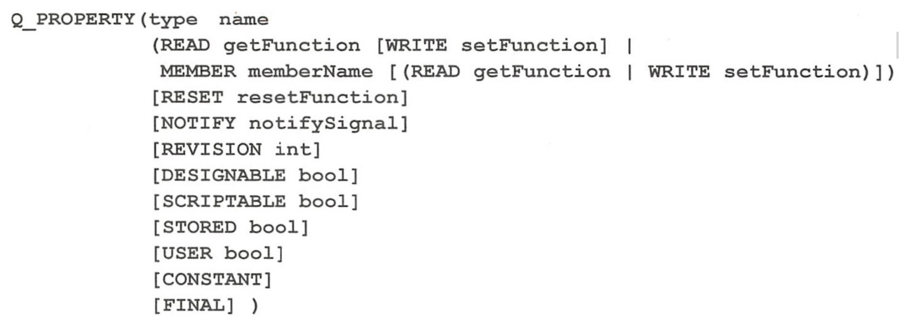

# Qt 学习

# 1 认识Qt

## 1.1 从一个hello world程序开始

### 1.1.1 Qt Creator的基本使用


- Qt Widgets 支持桌面平台的有图形用户界面（GUI）的应用程序
- QT Console Appliaction 类似于终端那种小黑窗
- Qt Quick Apppliaction，创建可部署的QT Quick 2 应用程序，其页面设计采用QML语言，程序架构采用C++y语言，一般用于移动设备或嵌入式设备上无边框的应用程序设计
- Qt Canvas 3D Application 创建Qt Canvas 3D QML项目，也是基于QML语言的页面设计，支持3D画布

#### 1 Qt Creator布局初识


一个Qt可运行程序的编写包含以下：

- untitled（项目名称）文件：主要用于存放qmake（和cmake和makefile一样，用于构建项目）
- Headers 存放头文件
- Sources 存放源文件
- Froms存放UI文件，用来设计界面的UI
- other Files存放其他文件如语言的翻译文件

#### 2：UI文件（Design）界面分布与介绍


UI界面的设计就是将组件拖到对应的窗口，在设计页面时可以减轻代码的编写

#### 3：project的编译，调试与运行

注意事项,勾选了会产生不同其他编译器的版本（在设置tools勾选编译器）


**project基于qmake+编译工具，在当前目录下简历Release和Debug**，**可执行文件和.o文件都会在Debug文件下，就像makefile+bush脚本一样**（不勾选），按F5就可以直接编译+运行软件（make+./可执行文件）

一些图标

| 小电脑 | 列举出编译工具和编译模式如Debug或Release模式     |          |
| ------ | ------------------------------------------------ | -------- |
| run    | 直接运行程序，如果为编译就是编译+运行程序        | ctr + R  |
| Debug  | 类似于GDB，用于调试文件相当于g++ -g+./可执行文件 | F5       |
| 小锤子 | 相当于make命令，编译当前项目                     | ctrl + B |

# 2 GUI程序设计基础

## 2.1 UI文件设计与运行机制

## 2.1.1项目文件组成

一个qt项目包含以下文件（前面说过，再说一次）

- untitled（项目名称）文件：主要用于存放qmake（和cmake和makefile一样，用于构建项目）
- Headers 存放头文件
- Sources 存放源文件
- Froms存放UI文件，用来设计界面的UI
- other Files存放其他文件如语言的翻译文件


## 2.1.2项目管理文件

对应上文中的untitled（项目名称）文件

具体代码

```cmake
QT       += core gui#追加类库内容，
#检查版本
greaterThan(QT_MAJOR_VERSION, 4): QT += widgets
##类似 a = version >4 ? QT : QT+widgets

CONFIG += c++11 #使用c++11，类似选项-std=c++11

# The following define makes your compiler emit warnings if you use
# any Qt feature that has been marked deprecated (the exact warnings
# depend on your compiler). Please consult the documentation of the
# deprecated API in order to know how to port your code away from it.
DEFINES += QT_DEPRECATED_WARNINGS #类似于-D

# You can also make your code fail to compile if it uses deprecated APIs.
# In order to do so, uncomment the following line.
# You can also select to disable deprecated APIs only up to a certain version of Qt.
#DEFINES += QT_DISABLE_DEPRECATED_BEFORE=0x060000    # disables all the APIs deprecated before Qt 6.0.0

SOURCES += \                #将依赖的源文件追加
    main.cpp \
    mainwindow.cpp

HEADERS += \  				 #将头文件追加
    mainwindow.h

FORMS += \
    mainwindow.ui

TRANSLATIONS += \
    untitled_zh_CN.ts

# Default rules for deployment.
qnx: target.path = /tmp/$${TARGET}/bin
else: unix:!android: target.path = /opt/$${TARGET}/bin
!isEmpty(target.path): INSTALLS += target

```

## 2.1.3 界面文件

后缀为.ui的文件时可视化设计的窗体的定义文件。如上图的mainwindow.ui，通过Design来可视化设计页面，Design分布如下：


- 对象浏览器（Objects Inspector）也就是右上角的Object，用来记录maninwindow.ui对应mainwindow.cpp/.h中定义的类实例化出来对象的一些属性
- 属性编辑器（Property Editor），位于窗口右下方，用来编辑对象中元素中一些属性。，比如图中的hello world 就是对象的元素Qlab类变量的属性的值
- 最底端为Signals 和 Slots，为信号与信号槽，这是Qt中非常重要的概念，类似于回调函数


ui设计界面的布局一定要熟练，一些gui组件的布局属性的一些值可以直接通过ui来设置。

## 2.1.4  从一个简单的hello world代码入门Qt

**首先一个简单的qt程序包含的文件，上面提到过**

### **主函数文件**

```c++
#include "mainwindow.h"

#include <QApplication>

int main(int argc, char *argv[])
{
    QApplication a(argc, argv);//定义并创建应用程序
    MainWindow w; //定义并创建窗口
    w.show();//展示窗口
    return a.exec();//应用程序运行
}

```

- QApplication 是Qt的标准应用程序类，声明并创建程序a
- MainWindow继承Qt库中窗口类，实例化对象为w，使用w.show类函数来展示窗口
- 最后一行用a.exec()启动应用程序的执行，开始应用程序的消息循环和事件处理

### 窗体相关文件

头文件

```c++
#ifndef MAINWINDOW_H
#define MAINWINDOW_H

#include <QMainWindow>

QT_BEGIN_NAMESPACE//编译时来提示是否由最新的函数
namespace Ui { class MainWindow; } //ui界面的窗口类
//我们可以看到下面类中的MainWindow类成员有一个ui命名空间的 MainWindow
QT_END_NAMESPACE

class MainWindow : public QMainWindow
{	//如果要使用信号槽与信号机制类必须添加
    Q_OBJECT//这个宏的展开有一大堆变量还有一些其他的宏

public:
    MainWindow(QWidget *parent = nullptr);
    ~MainWindow();

private:
    Ui::MainWindow *ui;
};
#endif // MAINWINDOW_H
```

源文件

```c++
#include "mainwindow.h"
#include "ui_mainwindow.h"
//源文件没啥好说

MainWindow::MainWindow(QWidget *parent)
    : QMainWindow(parent)
    , ui(new Ui::MainWindow)
{
    ui->setupUi(this);//这个函数实现窗口的生成与各种属性的设置，信号与信号槽的关联
        //可以理解将一个程序的窗口的组件加载
}

MainWindow::~MainWindow()
{
    delete ui;
}

```

### ui_mainwindow.h文件

这个文件是对项目编译完成（是对头文件mainwindow.h文件编译完成）后产生，代码如下

```c++
/********************************************************************************
** Form generated from reading UI file 'mainwindow.ui'
**
** Created by: Qt User Interface Compiler version 5.14.2
**
** WARNING! All changes made in this file will be lost when recompiling UI file!
********************************************************************************/

#ifndef UI_MAINWINDOW_H
#define UI_MAINWINDOW_H

#include <QtCore/QVariant>
#include <QtWidgets/QAction>
#include <QtWidgets/QApplication>
#include <QtWidgets/QLabel>
#include <QtWidgets/QMainWindow>
#include <QtWidgets/QMenu>
#include <QtWidgets/QMenuBar>
#include <QtWidgets/QPushButton>
#include <QtWidgets/QStatusBar>
#include <QtWidgets/QWidget>

QT_BEGIN_NAMESPACE

class Ui_MainWindow
{
public:
    //组件的类，通过Qt design的右上方也可以看到这些类
    QWidget *centralwidget;
    QLabel *label;
    QPushButton *pushButton;
    QMenuBar *menubar;
    QMenu *menumy_first_qt;
    QStatusBar *statusbar;
	//MainWindow.cpp文件中ui->setupUi(this)this指向实例化的QMainWindow对象
    //我们读完这个段代码，发现这个函数类似于init()函数，将一些类对象的属性设置设置
    //再使用 retranslateUi函数（下文定义）来对窗口组件进行调整，比如窗口的名称等等
    //还有就是信号和槽的关联
    void setupUi(QMainWindow *MainWindow)
    {
        if (MainWindow->objectName().isEmpty())
            MainWindow->setObjectName(QString::fromUtf8("MainWindow"));
        MainWindow->resize(1021, 775)//窗口的大小;
        centralwidget = new QWidget(MainWindow);
        centralwidget->setObjectName(QString::fromUtf8("centralwidget"));
        label = new QLabel(centralwidget);
        label->setObjectName(QString::fromUtf8("label"));
        label->setGeometry(QRect(40, 230, 921, 201));
        QFont font;
        font.setPointSize(26);
        font.setUnderline(false);
        label->setFont(font);
        pushButton = new QPushButton(centralwidget);
        pushButton->setObjectName(QString::fromUtf8("pushButton"));
        pushButton->setGeometry(QRect(240, 430, 221, 91));
        MainWindow->setCentralWidget(centralwidget);
        menubar = new QMenuBar(MainWindow);
        menubar->setObjectName(QString::fromUtf8("menubar"));
        menubar->setGeometry(QRect(0, 0, 1021, 23));
        menumy_first_qt = new QMenu(menubar);
        menumy_first_qt->setObjectName(QString::fromUtf8("menumy_first_qt"));
        MainWindow->setMenuBar(menubar);
        statusbar = new QStatusBar(MainWindow);
        statusbar->setObjectName(QString::fromUtf8("statusbar"));
        MainWindow->setStatusBar(statusbar);

        menubar->addAction(menumy_first_qt->menuAction());
		//
        retranslateUi(MainWindow);

        QMetaObject::connectSlotsByName(MainWindow);
    } // setupUi
	//重新设置窗口组件和窗口属性的值
    void retranslateUi(QMainWindow *MainWindow)
    {
        MainWindow->setWindowTitle(QCoreApplication::translate("MainWindow", "MainWindow", nullptr));
        label->setText(QCoreApplication::translate("MainWindow", "Hello world ,my first Qt program", nullptr));
        pushButton->setText(QCoreApplication::translate("MainWindow", "close", nullptr));
#if QT_CONFIG(shortcut)
        pushButton->setShortcut(QString());
#endif // QT_CONFIG(shortcut)
        menumy_first_qt->setTitle(QCoreApplication::translate("MainWindow", "my first qt", nullptr));
    } // retranslateUi

};

namespace Ui {
    class MainWindow: public Ui_MainWindow {};
} // namespace Ui

QT_END_NAMESPACE

#endif // UI_MAINWINDOW_H

```

# 2.2 可视化UI设计

前面我们发现通过Qt design操作一些组件是一种方式和ui_MainWindows.h文件相互对应，那么通过修改ui_MainWindows.h文件也可以做到Qt design的效果

## 2.2.1 实例化程序功能

进入Qt design界面


将左边的组件拖至中间即可

# 3 qt窗口类的介绍

Qt 中的几个关键基类：`QWidget`, `QMainWindow`, `QDialog`, 和 `QFrame`

## 3.1 QWidget

**QWidget**：

**特点**：

- `QWidget` 是所有用户界面对象的基类。
- **任何可以被显示的对象**都是 `QWidget` 的子类。
- 它提供了基本的用户界面功能，可以包含其他 `QWidget` 对象。

**功能**：

- 它可以单独使用，也可以作为其他复杂控件的容器。
- 支持事件处理，如鼠标点击、键盘输入等。
- 可以设置大小、位置、可视/隐藏状态等。

**使用场景：**

- 创建自定义的用户界面控件。
- 作为其他控件的容器。

## 3.2 **QMainWindow**：

**特点**：

- `QMainWindow` 是专为主窗口设计的类，提供了一个框架，使得开发者可以添加工具栏、状态栏、以及其他常见的元素。
- **它是 `QWidget` 的子类，但是专为主窗口应用程序设计**。
- 允许使用停靠窗口（dockable windows）和工具栏。

**功能：**

- 自动管理菜单栏、工具栏、状态栏和中心窗口。
- 支持添加停靠窗口（dock widgets）和工具条。
- 可以很容易地通过拖放来组织工具栏和停靠窗口的布局。

**使用场景**：

- 构建主窗口应用程序。
- 需要一个包含常用GUI组件的应用程序窗口。

## 3.3 QDialog

**特点：**

- `QDialog` 是专为对话框设计的基类。
- 通常用于执行短期任务或与用户交互。
- 支持模态和非模态对话框。

**功能**：

- 支持模态（阻塞）和非模态（非阻塞）对话框。
- 可以有返回值，通常用于表示用户的动作（如接受或拒绝）。
- 支持添加标准按钮和自定义的界面元素。

**使用场景**：

- 需要从用户那里获取决定或额外信息。
- 创建设置选项、文件选择对话框等。

## 3.4 Qframe、

**特点：**

- `QFrame` 是一个用于包含其他 `QWidget` 对象的框架或边框。
- 它提供了可以绘制各种样式的边框，并可以作为组织其他 `QWidget` 的容器使用。

**功能**：

- 提供了绘制边框的功能，可以选择不同的样式（如凹陷、凸出等）。
- 继承自 `QWidget`，因此可以包含其他控件。
- 用于组织界面布局，通过视觉上的分隔来增强用户体验。

**使用场景**：

- 组织界面布局，通过边框清晰地分割不同区域。
- 用作其他控件的背景框架，提供视觉上的边界和组织。

# 4 QT类库的概述

Qt使用cpp纯手搓出来的并且扩展，引入了一些新的概念比如**信号与槽** 元对象等等

**Qt Core模块是Qt类库的核心**，所有其他模块都依赖此模块。

**Qt为C++语言增加了新的特性就是在Qt Core模块中实现的**，这些扩展特性由Qt的元对象系统实现的，包括信号与槽机制，属性系统，动态类型转换。

## 4.1 元对象系统

Qt的元对象系统（meta-object-syste）提供了对象之间通信的信号与槽机制，运行时类型信息和动态属性系统。（类似标准库中的dynamic_cats一样，运行时确定）

### 4.1.1**元对象系统由三个基础组成**

- QObject类是所有使用元对象系统类的基类
- 在一个类的private部分声明Q_OBJECT宏，使得类可以使用元对象的特性，如动态属性，信号槽
- MOC(元对象编译器)为每个QObject的子类提供必要的代码来实现元对象系统的特性。

**MOC编译器的预处理阶段是将代表元对象的宏展开**，**也就是一个Cpp源文件在预处理前先用MOC编译器先进性预处理**，针对QT部分，将它预处理成额外的Cpp代码，然后这样在接下来就是常规的c++编译过程，预处理，编译，汇编和连接，最后形成可执行文件

所有元对象的基类都是QObject类，它的提供了一些函数：

- QObject::metaObject()函数返回类关联的元对象(动态时确定对象类型，类似于typeid)

  - ```c++
    QObject* obj = new QPushButton;//多态的使用
    obj->metaObject()->className();//QPushButton
    ```

- QObject::inherits（）,用于查看是否是子类关系

- QObject::tr()和QObject::trUtf8函数可翻译字符串，用于多语言界面设计

- QObject::setProperty()和QObject::Property()函数用于通过属性的名称动态的设置和获取属性值

- 对于QObject以及其子类,可以通过qobject_cast（dynamic_cast）进行切换，投影，必须是基础关系

**元对象都是继承于QObject**，**它们继承基类的属性和方法**，**QObject所带来的属性和方法组成了元对象系统**，用于后续的开发，可以说是整个QT开发的基础

## 4.2 属性系统

### 1.属性的定义

**Qt提供了一个QT_PROPERTY()宏可以定义属性**，他也是基于元对象系统实现的。Qt的属性系统与C++编译器无关，可以用任何标准的C++编译器编译定义了属性的Qt C++程序

**宏的格式如下：**



**QT_PROPERTY宏定义属性的一些主要关键字的以下如下**：

- READ指定一个读取属性值的函数，没有MEMBER关键字时必须设置READ。
- WRITE指定一个设定属性值的函数，只读属性没有WRITE设置
- MEMBER指定一个成员变量与属性关联，成为可读可写的属性，无需设置READ和WRITE
- RESET是可选的，用于指定一个设置属性缺省值的函数
- NOTIFY是可选的，用于设置一个信号，当属性值变化时发送此信号
- DESIGNABLE表示属性是否在Qt Designer里可见，缺省为true
- CONSTANT表示属性值是一个常数


**QT_PROPERTY这个宏是定义在类里面的，宏的展开，一般都是一些函数对类对象的操作或者与这个类对象有所关系的的变量**，**关于属性，无论是否有这个宏都是可以通过QObject::setProperty()和QObject::Property()函数来设置和读取**

### 2.属性的使用

```c++
class MyClass : public QObject {
    Q_OBJECT
    Q_PROPERTY(int myNumber READ getMyNumber WRITE setMyNumber NOTIFY myNumberChanged)

public:
    int getMyNumber() const { return m_myNumber; }
    void setMyNumber(int number) {
        if (m_myNumber != number) {
            m_myNumber = number;
            emit myNumberChanged();
        }
    }

signals:
    void myNumberChanged();

private:
    int m_myNumber;
};

```

```c++
MyClass obj;
obj.setProperty("myNumber", 42); // 设置属性
int value = obj.property("myNumber").toInt(); // 获取属性

```

### 3.类的附加信息

属性系统还有一个宏Q_CLASSINFO()，可以为类的对象定义“名称---值”信息，如：

```c++
class myclass:public QObject{
    Q_OBJECT
        Q_CLASSINFO("auto","wang")
        Q_CLASSINFO("company","UPC")
     public:
    	.......
};
```

```c++
//通过这个函数 获取一个对象，通过它的接口来知道一些信息
QMetaClassInfo QMetaObject::classInfo(int index) const
 //by the function value and name to get some information
```

## 4.3 信号与槽（signal and pot）

信号与槽是对象之间通信的机制，也需要元对象系统支持才能实现的，利用QObject::connect()函数建立联系，类似于原生C++中的“事件——响应”（原生借助于回调函数或者信号，或者一些事件处理比如epoll）

### 1：QObject::connect函数


**个人认为使用第一种即可**

**关于最后一个参数Qt::ConnectionTytpe type的默认值：**

- **Qt::AutoConnection**:如果信号的接收者与发射者在同一个线程，就使用Qt::DirectConnect方式；否则使用Qt::QueuedConnection方式，在信号发射时自动确认关联方式
- **Qt::DirectConnect**：信号被发射时槽函数立刻执行，槽函数与信号在同一线程
- **Qt::QueuedConnection**：槽函数与信号在不同一线程，当发出信号后，槽函数所在线程在被调度则立马执行
- **Qt::BlockingQueuedConnection**:与Qt::QueuedConnection相似，发送信号的线程必须等槽函数所在的线程，切记，信号与槽函数不要放在一个线程

### **2：sender()获得信号发射者**

在槽函数里，使用QObject::sender()可以获取信号发射者的指针。如果知道知道发射者的具体类型，直接动态强转即可，在使用发射者的接口函数

### 3：自定义信号及其使用

**在Qt中信号就是在类定义里声明的一个函数，但是这个函数无需实现，只需要发射**（emit）

例子：

```c++
class myclass : public QObject{
	Q_OBJECT
private:
    int m_age = 10;
public:
    void incAage();
signals:
    void ageChanged(int value);
}
//通过其他函数带动信号的发送
//再利用connect将其信号与槽连接
myclass::incAage(){
	m_age++;
    emit ageChanged(m_age);
}
```

## 4.4 元对象特性测试实例

#### 1：元对象测试的总结：

一些心得

如果自己定义的信号，是一定要绑定一个试图改变成员变量的函数或者是类外的变量

在写槽函数的时候，尽可能通过sender去判断信号源，在槽函数中利用分支语句执行不同的分支体，提高槽函数的复用性

巧妙使用QT_PROPERTY()和QObject::setProperty()和QObject::Property()函数来设置和读取

这个测试实例，包含了属性系统，信号与槽函数的使用

#### 2：QMetaObject介绍

QMetaObject他的出现是为了更好的查看类的元信息，不止局限于类的成员变量或者用Q_PROPERTY()宏所定义和设置的，还有继承关系，对象树等

#### 3：QObject 和 QMetaObject

##### QObject

- **基类**：`QObject` 是 Qt 中许多类的基类，为它们提供基本的对象功能，包括事件处理、信号和槽的机制、以及对象的父子关系管理等。
- **信号和槽**：`QObject` 的一个核心功能是信号和槽机制，它允许对象之间进行松散耦合的通信。信号和槽机制是 Qt 事件通信的基石，极大地简化了事件驱动程序的开发。
- **动态属性系统**：`QObject` 还支持动态属性的设置和查询，这使得在运行时可以灵活地修改和访问对象的状态。

##### QMetaObject

- **反射能力**：`QMetaObject` 提供了反射能力，允许程序在运行时查询对象的信息，如类名称、继承结构、可用的方法、信号、槽及属性等。这些信息可以用于动态地调用方法，连接信号和槽，以及动态创建对象。
- **类型信息**：通过 `QMetaObject`，Qt 提供了一种机制来处理类型信息，这在与 QML 等高级特性集成时非常有用。例如，可以在 QML 中直接访问和操作 C++ 对象的属性和方法。
- **枚举管理**：`QMetaObject` 还管理类中定义的枚举类型，使得可以在不知道具体值的情况下动态访问枚举。

**QMetaObject用于属性操作的函数有以下几种**

- propertyOffset(),返回类的第一个属性的序号
- propertyCount():返回属性个数
- QMetaProperty property(int index):返回序号为index的属性对象

**总结**

- QObject是所有元对象的父类，为继承的类提供很多的API，用于程序的编写
-  QMetaObject，用于更详细的获取对象的属性，而不仅仅局限于成员变量，还有对象继承关系等

## 4.5 Qt全局定义

### 1:Qt中的数据类型

​	和原生C++差不太大

### 2:**一些常用函数**

书61

### 3:**常用宏**

在头文<QtGloabal头文件中定义了很多宏，常用如下 

1. QT_VERSION

   - 比如qt5.9.1就是0x0050901

   - 宏的展开表示Qt编译器版本，这个宏常用于条件编译设置，根据Qt的版本不同，编译不同的代码段（与#if和#else使用）

2. QT_VERSION_CHECK

   - 这个宏展开是一个qt版本号的整数形式

3. QT_VERSION_STR

   - QT版本的字符串如“5.9.0”

4. Q_BYTE_ORDER,Q_BIG_ENDIAN和Q_LITTLE_ENDIAN

   - 第一个表示当前系统的字节序，第二个为大端字节序，最后一个是小段字节序

5. Q_DECL_OVERIDE

   - 在类的定义中，用于重载一个虚函数，如果你未对它重载则会报错

   - ```c++
     //exmaple：
     //虚函数printEvent()
     voidf printEvent(parament) Q_DEL_OVERRIDE
     ```

6. Q_DECL_FINAL

   - 使用这个宏修饰的虚函数，无法被重载，这是最后一个版本
   - 或修饰一个类，该类则无法被继承


## 4.6 容器类

相较于stl容器的优点：

- 容器类更加轻巧，安全，易于使用
- 进行了速度和存储的优化，减少可执行文件的大小
- 在多线程下读是安全的，无需使用线程同步

对于qt的容器类模版的T必须是可复制的的类型，即一个类必须提供有参构造，拷贝构造，拷贝复制构造

QT提供了foreach可以用于遍历这些容器

### 1： 顺序容器类

Qt的顺序容器类有QList，QLinkedList，Qvector，Qstack和QQueue。

#### 1.1 QList

与list相同，但是它支持使用index去访问数据，它是基于（array-list），链表的插入与删除的效率很高

常用的函数：

- 添加：任意位置 insert（），追加append（）
- 替换： replace（）
- 删除：任意位置removeAt（），删除最前面与最后removeFirst（）and removeLast（）
- 移动和交换：move and swap

其他的一些函数与stl中差不多比如size（）和isEmpty（==empty（））

#### 1.2 QLinkList

QLinkList是链式链表，数据不是连续储存的，无法利用index访问，他的接口函数与上面的基本相同

#### 1.3 QVector

与vector一样，接口函数与QList一样

#### 1.4  QStack

两个常用的操作接口函数，push he pop函数

#### 1.5 Queue

QQueue,队列，两个常用的api enqueue（）和 dequeue（）是主要操作函数

### 2：关联容器类

关联容器：Qmap，QMultiMap,QHash，QMultiHash,QSet

带Multi的支持一键对对多value，Qhash利用散列函数进行查找，查找速度更快

#### 1:QSet

QSet是基于散列表的集合模版类，储存顺序不定，查找值的速度非常快，QSet内部就是QHash实现

可利用〈〈追加元素

测试这个元素是否在集合内使用contains（）函数

#### 2: QMap

与map一样，两个常用的接口函数insert和remove用来添和删除key-value

其他一些容器与stl的差不多，更倾向于stl的容器

## 4.7容器的迭代

stl容器的迭代，利用迭代器，或者auto x ： xxx，迭代器揭开地址后的类型就是<>里面的类型

在qt中利用foreach宏可以遍历容器

```c++
//宏定义原型 foreach（variable，container）//第一个为元素的载体，第二个为容器
QVector<string> v;
string s;
foreach(s,v){
  qDebugc<<s;
}

```

## 4.8 Qt类库的模块

- Qt基本模块（qt Essentials):提供了Qt在所有平台上的基本功能
- Qt附加模块（Qt Add-Ons）:实现一些特定功能的提供附加价值的模块
- 增值模块（value-Add Modules）:单独发布的提供额外价值的模块

- 技术预览模块

### 1： Qt基本模块


**Qt Core 模块是Qt类库的核心**，所有其他模块都依赖于此模块，如果使用qmnake构建项目，则Qt Core模块是自动被加入项目的

### 2：Qt附加模块


### 3: 技术预览模块

- Qt Network Authorization 基于OAuth协议，为应用程序提供网络账号验证的功能
- Qt Speech 提供文字转语音功能支持
- Qt Remote Objects 进程间或设备间通信，共享QObject的API

### 4 ：工具

- Qt Designer 用于扩展Qt Designer的类
- Qt Help 
- Qt UI Tools 

# 5 常用界面设计组件

## 5.1 字符串与输入输出

### 5.1.1字符串与数值之间的转换

界面设计时使用最多的组件恐怕就是QLabel和QLineEit，前者用于显示字符串，后者用于显示和输入字符串，这两个类提供以下两个函数，来获取和设置文本信息

- QString text() const
- void setText(const QString &)

**QString类从字符串转换为整数的函数有** ：

```c++
int toInt(bool *ok=Q_NULLPTR,int)
```

