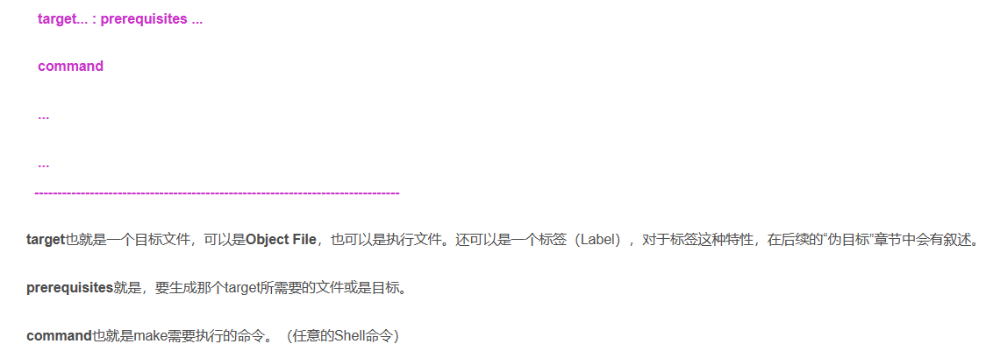
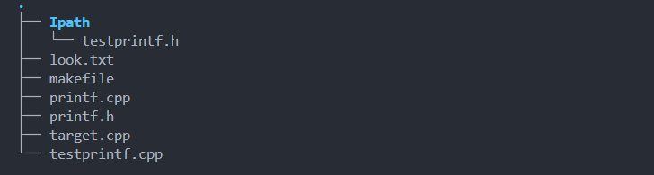
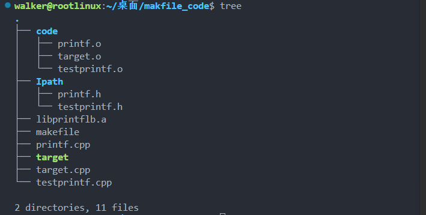

# Makefile

# 前置 gcc 与 g++

gcc与 g++ 使用基本相同，gcc主要编译C语言，g++基本都是编译Cpp

常规用法

```shell
g++ 源文件.... -o 可执行文件
gcc 源文件.... -o 可执行文件
```

一些其他选项：

-c 只激活预处理，编译和汇编

-S 只激活预处理和编译

-E 只激活预处理

-o 指定目标可执行文件名，也就是上面的常规用法

-I 指定头文件所在的目录

# gcc/g++编译动态库和静态库

# 1：Makefile的介绍

## 1.1 makefile规则的介绍：

```shell
目标 ... : 依赖 ...
	命令1
	命令2
	. . .
```



  这是一个文件的依赖关系，也就是说，target这一个或多个的目标文件依赖于prerequisites中的文件（它可能已经被编译好比如形成了库，也有可能没有还是众多的源文件），其生成规则定义在command中。如果prerequisites中的文件比target新的化会重新使用command。

总结：

1、目标即要生成的文件。如果目标文件的更新时间晚于依赖文件更新时间，则说明依赖文件没有改动，目标文件不需要重新编译。否则会进行重新编译并更新目标文件。

2、默认情况下Makefile的第一个目标（target）为终极目标。

3、依赖（prerequisites）：即目标文件由哪些文件生成。

4、命令：即通过执行命令由依赖文件生成目标文件。注意每条命令之前必须有一个tab保持缩进，这是语法要求（会有一些编辑工具默认tab为4个空格，会造成Makefile语法错误）。

5、all：Makefile文件默认只生成第一个目标文件即完成编译，但是我们可以通过all 指定所需要生成的目标文件。

## 1.2 变量

$符号表示取变量的值，当变量名多于一个字符时，使用"( )"
$符的其他用法

$^ 表示所有的依赖文件

$@ 表示生成的目标文件

$< 代表第一个依赖文件

上面这三个是makefile文件中最常见的三个变量。$用于获取变量的值

一个例子

```shell
cc = g++
object = targetprintf
prerequires = $(wildcard *.cpp)#wildcard 函数用于获取当前目录下所有以.cpp结尾的源文件

$(object) : $(prerequires)
	$(cc) $^ -o $@  # $^ 所有的依赖文件获取上面的prerequeires

					# $@获取目标文件也就object的值		
clean:
	rm *.o || *.out
```

编写的所有定义声明都是为了 g++/gcc那段话所服务的

## 1.3 变量的赋值

"**=**"是最普通的等号，在Makefile中容易搞错赋值等号，使用 “=”进行赋值，变量的值是整个Makefile中最后被指定的值。

```makefile
SRS = A
STS = $(SRS)ADADAD
SRS = AAAAA
#最后得到的STS 等于 AAAAAADADAD
#一句话总结：如果一个变量A利用=赋值设计到被其他变量B赋值,这个时候要考虑B变量最终值
```

"**:=**" 表示直接赋值，赋予当前位置的值。相当于c++中的=直接赋值

"?=" A ?= new ,如果A直接没有被:= 赋值，那么A就等于new

”+=“和平时写的一样，追加

## 1.4函数

最常用的两个分别是wildcard 和 patsubst

### wildcard

用法：

```makefile
SRS = (wildcard ./*.cpp）#匹配当前目录下所有后缀为.cpp的源文件
```

**patsubst**

用法：

```makefile
SRT = $(patsubst pattern,replacement,text)
#pattern 要替换的格式 如 %.cpp
#replacement 替换成的格式， 比如%.o
#text ,字符串列表， 比如SRS = $(wildcard ./*.cpp）
```

例子：

```makefile
cc = g++
object = targetprintf
prerequires = $(wildcard *.cpp)
srs = $(patsubst %.cpp , %.o , $(prerequires))

$(object) : $(srs)
	$(cc) $^ -o $@   
#生成$(srs)目标， 这个目的就是在当前项目下，只编译修改过的文件，没有改过的无需编译
$(srs) : $(prerequires)
	$(cc) -c $^ -o $@						
clean:
	rm *.o || *.out
```

## 1.5 为目标 .PHONY

`.PHONY` 是用于声明伪目标，指示 Make 工具执行对应操作而不检查文件状态的特殊标记。

在makefile中target ： 没有目标文件，想要执行这个下面的命令就得make target， 一般认为target不依赖文件，会看做一个命令，下面两个例子：

```makefile
target : test.cpp code.cpp
	g++ $^ -o $@
clean :
 	rm *.o && move *.cpp ./bush
#如果执行make ，只会执行 target下面得命令， clean下面得不会执行，得make clean手动执行
```

```makefile
.PHONY test2 clean
test2 : test.cpp code.cpp s.cpp
	g++ $^ -o $@
target : test.cpp code.cpp
	g++ $^ -o $@
clean :
 	rm *.o && move *.cpp ./bush
        
        # 如果执行make， 只有 target下面得指令被执行，有点像gitnore一样
```

## 1.6 嵌套使用makefile

### 基本

makefile无非就是在基础得shell上加了点构建项目的功能，所以makefile中也能使用make 命令

example：假设我们有两个 Makefile 文件，一个名为 `Makefile1`，另一个名为 `Makefile2`。现在要在 `Makefile1` 中调用 `Makefile2`，可以按照以下方式进行：

```makefile
all:
    @echo "Making all in Makefile1"
    $(MAKE) -f Makefile2 # -f 如果Makefile文件不是标准名称（makefile or Makefile，就需要-f指定）

clean:
    @echo "Cleaning in Makefile1"
    $(MAKE) -f Makefile2 clean

```

### 总控makefile的参数传递

当在总控 Makefile 中调用子 Makefile 时，可以通过传递变量来将总控 Makefile 中的变量传递给子 Makefile。这样做可以实现在整个项目中共享变量，同时确保子 Makefile 中定义的变量不会被覆盖。

example：假设有一个总控 Makefile，名为 `Makefile`，其中定义了一个变量 `CFLAGS`：

```makefile
CFLAGS := -Wall -O2
export CFLAGS
#export 单用就是传递所有变量

all:
    $(MAKE) -C subdirectory

```

```makefile
CFLAGS := -g #不会被总控的覆盖，如果总控像覆盖，在调用make -e即可
export CFLAGS

foo:
    gcc $(CFLAGS) -o foo foo.c

```

## 1.7 指定库文件的路径

一般都是通过"**-I**"（大写i）来指定，假设头文件在那个文件里

example： 文件目录结构如下：



```makefile
cc := g++
HEAD := -I./Ipath
object := targetprintf
prerequires := $(wildcard *.cpp)

$(object) : $(prerequires)
	g++ $(HEAD) $^ -o $(object)
```

## 1.8 指定库文件路径

gcc/g++中利用选项 -L 来指定库文件夹的路径，利用选项-l（会在自动添加lib）来指定连接库文件夹中哪些文件

## 1.9 实战练习

### 1.9.1利用makefile制作静态库

文件结构如下：



```makefile
CC := g++
STATIC_LB := libprintflb.a
HEAD := -I./Ipath
OBJECT := target
prerequires := $(wildcard *.cpp)
prerequireso := $(patsubst %.cpp,./code/%.o,$(prerequires))
SOURCES := $(filter-out target.cpp,$(wildcard *.cpp))
OBJDIR := ./code

$(OBJDIR)/%.o : %.cpp
	$(CC) -c $< -o $@ $(HEAD)

target : target.cpp $(STATIC_LB)
	$(CC) target.cpp -o $@ -L. -lprintflb


$(STATIC_LB) : $(prerequireso)
	ar rcs $@ $^

clean:
	rm -f $(OBJDIR)/*.o $(OBJECT) $(STATIC_LB)
```

### 1.9.2利用makefile制作动态库

```makefile
CC := g++
STATIC_LB := libprintflb.so
FLAG := -shared
HEAD := -I./Ipath
OBJECT := target
prerequires := $(wildcard *.cpp)
prerequireso := $(patsubst %.cpp,./code/%.o,$(prerequires))
SOURCES := $(filter-out target.cpp,$(wildcard *.cpp))
OBJDIR := ./code

#* 生成.o文件

$(OBJDIR)/%.o : %.cpp
	$(CC) -c $< -o $@ $(HEAD)

target : target.cpp $(STATIC_LB)
	$(CC) target.cpp -o $@ -L. $(STATIC_LB)

#* 生成动态库
$(STATIC_LB) : $(prerequireso)
	$(CC) $(FLAG) -o $@ $^ ##这个与静态库不同

clean:
	rm -f $(OBJDIR)/*.o $(OBJECT) $(STATIC_LB)
```

**补充：makefile获取环境变量**

```shell
export FLAG="DEBUG"
#makefile文件可以直接捕获环境变量，可以直接使用如
```


# Cmake