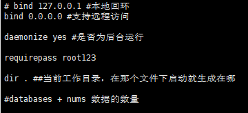

# Redis

笔记主要用来记redis的命令，概念部分看总结的八股

## 1.1 认识redis

*REmote DIctionary Server(Redis) 是一个由 Salvatore Sanfilippo 写的 key-value 存储系统，**是跨平台的非关系型数据库。***

Redis（Remote Dictionary Server）是一个开源的内存数据库，遵守 BSD 协议，它提供了一个高性能的键值（key-value）存储系统，**常用于缓存、消息队列、会话存储等应用场景。**

## 1.2 配置 redis

使用 sudo vim /etc/redis.conf修改配置文件

