# 数据库-Mysql

# 基础知识讲解

**主键，索引，外键**

## 1 : 什么是主键

主键就是一列，其值可以**唯一标识**表中的每一行数据，**每个表只能有一个主键**，而且**主键的值不能重复**，也不能包含NULL值，通常用来保证数据的唯一性和用于载表中查询特定的行

```
比如一个表结果如id name ,在建立表时设置id为主键，那么select * from table where id = id_value
```

## 2: 主键，外键，索引的区别

**定义**：

- 主键：唯一标识一条记录，不允许重复，不允许为空
- 外键：外键是一个表中的字段，其值为另一个表的主键，用于建立两个表之间的关系
- 索引：没有重复值，但可以有一个空值，用于查询到数据

**作用：**

- 主键：唯一值，在一个表中用来标识一行记录
- 外键：用于与其他表建立关系
- 索引：为了提高查询排序的速度

**区别**：外键为一个表中的字段，其值一般为其他表的主键，用于与其他表的记录建立关系，**主键和外键通常与索引有关，但索引不一定是主键或外键**

## 3：MySql表连接

### 3.1 连接和笛卡积

**连接：**

将各个表中的记录都取出来进行依次匹配，将匹配后的结果发送给客户端

**笛卡积**：

连接查询的结果中包含一个表的每一条记录与里一个表中每一条记录的组合，这样的查询结果就是笛卡积。

### 3.2 连接过程

1. 确定第一个需要查询的表，此表为**驱动表** 
2. 从驱动表中每一条符合搜索条件的记录，到接下来的表中查询匹配的记录；**驱动表之后的那个就叫做被驱动表**

只需要访问驱动表一次，可能会多次访问被驱动表

每获得一条满足条件的驱动表记录，马上到被驱动表中寻找匹配的记录

#### 3.2.1 内/外连接

##### 内连接

驱动表中的记录载在被驱动表中找不到匹配的记录，那么驱动表的这条记录不会加入到结果中

内连接的实质在于在先从驱动表找到符合条件，没有自然无法显示，再去驱动表，没有自然无法显示

相当于

```sql
#驱动表为A， 被驱动表B
select * from A，B; ==
select * from A;
select * from B;#把两者的结果笛卡积一下
```

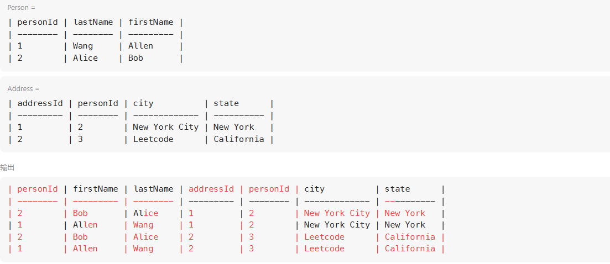

```sql
#驱动表为A， 被驱动表B
select * from A，B;
select * from A join B;
select * from A inner join B;
select * from A cross join B;
```

##### 外连接

驱动表中的记录在被驱动表中找不到匹配的记录，也仍需加入到最后结果中

左外连接：语句左侧的表为驱动表

#驱动表为A， 被驱动表B

```sql
select * from A left join B on 连接条件
```

example：将person和address表按照personid连接，就算没出现也不能省略

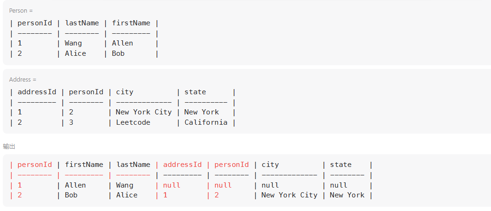

```sql
# Write your MySQL query statement below
select *
from Person left join Address
on Person.PersonId = Address.PersonId
;
```

右外连接语句右侧的表为驱动表

```
select * from B right join A on 连接条件
```

对于内连接，驱动表和被驱动表的顺序可以更换；对于外连接，这个顺序不能随意更换

##### 过滤条件

where：不论内外连接，只要不符合where子句的记录都不会加入到最后的结果

on：主要用于外连接，在外连接中，如果驱动表中的记录在被驱动表中没有记录可以匹配，该驱动表记录仍然会加入结果中，对应的被驱动表中的字段以null填充

嵌套循环连接

如果涉及2个以上的表，比如3个，那就先将1和2连接（至于内连接还是外连接根据情况），再将3作为被驱动表进行连接查询

##### 总结：

为了方便记忆

内连接的行为实际像两次select然后将两次select的结果迪卡积，再筛选

外连接的行为好像“真正意义上两表连在了一起，连接点在于on，然后通过一次select将连起来的表符合的记录筛选出来”

## 4：执行一次select语句后发生什么

### 流程图

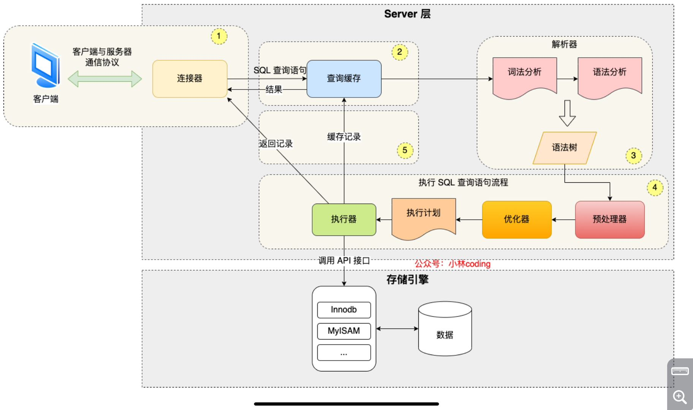

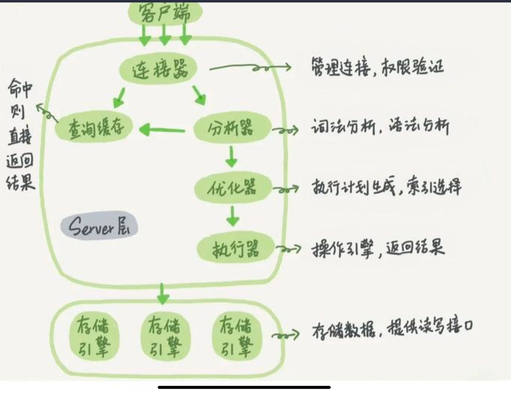

**拿webserver的角度，走一遍**

1. 客户端连接向服务器请求先建立连接（TCP三次握手）,对应客户端和连接器
2. 分析器，词法分析和语法分析，很像分析http协议的行为，这里就是分析select语句
3. 优化，类似加速引擎
4. 执行器，很像服务器拿取本地资源的行为，作为对应的回应

MySql的架构共分为两层：**Server层和存储引擎层**

- **Server 层负责建立连接**，分析，和执行SQL
- **存储引擎层负责数据的存储和提取**，支持InnoDB，MySAM，Memory等多个存储引擎，现在最常用的存储引是InnoDB，其支持索引类型是B+树索引。

### Server层

#### 1：连接器 

管理连接和权限的认证

连接器跟客户端建立连接，获取权限，然后后面的权限判断都基于此时读到的权限。

Mysql回定期自动清理“空闲”连接，由参数wait_timeout控制，默认值8 hours

**由于建立连接比较复杂，所以尽量使用长连接，而不是短连接**（少量查询后，断开）但是，**当长连接过多时，可能导致内存占用太大**，被系统强行杀掉（OOM），会导致Mysql异常重启

**解决方案：**

- 定期断开连接
- Mysql 5.7后可以用过执行mysql_reset_connection来重新初始化连接资源

#### 2：查询缓存

执行语句前，先查看下查询缓存中是否有结果

- 有就直接取缓存结果返回
- 没有则继续，且将结果加入缓存

不建议用，因为数据可能在变，8.0后这一步直接无

#### 3：解析SQL

输入一条select指令，Mysql需要识别出里面的字符串是什么，代表什么（编译原理）

- 词法分析：根据你输入得字符串识别出关键字
- 语法分析：根据词法分析得结果判断是否符合SQL语法

#### 4：执行SQL

分为三个阶段预处理，优化，执行阶段

- 预处理阶段：判断表和字段是否存在
- 优化阶段：将SQL查询语句的执行方案确认下来，比如在表里有多个索引的时候，优化器会给予查询成本的考虑，来决定，或者是多表查询或这多表关联，决定各个表的连接顺序
- 执行阶段：MySql通过前面两个阶段，知道了要做什么，开始执行语句（首先判断当前用户是否有权限）

## 5：执行一次update语句发生什么

流程与查询语句的流程相同。行为不同而已

涉及到更新流程有两个重要的日志模块：redo log（重做日志）和 binlog（归档日志），具体会在日志章节中讲解。

### **redo log 和 binlog有什么不同？**

- redo log 是InnoDB引擎特有的；binlog是Mysql的Server层实现，所有引擎都可以使用
- **redo log是物理日志，记录的是“在某个数据页上做了什么修改**”（改了哪些数据...记得是结果）；**binlog是逻辑日志（记得是得到结果的思路），**记录的是这个语句的原始逻辑，比如“ID=2 这一行的c字段加1”（也就是update执行的目的和执行操作的过程，比如update...where ID= 2,逻辑就是先筛选在改动）

## 6：MySQL语句

目的L为了保证MySql服务器安全，每个MySql的用户应该对他们需要的数据具有适当的访问权；

列如

1. 多数用户只能够用到读写权限，只有少数用户能够创建表格和删除表格
2. 一些用户只能访问某个数据库而不能访问其他的数据库
3. 一些用户可以管理其他用户的账号，但大多数人不需要管理别人的账号

### 6.1 用户账号存储

所有的用户账号被存在MYSQL数据库中

```sql
#使用
use mysql;
select user from user;
#可以查看
```

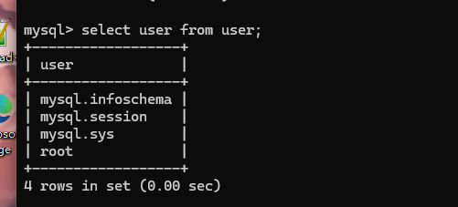

### 6.2 用户账号管理

对于对表的操作可以使用insert来操作，但是为了安全不建议这样使用，可以参考以下

#### 1：新增用户

```sql
#语法
CREATE USER [user_name] IDENTIFIED BY [user_pwd];
#example:
CREATE USER zhangsan IDENTIFED BY '12323';
```

#### 2: 修改用户名

```sql
RENAME USER [user_name] TO [new_user_name];
#example:
RENAME USER zhangsan TO lisi;
```

#### 3: 修改用户密码

```sql
SET PASSWORD FOR [user_name] = PASSWORD('[new_pwd]');#PASSWORD对密码加密
#example
#不指定user_name,默认修改当前登入账号的密码
SET PASSWORD = Password('[new_pwd]');
#指定用户名
SET PASSWORD FOR lisi = passwrod('123212');
```

#### 4: 用户账号的删除

```sql
#删除用户账号语法
DROP USER [user_name];
#example
DROP USER lisi;
```

#### 5 ：用户权限控制

##### 1：查看用户权限

刚创建的用户无任何权限

```sql
SHOW GRANTS FOR [user_name];
```


图片显示无任何权限

##### 2：用户授权

```sql
#语法
GRANT [权限名称，比如select，delete...] ON [database.name].[table.name] TO [user name];
```

##### 3: 撤销权限

```sql
#用户权限
REVOKE [权限名] ON [数据库名].[表名] FROM [用户名]
```

### 7：索引

#### 7.1 什么是索引

**索引**：索引的出现其实就是为了提高数据查询的效率，就像书的目录一样

MySQL在查询方面主要就是两种方式：

1. 全表扫描（一个个挨个找）
2. 根据索引检索

#### 7.2 索引操作

##### 1 创建索引

```sql
create index 索引名 on 表名(列名);
#可以有多个列名构成索引（组合索引）
```

##### 2 删除索引

```sql
drop index 索引名 on 表名;
```

#### 7.3 查看一个SQL语句是否使用索引进行检索

在SQL语句前，添加explain关键字

- 当type=ALL时，表示使用全表查询（未使用索引）
- 当type=RES时，表示使用了索引

#### 7.4 索引有哪些类别

- **按[数据结构]分类**：B+tree索引，Hash索引，Full-text索引。
- **按[物理存储]分类**：聚簇索引（主键索引），二级索引（辅助索引）
- **按[字段特性]分类**：主键索引，唯一索引，普通索引，前缀索引
- **按[字段个数]分类**：单列索引，联合索引。

##### 1.按[数据结构]分类

**哈希表**：使用key-value对，存储数据，可能存在hash冲突问题（多个value对于一个key）

- 优点：key无序的，插入数据无需维护顺序（尾部追加数据即可），效率高
- 缺点：无序，做区间查询时效率低
- 适用场景：适用于只有等值查询的场景，而不适用于频繁区间查找（一个个找，比如where id =1这种而不是where id <2 or id >3）

**有序数组**：

- 优点：等值查询和区间查询性能都很好（有序数组很适合查询）
- 缺点：有序数组不适合频繁增/删记录的场景（确实，有序数组这种数据结果在增删的情况下确实不行）
- 等值查询使用二分查找（有序+顺序存储），事件复杂度为log(n);
- 区间查询先用二分查找“左边界”（不存在的适合，则找第一个比它大的记录），然后再向右扫描，直至大于右边界
- 适用场景：有序数组只适用于静态存储引擎，在等值和区间范围内查询，场景中的性能非常优秀

**二叉树搜索树**

- BST是为了保留了有序数组查询（二分，O(logn)）性能好的优点，同时解决“有序数组”不适合增删的缺点
- BST查询的时间复杂度：O(logN),但是，为了维持O(logN)的查询复杂度，就需要保持这个数是平衡二叉树
- **二叉树是搜索效率最高的**，但实际上大多数数据库存储却并不使用二叉树，其原因是，索引不止存在内存中，还要写到磁盘上，**为了保证效率，原则是尽可能的减少访问数据库的次数，所以一般不用二叉树**

**为了提高读取速率，减少访问硬盘的次数**，考虑N叉树，N取决于数据块的大小，**通过使用N叉树来降低树的高度，即减少读取磁盘的次数，提高查询的效率**

**N叉树特点：**

折中考虑了查询的性能和读取磁盘的次数，广泛应用于数据库的索引中

MySQL中，索引是在存储引擎层实现，而且不同的存储引擎的索引的工作方式并不一样。而即使多个存储引擎支持同一种类型的索引，其底层的实现可能不同。

**InnoDB的索引模型**：

**InnoDB使用了B+树索引模型**，每个索引在InnoDB里面对应一棵B+树

不难看出B+树是N叉树的一种

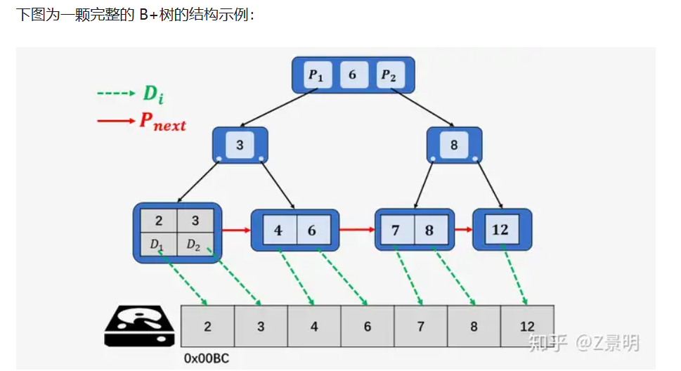

假设建表语句如下，则对应的2棵索引树（主键 自动创建一棵；字段k创建一颗索引树）

```sql
create table T
(
	id int primary key,#主键，自动创建索引
	k int not null,
	name varchar(16),
	index (k)
)#给字段k条件索引

engine= InnoDB;
```

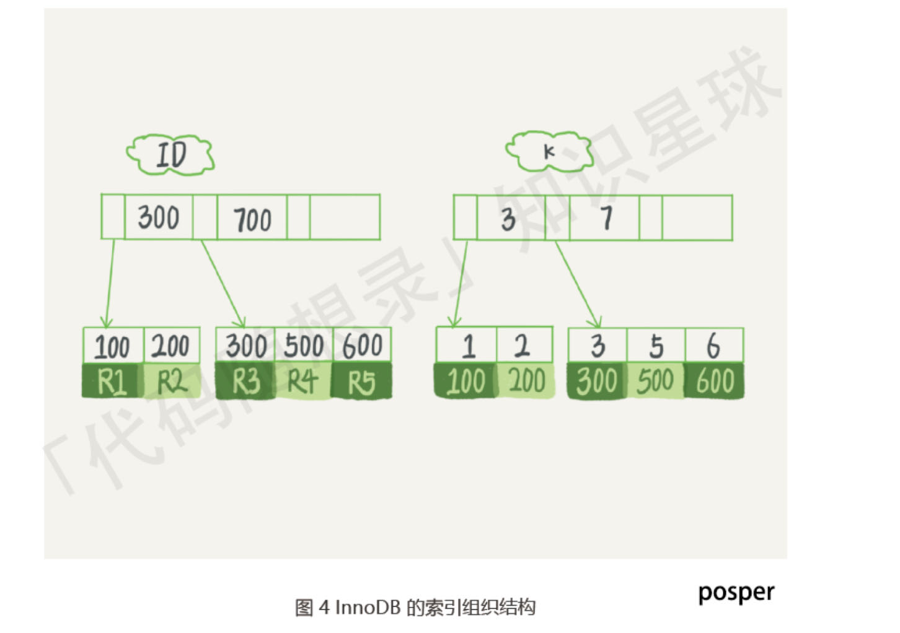

##### 2：按照存储分类

根据叶子节点的内容，索引类型分为主键索引（聚簇索引）和二级索引（辅助索引）

- 主键索引的B+Tree的叶子节点存放的是实际数据，所有完整的用户记录都存放在主键索引的B+tree的叶子节点里
- 二级索引的B+tree的叶子节点存放的是主键值，而不是实际数据

**主键查询和二级索引查询**

主键查询：直接在主键索引 所在的B+树中查询，然后直接返回查询到的叶子节点（此时，叶子节点里面就是整行记录）

二级索引查询：首先，在普通索引所在的B+树中，查询到待查询记录的 主键；然后再根据这些查到的主键执行主键查询（回表）

**基于非主键索引的查询需要多扫描一棵索引树，尽量使用主键索引**

如果当查询的数据能在二级索引的B+tree的叶子节点里查询到，这是就不再用主键索引去查，这种在二级索引的B+Tree就能查询到结果的过程就叫做【覆盖索引】

**基于覆盖查询索引可以减少树的搜索次数**，显著提升查询性能，**·**

##### 3：按照字段特性分类

- **主键索引**：**建立在主键字段上的索引，一张表最多只能有一个主键索引，不允许有空值**
- **唯一索引**：建立在UNIQUE字段上的索引，一张表可以有多个唯一索引，索引列的值必须唯一，但是允许有空值
- **普通索引**：建立在普通字段上的索引
- **前缀索引**：对字符类型字段的前几个字符建立的索引，而不是在整个字段上建立的索引，可以减少索引的大小，适用于较长列值的情况

##### 5：按照字段个数分类

- 单列索引：建立在单列上的索引称为单列索引，比如主键索引
- 联合索引：由多个列组合而成的索引。适用于多列的查询条件

#### 7.5：什么是最左匹配原则

通过将多个字段组合成一个索引，该索引就被称为联合索引

**使用联合索引时，存在最左匹配原则**，也就是按照最左优先的方式进行索引的匹配

**最左匹配原则要求查询条件中的列应该从索引的最左边的列开始**，并且不能跳过中间的列。如果查询条件不按照索引的顺序进行匹配，那么索引可能会失效

example：

```wiki
查询的例子：
有效利用索引：
WHERE A = 'a'
WHERE A = 'a' AND B = 'b'
WHERE A = 'a' AND B = 'b' AND C = 'c'
WHERE A = 'a' AND B = 'b' AND C = 'c' AND D = 'd'
无法有效利用索引：
WHERE B = 'b'（未包括A）
WHERE C = 'c'（未包括A和B）
WHERE B = 'b' AND C = 'c'（未包括A）
WHERE A = 'a' AND C = 'c'（跳过了B）
```

最左匹配时在遇到范围查询（如>,<）的时候，就会停止匹配，范围查询的子对岸可以用到联合查询（就相当于简单的索引，后面的条件就不再使用），但是后面的字段无法使用索引

example： 

```sql
#A,B,C三个列被联合索引
#有效做法
select * from table where A = 1 AND B=3 AND C>3;
#不那么好的做法
#最左匹配到A>1就停止了
select * from table where A>1 and B=2 and C= 3;
```

#### 7.6：索引下推

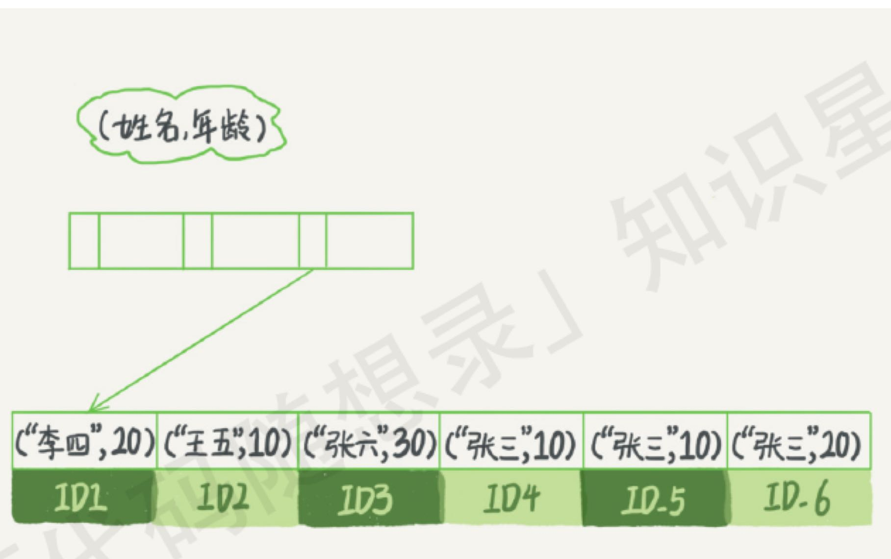

那些不符合最左前缀的部分

比如利用like+匹配符做前缀索引

```sql
select * from user
where name like '张 %'
and age = 10;
and ismale = 1;
```

前面我们提到了按照索引的存储方式分为两种主键索引和二级索引，提到了一个术语**”回表“**

对于找到了前缀为张的，通过它的ID回到表中再次索引也就是依附主键索引（前面提到过，二级索引要依附主键索引），5.6之前通过这种方式根据ID一个个回表，如图：

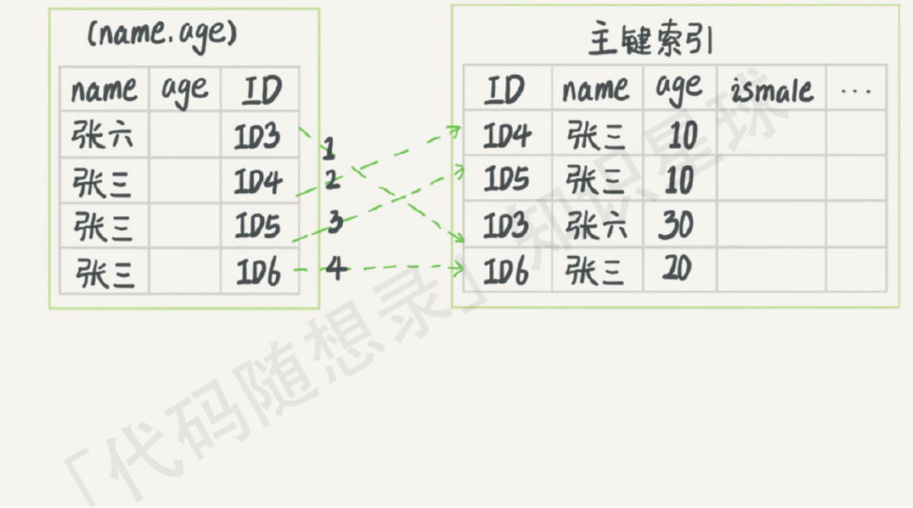

5.6后迎入了索引下推优化（之前还有覆盖索引）

**可以在联合索引遍历过程中，对联合索引中包含的字段先做判断，直接过滤掉不满足条件的记录，减少回表次数**

（先确认确定的字段，再找不确定的）

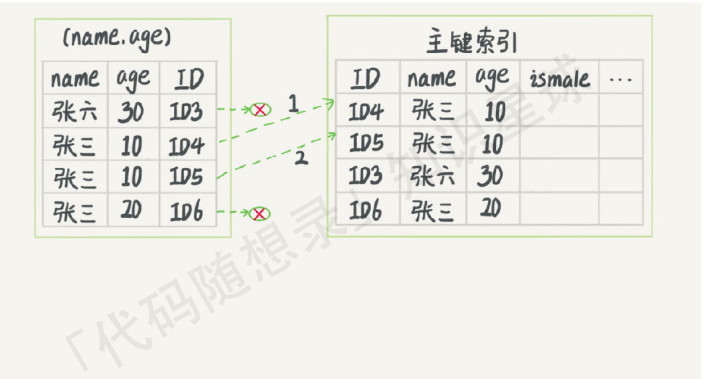

#### 7.7：索引区分度

索引区分度表示某个字段不同值得个数占整个表的比例，建立联合和索引时，要把区分度大的字段排在前面（这和很好理解，联合索引不喜欢最左边为是>.<）

#### 7.8: 建立索引的注意事项

- 索引不是越多越好的，虽然提高select效率，但是也降低了insert以及update的效率
- 数据量小的表不需要建立索引，会增加额外的索引开销
- 不经常使用的列不建立索引
- 频繁更新的列不要建立索引，会影响更新的效率

#### 7.9：索引的优缺点

优点：

- 使用索引可以大大加快数据的检索速度（大大减少检索的数据量），这是创建索引的主要原因
- 但是注意使用索引不一定能够提高查询的性能，因为如果数据的数据量不大，使用索引不到一定能带来很高的提升。其余大多数情况是比全表扫描要快
- 通过创建唯一性索引，可以保证数据库表中的每一行数据的唯一性。

缺点：

- 空间消耗，一个索引对应的就是一课B+树，每一个节点都是一个16KB大小的页。占用的空间较大。
- 创建索引和维护索引需要消耗许多时间，当对表中的数据进行增删改的时候，如果数据有索引，那么所有也需要动态的修改，会降低SQL执行效率

#### 7.10： 创建索引的时机（对着优缺点即可）


#### 7.11：索引优化的方法

- **前缀索引优化**：某字段中的字符串很大很长，就前几个字符建立索引即可
- **覆盖索引优化**：避免基于主键索引回表
- **主键索引最好自增的**
- 避免过多的索引

#### 7.12： 索引什么时候会失效

- 使用左或者左右模糊匹配：比如：like '%abc'这样会导致索引失效
- 在索引列上使用函数或者表达式:索引列上参与计算，索引失效
  - select * from table where UPPER(Column) ='VALUE';
- 在where子句中，or前的条件列是索引列，而在or之后条件列不是索引列失效
- 未被最左原则（联合索引遇到>,<停止往后）
- 数据分布不均匀
- 隐式类型转换：比如字符串和数字比较

#### 7.13： 为什么使用B+树索引

减少I/O操作

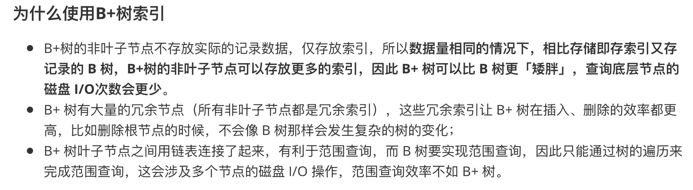

## 8：事务

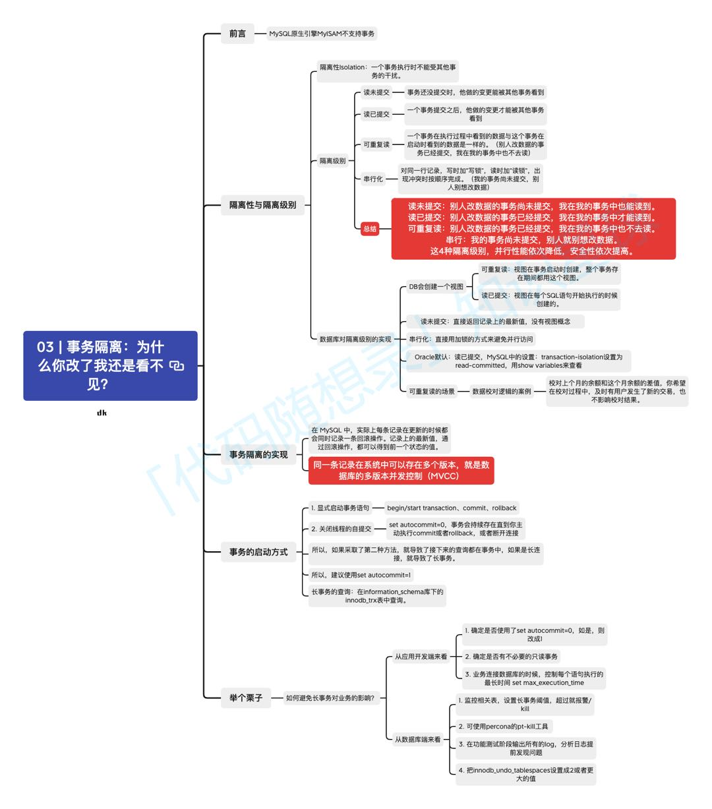

### 8.1 事务的四大特性ACID

**ACID：原子性，一致性，隔离性，持久性**

#### 1.原子性

事务是一个不可分割的工作单元，要么完全执行，要么完全不执行。如果在事务执行的过程中发生了错误，系统会撤销事务中已经执行的操作，将数据库恢复到事务开始前的状态（要么执行要么不执行）。原子性是通过undo log（回滚日志）来保证的。

#### 2.一致性

确保事务将数据库从一个一致性的状态转变为另一个一致的状态。事务执行的结果必须满足数据库的完整性约束和规则，保持数据库的一致性，一致性则通过持久性+原子性+隔离性来保证。

#### 3 隔离性

事务的执行不能被其他事务干扰。多个事务同时进行时，一个事务的执行不应该影响其他事务的执行。隔离性是通过MVCC（多版本并发控制）或锁机制来保证的

#### 4 持久性

一旦事务被提交，其结果将永久保存在数据库中，即使系统发生故障。即使系统发生崩溃，事务的结果也不应该丢失，持久性是通过reduo log（重做日志）来保证的。

### 8.2 并行事务会出现什么问题

并行事务是指多个事务同时执行，这可以提高数据库系统的性能和吞吐量。但是并行事务也可能引发一些问题

#### 1 脏读

**读到其他事务未提交的数据**

**一个事务读取了另一个事务未提交的数据，如果另一个事务后来回滚，读取的数据就是无效**。读到了并不一定最终存在的数据，这就是脏读

#### 2 不可重复

前后读取的数据不一致

**在一个事务内，同一查询可能返回不同的结果**，因为在事务执行期间其他事务可能修改了数据

#### 3 幻读

**前后读取的记录数量不一致**

在一个事务内多次查询某个符合查询条件的记录，如果出现前后两次查询到的记录数量不一样的情况，就意味着发生了幻读的现象

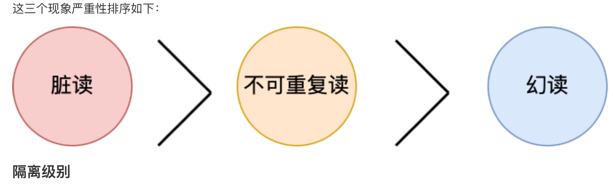

#### 4 隔离级别


##### 1 读未提交

最低的隔离级别，可能发生脏读，不可重复的以及幻读等问题

##### 2 读提交

这个级别下，一个事务只能读取到已经提交的其他事务的数据，解决了脏读的问题，但仍然可能遇到不可重复读的问题（一个事务不断提交数据）

##### 3 可重复读

这个级别下，一个事务在其生命周期内多次执行相同的查询，将始终看到相同的数据，但是仍可能发生幻读，也是MySQL InnoDB引擎的默认隔离级别；

##### 4 可串行化

提供了最高的隔离级别，会对记录加上读写锁，多个事务对这条记录进行读写操作时，如果发生了读写冲突时，后访问的事务必须等待前一个事务执行完成，才能继续执行，这种情况下事务的执行和串行一样，一个个执行，因此可能导致性能下降。

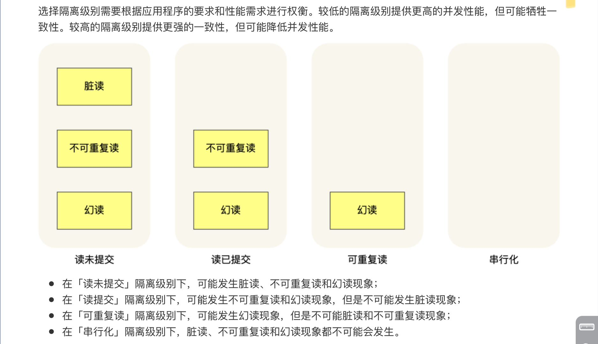

#### 5 幻读的解决

InnoDB引擎的默认隔离级别虽然是可重复的，它很大程度上避免了幻读现象，解决方案有两种：

- 针对快照（普通select语句），是通过MVCC方式解决了幻读
- 针对当前读：（select for update）是通过next-key lock（记录锁+间隙锁）方式解决幻读，实行该语句其他事务在next-key lock 锁范围插入

6 事务隔离的实现