# hot 100 与面试150+代码随想录

本人就是个脑残，笨b，有些算法刷了两遍以上还是忘记，加上之前笔记很乱，就重新开一篇

下面题目只针对于面试，笔试建议直接练acwing的题目或者直接练华为OD的题。好有就是算法真的很重要

# 1：数组字符串

## 1.1 双指针问题

### 1.1.1 leetcode 80

双指针（前前指针，指针的移动看情况）

[80. 删除有序数组中的重复项 II](https://leetcode.cn/problems/remove-duplicates-from-sorted-array-ii/)

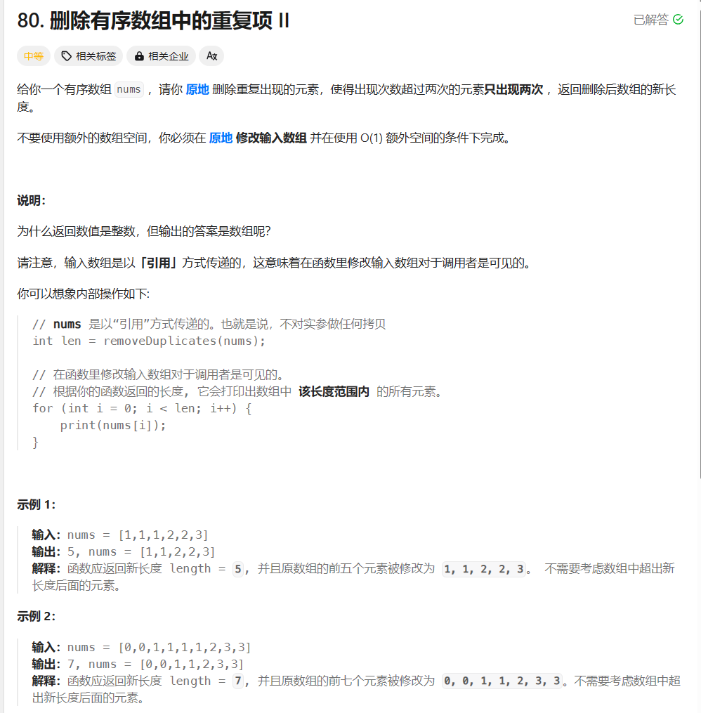

思路：有序数组

定义一个 i 从零开始（新的数组）

i<2.先将数组前两个确定

元素重复次数超过2的满足 nums[i-2] < num

```c++
class Solution {
public:
    // 不能有额外空间
    //不是正真意义上的删，只是重选
    int removeDuplicates(vector<int>& nums) {
        int i = 0;
        for(auto a : nums){
            //i<2可以先把前两个定下
            //i>2,就要拿当前num[i-2]和当前数组中的元素比较
            if(i<2 || nums[i-2]<a ){//只有次数超过2的不满足第二个条件
                nums[i++] = a;
            }
        }
        return i;
    }
};
```

### 1.1.2 leetcode 283

双指针（前前指针，指针的移动看情况）

[ 移动零](https://leetcode.cn/problems/move-zeroes/)

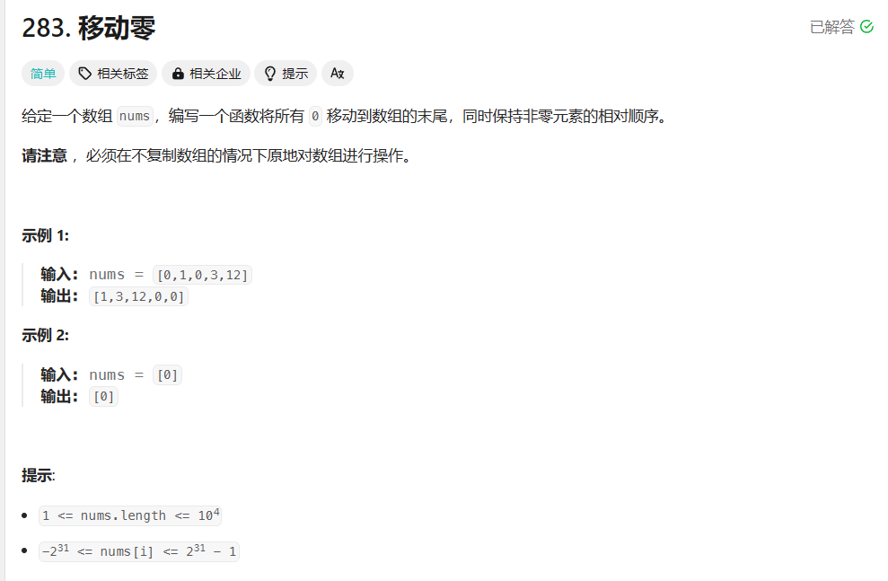

```c++
//思路很简单，利用双指针，j代表经过优化过数组的下标(在原数组上操作)，先将不为0的元素全部放到原数组的前面，再在j的基础上往j位置到末尾那段添零
//代码
class Soultion{
 public:
void moveZeroes(vector<int>& nums) {
    int j = 0;
    for(auto x : nums){
        if(a !=0 )nums[j++] = a;
    }
    for(;j<nums.size();j++)
        nums[j++] = 0;
}
};
```

**1.1.2 和 1.1.1 两道题的思路如出一辙** ，指针的移动是同向的

在面对对一维数组进行原地操作时，比如原地删除移动一些元素就可以用下面的通式

```c++
int j = 0; //原地操作，数组新的开头index
for(auto a : nums){ // 扫描原数组
    if(condition) //新数组满足的条件
        nums[j++] = a; //新数组的赋值
}	
```

### 1.1.3  leetcode 11

[盛最多水的容器](https://leetcode.cn/problems/container-with-most-water/)

双指针（前后指针）

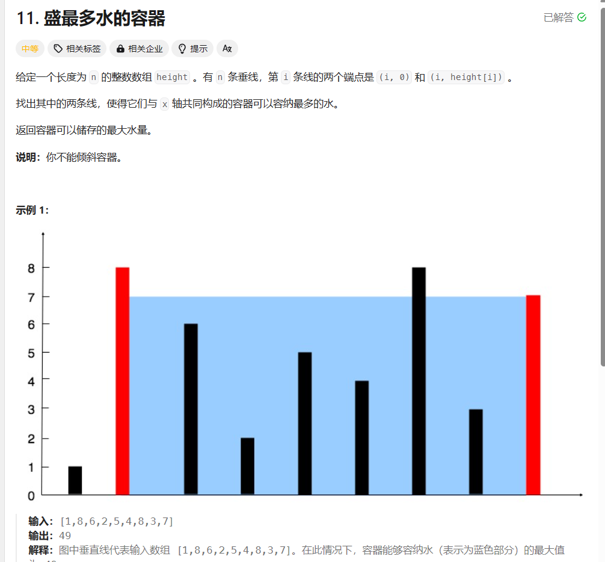

定义前后指针，接到水的最大值由最低高度决定，哪一边的高度低，就让那一边的指针移动，并且记入当前的最大值（目前为止）

```c++
class Solution {
public:
    int maxArea(vector<int>& height) {
        int n = height.size();
        int res = 0;
        for(int i = 0,j=n-1;i<=j;){
            if(height[i] < height[j]){
                res = max(res ,height[i]*(j-i));
                i++;
            }else{
                res = max(res,height[j]*(j-i));
                j--;
            }
        }
        return res;

    }
};
```

**相似题目：leetcode 42 ，接雨水问题**

不同点在于，接雨水要求总共接到的雨水数量:

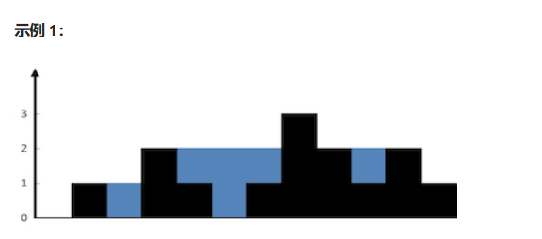

```c++
class Solution {
public:
    int trap(vector<int>& height) {
        int l = 0, r = 0;
        int n = height.size();
        int res = 0;
        for(int i = 0, j = n -1;i<j;){
            l= max(l,height[i]), r = max(r,height[j]);
            if(l <= r){
                // l 必须比 i+1位置的元素高才能蓄水，其实将问题切成一块一块的
                res += max(0, l - height[++i]);
            }else{
                res += max(0, r- height[--j]);
            }
        }
            return res;
    }
};
```

### 1.1.4 leetcode 15

[ 三数之和](https://leetcode.cn/problems/3sum/)

**双指针，一一确定三个数**

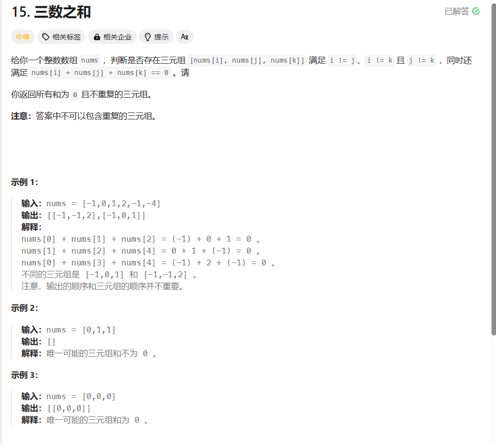

```c++
 class Solution {
public:
//通过排序，第一个元素就是当中最小的，第二个元素就是第二小的，最后一个元素就是最大，要想和为0
//先去控制最后一个元素,而后逐个确定前面元素，
    vector<vector<int>> threeSum(vector<int>& nums) {
        vector<vector<int>> res;
        int n = nums.size();
        sort(nums.begin(),nums.end());
        for(int i = 0;i<n;i++){
            if(i && (nums[i] == nums[i-1]))continue;
            for(int j = i+1,k=n-1;j<k;j++){
                if(j>i+1&&(nums[j-1] == nums[j])) continue;
                //记住这一步
                while(j<k-1 && (nums[i]+nums[j] +nums[k-1]) >= 0) k--;
                if((nums[i]+nums[j] +nums[k])== 0)
                    res.push_back({nums[i],nums[j],nums[k]});

            }

        }
        return res;
        
    }
};
```

### 1.1.5 letcode  3

[无重复字符的最长子串](https://leetcode.cn/problems/longest-substring-without-repeating-characters/)

哈希+双指针

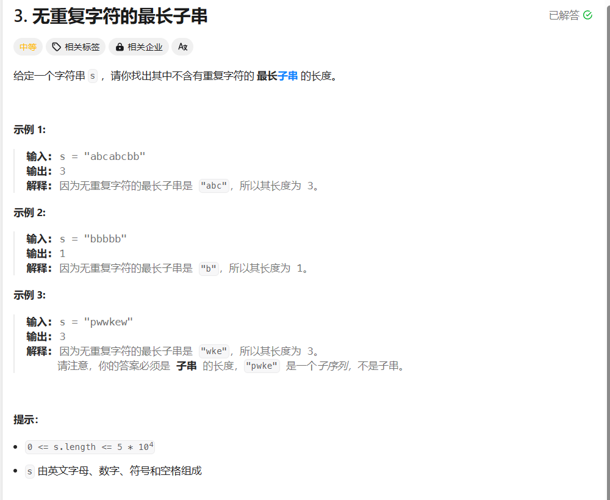

```c++
class Solution {
public:
    int lengthOfLongestSubstring(string s) {
        unordered_map<char, int>m;
        int res = 0;
        for(int i = 0,j=0;i <s.size();i++){
            m[s[i]]++;
            while(m[s[i]]>1)  m[s[j++]]--;//一旦出现重复，新的最大值不可能出现在中间，必然是从新的重复点开始，前面出现的要清空
            res = max(res,i-j+1);       
        }
        return res;


    }
};
```

### 1.1.6 leetcode 438

[找到字符串中所有字母异位词](https://leetcode.cn/problems/find-all-anagrams-in-a-string/)

哈希+双指针

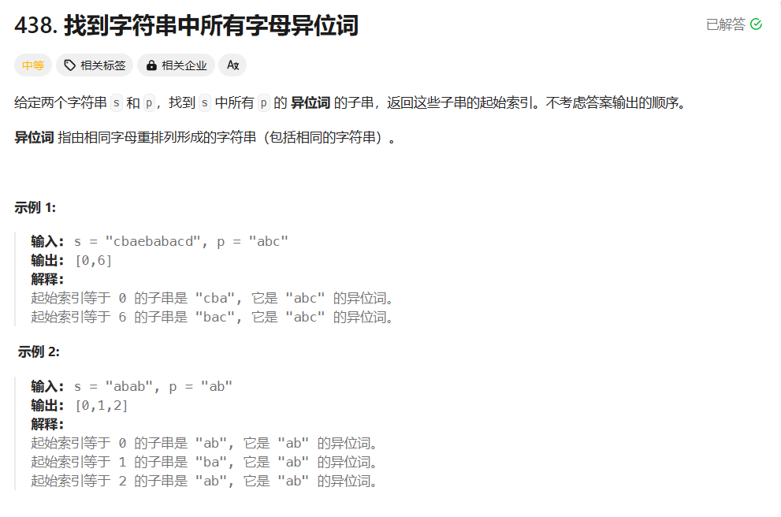

```c++
class Solution {
      //用哈希表来计入每个字符出现的次数
    //如果在一个区间内，哈希表某一个key的value变为0，则满足要求一次
    //当满足次数等于p的大小就满足要求
public:
    vector<int> findAnagrams(string s, string p) {
        unordered_map<char, int> cnt;
        for (auto c: p) cnt[c] ++ ;
        vector<int> res;
        int tot = cnt.size();
        for (int i = 0, j = 0, satisfy = 0; i < s.size(); i ++ ) {
            if ( -- cnt[s[i]] == 0) satisfy ++ ;
            if (i - j + 1 > p.size()) {
                if (cnt[s[j]] == 0) satisfy -- ;
                cnt[s[j]] ++ ;
                j++;
            }
            if (satisfy == tot) res.push_back(j);
        }
        return res;
    }
};

```


## 1.2 数组的旋转问题

### 1.2  leetcode 189

[189. 轮转数组](https://leetcode.cn/problems/rotate-array/)

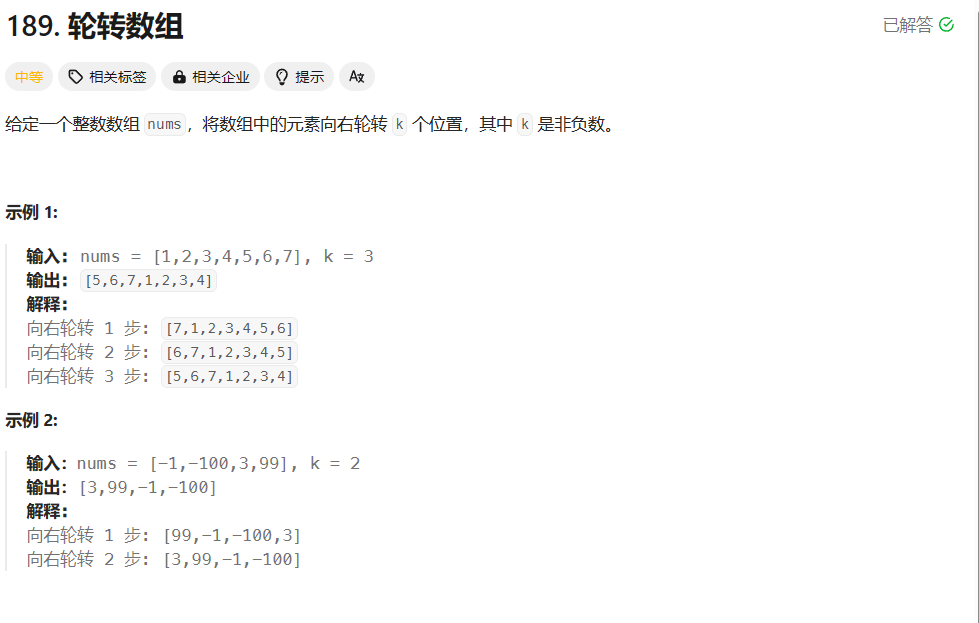

思路：k指的就是从倒数第k到末尾移到最前面去

先反转整体，再反转0-k，再反转k-nums.end

```c++
class Solution {
public:
    void rotate(vector<int>& nums, int k) {
        k %= nums.size();
         reverse(nums.begin(),nums.end());
          reverse(nums.begin(),nums.begin()+k);
           reverse(nums.begin()+k,nums.end());
    }
};
```

## 1.3 一维数组前缀和解决问题

**前缀和公式：**

```c++
vector<int> nums; //原数组
int n = nums.size();
vector<int> presum(n+1);//默认下标从1开始
for(int i = 1 ; i<=n;i++) presum[i] = presum[i-1]+nums[i-1];
```

### 1.3.1 leetcode 560

[和为 K 的子数组](https://leetcode.cn/problems/subarray-sum-equals-k/)

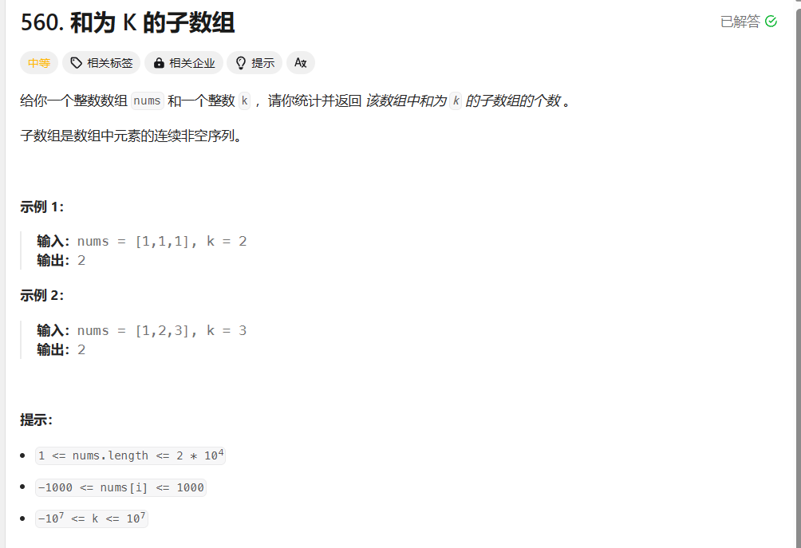

```c++
class Solution {
public:
    int subarraySum(vector<int>& nums, int k) {
        int n = nums.size();
        unordered_map<int,int>h;
        vector<int>sum(n+1);
        for(int i = 1;i<=n;i++) sum[i] = sum[i-1]+nums[i-1];//因为连续子数组所有前缀和适用
        h[0]=1;
        int res = 0;
        for(int i = 1; i<=n;i++){
            //对于连续子数组的和等价于前缀和，如果前缀和减去k，出现在哈希表中
            res += h[sum[i]-k];
            //记住这一步
            h[sum[i]]++;
        }
        return res;

    }
};
```

一个类似前缀和的做法的题目，前缀✖️不称当前位置

leetcode 238


```c++
class Solution {
public:
    vector<int> productExceptSelf(vector<int>& nums) {
        int n = nums.size();
        vector<int>p(n,1);
        //用于计算前缀乘（不含当前元素）
        for(int i = 1;i<n;i++) p[i] = p[i-1]*nums[i-1];
        for(int i = n-1,s=1;i>=0;i--){
            p[i] *=s;//s永远都是当前前缀和（不包含当前元素）后面元素的乘积
            s *= nums[i]; 
        }
        return p;
    }
};
```


# 4：矩阵

# 5：哈希表

# 6：区间与贪心

贪心与dp的不同：贪心和dp都是用于求结果的最值，但是贪心的状态变化成最优的局部过程是明确的，而dp不一样，一个点的状态可能是由多个状态而来

## 6.1 区间模型的贪心:

贪心的区间模型思路一般如下：

- 对于区间，一般会对区间进行排序，有可能以区间的左端点有可能以右端点，甚至可能这两个都会作为排序的条件
- 然后对于排序好的区间，之间通过前一个区间的右端点和后一个区间的左端点比较
- 如果第二步成功，则将右端点和后一个区间的右端点比较，且更新（根据题意）

### 6.1.1 leetcode 452

[用最少数量的箭引爆气球](https://leetcode.cn/problems/minimum-number-of-arrows-to-burst-balloons/)

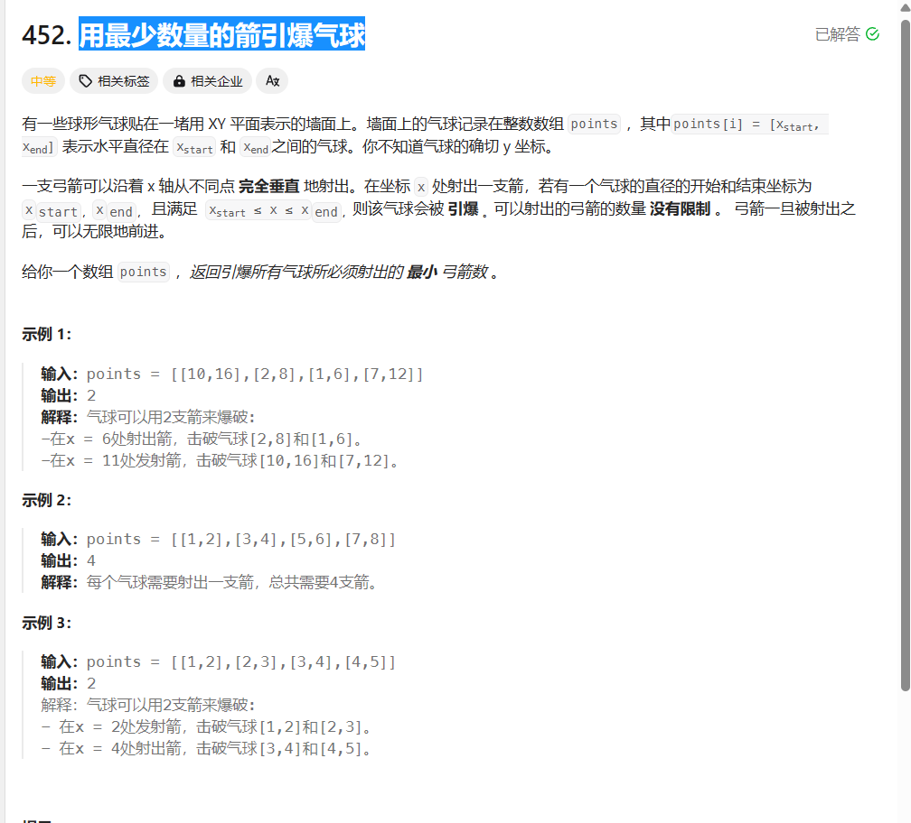


```c++
class Solution {
public:
    int findMinArrowShots(vector<vector<int>>& points) {
        int res=1;
        sort(points.begin(),points.end(),[](vector<int> &a,vector<int>&b){//以右端点排序
            return a[1]<b[1];
        });
        int x=points[0][1];
        for(int i=1;i<points.size();i++){
            //只有后一个区间的左端点大于前一个区间右端点，那么次数加一
            if(points[i][0]>x){
                res++;
                x=points[i][1];
            }

        }
        return res;

    }
};
```

### 6.1.2 leetcode 646

[最长数对链](https://leetcode.cn/problems/maximum-length-of-pair-chain/)

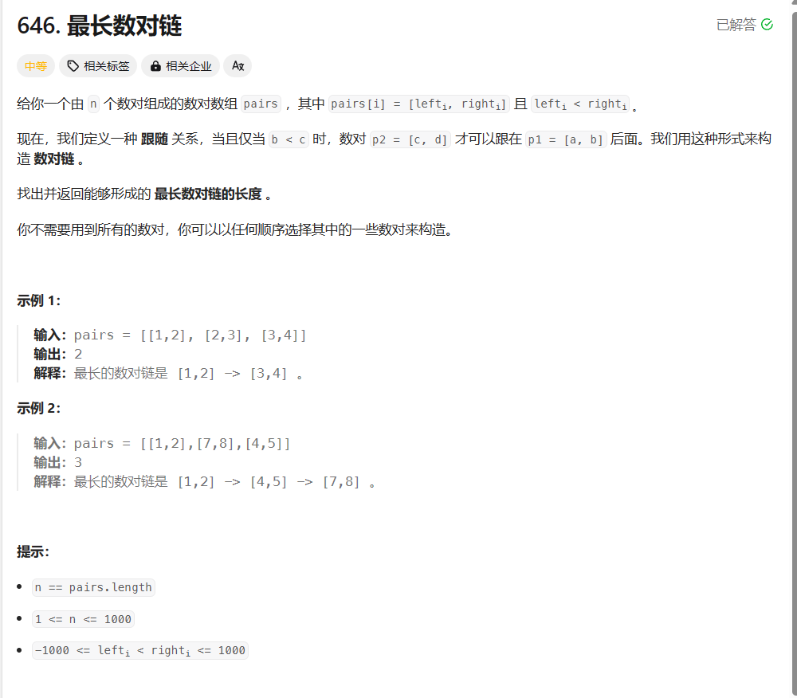

```c++
class Solution {
public:
//贪心模型，最多不相交区间，要从 i = 0 开始
    int findLongestChain(vector<vector<int>>& p) {
        sort(p.begin(), p.end(),[](vector<int>&a,vector<int>&b){
            return a[1] < b[1];
        });
        int res = 1,pre = p[0][1];
        for(auto &x:p){
            if(x[0]>pre){
                res++;
                pre=x[1];
            }
        }
        return res;

    }
};
```


## 6.2 一维数组中的贪心问题

### 6.2.1 leetcode 402

[移掉 K 位数字](https://leetcode.cn/problems/remove-k-digits/)

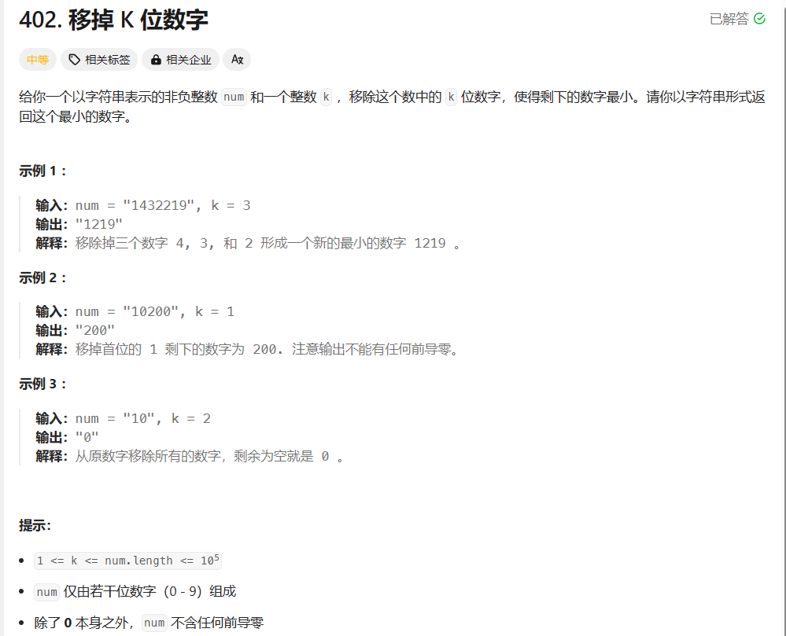

```c++
class Solution {
public:
////贪心
//只有当s[i-1]>s[i]时删除s[i-1]
//所以局部最优是知道的，所以用贪心而不是dp
    string removeKdigits(string num, int k) {
    int n = num.size();
    k  = min(n,k);
    string res; 
      for(auto c : num){
        while(k&&!res.empty()&&res.back()>c){
            k--;
            res.pop_back();
        }
        res += c;
      }
      while(k--) res.pop_back();
      k =0;
      while(k<res.size() && res[k] == '0') k++;
      if(k==res.size()) return "0";
      return res.substr(k,(int)res.size());
      
    }
};
```


# 栈

## 1 单调栈

1.1 leetcode 316

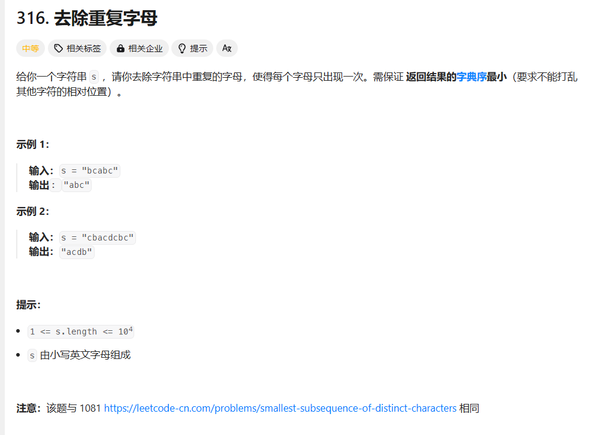

思路：贪心决策，当res的后面单词大于s[i],且res后面这个单词还在后面出现（去重）就可以把res后面的单词删掉，把s[i]加进去，且标记它进栈

时间复杂度 O(n)

```c++
class Solution {
public:
//贪心+栈
    string removeDuplicateLetters(string s) {
        unordered_map<char, int> last; //记入每个字母得最后位置
        string res;
        unordered_map<char,bool> st;//记入字符是否在res指针

        for(int i = 0;i<s.size();i++) last[s[i]] = i;
        for(int i = 0;i<s.size();i++){
            if(st[s[i]]) continue;
            //如果当前字符得后一个大于s[i]且这个元素后面还有就可以删除
            while(!res.empty() && res.back()>s[i] && last[res.back()] >i){
                st[res.back()] = false;
                res.pop_back();
            }
            res += s[i];
            st[s[i]] = true;
        }
        return res;

    }
};
```


# 7：链表

# 8：二叉树

# 9：图论

# 10：字典树

# 11：回溯

# 12：分治

# 13：二分查找

# 14：位运算

# 15：数学

# 16：动态规划

## 1： 买股票系列 [状态dp][线性dp] 【线性dp】

### 1.1leetcode 121

[买卖股票的最佳时机](https://leetcode.cn/problems/best-time-to-buy-and-sell-stock/)

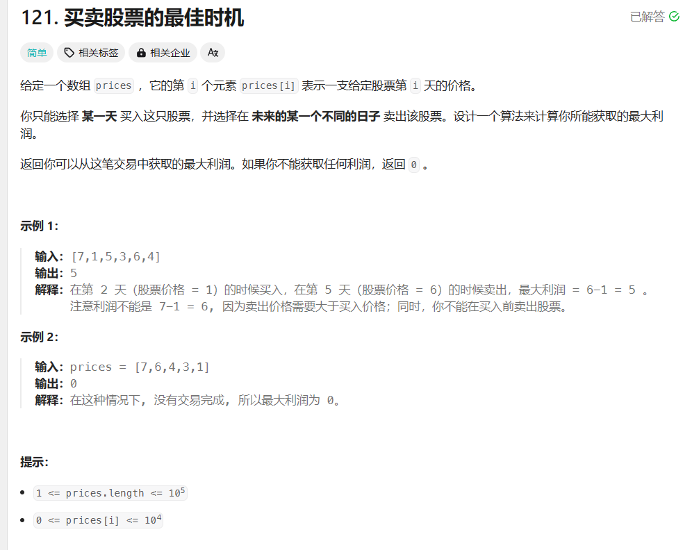

```c++
class Solution {
    //思路状态dp
    //两个状态买入与卖出，起始由0开始
    //状态转移:买入 -> 卖出, min(买入-》买入)
public:
    int maxProfit(vector<int>& prices) {
        int n = prices.size();
        vector<vector<int>> f(n,vector<int>(2)); //0代表买入，1代表卖出
        f[0][0] = -prices[0]; //第一天买入
        f[0][1] = 0;
        for(int i = 1;i<n;i++){
            f[i][0] = max(f[i-1][0],-prices[i]);//买入，只能和当天买入的股票价格比，只能由其他买入转过来
            f[i][1] = max(f[i-1][1],prices[i]+f[i-1][0]);//卖出，只能由买入转过来
        }
        return f[n-1][1];
    }
};
```

### 1.2 leetcode 122

[买卖股票的最佳时机 II](https://leetcode.cn/problems/best-time-to-buy-and-sell-stock-ii/)

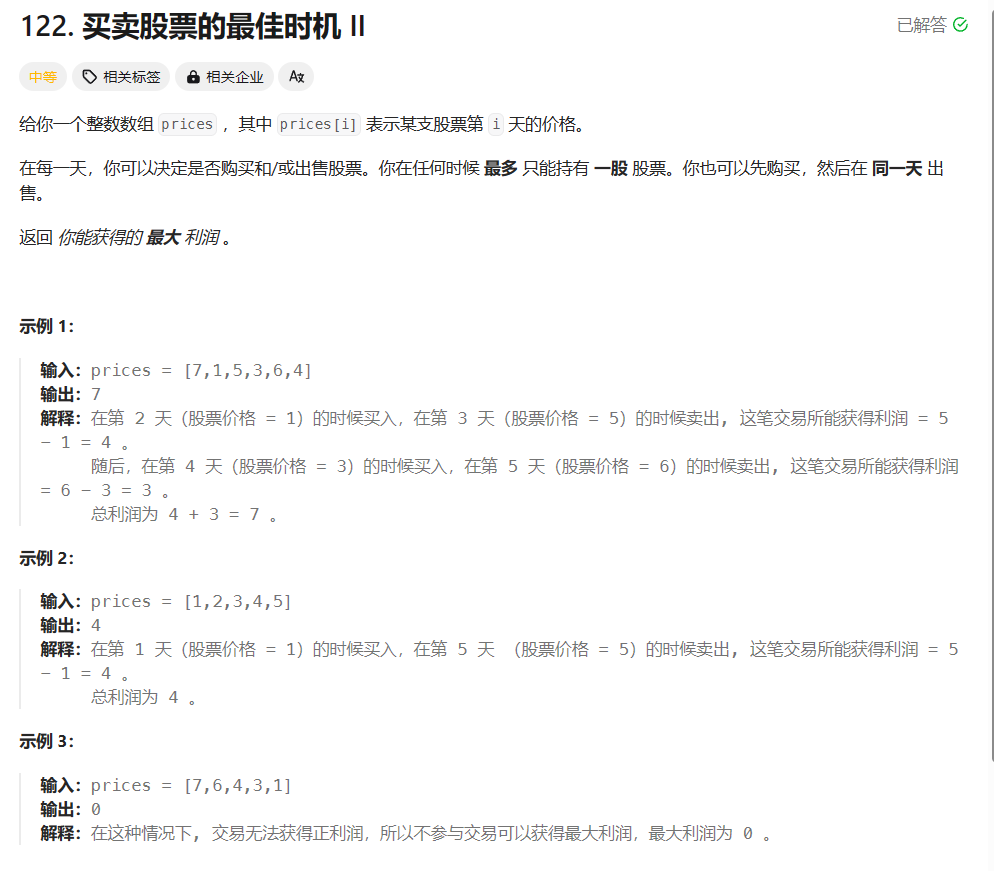

```c++
class Solution {
public:
    int maxProfit(vector<int>& prices) {
        int len = prices.size();
        //空间上优化
        vector<vector<int>> dp(2, vector<int>(2)); // 注意这里只开辟了一个2 * 2大小的二维数组
        // 0代表买入，1代表卖出
        dp[0][0] -= prices[0];
        dp[0][1] = 0;
        for (int i = 1; i < len; i++) {
            //和买股票一不同就是在买入状态可以由买入状态和卖出状态转换而来
            dp[i % 2][0] = max(dp[(i - 1) % 2][0], dp[(i - 1) % 2][1] - prices[i]);
            dp[i % 2][1] = max(dp[(i - 1) % 2][1], prices[i] + dp[(i - 1) % 2][0]);
        }
        return dp[(len - 1) % 2][1];
    }
};
```

### 1.3 leetcode 123

[买卖股票的最佳时机 III](https://leetcode.cn/problems/best-time-to-buy-and-sell-stock-iii/)

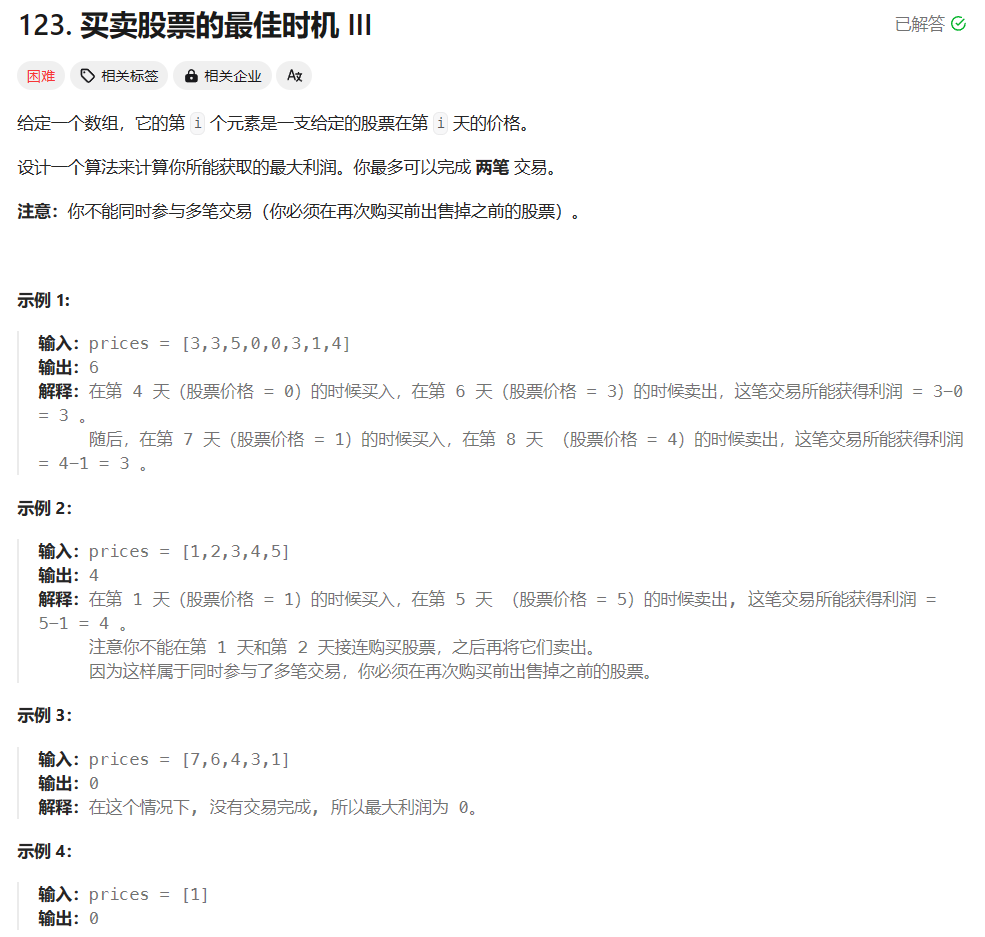

方法 1 ：前后缀分解法（枚举分割点）+ 动态规划

**前后缀分解法的套路：**

- 只适用于两次，什么交易两次。。。
- 两次之间无关系（覆盖），相互独立
- 第一次枚举，从前往后，得到分割点的最值，比如i,f[i]代表第i天的最值（大或小），也就是第一段的最值
- 第二次枚举从后往前，第二次的最值加上分割点的最值（i-1）就是整体的最值

**两次交易都是独立的**

```c++
class Solution {
public:
// f[i]代表第i天的最大利润 由max(f[i-1],和当天股票价格减最小股票价格)比较得来
    int maxProfit(vector<int>& prices) {
        int n = prices.size();
        vector<int> f(n + 2);
        for (int i = 1, minp = INT_MAX; i <= n; i ++ ) {
            f[i] = max(f[i - 1], prices[i - 1] - minp);
            minp = min(minp, prices[i - 1]);
        }
//第二次交易
//从后往前枚举
//res=max(枚举出哪天的股票价格最高（卖出）然后减去当天（买入）+ 第i-1天内最高利润)
        int res = 0;
        for (int i = n, maxp = 0; i; i -- ) {
            res = max(res, maxp - prices[i - 1] + f[i - 1]);
            maxp = max(maxp, prices[i - 1]);
        }

        return res;
    }
};

```

方法二：通法，常规动态规划

由

两个状态变四个状态，buy1，sell1，buy2，sell2 ，后两个状态必须依靠sell1的状态最值来完成

```c++
class Solution {
public:
    int maxProfit(vector<int>& prices) {
        int lar = INT_MIN;
        int buy1 = lar, sell1 = 0, buy2 = lar, sell2 = 0;
        int n = prices.size();
         for(int i = 0; i<n ;i++){
            buy1 = max(buy1,-prices[i]);
            sell1 = max(sell1,buy1+prices[i]);
            buy2 = max(buy2,sell1 -prices[i] );
            sell2 = max(sell2,buy2+prices[i]);
         }
         return sell2;

    }
};
```

### 1.4 leetcode 309

[买卖股票的最佳时机含冷冻期](https://leetcode.cn/problems/best-time-to-buy-and-sell-stock-with-cooldown/)

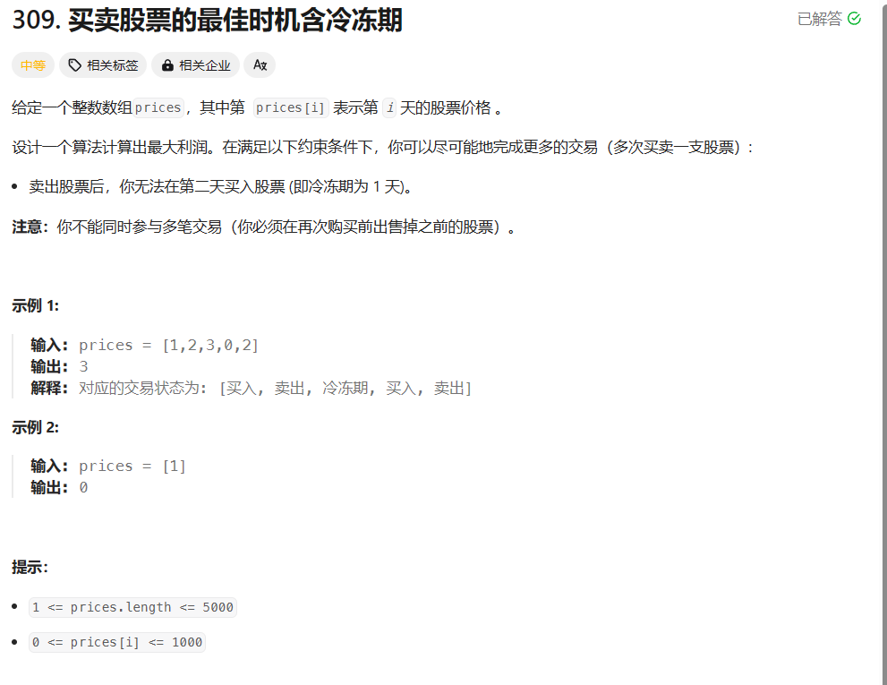

这道题的思路,就是从之前的两个状态加了一个冷冻状态

得到状态方程vector<vector<int>>f(n,vector<int>(3))

状态 ：0 冷却期， 1：买入  2：卖出

状态转移：买入->卖出 ，卖出->冷却，冷却->买入

两个初始状态：f[0] [0]冷却 ，f[0] [1]买入

```c++
class Solution {
public:
    int maxProfit(vector<int>& prices) {
        int n = prices.size();
        vector<vector<int>>f(n,vector<int>(3));
        f[0][0] = 0;
        f[0][1] = -prices[0];
        for(int i = 1;i<n;i++){
            f[i][0] = max(f[i-1][0],f[i-1][2]);//冷却期由冷却和卖出转换而来
            f[i][1] = max(f[i-1][0]-prices[i],f[i-1][1]);//买入只能由冷却期和买入期转换而来
            f[i][2] = max(f[i-1][1]+prices[i],f[i-1][2]);//卖出期只能由买入期转换而来
        }
            return f[n-1][2];
    }
};
```

## 2 线性dp

### 2.1 leetcode 53

[最大子数组和](https://leetcode.cn/problems/maximum-subarray/)

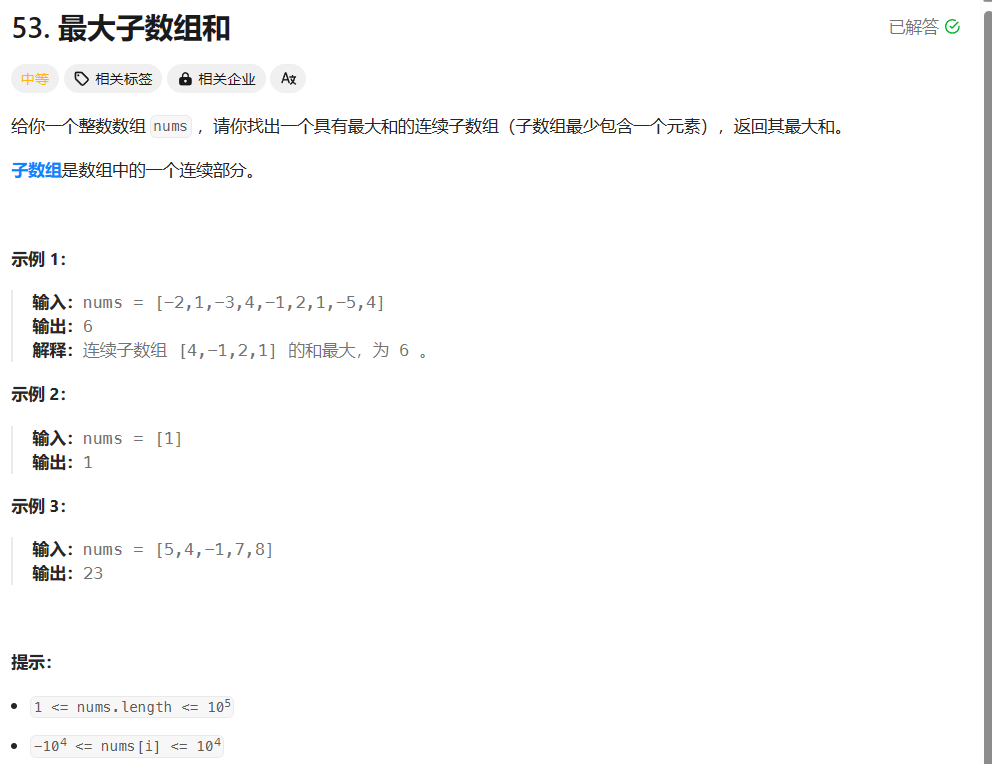

```c++
class Solution {
public:
    int maxSubArray(vector<int>& nums) {
        int res = INT_MIN;
        int last = 0;
        int n  = nums.size();
        for(int i = 0;i<n;i++){
            //前一个last不为0的化，有可能和nums[i]生成最大的值
            last = nums[i]+max(last,0);
            res= max(res,last);//维护当前最大的值
        }
    return res;
    }
};
```

### 2.2 leetcode 300

[最长递增子序列](https://leetcode.cn/problems/longest-increasing-subsequence/)

这道题重点就是每个点i为结尾时，初始化都得先为0

状态方程：当nums[j]<nums[i]时，f[i] = max(f[i],f[j]+1)

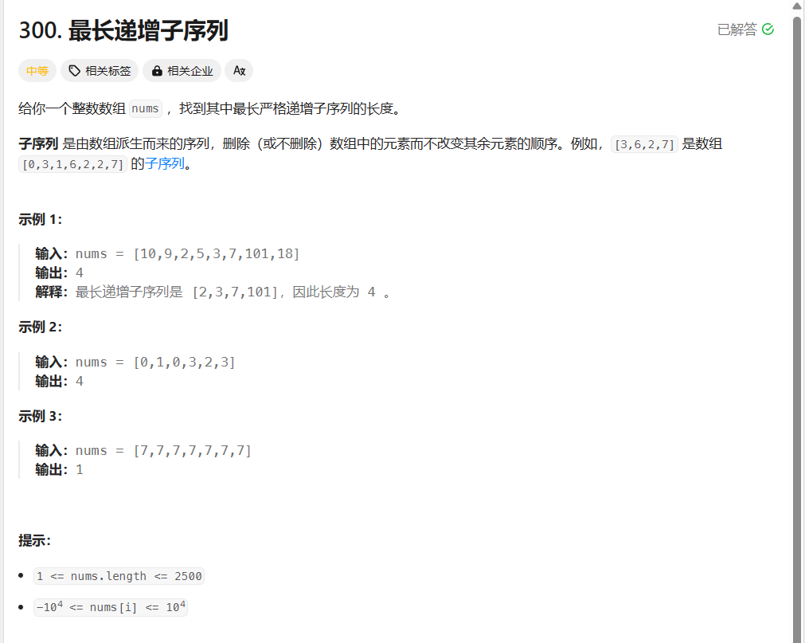

```c++
class Solution {
public:
//题目不是要递增的子区间
//状态f[i]，代表以i为结尾的最大升序子序列
//由于每个点都有可能被枚举到所以f[i]初始为1，作为末尾
//j代表i之前的index，且f[j]代表之前j为结尾的最大
//当nums[j]<nums[i]时，f[i] = max(f[i],f[j]+1)
    int lengthOfLIS(vector<int>& nums) {
        int n = nums.size();
        vector<int> f(n);
        int res = 1;
        f[0] = 1;
        for(int i =1;i<n;i++){
            f[i] = 1;
            for(int j =0;j<i;j++){
            if(nums[i] >nums[j])
                f[i] = max(f[i],f[j]+1);
            }  
            res = max(res, f[i]);  
        }
        return res;

    }
};
```

