# 计算机网络

**引导：*****在浏览器输入URL并按下回车之后会发生什么****

1. 输入URL并解析，浏览器解析出协议，主机端口等信息，构造一个HTTP请求（浏览器会根据请求偷判断是否有HTTP缓存，来判断获取资源是从服务器中得来还是本地缓存等）
2. DNS域名解析，将域名解析成对应的IP地址
3. 建立TCP三次握手，由于应用层基于HTTP协议，在HTTP3之前运输层都是采用TCP，TCP是面向连接的。
4. 浏览器发送HTTP/HTTPS请求到web服务器中
5. 服务器处理HTTP请求并返回HTTP报文
6. 浏览器渲染页面
7. 断开连接TCP四次挥手

**补充URL的组成：**

1. **协议（Scheme）**：指明了用于访问资源的协议类型。常见的协议有HTTP（超文本传输协议）、HTTPS（HTTP加密版）、FTP（文件传输协议）等。例如，在URL `http://example.com` 中，`http` 就是协议。
2. **主机名（Host）**：指互联网上的服务器域名或IP地址。它告诉浏览器资源所在的主机位置。例如，在URL `http://example.com` 中，`example.com` 是主机名。
3. **端口号（Port）**：（可选）服务器上特定服务的访问端口。HTTP默认端口是80，HTTPS默认端口是443。如果使用默认端口，通常不会在URL中显示。例如，`http://example.com:8080` 中的 `8080` 表示端口号。
4. **路径（Path）**：指向服务器上资源的具体位置。它通常映射到服务器上的一个文件或文件夹。例如，在URL `http://example.com/index.html` 中，`/index.html` 是路径，指向服务器上名为 `index.html` 的文件。
5. **查询字符串（Query）**：（可选）以键值对形式存在，用于传递额外参数给服务器。它们通过问号（`?`）开始，并且键值对之间通过和号（`&`）分隔。例如，`http://example.com/search?q=example` 中的 `q=example` 是查询字符串，表示查询参数是 `q`，其值是 `example`。
6. **片段标识符（Fragment）**：（可选）通过井号（`#`）引入，用于指向资源内部的一个锚点，即页面中的具体位置。浏览器通过片段标识符直接跳转到页面的指定部分。例如，在URL `http://example.com/index.html#content` 中，`#content` 是片段标识符，指向页面中 `id="content"` 的元素。

# 1 ：应用层的协议

## 1.1 DNS

DNS的定义：一种将域名转换成IP地址的分布式系统

DNS：基于运输层的UDP协议

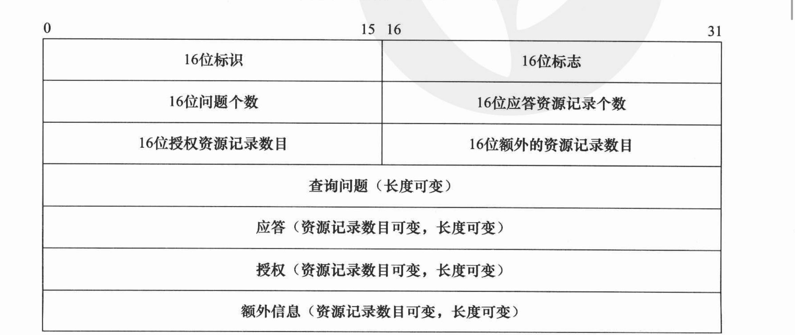

### 1.1.2**DNS服务器如果采用集中式的设计会引发的问题**

1. 单点故障 ：如果DNS服务器崩溃，那么整个网络随之瘫痪。通信容量，单个DNS服务器不得不处理所有的DNS查询，这种查询级别可能是上百万级别的。
2. 远距离集中式数据库：单个DNS不可能临近所有的用户。
3. 维护：维护成本巨大，而且还需要频繁更新

### 1.1.3 域名层级关系

原则：在域名中，越靠右边其层级越高。

example： www.server.com

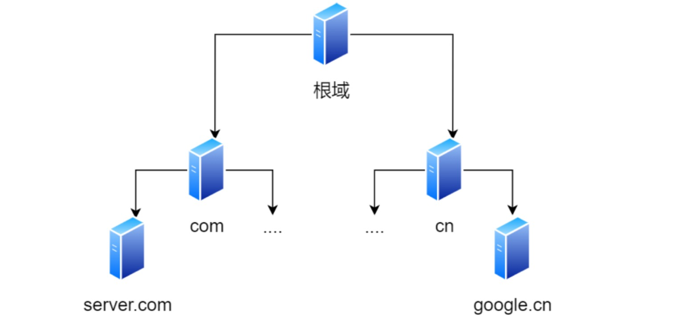

### 1.1.4 DNS解析过程

1. 先查询浏览器缓存是否有该域名对应的IP地址
2. 如果浏览器中无，就回去本地的HOST文件中查询
3. 如果没有，则向本地的DNS服务器（ISP提供），如果找到直接返回
4. 如果没有则向根DNS服务器发出查询请求，他不负责解析，而是告诉哪个顶级的服务器可能有
5. 本地的DNS解析器接着向指定的顶级域名DNS发送查询请求
6. 查询到后把结果返回给浏览器，并且把结果，存放到浏览器的缓存中，以便下一次
7. 浏览器得到解析结构后，发起连接

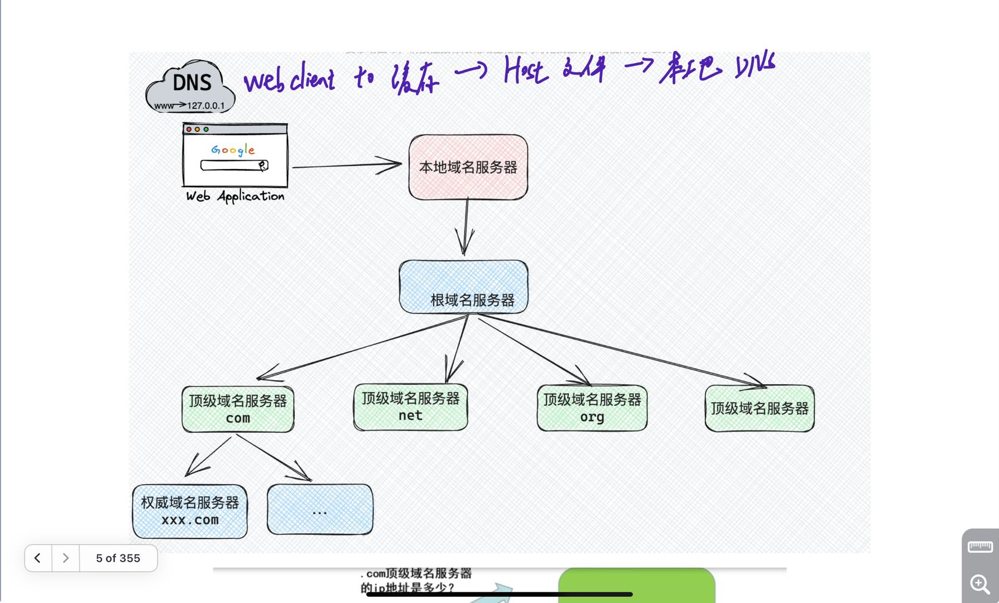

### 1.1.5递归查询和迭代查询

1. 递归查询：逐个向上询问（和递归一样），一一返回问答结果
2. 迭代查询：踢皮球的形式，询问一个，没找到就让请求别的服务器去
3. 递归适合普通用户和客户端，而递归适用于DNS服务器之间的通信

## 1.2 HTTP协议

HTTP协议的特征： 简单，灵活，已于扩展，应用广泛和跨平台

### 1.2.1 特征

- 简单：基本报文格式header+body，头部信息也是key-value简单文本的形式，易于理解。
- 灵活和易于扩展
  - HTTP协议各自请求方法，URL/URI，状态码等都不是固定死的，允许开发人员自定义和扩充
  - HTTP工作在应用层，下层可以随意变化
  - HTTPS就是在HTTP与TCP之间增加了SSL/TSL安全传输层
- 无状态，明文传输，不安全
  - 无状态：服务器不会记忆HTTP的状态，所以不需要额外的资源来记入状态信息，能减轻服务器的负担
    - **对于无状态的问题，可以使用cookie技术**，通过在请求和响应报文中写入cookie的信息来控制客户端的状态
  - 明文传输：传输过程中的信息，是可方便阅读的，信息透明，容易被窃取
  - 不安全
    - 使用明文传输，内容可被窃听
    - 不验证通信的身份，因此有可能遭遇伪装
    - 无法验证报文的完整性，所以有内容可能已经恶意修改

### 1.2.2 HTTP版本的演变

目前为止，http常见的版本有HTTP/1.1,HTTP/2.0.HTTP/3.0,不同版本的HTTP特征是不一样的。

#### **HTTP/0.9只支持get方法**

#### **HTTP/1.0：HTTP/1.0是HTTP协议的第一个正式版本，拥有以下特征**

- 引入请求头和响应头，支持多种请求方法和状态码
- 不支持持久连接，每次请求都学要建立新的连接

#### HTTP/1.1

##### 1：长连接

**HTTP/1.1提出了长连接（持久连接），只要客户端和服务器任意一端没有明确提出断开连接，则保持TCP连接状态**

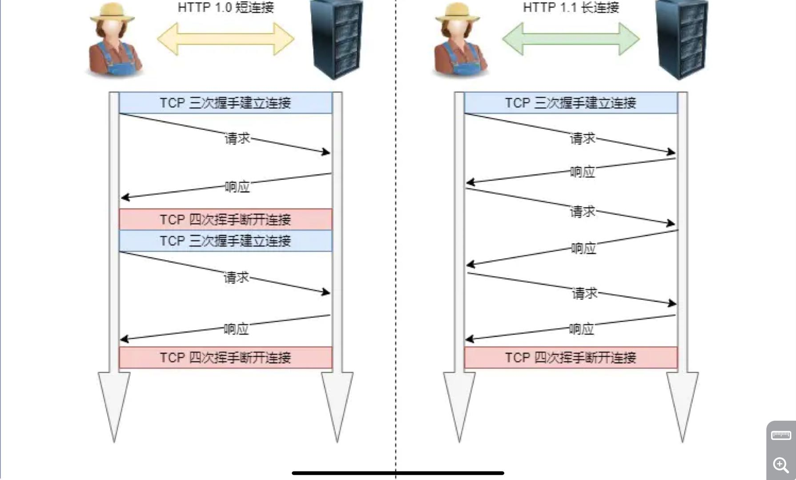

##### 2：**管道网络传输**

在**同一个TCP连接里面，客户端可以发起多个请求，只要第一个请求发出去了，不必等其回来，就可以发送第二个请求，减少整体的响应时间**

**但是服务器必须按照接收请求的顺序发送对这些管道化请求的响应**，HTTP/1.1管道解决了请求的队头阻塞，但是没有解决响应的队头阻塞。

##### 3：队头阻塞

当顺序发送请求序列中一个请求因为某种原因被阻塞，导致后面排队的所有请求都会被同一阻塞，导致客户端一直收不到请求。

对于HTTP/1.1之前的，一般发生在客户端和服务端，因为发送和接收要一一对应（一条信息一条信息的处理）

对于HTTP/1.1而言，队头阻塞只会发生在服务响应上，因为发送端可以连续发送信息，但是服务端得按顺序响应。

##### 4：HTTP/1.1存在的问题

- 头部繁重：每个请求和响应都需要带有一定的头部信息，每次互相发送相同的首部造成浪费
- 服务器是按请求的顺序响应，会造成队头阻塞
- 没有请求优先级控制
- 请求只能从客户端开始，服务器被动响应

#### HTTP/2

HTTP/2协议基于HTTPS的，所以HTTP/2是安全的

HTTP/2很好的兼容了HTTP/1.1

- HTTP/2没有在url中引入新的协议名，
- 只在应用层做了改变，还是基于传输层的TCP协议

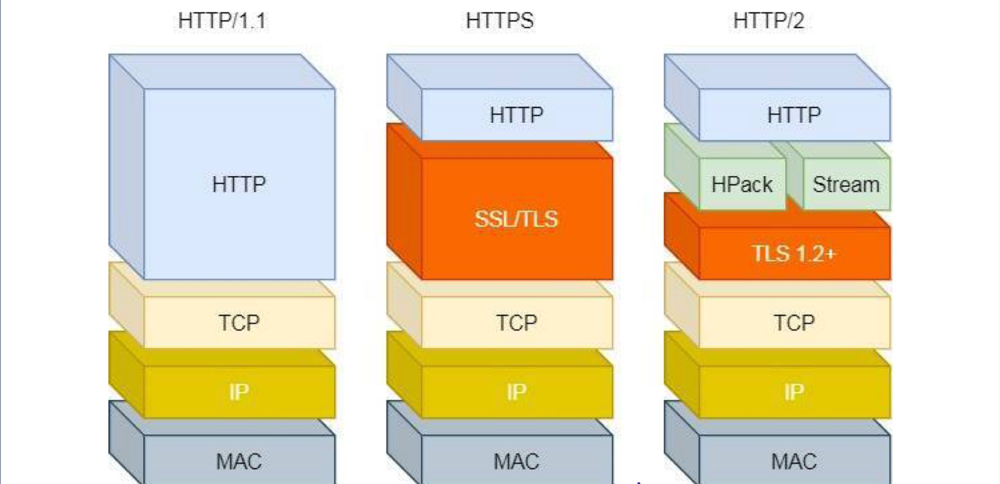

##### HTTP/2采用的技术

1. 头部压缩：采用HPACK压缩算法对请求和响应头部进行压缩，减少传输头部数据量，降低延迟
2. 二进制帧：HTTP/2将数据分割成二进制帧进行传输，分为头部信息帧（Headers Frame）和数据帧（Data Frame），增加数据传输的效率
   - 其实就是将原来的应用层的数据，压缩，减少传输体积
3. 并发传输：引出Stream概念，多个Stream复用一条TCP连接，针对不同的HTTP请求用独一无二的Stream ID来区分，接收端通过stream ID来组装HTTP信息
4. 服务器推送，服务器可以额外的向客户端推送资源，而无需客户端明确请求

**HTTP/2仍然存在队头阻塞的问题**，**问题的发生是在传输层**

HTTP/2是基于TCP协议来传输数据的，TCP是字节流协议，**TCP保证了收到的数据是准确的，完整的，顺序正确的，才会将内核接收缓存区的数据取出返回给HTTP应用。**

##### HTTP/1.1协议的性能问题

- 浪费带宽，不支持服务器的推送（请求什么就返回什么，如果请求的东西少）
- 头部繁重，造成浪费
- 并发数量有限，每个连接都会使得内核产生接收缓冲区，使得内核繁重
- 队头阻塞，发生在响应（应用层）

##### 解决HTTP/1.1性能问题的手段

- 将同一个页面资源分散到不同的域名，提升并发上限
- 将多个体积小的javascript文件使用webpack等工具打包成一个体积更大的javascript文件

##### 头部压缩

###### HTTP1.1报文的header部分存在问题

- 含很多固定字段
- 大量请求和响应的报文里很多字段是重复的，要避免重复性
- 字段基于ASCII编码，传输效率低，所以有必要改成二进制编码

###### HTTP/2对于头部的改造：

使用HPACK算法压缩头部，HPACK算法包含三个组成部分

1. 静态字典
2. 动态字典
3. huffman编码（压缩算法）
   - 基于大根堆，频率最高的出现在头部

客户端和服务器都会建立和维护一个字典，用长度较小的索引号表示重复的字符串，再用Huffman编码压缩数据

对于头部而言，就是对头部的字段建立key-value的映射，使得之间的字段采用更小字节的来代替，双方通过查表来解析

##### 二进制帧

**HTTP/2厉害在于将文本格式改成二进制格式传输数据**，**极大提高HTTP传输效率**，而且二进制数据**采用位运算能高效解析**

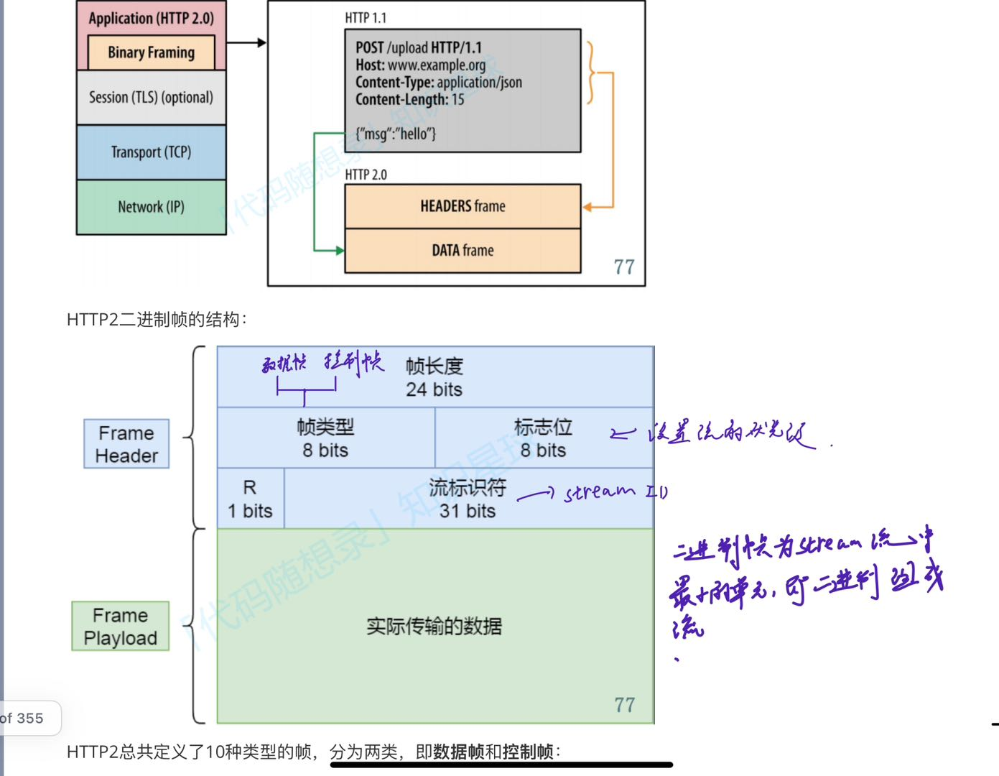

HTTP2总共定义了10类型的帧，分为两类，即数据帧和控制帧

流标识符（Stream ID）：标识该帧属于哪一个stream，接收方可以根据这个信息从乱序的帧里找到相同的stream ID，从而有序组装

帧数据：就是实际传输的内容

##### 并发传输

###### 1：HTTP1.1 与 HTTP2的比较

HTTP1.1基于请求-响应模型。HTTP完成一个事务（请求和响应），才能处理下一个事务，（即使HTTP1.1使用了管道技术，也只是发送端可以连续发送请求，但是服务端仍然需要对应处理请求），会造成队头阻塞问题

HTTP2通过Stream这个设计（多个Stream复用一条TCP连接，达到并发的效果（个人认为对于应用层而言是通过一条TCP连接）)，解决了队头阻塞（仅仅在应用层而言），提高了HTTP传输的吞吐量。

###### 2： HTTPS的并发实现

HTTP2复用一条TCP连接可以这样理解，多个stream可以共享一个TCP连接，stream上由多个frame组成，也就是它不需要像HTTP/1.1那样，客户端想要建立新的连接需要重新建立新的连接，但是HTTP/2不需要，它的新连接可以用上一次的TCP连接

而且在应用层不会发生队头阻塞，提高了并发，增加了吞吐量。

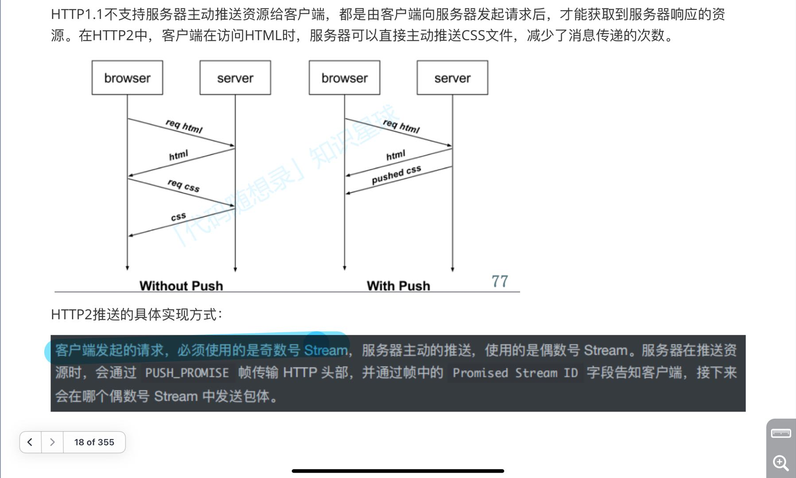

HTTP2协议还包括：流控制，流状态，依赖关系等。

#### HTTP/3

HTTP/3基于QUIC协议，具备以下特点：

- 零RTT连接建立：quic允许在首次连接时进行零往返时间连接建立，从而减少了连接延迟，加快了页面加载速度
- 无队头阻塞：**quic使用UDP协议来传输数据**，一个连接上的stream之间没有依赖。
- 连接迁移：**quic允许在网络切换时，将连接迁移到新的IP地址，从而减少连接的中断时间**
- 向前纠错机制：每个数据爆除了本身的内容之外，还包括了部分其他数据包的数据，因此少量的丢包可以通过其他包的数据直接组装而无需重传（**减少丢包的重传**）

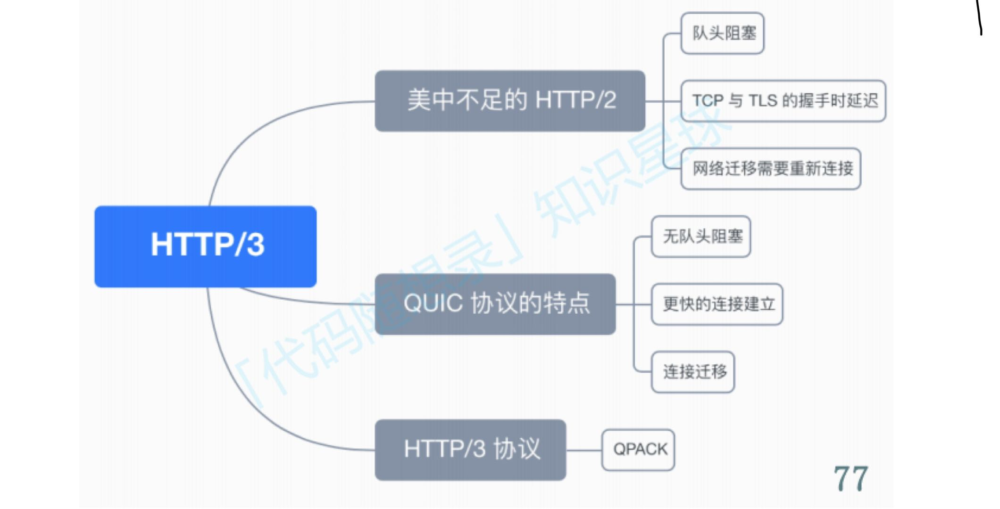

##### HTTP/2的不足

###### TCP 与 TLS的握手时延迟

发出HTTP请求时，需要经过TCP三次握手和TLS四次握手，共计3RTT的时延才能发出请求数据。

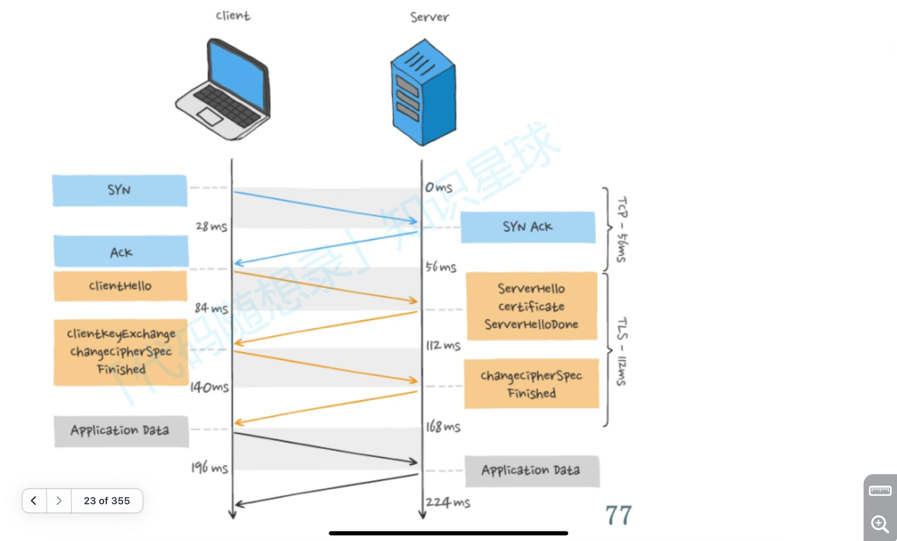

###### 网络迁移需要重新连接

一个TCP连接由[源IP地址，源端口，目标IP地址，目标端口]确定（TCP基于IP），诺IP地址或者端口发送回暖，这需要重新进行连接。这不利于移动设备切换网络的场景，要解决该问题，就需要修改传输层协议，HTTP3协议对下层的修改：

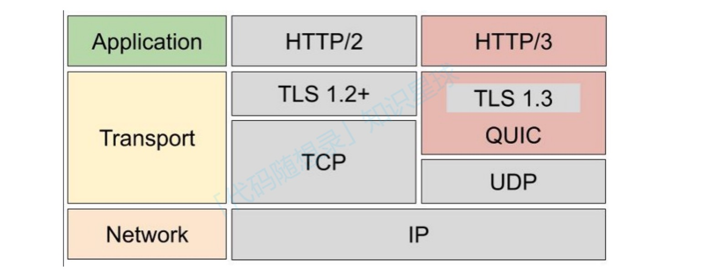

##### QUIC协议的特点

HTTP3基于UDP协议在应用层实现了QUIC协议，他类似TCP的连接管理，拥塞窗口，流量控制的网络特性，相当于将不可靠的UDP协议变成可靠协议，无需担心数据包丢包的问题

##### 1：无队头阻塞

HTTP/2的阻塞发生于传输层，**应用层采用stream和frame支持交错发送与处理所以在应用层不会发生阻塞**

HTTP/3无队头阻塞问题，首先在应用层还是沿用了stream，**stream与stream之间互不影响，互相独立**，又可以交错处理即使使用QUIC协议弥补UDP的不足，也不会操作队头阻塞问题，且传输层采用UDP（不是面向连接，不可靠）

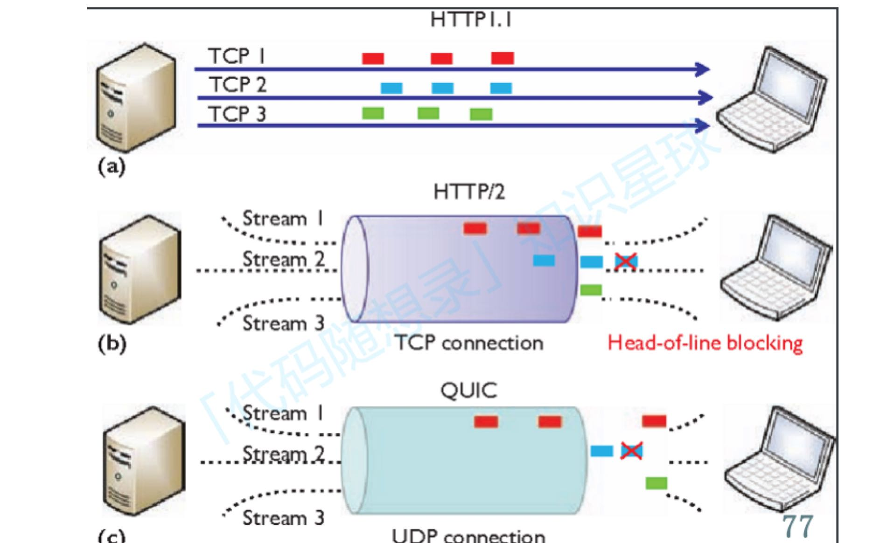

##### 2 更快的连接建立

对于HTTP/1和HTTP/2协议，TCP（内核实现的传输层）和TLS（openssl库实现的表示层）是分层的，因此他们难以合并在一起，需要分批次握手,先TCP握手再TLS握手，整个过程得3RTT

HTTP/3在传输数据前虽然需要QUIC协议握手，这个握手过程仅需要1 RTT,HTTP3的QUIC不与TLS分成，而是QUIC内部包含TLS,整个RTT时间达到0-RTT

##### 3：连接迁移

在HTTP/3之前，当用户进行网络切换时，需要重新TLS四次握手和TCP三次握手，以及TCP慢启动导致的流量控制，造成卡顿

HTTP/3由于底层没有使用TCP，不用四元组（源IP,目标IP,源port，目标port）来标识连接，而是用连接ID来表示连接的两个端点，在发生网络切换时，保持上下文即可，就可以无缝切换，消除重连的成本

#### HTTP/2与HTTP/3头部压缩总结

HTTP/2与HTTP/3一样采用二进制帧的结构，HTTP/3不需要定义Stream，直接使用QUIC里的Stream

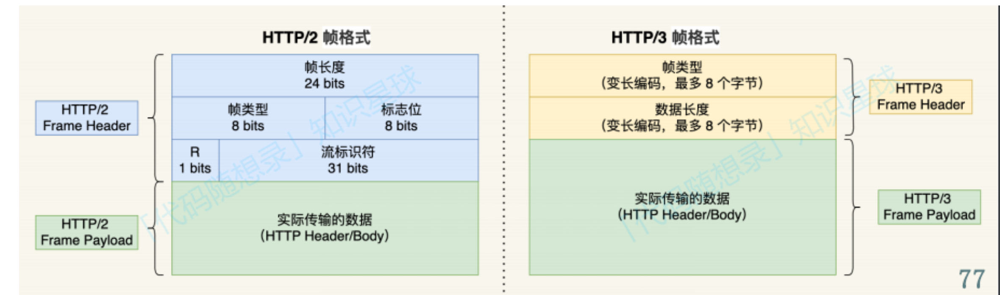

##### 头部压缩算法对比：

HTTP2:HPACK

HTTP/3:QPACK

### 1.2.3 HTTP缓存

对于已经请求过的资源，客户端和代理服务器会将其副本保持在本地存储中，并且在下一次请求中先检查缓存中是否有数据

HTTP缓存有两种实现方式：**强制缓存**和**协商缓存**

#### 强制缓存

强制缓存:浏览器判断请求得目标资源是否有效命中强缓存，如果命中，则直接从内存中读取目标资源，无需与服务器做任何通讯

- Expires强缓存：设置一个强缓存时间，在此时间范围内，从内存中读取缓存并返回，判断是否过去要获取本地时间戳，与Expires字段得时间比，所以产生一个问题就是时间不对（本地时间）
- Cache-Control强缓存：http1.1中增加该字段，在资源的响应头写上需要缓存多久的时间即可，单位为秒，它有六个属性
  - max-age决定客户端资源被缓存多久
  - s-maxage决定代理服务器缓存的时长
  - no-store表示强制进行**协商缓存**
  - public表示资源既可以被浏览器缓存也可以被代理服务器缓存
  - private：表示资源只能被浏览器缓存，默认为private

流程：

1. 浏览器第一次请求访问的服务器资源时，服务器会在返回资源的同时，在响应报文的头部增加Cache-Control，并设置过期时间的大小
2. 再次请求时，会先通过请求资源的时间与Cache-Control设置的过期时间的大小来计算是否过期，没有则使用缓存
3. 在服务器再次接收到请求时就会更新响应头部的Cache-Cntrol

#### 协商缓存

当响应码是304，这个时候告诉浏览器可以使用本地缓存的资源，这种方式被称为协商缓存

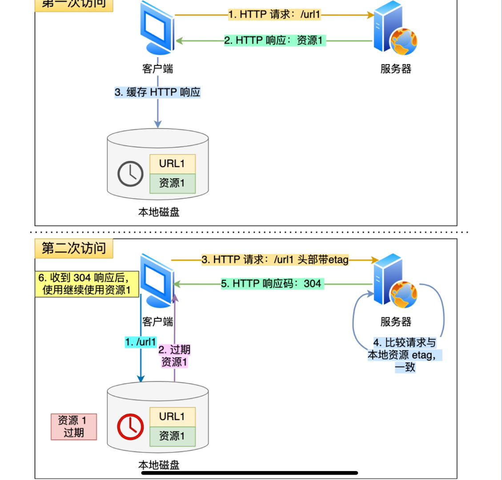

##### 1 基于Last-Modified 和 If-Modified-Science的协商缓存

流程：

- 首先需要在服务器端读取文件修改时间
- 将读出来的修改时间赋值给响应头的Last-Modified字段
- 最后设置Cache-control：no-cache
- 当客户端读取Last-Modified的时候，会在下次的请求标头中携带一个字段：If-Modified-scinece，这个就是上面Last-Modified字段的值
- 只后每次对该资源的请求都会带上If-Modified-Science这个字段，而服务端就需要拿到这个时间并再次读取该资源的修改时间，做对比
- 如果修改时间较新，说明资源改动，则返回最新资源、否则表示资源无改动，响应304读取缓存

缺点

- 根据文件的修改时间来决定是否读缓存，文件有可能没修改，但是修改时间变了，缓存会失效
- 如果在极短的时间内修改，文件的修改时间意识不到，文件被更新，却无法即使响应新的文件

##### 2：基于ETag的协商缓存

将原先协商缓存的比较时间戳的形式形成了文件指纹（根据文件内容计算出的唯一key）

- 第一次请求某资源的时候，服务端读取文件并计算出文件指纹，将文件指纹放在响应头的Etag字段中跟资源一起返回给客户端
- 第二次请求时，会从缓存中将文件指纹拿出来赋值给If-None-Match字段，一起返回给服务端
- 服务端接收到请求报文，从If-None-Match字段值（上一次的文件指纹，请求方从缓存中拿出的），并再次读取目标次元并生成文件指纹，两次文件指纹对比，相同则返回响应码304，return 一个空体。如果不一致则返回新的文件指纹并且和内容一起返回

缺点：

**由于每次服务端都要将目标资源计算，所以增加服务器的计算开销，**如果文件尺寸大，数量多，并且计算频繁，那么会极大的影响服务器的性能

ETag有强验证和弱验证，强验证可以认为提取资源的所有生成一个key，所以当前资源有一丁点改变（很微小），它都会重新计算。而弱验证则是提取部分属性生成key，只有当这些属性发生变化，才会生成新的key，但是准确率不高，会降低协商缓存的有效性

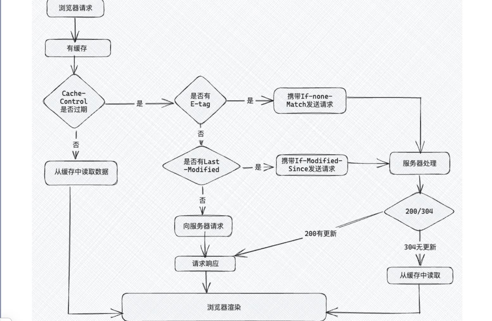

### 1.2.4 HTTPS

在传统的HTTP协议上应用层和传输层添加了SSL/TLS协议（表示层）

#### HTTPS的特点

#####  1 特点

- 信息加密：采用对称加密和非对称加密的混合加密方式，对传输的数据加密，实现信息的机密性，解决窃听的风险
- 效验机制：用摘要算法为数据生成独一无二的指纹效验码，指纹用来效验数据的完成性，解决篡改的风险
- 身份证书：将服务端的公匙放入CA数字证书中，解决了服务端被冒充风险

2 优点

- 在数据传输过程中，使用密匙加密，安全性更高
- 可认证用户和服务器，确保数据发送到正确的用户和服务器

3 缺点

- 握手阶段延时较高，会话需要进行SSL/TSL握手（HTTP3就需要可以使用quic协议内部的TLS 1.3做到0-RTT）
- 部署成本高

#### HTTP与HTTPS的区别

- HTTP时以明文的方式在网络上传输，它是不安全的，而HTTPS在表示层增加了TSL/SSL使得报文能够加密传输。
- HTTP协议只需要TCP三次握手后就可以建立连接，而HTTPS在TCP连接建立前还要TSL/SSL的四次握手
- HTTP端口为80，HTTPS的端口为443
- HTTPS协议需要向CA机构申请数字证书，来保证服务器的身份是可信的

#### 对称加密

对称加密也称私钥加密，使用相同的密匙进行加密和解密

- 明文数据通过特定的算法和密钥进行加密，生成密文数据，解密的过程就是利用特点的算法和密匙恢复明文数据
- 加密解密使用相同密匙，对称加密算法的速度很快，而且密匙不能泄漏

#### 非对称加密

- 非对称加密也称为公匙加密，使用一对不同但相关的密钥：公钥和私钥
- 公钥用于加密，私钥用于解密数据，两个密匙可以互换使用
- 除了加密解密，非对称加密还可以用于数字签名，验证消息的来源和完整性

#### 混合加密

HTTPS采用对称加密和非对称加密的混合形式，也称之为混合加密，保证信息的机密性，解决窃听的风险

**建立通信前**：采用非对称的方式交换会话密匙，后续不采用非对称加密的形式

**通信过程中**：借助交换的会画密匙进行对称加密的通信方式

采用混合加密的原因：就是结合两种加密的优点

#### 摘要算法+数字签名

为了保证传输的内容不被修改，可以将传输的内容计算一个诗文，对方接收过，再次计算出一个指纹两者对比，如果指纹相同则没有更改（很像协商换成基于ETag,保证目标内容是否更改）

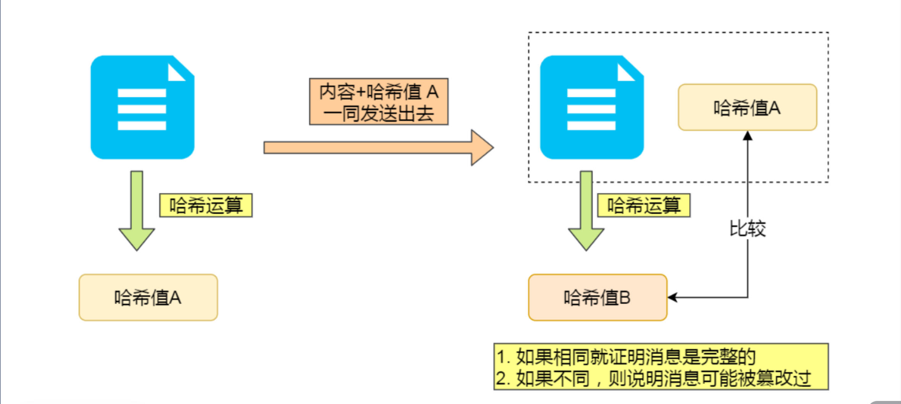

摘要算法只能保证内容没有被修改，但是发送者的身份是无法辨认的，为了避免这种情况，计算机会使用非对称加密算法来解决：**公钥用于验证签名，私钥用于生成签名**。

当服务端通过私钥生成签名，然后向请求的颁发对应的公钥，请求端接收到信息能被公钥解密，则知道是服务器发送。

**1:生成数字签名**

- 发送者使用私钥对信息的摘要（通过哈希函数计算得到）进行加密，生成数字签名。
- 数字签名是消息的哈希值经过私钥加密的结果

**2：发送消息**

- 发送者将原始消息和生成的数字签名一起发送给接收者

**3：验证数字签名**

- 接收者收到消息和数字签名后，使用发送者的公钥对数字进行解密，得到摘要值。
- 接收者再次计算收到的信息的摘要（使用相同的哈希函数），将其与解密得到的摘要值进行比较
- 如果两个摘要值相同，说明消息未被篡改过，数字签名有效，信息来源可信

#### 数字证书

上述方式，只能保证双方通信的数据无法更改，和消息源是正确的，但是万一中间又服务器，将原本双方通信的公钥篡改成自己的公钥怎么办

**1：密匙生成：**

- 首先实体（client，server）需要生成一对密匙：公钥和私钥
- 公钥用于加密和验证，可以公开共享
- 私钥用于解密和签名，必须保密，只有持有者知道

**2：证书请求（CSR）**

- 实体生成一个证书请求，其中包含公钥，实体信息（如名称，电子邮件）和签名
- CSR是一个包含有实体信息的文本块，可以被送到数字证书颁发机构（CA）以获取数字证书

**3：证书颁发**

- 实体将证书请求发送给数字证书颁发机构（CA）
- CA会验证请求者的身份，然后使用自己的私钥对请求者的信息进行签名，生成数字证书

**4：证书验证**

- 当实体收到数字证书时，它可以使用CA的公钥验证证书的签名，确保证书未被篡改且由合法的CA签发
- 接收者可以检查证书中的实体信息以及CA的信息，确保证书的合法性。

**5：数字证书使用：**

- 接收者可以使用数字证书中的公钥来加密数据，然后发送给证书的持有者
- 持有者使用私钥解密数据，保护数据的机密性。
- 持有者还可以使用私钥生成数字签名，接收者使用公钥验证签名，验证数据的来源和完整性

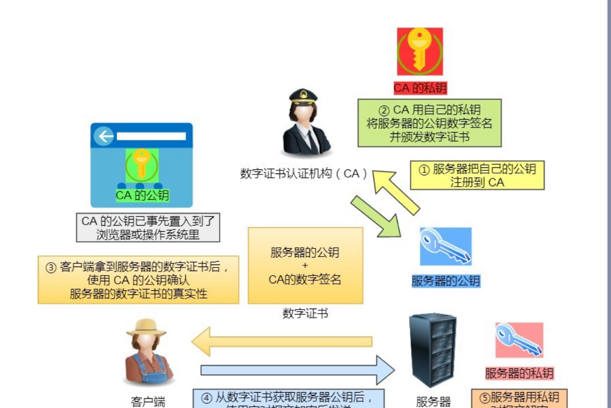

#### HTTPS是怎么连接的（HTTPS应该会重点问）

##### **SSL/TLS协议基本流程：**

- 客户端向服务器索要并验证服务器的公钥
- 双方协商生产会话密匙
- 双方采用会话密匙，进行加密通信

##### **具体流程**

1. 客户端向服务端发送加密通信请求，也就是clienthello请求，请求与服务端建立连接
2. 服务端产生一对公私钥，然后将自己的公钥发送给CA机构，CA机构也有一对公私钥，然后CA机构利用自己的私钥将服务端发送过来的公钥进行加密，产生一个CA数字证书。
3. 服务端响应请求，将CA机构生成的数字证书发送给客户端
4. 客户端将服务端发送过来的数字证书进行解析，验证这个CA数字证书的合法性，如果不合法，发出警告，合法则取出证书中的服务端的公钥
5. 客户端取出公钥并生成一个随机码key（其实就是对称加密的密匙）
6. 客户端将随机码key加密后发送给服务端，作为通信的密匙
7. 服务端收到后，拿自己的私钥解密，得到随机key
8. 利用这个随机key对传输的数据进行加密，在传输加密后的内容给客户端
9. 客户端利用随机key解密服务端发送过来的数据，之后客户端和服务端通过对称加密传输数据，随机key就是两者协商出来的密匙，而摘要算法和数字签名也要基于这个密匙

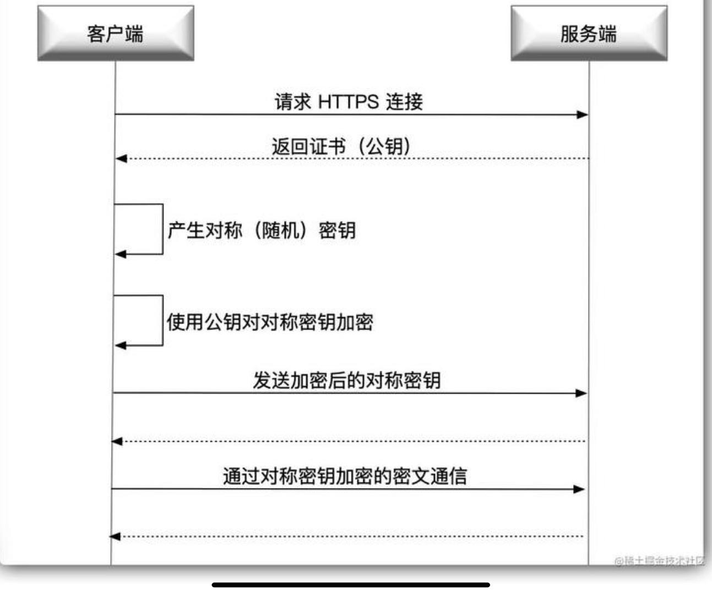

### 1.2.5 总结

DNS采用集中式的设计的问题

DNS的两种查询

HTTP1.1/2/3比较，2在1.1的基础上引入了什么（二进制帧，头部压缩算法hpack，静态动态表，huffman压缩算法，stream流，提高并发），3主要是运输层变为udp，应用层通过quck，做到连接0RTT，解决队头阻塞

HTTP缓存 强制和协商，协商的一些属性，协商使用缓存返回的响应码为304

- 基于last-Mod。。。的缺点在于时间
- ETag基于资源的改变，做出判断，但是增加了服务器计算的成本

HTTPS（TLL/SSL） 建立连接前利用非对称加密，通信时采用对称加密

对称加密比非对称快

## 2 传输层

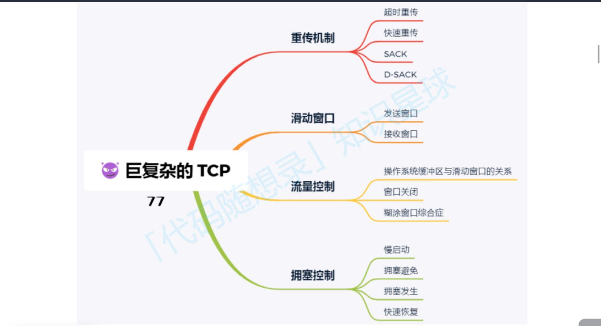

### 2.1 TCP协议

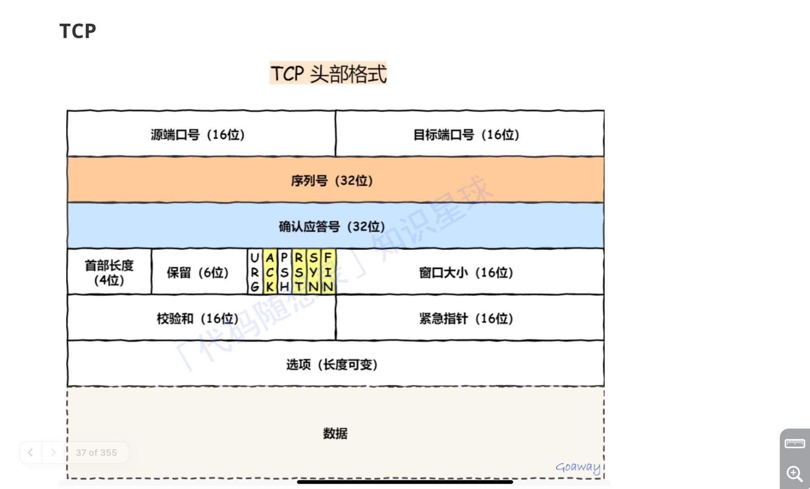

**序列号和确认应答号都用于实现可靠数据传输**

**窗口大小：接收窗口，用于告诉发送方本端TCP缓冲区还要多少空间，用来做流量控制。**

检验和：接收方使用检验和检查该报文段中是否出现错误，CRC算法

**选项**：个人认为重要的

kind =2 **TCP连接初始化时，通信双方使用该选项来协商最大报文段长度**

kind = 3 **窗口扩大因子选项** ： 扩大因子的存在就是提升窗口大小的极限，如果扩大因子为M，窗口大小为n，那么现在窗口大小为n<<M,M取值0~14，只能在建立连接之初觉得。

kind=4 **选择确认选项**，TCP通信时发生丢包，则重传最后一次被确认的后续发送内容，有些内容会被重传，从而降低了TCP性能

kind=5 **SACK实际工作的选项**

**该选项的参数告诉发送方本端已经收到并缓存的不连续的数据块，从而让发送端可以据此检查并重发丢失的数据**
**块。**

kind = 8 **时间戳选项**

该选项提供了较为准确的计算通信双方之间的回路时间的方法，为TCP流量控制提供信息

### 2.2 TCP三次握手

#### 2.2.1三次握手过程

TCP是面向连接协议

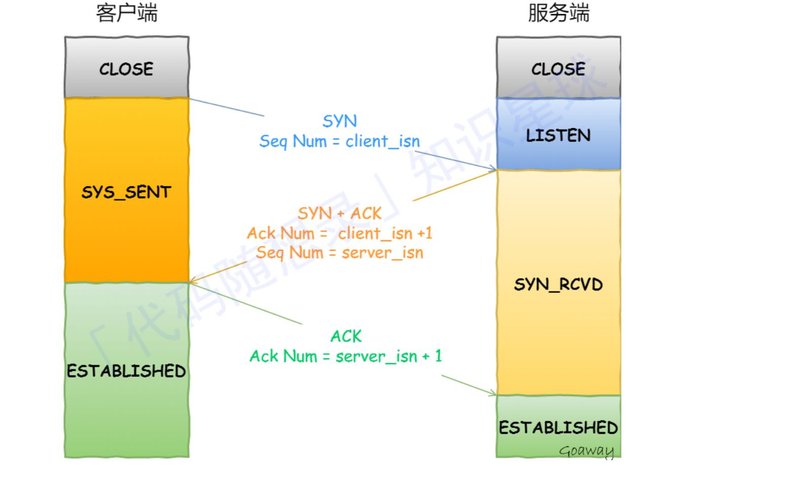

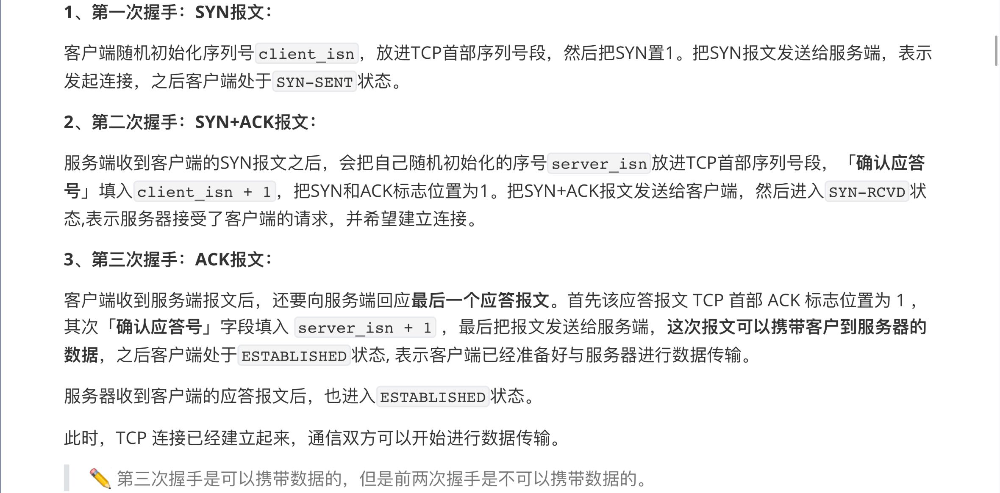

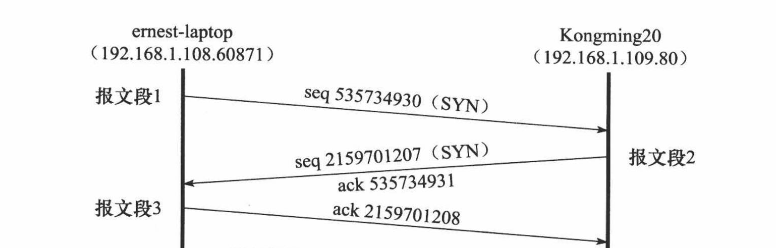

#### 2.2.2为什么需要三次握手

**1：阻止重复历史连接的初始化（主因）**

（**关键就在于第三次握手**）

由于网络阻塞的问题client有可能会发生两次SYN，体现三次握手的好处是在第三次握手时，第三次握手时会对先返回的ack进行回应，两者建立连接，当后一个SYN回应时，就可以意识到历史连接，从而意识到连接存在问题，可以发送复位报文，重新进行三次握手建立正常的连接。

**2：同步双方的初始化序列**

**3：避免资源浪费**

#### 2.2.3 什么是半连接队列

半连接队列（SYN队列）用于存放已经发送SYN（同步）包，但未完成三次握手的连接，服务端第一次收到客户端的SYN之后处于SYN_RCVD状态，此时双方还没有建立器连接，服务器把这种状态下的请求连接放在一个队列里，这个队列被称之为半连接队列。

**全连接队列（Accept队列）用于存放已经完成三次握手，处于完全建立连接状态的连接。**

#### 2.2.4 什么是SYN攻击

攻击者发送大量伪造的SYN请求到目标服务器，但不完成后续的握手过程，从而让服务器一直等待确认，消耗服务器的资源（如半连接队列和系统资源），当半连接队列满了之后，后续再收到SYN报文就会被丢弃，导致无法与客户端之间建立连接

### 2.3 TCP四次挥手

#### 2.3.1TCP四次挥手过程

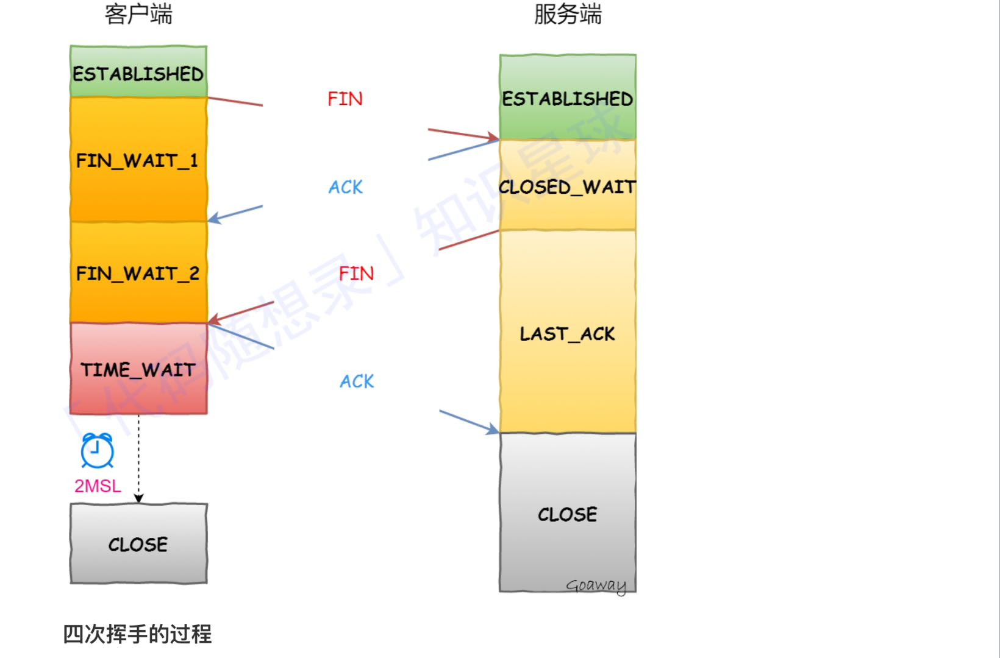

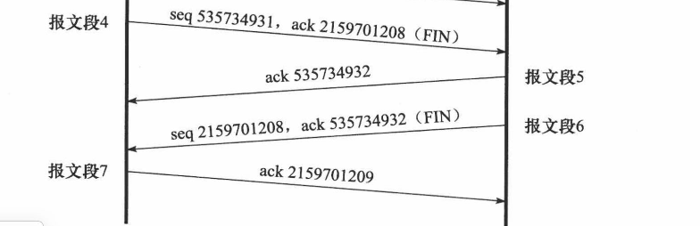

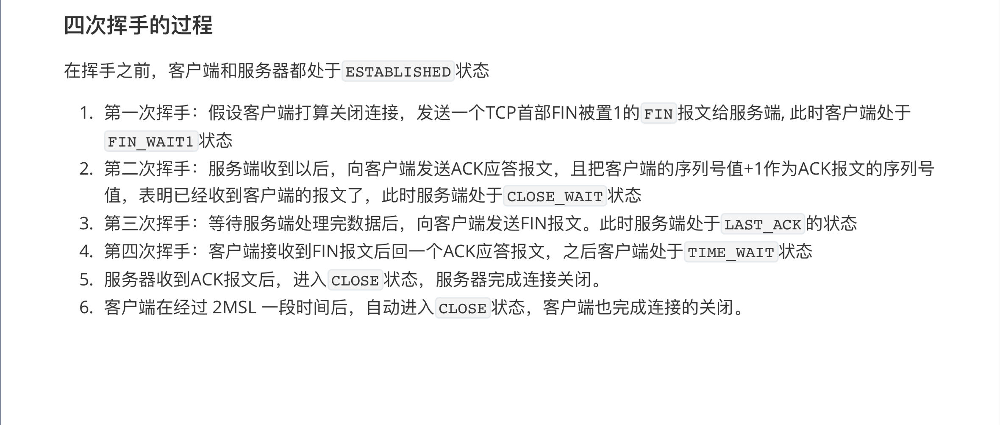

#### 2.3.2 为什么挥手需要四次

TCP挥手需要四次，主要是因为TCP提供的是全双工通信服务，这意味着**连接的两端都可以同时发送和接收数据。因此，每一端都必须单独关闭其发送方向的通道，以确保数据能够完全传输完成**。简单总结，四次挥手的原因如下：

1. **全双工通信**：TCP连接允许双方同时发送和接收数据，因此每个方向的关闭都需要独立处理。
2. **确保数据完全传输**：通过逐步关闭连接，TCP确保了在连接终止前，双方都有机会发送和接收所有剩余的数据。
3. **避免潜在的数据丢失**：如果连接被过早地一次性关闭，尚在传输中的数据可能会丢失。
4. **允许双方各自确认关闭**：每一方都可以独立地确认对方已经没有更多的数据要发送，从而安全地关闭连接。

因此，四次挥手是一种确保TCP连接可靠终止的必要过程，它反映了TCP协议对数据传输可靠性和完整性的重视。

#### 2.3.3 为什么需要TIME_WAIT状态

主动发起关闭连接的一方，才会有TIME_WAIT状态

主要以下两大原因：

1. **防止历史连接中的数据，被后面新建立连接（复用了这条TCP）**
   - 首先你不知道这是新的还是旧的
   - 其次如果之前数据还有残留是发给之前的，那么现在发送到新的连接接收端，会对通信进行干扰，这也就是TIME_WAIT的时间是2MSL，（这是MSL是最大生存时间），足以让之前的数据被丢弃。
2. **保证被动关闭的一方被正确的关闭，即保证最后的ack能让被动关闭的一方接收**
   - 确保被动关闭的一方能收到ack

#### 2.3.4 为什么TIME_WAIT是2MSL

`TIME_WAIT`状态持续2MSL的原因是为了确保：

- 主动关闭方发送的最后一个ACK报文有足够的时间到达被动关闭方，即使考虑到网络延迟。
- 如果需要，允许被动关闭方的FIN报文的重传，并确保主动关闭方有足够的时间来回复ACK。

#### 2.3.5 TIME_WAIT过多的危害

- 内存资源占用
- 对端口资源的占用

### 2.4 TCP的重传机制

TCP实现可靠传输的方式之一，是通过序列号与确认应答。如果没有收到对应的确认应答信息，数据丢包，就会使用重传机制来解决。

#### 2.4.1 超时重传

**设定一个计时器，当超过指定的时间后，没有收到对方的确认ACK应答报文，就会重发该数据。**

**超时重传的两种情况如下**：

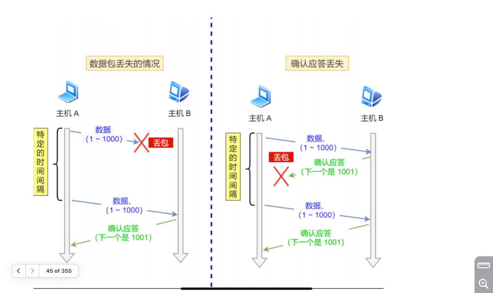

两个时间单：

- RTT指的的一个数据往返的时间，比如发送一个SYN到接收到ack这个时间段
- RTO超时重传的时间
  - RTO有以下两种情况

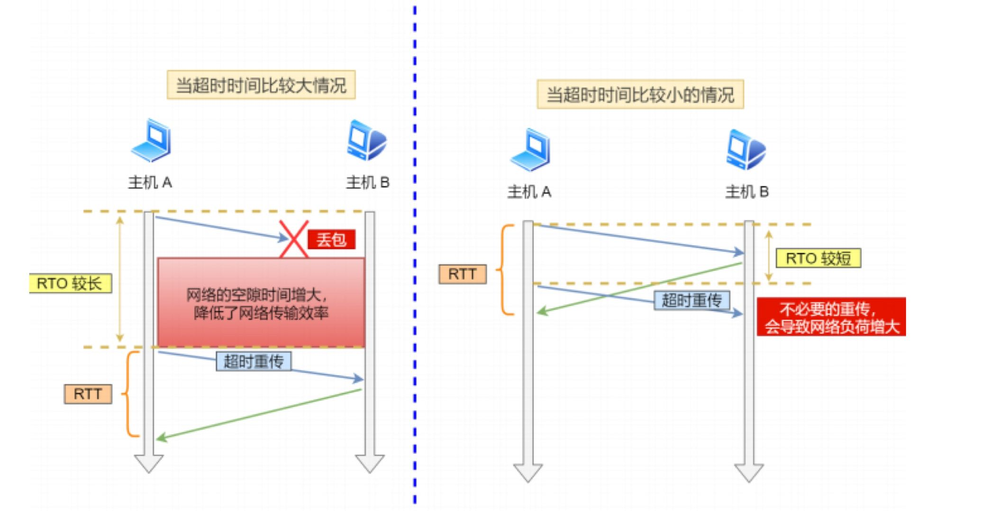

设置的RTO的值应该要略大于RTT的值，且是动态变化的

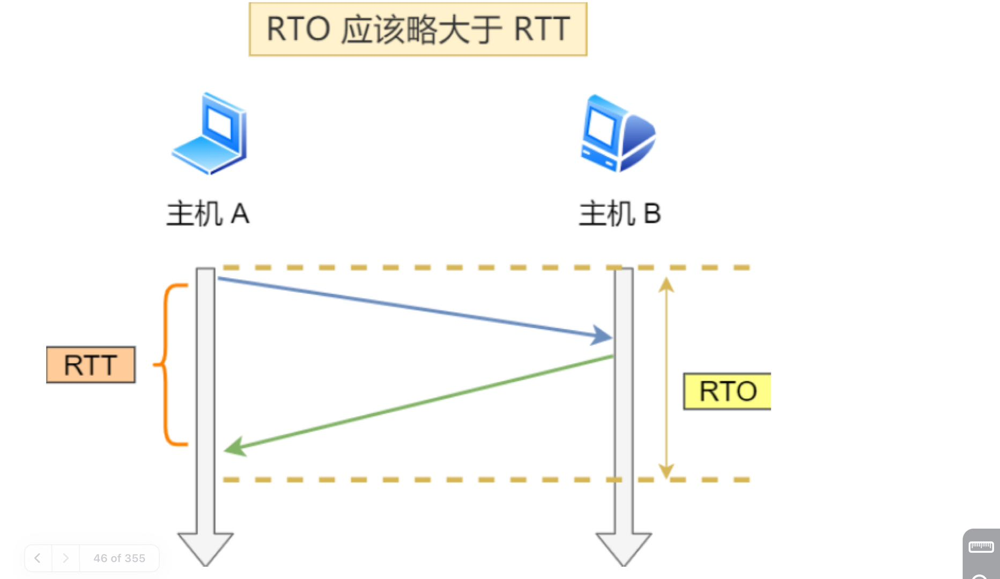

如果超时重传的数据，又要再次重传，tcp的策略是将超时间隔加倍，也就是增加RTO的时间，是之前的两倍

#### 2.4.2 快速重传

快速重传机制，**它不以时间为驱动，而是以数据驱动重传**

**工作原理**：当收到三个相同的ack报文时，会在定时器过期之前，重传丢失报文段

快速重传解决了超时问题，但是面临新的问题：重传的时候，是重传前一个还是重传全部问题

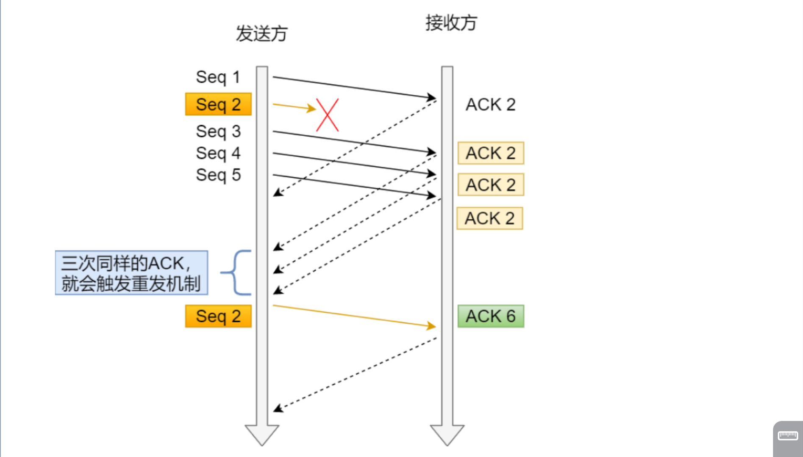

#### 2.4.3 SACK(选择确认)

SACK主要告诉发送方哪些包被接收了

上文中会发现，ack返回相同的三次，这会让发送端不知道那一段要重传，于是引入TCP协议的可选选项SACK，来判断是哪一段要重传。如图所示：

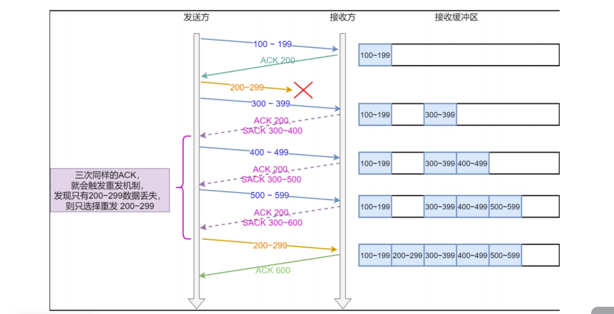

可以发现，一旦发生丢失，ack会重复发送缺失位置的seq，而SACK发送接收到分sep的范围，知道重发，ack才会返回接收到数据的正确seq。

#### 2.4.4 D-SACK

D-SACK的好处：

- 可以让发送方知道，是发出去的包丢了，还是接收方回应的ACK包丢了
- 可以知道是不是发送包由于网络延迟，导致发送包发了多次，导致，接收端收到重复数据

### 2.5 TCP的滑动窗口

#### 2.5.1什么是滑动窗口 ————主要提高网络的吞吐量

TCP没发送一次，都要被应答一次，如果一来一回时间很长，接收端和发送端都得等，这无疑使得吞吐量巨低，滑动窗口的出现表示了，接收端还能接收多少数据，那么发送端可以连续发送，等接收端一一处理即可，这也就是为什么http/1.1支持管道化的原因。**而且再加上窗口扩大因子的存在，使得接收缓存区的容量很大**

#### 2.5.2 什么决定窗口的大小

图中的win就是告知对方窗口大小

- 通常窗口的大小是由接收方的窗口大小来决定的
- 发送方发送的数据大小（length字段）不能超过接收方的窗口大小，否则接收方无法正常接收到数据

#### 2.5.3 发送发的滑动窗口

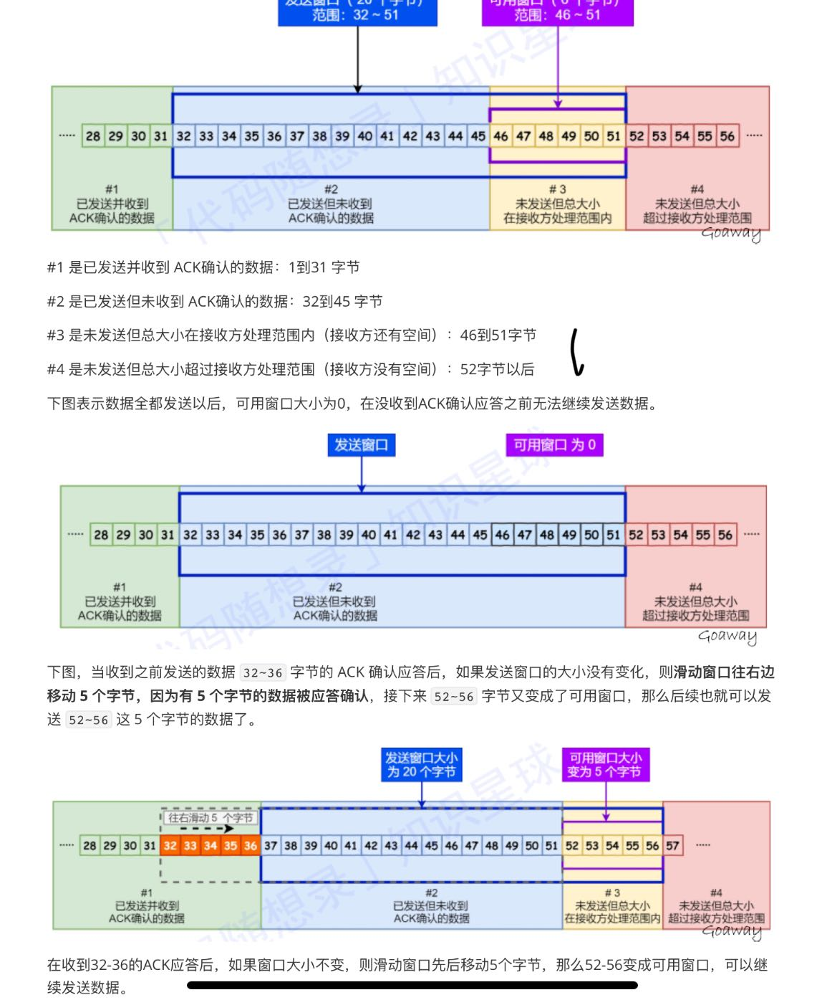

#### 2.5.4 程序如何表示发送方的四个部分

#### 2.5.5 接收方滑动窗口大小

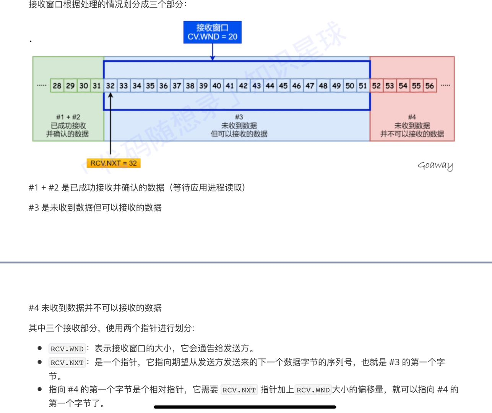

#### 2.5.6 接收串口和发送窗口的大小相等么？

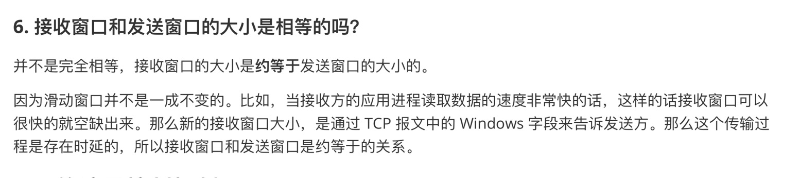

个人认为接收窗口是略大于发送窗口的

#### 2.5.7 TCP的流量控制机制

TCP流量控制居于**滑动窗口机制**，其中接收方可以**通过调整窗口大小来告诉发送端现在接收数据的能力**

1. **接收窗口**：接收维护一个接收窗口,表示接收方可以通过调整窗口大小告诉发送方当前处理数据的能力
2. **通告大小**：接收方通过TCP报文中的确认信息，来告诉发送端当前的窗口大小，win字段
3. **发送速率控制**：发送方会根据接收方通告的窗口大小来控制发送数据的速率
4. **动态调整**：TCP流量控制是动态的，适应网络和接收方的变化。

**2.5.8 TCP的拥塞控制机制**

目的：在网络堵塞是，减少数据包的发送，拥塞控制的目的就是避免发送方的数据填满网络

拥塞控制通过拥塞窗口来防止过多的数据注入网络，使得网络中的路由或者链路过载

- 拥塞窗口cwnd是发送方维护的一个状态变量，根据网络拥塞程度变化
- 发送窗口的值swnd = min(cwnd,rwnd),也是就是拥塞窗口和接收窗口中的最小值
- 网络中没有出现拥塞，cwnd增大，出现拥塞，cwnd减少

如果发送方没有在规定时间内接收到ACK应答报文，也就是发生超时重传，就会认为网络出现了拥塞

##### 1：拥塞控制的常见算法：

- 慢启动
- 拥塞避免
- 拥塞发生
- 快速恢复

##### 2：慢启动

TCP在刚建立连接完成后，首先是有个慢启动的过程，这个慢启动的意思就是一点一点的提高发送数据包的数量

慢启动的规则：当发送方没收到一个ACK。拥塞窗口cwnd的大小就会增加

慢启动算法，发包的个数是指数性的增长

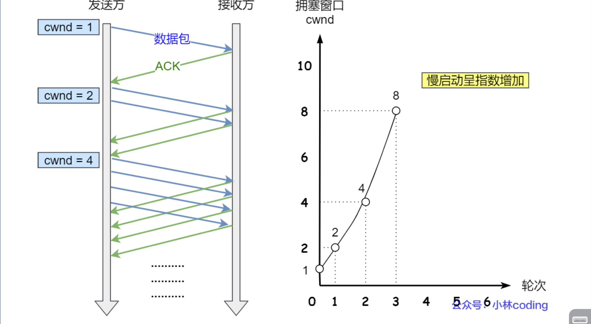

慢启动有一个门限ssthresh状态变量：

1. 当cwnd < ssthresh时，使用慢启动算法
2. 当cwnd >= ssthresh时，就会使用拥塞避免算法

##### 3：拥塞避免

一般来说ssthresh的大小是65535字节。超过后就会使用拥塞避免算法

进入以后，每当收到一个ACK时，cwnd增加1/cwnd

将指数增长变为线性增长，还是增长，但是速度变慢

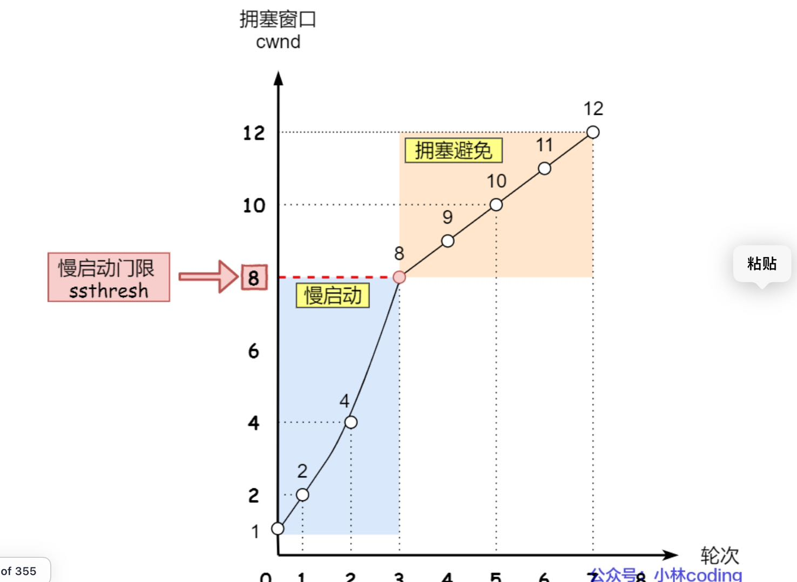

##### **3 拥塞发生**

当网络出现拥塞，也就是会发生数据包重传，重传机制主要有两种：

- 超时重传
- 快速重传
- 两种重传机制代表遇到什么情况重传，拥塞算法代表怎么重传

###### 超时重传拥塞算法

一旦发生重传，那么就要从零开始，回到刚建立TCP连接那会的发送数据报的数量，也就是重新慢启动

1：ssthresh设为cwnd/2

2：cwnd为1

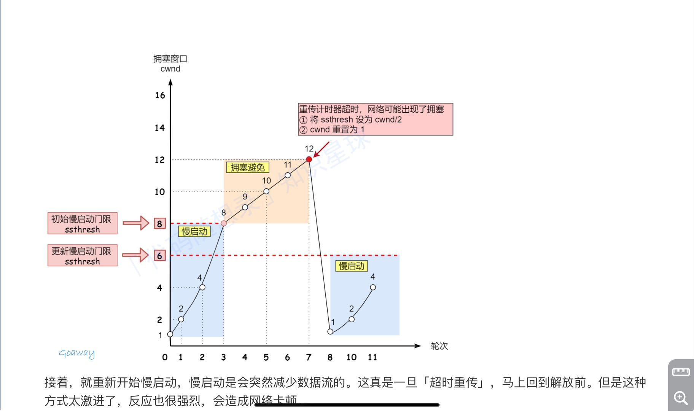

这个方法太激进，反应强烈，会造成网络卡顿

###### 快速重传拥塞算法

TCP认为这种情况不严重，因为大部分没丢，只丢了一小部分，则ssthresh和cwnd便会啊如下：

- cwnd = cwnd/2
- ssthresh = cwnd
- 进入快速恢复算法

##### 4：快速恢复算法

快速重传和快速恢复算法一般同时使用，快速恢复算法是认为能接收到三个一样的ack代表网络并不是很糟糕，所以没必要像超时那么强烈

进入快速恢复：

1. 拥塞窗口 cwnd = ssthresh +3
2. 重传丢失
3. 如果在收到重复ack ，则cwnd+1
4. 收到新的ack，把cwnd设置成ssthresh，代表阻塞已经避免，进入拥塞避免的状态。

继承最高值，后续还是线性增长

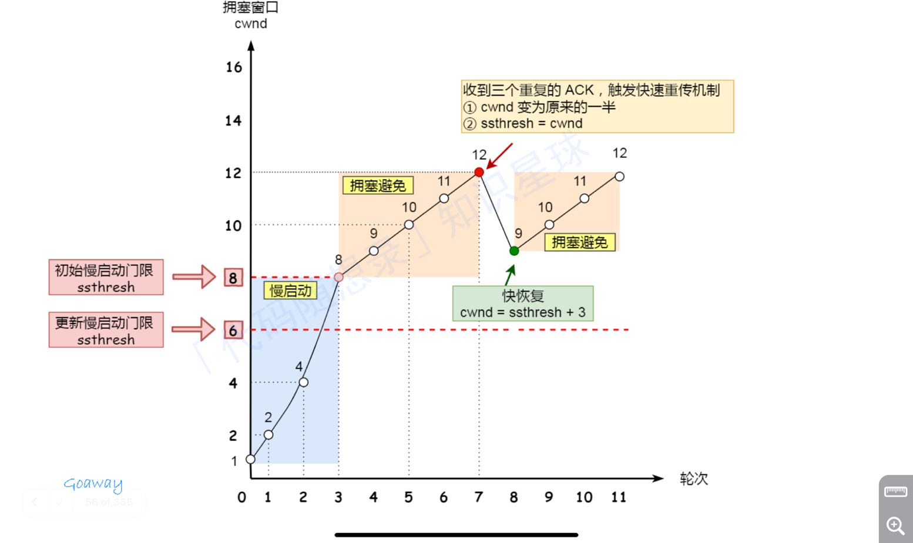

#### 2.5.8 TCP粘包问题

##### 2.5.8.1 TCP粘包问题的由来

**TCP是基于字节流，字节流的有特点就是无边界性**，比如发送为夏洛特烦恼（夏洛特连在一起），接收方说不定就是变成了夏洛 (夏洛连在了一起)特烦恼

##### 2.5.8.2 TCP粘包带来的问题

应用层处理数据变得十分困难，比如在处理一条TCP连接时，我们要分批次处理两个请求，就很有可能在接收时将这两个请求何在了一起，这很有可能使得应用层无法处理数据

##### 2.5.8.2 处理方法

解决TCP粘包问题的关键在于在应用层引入一种机制来明确区分或标识消息的边界。常见的解决方法包括：

- **固定大小：**让write和read，send，recv函数接收和发送固定大小的数据

- **长度前缀**：在每个消息的开始添加一个表示消息长度的头部。接收方首先读取这个长度值，然后根据这个值读取相应长度的数据，这样可以准确地分离出独立的消息。
- **分隔符**：约定一个特殊的序列作为消息的结束标志。发送方在每个消息的末尾添加这个分隔符，接收方通过搜索分隔符来确定消息的边界。
- **自定义协议**：设计一个包含消息边界信息的复杂协议结构，例如通过组合使用消息类型、长度、内容等字段来定义每个消息的格式。

通过这些策略，应用程序可以在接收数据时准确地识别和分离出单独的消息，从而避免粘包问题。

#### 总结

**TCP协议面向连接的（双方内核维持接收和发送缓存区）**，基于字节流的（粘包问题），可靠的

**UDP是无状态的，不可靠的协议**

##### **TCP为什么如何保证可靠性：**

- **确认序列和序列号**，每次发送都有确认报文的响应
- **TCP的重传机制**
  - **快速重传：基于三次ack**
  - **超时重传**：基于RTO（RTO大于RTT）

##### **TCP的流量控制手段**：

- 基于滑动窗口，发送端维护cwnd，实际发送窗口大小swnd为min(cwnd,rwnd)

- **慢启动，**指数级增加发送窗口的大小（cwnd++），当cwnd达到ssthresh，则启动拥塞避免算法
- 这是网络状态还是可以的，为了避免网络被发送方占用，将原来的指数型增长变为线性增长(cwnd += 1/cwnd)
- 一旦发生拥塞，代表网络出现情况
  - 超时重传拥塞避免算法：网络情况非常糟糕，可能多个数据未接收，触发此算法，一夜回到解放前，重新慢启动-》-》
  - 快速重传拥塞避免算法：还能连续收到三个ack，代表网络还行，调整一下cwnd，回到拥塞避免阶段

##### TCP粘包问题：

根本原因在于基于字节流，无边界的特点

## 3 IP协议 

### 3.1 IP基础

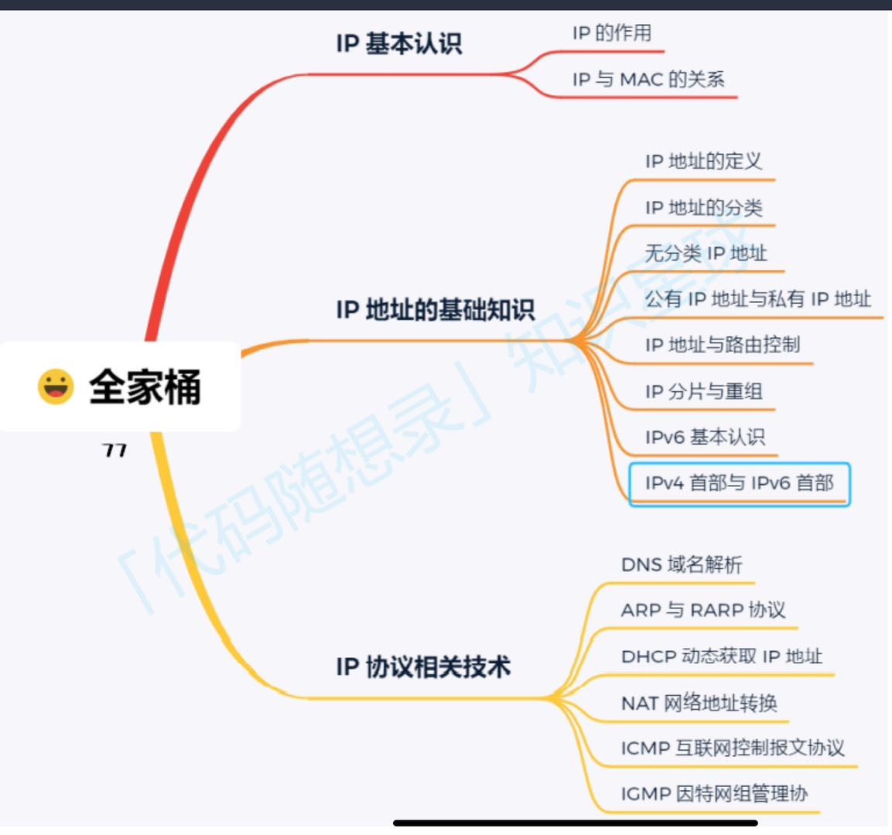

#### 3.1.1 IP协议的作用

**IP位于TCP/IP参考模型的第三层，也就是网络层**，**IP协议为上层提提供无状态，无连接，不可靠的服务**

**IP最重要的只是有这两点：**

- IP头部信息。IP头部信息出现在每个IP数据报中，用于指定IP通信的源端IP地址，目的端IP地址，知道IP分片和重组
- **IP数据报的路由和转发**，前面提到过IP协议最重要的就是选路和转发

**网络层的主要作用**：实现主机与主机之间的通信，也叫点到点通信

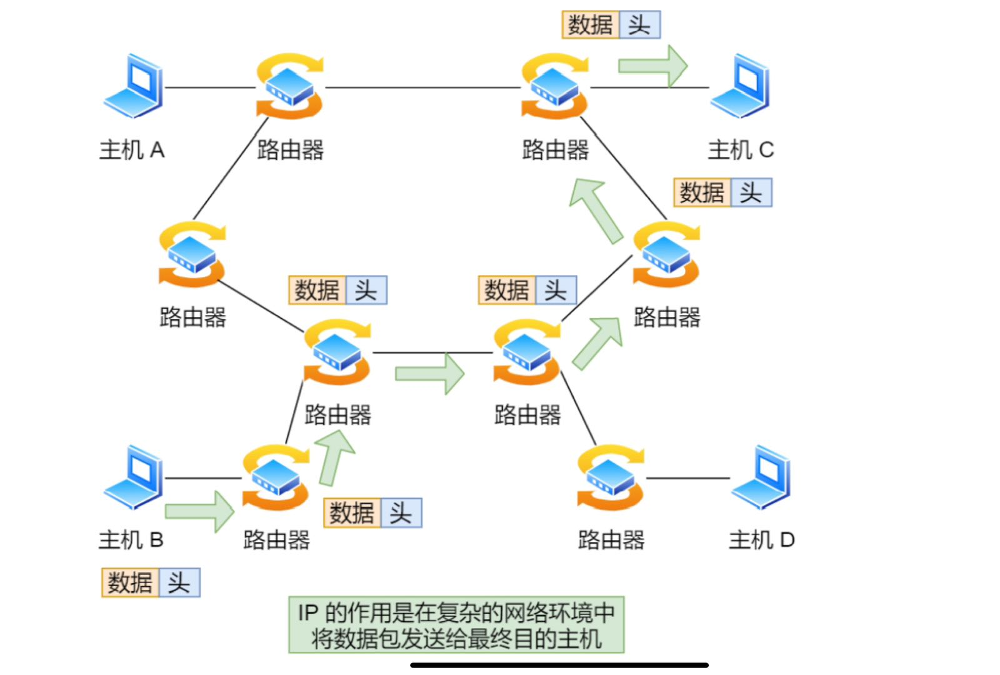

#### 3.1.2 网络层(IP)与数据链路层(MAC)有什么关系

MAC的作用：实现直连的两个设备之间的通信，如光纤双绞线，

IP的作用：网络之间的进行通信传输

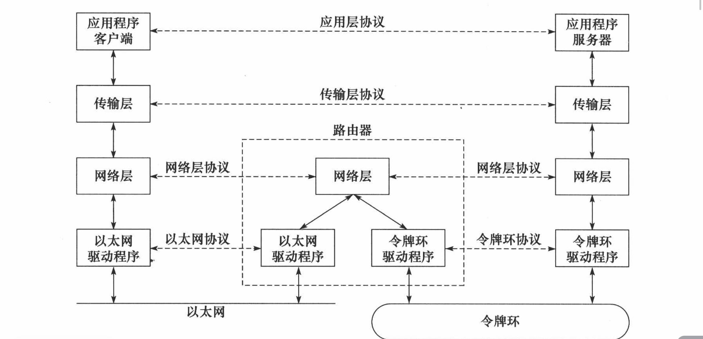

如图：

- IP之间（网络层）为虚线也就是逻辑上的连接
- MAC（数据链路层）我们可以看到为实线，是真正意义上的连接

通俗来说：IP就是两个通信主机在导航上的出发地和目标地（点到点），而MAC物理地址就是当前真正的位置（MAC地址会变化）

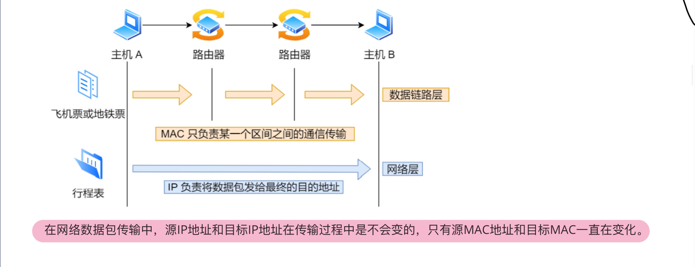

### 3.2 IP地址

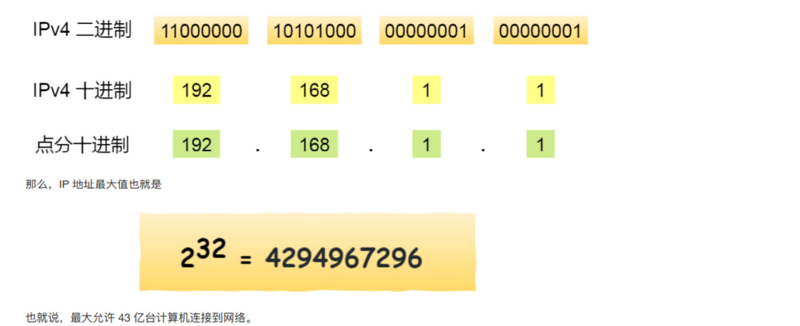

IP地址是由“网络标识”和“主机标识”这两个部分组成的。

#### 3.2.1 IP地址分类

**IP地址被分为了五种类型：**

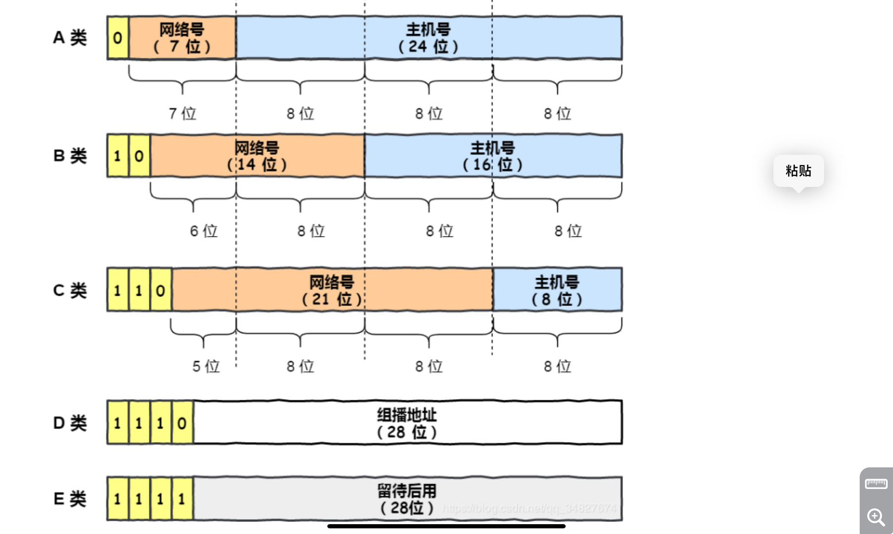

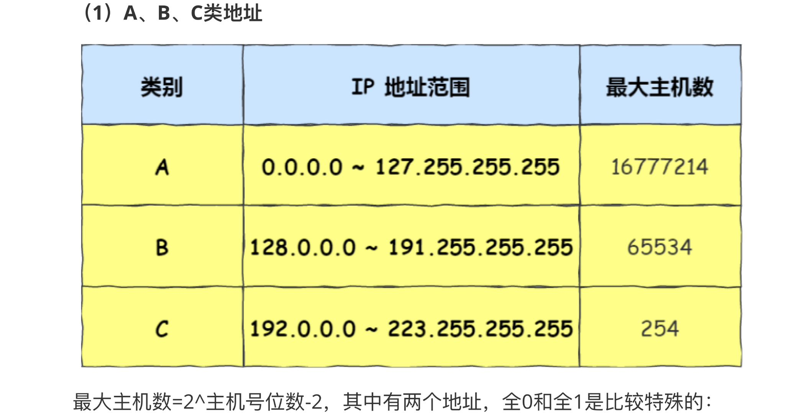

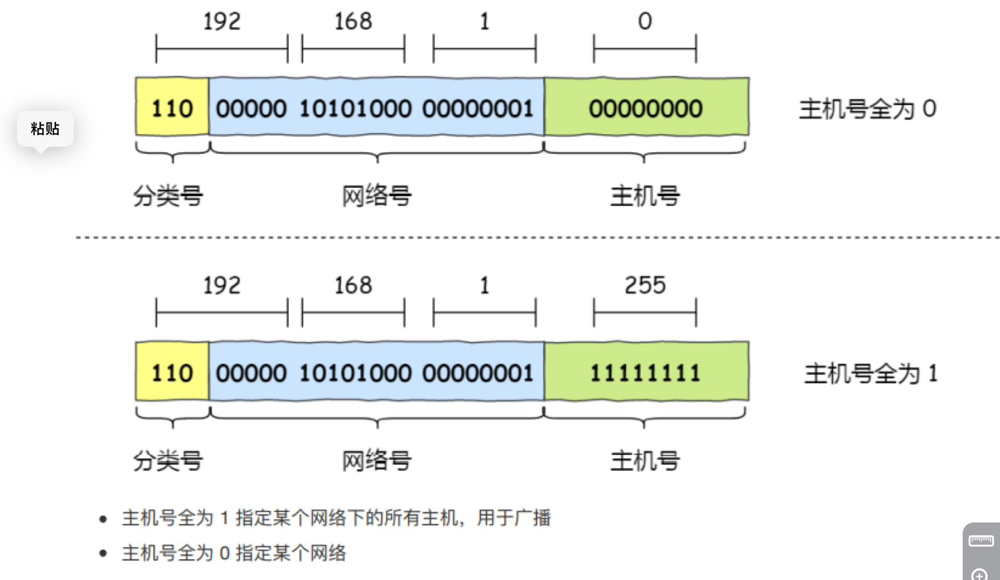

##### 本地广播和直接广播

广播地址**用于在同一个链路中相互连接的主机之前发送数据包**。广播地中可以分为**本地广播**和**直接广播**两种。

在本网络内广播的**叫做本地广播**，也就是信息只会在本地传播（一个区域，一个网络内），不会传递到别的域

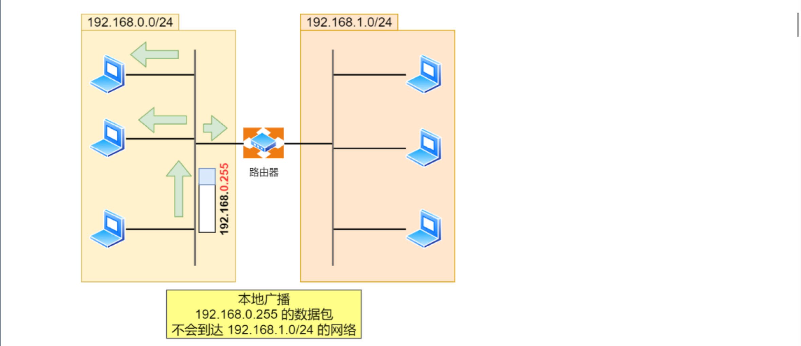

**在不同网络之间的广播叫做直接广播**

直接广播存在一定的安全问题，多数情况下会在路由器设置不转发

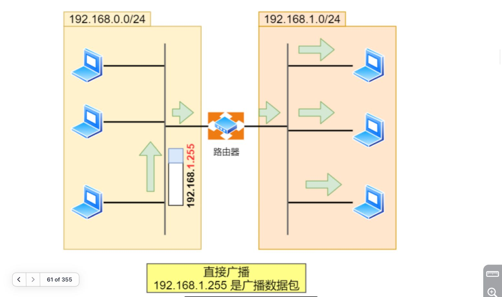

##### IP地址的D,E类地址

D和E类地址没有主机号的，所以不可用于主机IP，D类常用于多播，E类时预留的分类（暂未使用）

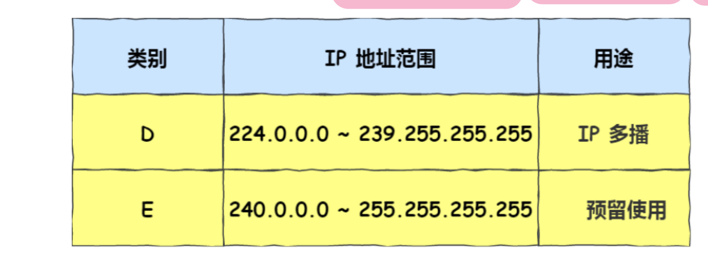

多播地址用于将包发送给特定组内的所有主机。**由于广播无法穿透路由（直接广播一般不被路由转发**），像给其他网段发送同样的包，就可以使用可以穿透路由的多播

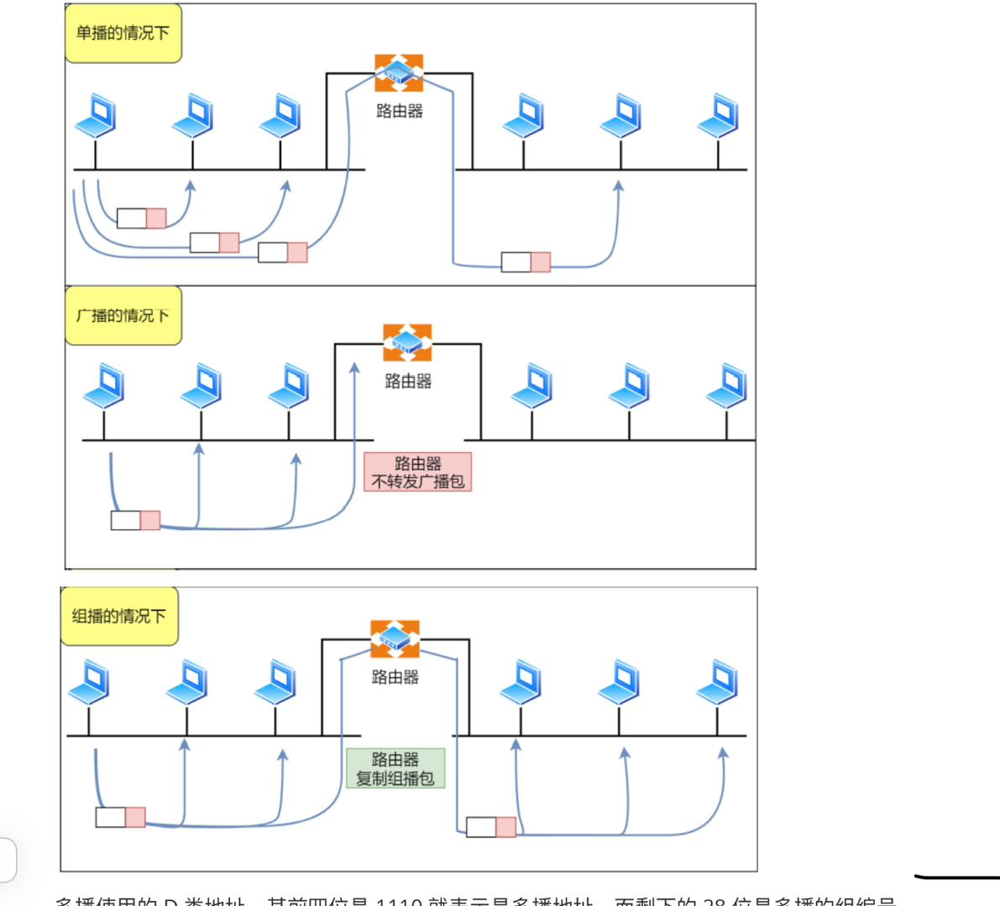

多播使用D类地址，其四位是1110就表示多播地址，而剩下的28位是多播的组编号。

从224.0.0.0----239.255.255.255是多播的可用范围，分为以下三类：

- 224.0.0.0---224.0.0.255为预留的组播地址，只能用于局域网，不进行路由转发
- 224.0.1.0---238.255.255.255为用户可用的组播地址，可以用于Internet上
- 239.0.0.0 -- 239.255.255.255为本地管理组播的地址，可供内部网在内部使用，仅在特定的本地范围内有效

##### IP分类的优缺点

- 优点：可以根据IP地址前四位来判断IP地址属于哪一个类别，简单明了，选路简单
- 缺点：同一个网络下，IP地址没有地址层次，也就是不能根据具体的生产环境，测试环境来单独区分，大家在一个网络下IP无层次
  - ABC类有个尴尬的处境，不能很好的与现实网络匹配
  - c类地址包含的最大主机数量太少，只有254
  - B类的地址包含的最大主机数量过多
  - 以上B类和C类地址可以通过CIDR无分类地址解决

##### CIDR无分类地址

这种方式不再有分类地址的概念，32bit的IP地址被划分为两个部分，前面为网络号后面是主机号。

**如何划分网络号和主机号**

表示形式a.b.c.d/x,其中/x表示前x位属于网络号，x的范围是0-32，这是得IP地址更加的灵活

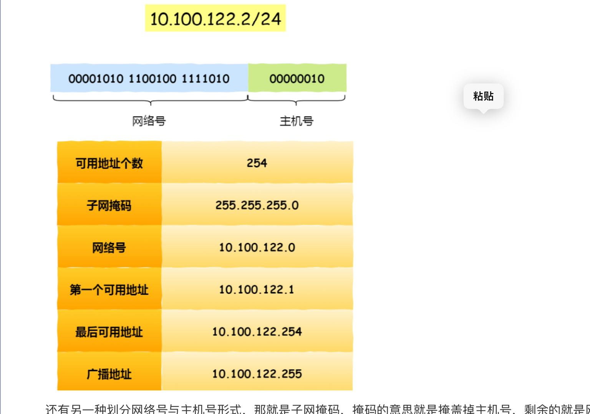

还有另一种划分网络号和主机号，那就是子网掩码，掩码就是掩盖掉主机号，留下来的就是网络号。将子网掩码和IP地址按位计算and，就可以得到网络号。

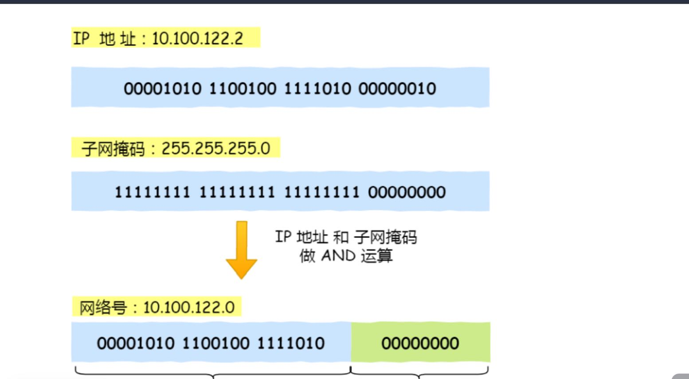

**为什么要分离网络号和主机号**

当两台计算机要通讯，首先灰判断是否处于一个广播域内，及网络地址是否相同。如果网络地址相同，表明接受方在本网络上，那么数据可以直接发送到目标主机

如图：

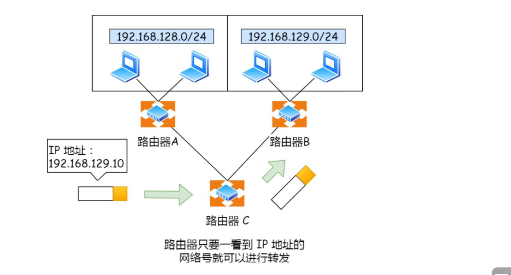

##### 子网划分

通过子网掩码划分出网络号和主机号，子网掩码还有一个作用就是划分子网

子网划分实际上是将主机地址分为两个部分：子网网络地址和子网主机地址

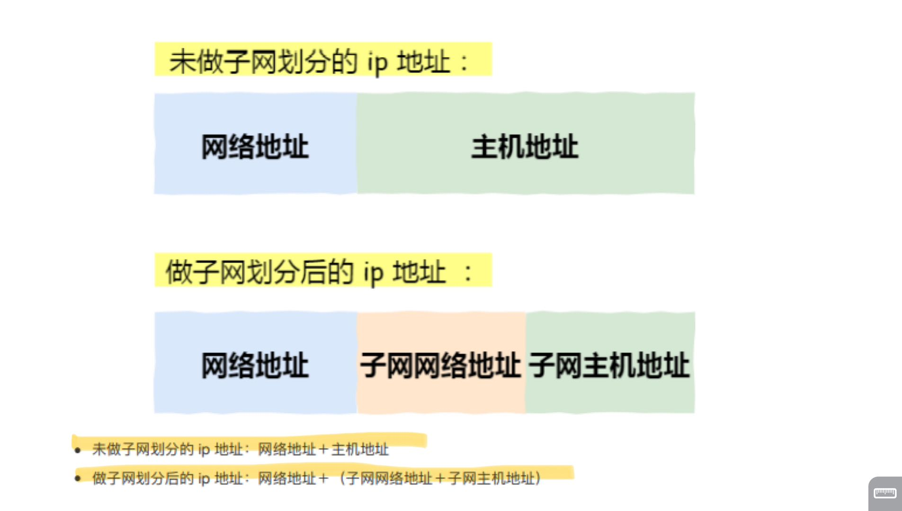

子网划分的例子

对CIDR和子网划分：

- 直接用IP地址和子网掩码作and操作就是获取网络号操作
- 拿网络号和子网掩码操作就是子网换分

**公有与私有IP地址**

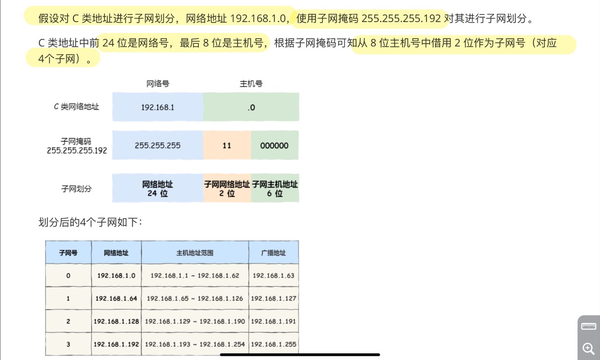

#### 3.2.2 IP的路由转发机制

前面提到过IP地址的两大特点一是其头部信息，**其次就是IP的路由转发机制。**

**IP的路由转发取决于IP地址的网路号，来决定数据的下一跳去哪**（trace + 网址可详细看）

##### **路由表**

路由控制表中记录着网络地址与下一步发送至路由器的地址。

**主机和路由器上都会有各自的路由器控制表**

**Linux端可以通过route命令来查看和修改路由表**

##### 转发

流程：发送 IP 包时，**首先要确定 IP 包首部中的目标地址**，再从路由控制表中**找到与该地址具有相同网络地址的记录， 根据该记录将 IP 包转发给相应的下一个路由器**。如果路由控制表中存在多条相同网络地址的记录，就选择相同位 数最多的网络地址，也就是最⻓匹配。

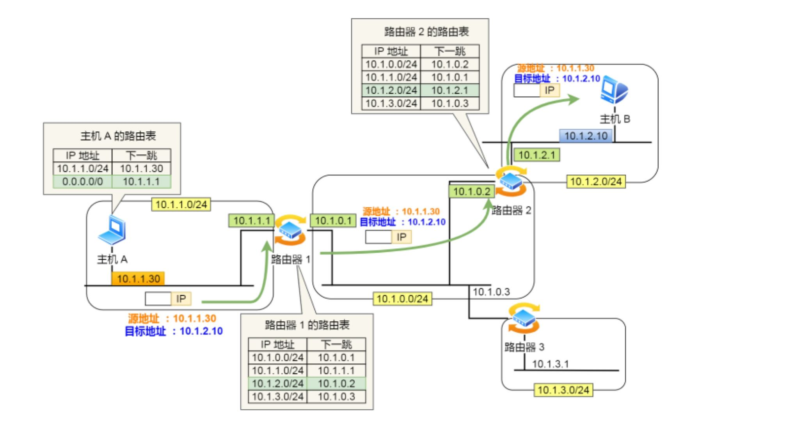

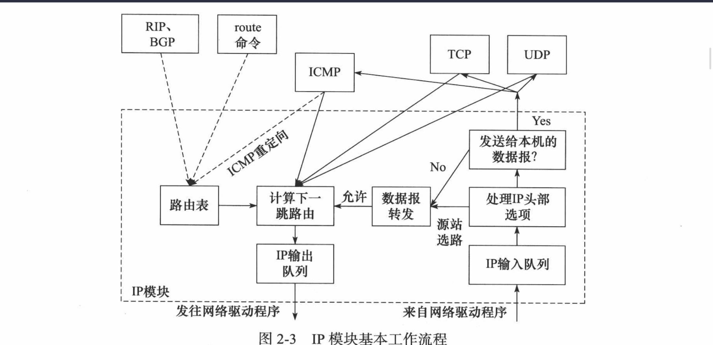

2-3图展示了网络层IP模块的具体操作

**还回地址是不会流向网络的**：用于一台计算机上程序之间的网络通信，特殊IP地址127.0.0.1与它相同意义的是主机名localhost。

#### 3.2.3 IP分片与重组

每种数据链路层的最大传输单元MTU都是不相同的，如FDDlMTU4352字节，互联网通常为1500字节。这个指的是已经被数据链路层包装过的数据部分也就是**IP+数据**，**它又叫IP数据报**

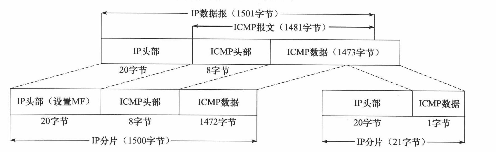

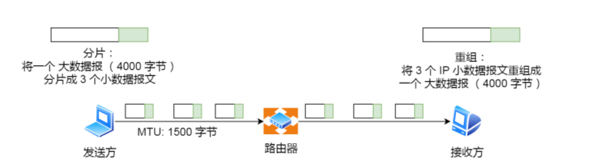

#### 3.2.4 IPV6

##### IPV6基本认识

更多的地址，根号的安全性和扩展性。

IPV6和IPV4不能兼容。

##### *IPV6的亮点*

IPV6可自动配置，即使没有DHCP服务器也可以实现自动分配IP地址。

IPv6包头包首部长度采用固定的值40字节，去掉了包头效验和，简化了首部结构，减轻了路由器负荷，大大提高了传输的性能。

IPv6有应对伪造IP地址的网络安全功能以及防止线路窃听的功能，大大提升了安全性

