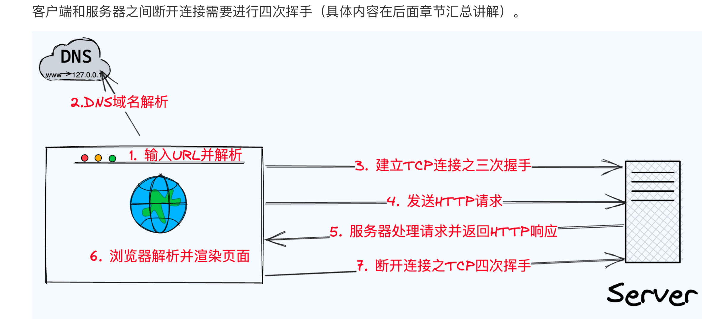

# 计算机网络

**引导：*****在浏览器输入URL并按下回车之后会发生什么****

1. 输入URL并解析，浏览器解析出协议，主机端口等信息，构造一个HTTP请求（浏览器会根据请求偷判断是否有HTTP缓存，来判断获取资源是从服务器中得来还是本地缓存等）
2. DNS域名解析，将域名解析成对应的IP地址
3. 建立TCP三次握手，由于应用层基于HTTP协议，在HTTP3之前运输层都是采用TCP，TCP是面向连接的。
4. 浏览器发送HTTP/HTTPS请求到web服务器中
5. 服务器处理HTTP请求并返回HTTP报文
6. 浏览器渲染页面
7. 断开连接TCP四次挥手

**补充URL的组成：**

1. **协议（Scheme）**：指明了用于访问资源的协议类型。常见的协议有HTTP（超文本传输协议）、HTTPS（HTTP加密版）、FTP（文件传输协议）等。例如，在URL `http://example.com` 中，`http` 就是协议。
2. **主机名（Host）**：指互联网上的服务器域名或IP地址。它告诉浏览器资源所在的主机位置。例如，在URL `http://example.com` 中，`example.com` 是主机名。
3. **端口号（Port）**：（可选）服务器上特定服务的访问端口。HTTP默认端口是80，HTTPS默认端口是443。如果使用默认端口，通常不会在URL中显示。例如，`http://example.com:8080` 中的 `8080` 表示端口号。
4. **路径（Path）**：指向服务器上资源的具体位置。它通常映射到服务器上的一个文件或文件夹。例如，在URL `http://example.com/index.html` 中，`/index.html` 是路径，指向服务器上名为 `index.html` 的文件。
5. **查询字符串（Query）**：（可选）以键值对形式存在，用于传递额外参数给服务器。它们通过问号（`?`）开始，并且键值对之间通过和号（`&`）分隔。例如，`http://example.com/search?q=example` 中的 `q=example` 是查询字符串，表示查询参数是 `q`，其值是 `example`。
6. **片段标识符（Fragment）**：（可选）通过井号（`#`）引入，用于指向资源内部的一个锚点，即页面中的具体位置。浏览器通过片段标识符直接跳转到页面的指定部分。例如，在URL `http://example.com/index.html#content` 中，`#content` 是片段标识符，指向页面中 `id="content"` 的元素。

# 1 ：应用层的协议

## 1.1 DNS

DNS的定义：一种将域名转换成IP地址的分布式系统

DNS：基于运输层的UDP协议

### 1.1.2**DNS服务器如果采用集中式的设计会引发的问题**

1. 单点故障 ：如果DNS服务器崩溃，那么整个网络随之瘫痪。通信容量，单个DNS服务器不得不处理所有的DNS查询，这种查询级别可能是上百万级别的。
2. 远距离集中式数据库：单个DNS不可能临近所有的用户。
3. 维护：维护成本巨大，而且还需要频繁更新

### 1.1.3 域名层级关系

原则：在域名中，越靠右边其层级越高。

example： www.server.com

### 1.1.4 DNS解析过程

1. 先查询浏览器缓存是否有该域名对应的IP地址
2. 如果浏览器中无，就回去本地的HOST文件中查询
3. 如果没有，则向本地的DNS服务器（ISP提供），如果找到直接返回
4. 如果没有则向根DNS服务器发出查询请求，他不负责解析，而是告诉哪个顶级的服务器可能有
5. 本地的DNS解析器接着向指定的顶级域名DNS发送查询请求
6. 查询到后把结果返回给浏览器，并且把结果，存放到浏览器的缓存中，以便下一次
7. 浏览器得到解析结构后，发起连接

### 1.1.5递归查询和迭代查询

1. 递归查询：逐个向上询问（和递归一样），一一返回问答结果
2. 迭代查询：踢皮球的形式，询问一个，没找到就让请求别的服务器去
3. 递归适合普通用户和客户端，而递归适用于DNS服务器之间的通信

## 1.2 HTTP协议

HTTP协议的特征： 简单，灵活，已于扩展，应用广泛和跨平台

### 1.2.1 特征

- 简单：基本报文格式header+body，头部信息也是key-value简单文本的形式，易于理解。
- 灵活和易于扩展
  - HTTP协议各自请求方法，URL/URI，状态码等都不是固定死的，允许开发人员自定义和扩充
  - HTTP工作在应用层，下层可以随意变化
  - HTTPS就是在HTTP与TCP之间增加了SSL/TSL安全传输层
- 无状态，明文传输，不安全
  - 无状态：服务器不会记忆HTTP的状态，所以不需要额外的资源来记入状态信息，能减轻服务器的负担
    - **对于无状态的问题，可以使用cookie技术**，通过在请求和响应报文中写入cookie的信息来控制客户端的状态
  - 明文传输：传输过程中的信息，是可方便阅读的，信息透明，容易被窃取
  - 不安全
    - 使用明文传输，内容可被窃听
    - 不验证通信的身份，因此有可能遭遇伪装
    - 无法验证报文的完整性，所以有内容可能已经恶意修改

### 1.2.2 HTTP版本的演变

目前为止，http常见的版本有HTTP/1.1,HTTP/2.0.HTTP/3.0,不同版本的HTTP特征是不一样的。

#### **HTTP/0.9只支持get方法**

#### **HTTP/1.0：HTTP/1.0是HTTP协议的第一个正式版本，拥有以下特征**

- 引入请求头和响应头，支持多种请求方法和状态码
- 不支持持久连接，每次请求都学要建立新的连接

#### HTTP/1.1

##### 1：长连接

**HTTP/1.1提出了长连接（持久连接），只要客户端和服务器任意一端没有明确提出断开连接，则保持TCP连接状态**

##### 2：**管道网络传输**

在**同一个TCP连接里面，客户端可以发起多个请求，只要第一个请求发出去了，不必等其回来，就可以发送第二个请求，减少整体的响应时间**

**但是服务器必须按照接收请求的顺序发送对这些管道化请求的响应**，HTTP/1.1管道解决了请求的队头阻塞，但是没有解决响应的队头阻塞。

##### 3：队头阻塞

当顺序发送请求序列中一个请求因为某种原因被阻塞，导致后面排队的所有请求都会被同一阻塞，导致客户端一直收不到请求。

对于HTTP/1.1之前的，一般发生在客户端和服务端，因为发送和接收要一一对应（一条信息一条信息的处理）

对于HTTP/1.1而言，队头阻塞只会发生在服务响应上，因为发送端可以连续发送信息，但是服务端得按顺序响应。

##### 4：HTTP/1.1存在的问题

- 头部繁重：每个请求和响应都需要带有一定的头部信息，每次互相发送相同的首部造成浪费
- 服务器是按请求的顺序响应，会造成队头阻塞
- 没有请求优先级控制
- 请求只能从客户端开始，服务器被动响应

#### HTTP/2

HTTP/2协议基于HTTPS的，所以HTTP/2是安全的

HTTP/2很好的兼容了HTTP/1.1

- HTTP/2没有在url中引入新的协议名，
- 只在应用层做了改变，还是基于传输层的TCP协议

##### HTTP/2采用的技术

1. 头部压缩：采用HPACK压缩算法对请求和响应头部进行压缩，减少传输头部数据量，降低延迟
2. 二进制帧：HTTP/2将数据分割成二进制帧进行传输，分为头部信息帧（Headers Frame）和数据帧（Data Frame），增加数据传输的效率
   - 其实就是将原来的应用层的数据，压缩，减少传输体积
3. 并发传输：引出Stream概念，多个Stream复用一条TCP连接，针对不同的HTTP请求用独一无二的Stream ID来区分，接收端通过stream ID来组装HTTP信息
4. 服务器推送，服务器可以额外的向客户端推送资源，而无需客户端明确请求

**HTTP/2仍然存在队头阻塞的问题**，**问题的发生是在传输层**

HTTP/2是基于TCP协议来传输数据的，TCP是字节流协议，**TCP保证了收到的数据是准确的，完整的，顺序正确的，才会将内核接收缓存区的数据取出返回给HTTP应用。**

##### HTTP/1.1协议的性能问题

- 浪费带宽，不支持服务器的推送（请求什么就返回什么，如果请求的东西少）
- 头部繁重，造成浪费
- 并发数量有限，每个连接都会使得内核产生接收缓冲区，使得内核繁重
- 队头阻塞，发生在响应（应用层）

##### 解决HTTP/1.1性能问题的手段

- 将同一个页面资源分散到不同的域名，提升并发上限
- 将多个体积小的javascript文件使用webpack等工具打包成一个体积更大的javascript文件

##### 头部压缩

###### HTTP1.1报文的header部分存在问题

- 含很多固定字段
- 大量请求和响应的报文里很多字段是重复的，要避免重复性
- 字段基于ASCII编码，传输效率低，所以有必要改成二进制编码

###### HTTP/2对于头部的改造：

使用HPACK算法压缩头部，HPACK算法包含三个组成部分

1. 静态字典
2. 动态字典
3. huffman编码（压缩算法）
   - 基于大根堆，频率最高的出现在头部

客户端和服务器都会建立和维护一个字典，用长度较小的索引号表示重复的字符串，再用Huffman编码压缩数据

对于头部而言，就是对头部的字段建立key-value的映射，使得之间的字段采用更小字节的来代替，双方通过查表来解析

##### 二进制帧

**HTTP/2厉害在于将文本格式改成二进制格式传输数据**，**极大提高HTTP传输效率**，而且二进制数据**采用位运算能高效解析**

HTTP2总共定义了10类型的帧，分为两类，即数据帧和控制帧

流标识符（Stream ID）：标识该帧属于哪一个stream，接收方可以根据这个信息从乱序的帧里找到相同的stream ID，从而有序组装

帧数据：就是实际传输的内容

##### 并发传输

###### 1：HTTP1.1 与 HTTP2的比较

HTTP1.1基于请求-响应模型。HTTP完成一个事务（请求和响应），才能处理下一个事务，（即使HTTP1.1使用了管道技术，也只是发送端可以连续发送请求，但是服务端仍然需要对应处理请求），会造成队头阻塞问题

HTTP2通过Stream这个设计（多个Stream复用一条TCP连接，达到并发的效果（个人认为对于应用层而言是通过一条TCP连接）)，解决了队头阻塞（仅仅在应用层而言），提高了HTTP传输的吞吐量。

###### 2： HTTPS的并发实现

HTTP2复用一条TCP连接可以这样理解，多个stream可以共享一个TCP连接，stream上由多个frame组成，也就是它不需要像HTTP/1.1那样，客户端想要建立新的连接需要重新建立新的连接，但是HTTP/2不需要，它的新连接可以用上一次的TCP连接

而且在应用层不会发生队头阻塞，提高了并发，增加了吞吐量。

HTTP2协议还包括：流控制，流状态，依赖关系等。

#### HTTP/3

HTTP/3基于QUIC协议，具备以下特点：

- 零RTT连接建立：quic允许在首次连接时进行零往返时间连接建立，从而减少了连接延迟，加快了页面加载速度
- 无队头阻塞：**quic使用UDP协议来传输数据**，一个连接上的stream之间没有依赖。
- 连接迁移：**quic允许在网络切换时，将连接迁移到新的IP地址，从而减少连接的中断时间**
- 向前纠错机制：每个数据爆除了本身的内容之外，还包括了部分其他数据包的数据，因此少量的丢包可以通过其他包的数据直接组装而无需重传（**减少丢包的重传**）

##### HTTP/2的不足

###### TCP 与 TLS的握手时延迟

发出HTTP请求时，需要经过TCP三次握手和TLS四次握手，共计3RTT的时延才能发出请求数据。

###### 网络迁移需要重新连接

一个TCP连接由[源IP地址，源端口，目标IP地址，目标端口]确定（TCP基于IP），诺IP地址或者端口发送回暖，这需要重新进行连接。这不利于移动设备切换网络的场景，要解决该问题，就需要修改传输层协议，HTTP3协议对下层的修改：

##### QUIC协议的特点

HTTP3基于UDP协议在应用层实现了QUIC协议，他类似TCP的连接管理，拥塞窗口，流量控制的网络特性，相当于将不可靠的UDP协议变成可靠协议，无需担心数据包丢包的问题

##### 1：无队头阻塞

HTTP/2的阻塞发生于传输层，**应用层采用stream和frame支持交错发送与处理所以在应用层不会发生阻塞**

HTTP/3无队头阻塞问题，首先在应用层还是沿用了stream，**stream与stream之间互不影响，互相独立**，又可以交错处理即使使用QUIC协议弥补UDP的不足，也不会操作队头阻塞问题，且传输层采用UDP（不是面向连接，不可靠）

##### 2 更快的连接建立

对于HTTP/1和HTTP/2协议，TCP（内核实现的传输层）和TLS（openssl库实现的表示层）是分层的，因此他们难以合并在一起，需要分批次握手,先TCP握手再TLS握手，整个过程得3RTT

HTTP/3在传输数据前虽然需要QUIC协议握手，这个握手过程仅需要1 RTT,HTTP3的QUIC不与TLS分成，而是QUIC内部包含TLS,整个RTT时间达到0-RTT

##### 3：连接迁移

在HTTP/3之前，当用户进行网络切换时，需要重新TLS四次握手和TCP三次握手，以及TCP慢启动导致的流量控制，造成卡顿

HTTP/3由于底层没有使用TCP，不用四元组（源IP,目标IP,源port，目标port）来标识连接，而是用连接ID来表示连接的两个端点，在发生网络切换时，保持上下文即可，就可以无缝切换，消除重连的成本

#### HTTP/2与HTTP/3头部压缩总结

HTTP/2与HTTP/3一样采用二进制帧的结构，HTTP/3不需要定义Stream，直接使用QUIC里的Stream

##### 头部压缩算法对比：

HTTP2:HPACK

HTTP/3:QPACK

### 1.2.3 HTTP缓存

对于已经请求过的资源，客户端和代理服务器会将其副本保持在本地存储中，并且在下一次请求中先检查缓存中是否有数据

HTTP缓存有两种实现方式：**强制缓存**和**协商缓存**

#### 强制缓存

强制缓存:浏览器判断请求得目标资源是否有效命中强缓存，如果命中，则直接从内存中读取目标资源，无需与服务器做任何通讯

- Expires强缓存：设置一个强缓存时间，在此时间范围内，从内存中读取缓存并返回，判断是否过去要获取本地时间戳，与Expires字段得时间比，所以产生一个问题就是时间不对（本地时间）
- Cache-Control强缓存：http1.1中增加该字段，在资源的响应头写上需要缓存多久的时间即可，单位为秒，它有六个属性
  - max-age决定客户端资源被缓存多久
  - s-maxage决定代理服务器缓存的时长
  - no-store表示强制进行**协商缓存**
  - public表示资源既可以被浏览器缓存也可以被代理服务器缓存
  - private：表示资源只能被浏览器缓存，默认为private

流程：

1. 浏览器第一次请求访问的服务器资源时，服务器会在返回资源的同时，在响应报文的头部增加Cache-Control，并设置过期时间的大小
2. 再次请求时，会先通过请求资源的时间与Cache-Control设置的过期时间的大小来计算是否过期，没有则使用缓存
3. 在服务器再次接收到请求时就会更新响应头部的Cache-Cntrol

#### 协商缓存

当响应码是304，这个时候告诉浏览器可以使用本地缓存的资源，这种方式被称为协商缓存

##### 1 基于Last-Modified 和 If-Modified-Science的协商缓存

流程：

- 首先需要在服务器端读取文件修改时间
- 将读出来的修改时间赋值给响应头的Last-Modified字段
- 最后设置Cache-control：no-cache
- 当客户端读取Last-Modified的时候，会在下次的请求标头中携带一个字段：If-Modified-scinece，这个就是上面Last-Modified字段的值
- 只后每次对该资源的请求都会带上If-Modified-Science这个字段，而服务端就需要拿到这个时间并再次读取该资源的修改时间，做对比
- 如果修改时间较新，说明资源改动，则返回最新资源、否则表示资源无改动，响应304读取缓存

缺点

- 根据文件的修改时间来决定是否读缓存，文件有可能没修改，但是修改时间变了，缓存会失效
- 如果在极短的时间内修改，文件的修改时间意识不到，文件被更新，却无法即使响应新的文件

##### 2：基于ETag的协商缓存

将原先协商缓存的比较时间戳的形式形成了文件指纹（根据文件内容计算出的唯一key）

- 第一次请求某资源的时候，服务端读取文件并计算出文件指纹，将文件指纹放在响应头的Etag字段中跟资源一起返回给客户端
- 第二次请求时，会从缓存中将文件指纹拿出来赋值给If-None-Match字段，一起返回给服务端
- 服务端接收到请求报文，从If-None-Match字段值（上一次的文件指纹，请求方从缓存中拿出的），并再次读取目标次元并生成文件指纹，两次文件指纹对比，相同则返回响应码304，return 一个空体。如果不一致则返回新的文件指纹并且和内容一起返回

缺点：

**由于每次服务端都要将目标资源计算，所以增加服务器的计算开销，**如果文件尺寸大，数量多，并且计算频繁，那么会极大的影响服务器的性能

ETag有强验证和弱验证，强验证可以认为提取资源的所有生成一个key，所以当前资源有一丁点改变（很微小），它都会重新计算。而弱验证则是提取部分属性生成key，只有当这些属性发生变化，才会生成新的key，但是准确率不高，会降低协商缓存的有效性

### 1.2.4 HTTPS

在传统的HTTP协议上应用层和传输层添加了SSL/TLS协议（表示层）

#### HTTPS的特点

#####  1 特点

- 信息加密：采用对称加密和非对称加密的混合加密方式，对传输的数据加密，实现信息的机密性，解决窃听的风险
- 效验机制：用摘要算法为数据生成独一无二的指纹效验码，指纹用来效验数据的完成性，解决篡改的风险
- 身份证书：将服务端的公匙放入CA数字证书中，解决了服务端被冒充风险

2 优点

- 在数据传输过程中，使用密匙加密，安全性更高
- 可认证用户和服务器，确保数据发送到正确的用户和服务器

3 缺点

- 握手阶段延时较高，会话需要进行SSL/TSL握手（HTTP3就需要可以使用quic协议内部的TLS 1.3做到0-RTT）
- 部署成本高

#### HTTP与HTTPS的区别

- HTTP时以明文的方式在网络上传输，它是不安全的，而HTTPS在表示层增加了TSL/SSL使得报文能够加密传输。
- HTTP协议只需要TCP三次握手后就可以建立连接，而HTTPS在TCP连接建立前还要TSL/SSL的四次握手
- HTTP端口为80，HTTPS的端口为443
- HTTPS协议需要向CA机构申请数字证书，来保证服务器的身份是可信的

#### 对称加密

对称加密也称私钥加密，使用相同的密匙进行加密和解密

- 明文数据通过特定的算法和密钥进行加密，生成密文数据，解密的过程就是利用特点的算法和密匙恢复明文数据
- 加密解密使用相同密匙，对称加密算法的速度很快，而且密匙不能泄漏

#### 非对称加密

- 非对称加密也成为公匙加密，使用一对不同但相关的密钥：公钥和私钥
- 公钥用于加密，私钥用于解密数据